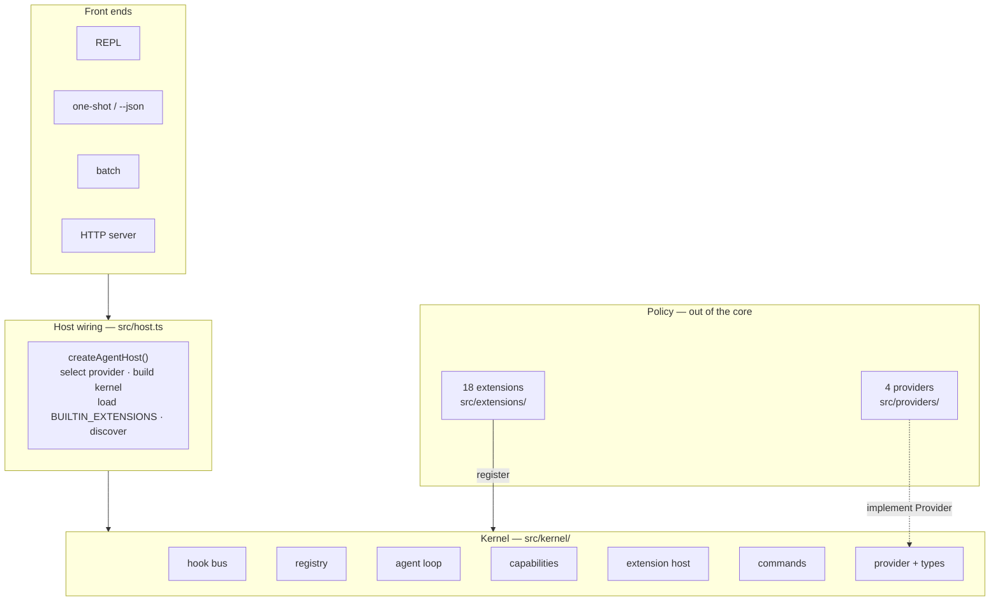
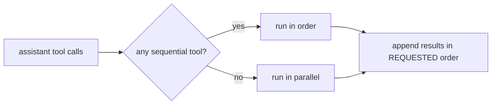
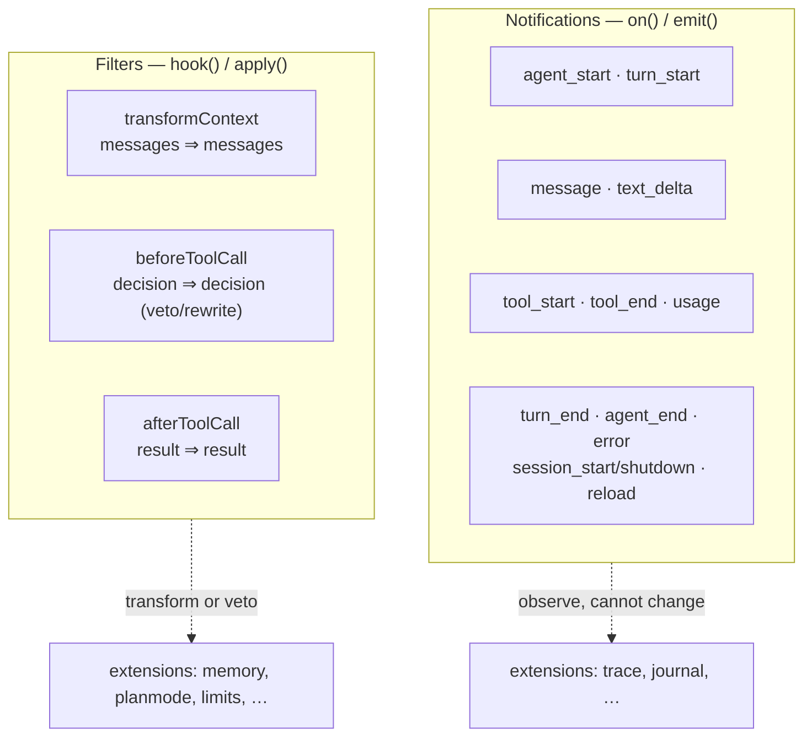
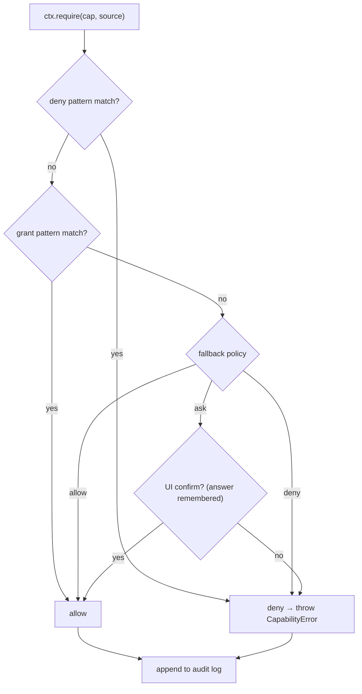
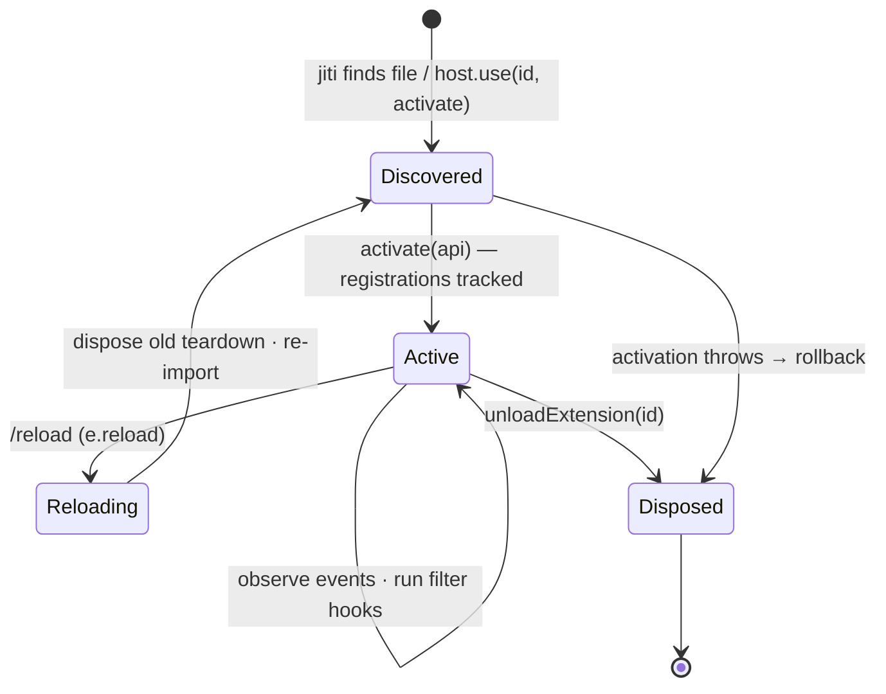
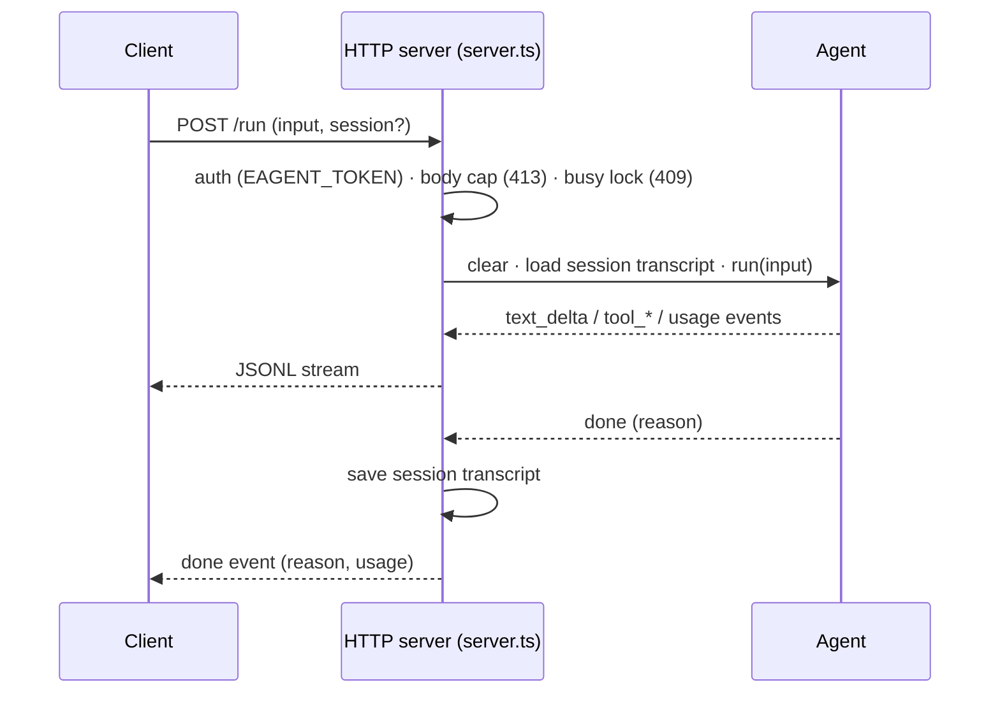
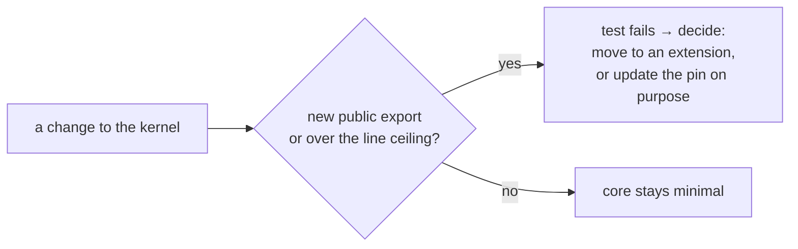
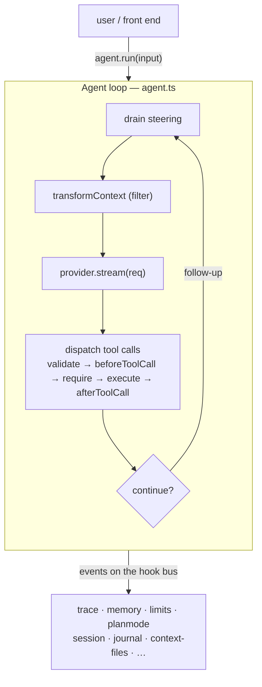

# EAgent Architecture

This is the design document for EAgent: what the kernel is, why it is shaped the
way it is, and how a turn actually flows through the code. It is accurate to the
source — file references point at the code that implements each claim.

## The thesis

Emacs has survived four decades because of a single architectural decision: a
small C core that hosts a language in which *almost everything is redefinable at
runtime*. Primitives live in the core; policy lives in the extension language.
EAgent applies that decision to AI agents.

The kernel is **seven primitives and nothing more**. It ships with zero opinions
about tools, prompts, memory, sub-agents, or UI. The four "built-in" tools
(`read`, `write`, `edit`, `bash`) are themselves an extension. Everything you
would want to change is a hot-reloadable extension you can edit while the agent
is running. The bet is the same one Emacs and pi make: a minimal, observable,
malleable core beats a big one — new behavior is always an extension, never a
fork.

## System layers

The kernel is deliberately oblivious to which front end drives it and which
extensions are loaded. Everything above the kernel is policy.



The whole core lives under `src/kernel/` and is held below a hard line ceiling by
a test (see *The minimalism guard*).

## The seven primitives

All seven live in `src/kernel/` and are the entire intended public surface of the
kernel (re-exported from `src/kernel/index.ts`).

| Primitive            | File                          | Responsibility |
| -------------------- | ----------------------------- | -------------- |
| **Hook bus**         | `src/kernel/hooks.ts`         | Lifecycle events (observe) and filter hooks (intervene) — Emacs *hooks* + *advice*. |
| **Tool registry**    | `src/kernel/registry.ts`      | Register / shadow / dispose tools and providers; a later definition wins, disposing it restores the prior one. |
| **Provider**         | `src/kernel/types.ts`         | The single thing the kernel knows about an LLM: a request becomes a stream of events. |
| **Agent loop**       | `src/kernel/agent.ts`         | Turns, streaming, guarded and ordered tool dispatch, steering, follow-up, stop conditions. |
| **Capability layer** | `src/kernel/capabilities.ts`  | Per-capability allow / deny / ask, wildcards, and an audit log. |
| **Extension host**   | `src/kernel/extension.ts`     | Discovery, activation, the `ExtensionAPI`, and hot reload via `jiti`. |
| **Command registry** | `src/kernel/commands.ts`      | User-facing slash commands — `M-x` for agents. |

Supporting modules round out the kernel without being primitives: `types.ts`
(shared types plus `Usage` accounting), `events.ts` (the typed event/filter
maps), `define.ts` (`defineTool` and result helpers), `validate.ts` (JSON-Schema
argument validation), and `store.ts` (the namespaced persistent `Store`).

## The agent loop

The one piece that must be small, correct, and observable, because everything
else hangs off it. A turn, as implemented in `Agent.run` / `streamTurn` /
`dispatch`:

```mermaid
sequenceDiagram
    autonumber
    participant FE as Front end
    participant Loop as Agent loop (agent.ts)
    participant Hooks as Hook bus
    participant Prov as Provider
    participant Disp as Dispatch
    participant Cap as Capabilities

    FE->>Loop: run(input)
    Loop->>Hooks: emit agent_start and user message
    loop each turn (max maxTurns)
        Loop->>Loop: drain steering into transcript
        Loop->>Hooks: apply transformContext (filter)
        Loop->>Prov: stream(request)
        Prov-->>Loop: text_delta ... then done (message, stopReason, usage)
        Loop->>Hooks: emit usage (usage, cumulative)
        alt assistant requested tool calls
            Loop->>Disp: dispatch(calls)
            Disp->>Disp: validate args (JSON Schema)
            Disp->>Hooks: apply beforeToolCall (veto or rewrite)
            Disp->>Cap: require declared capabilities
            Disp->>Disp: tool.execute(args, ctx)
            Disp->>Hooks: apply afterToolCall
            Disp-->>Loop: results in requested order
            Note over Loop: stop if every result is terminate
        else no tool calls
            Note over Loop: drain follow-ups, else stop
        end
    end
    Loop->>Hooks: emit agent_end (reason)
```

Tools may run in parallel, but if any requested tool declares
`executionMode: "sequential"` the whole batch runs in order; results are always
appended in the order the model requested them, regardless of completion order.



Two injection points make a running agent controllable from outside: **steering**
injects a message before the next model call (interruptions, corrections), and
**follow-up** queues work for when the loop would otherwise idle (automation).
Both are exposed to tools through the capability-limited `AgentHandle`. A
`maxTurns` safety bound (default 24) caps a single `run`.

## The hook model: observe and intervene

The hook bus maps cleanly onto Emacs's two extension idioms.



- **Notifications** run in registration order; one throwing does not abort the
  rest (errors go to a redirectable reporter and the loop continues).
- **Filters** thread a value through each handler. An optional `shouldStop`
  predicate halts the chain once a terminal value (e.g. a veto) is produced, so a
  later filter cannot override a decision already made.

These three filter seams are where memory strategies, plan-mode approvals, safety
gates, and resource limits plug in without modifying the loop.

## The capability model

The kernel runs LLM-directed — and optionally LLM-authored — code, so authority
is explicit rather than ambient. A capability is a dotted string naming an
authority: `fs:read`, `fs:write`, `shell:exec`, `code:exec`, `net:fetch`,
`skill:write`, `mcp:call`, `agent:spawn`, `pkg:install`, `self:extend`. Tools
declare what they need; the dispatcher enforces the declaration before the body
runs.



Patterns support a trailing `*` wildcard segment (`fs:*`, `*`). Every check is
recorded in an audit log that `/caps` can inspect, and an `ask` answer is
remembered for the session. This layer is the one thing pi deliberately omits —
reasonable for a trusted single-user coding agent, but EAgent makes LLM-authored
code a first-class mode. It enforces *authority*; it does not pretend to sandbox
arbitrary in-process code (see `SECURITY.md`).

## The extension host

An extension is a module with a default-exported activation function that
receives the `ExtensionAPI`:

```ts
export default function activate(e: ExtensionAPI) {
  e.registerTool(myTool);
  e.on("turn_end", () => { /* ... */ });
  return () => cleanup(); // optional deactivate
}
```

The `ExtensionAPI` is the single, versioned public surface — `registerTool`,
`registerProvider`, `registerCommand`, `on`, `hook`, `grantCapability`, a
namespaced `store`, `log`, the `agent`, the `commands` registry, plus `reload`,
`loadExtension`, and `unloadExtension`. It follows VS Code's discipline: minimal,
additive, never broken.

**Tracked disposables make reload a clean swap.** Every registration the host
hands an extension is wrapped so the host owns its `Disposable`. If an activation
throws partway, the host rolls back whatever it managed to register, so a failed
extension leaves nothing half-wired.



**Discovery and hot reload.** The host discovers extension files in a list of
directories (project `.eagent/extensions/` then user `~/.eagent/extensions/`,
most-specific last so it wins on id collision). Files are loaded via `jiti`, which
evaluates TypeScript with no build step; the loader uses `moduleCache: false` so
re-importing on reload re-evaluates the module. `loadExtension` is the uniform
seam through which built-in, discovered, self-authored, and package-installed
extensions all flow, so reload and unload work on them identically.

## The provider abstraction

A `Provider` turns a request into a stream of events and nothing more — the kernel
knows no wire format, auth, or retry logic.

```mermaid
sequenceDiagram
    participant Loop as Agent loop
    participant P as Provider
    Loop->>P: stream(systemPrompt, messages, tools, model, signal)
    P-->>Loop: text_delta (text)
    P-->>Loop: text_delta (text)
    P-->>Loop: tool_call (id, name, arguments)
    P-->>Loop: done (message, stopReason, usage)
```

Four ship in `src/providers/`:

- **`mock`** — a scriptable, deterministic LLM. It is why the whole suite runs
  offline and why you can explore the agent with no API key.
- **`anthropic`** — fetch + SSE, no SDK. Prompt-caches the stable system+tools
  prefix, supports image content, and reports `Usage` (including cache tokens).
- **`openai`** — fetch + SSE, no SDK; also reaches any OpenAI-compatible endpoint
  (Azure, Together, Groq, Ollama, …) via `OPENAI_BASE_URL`.
- **`gemini`** — fetch + SSE; maps the neutral message model onto Gemini's
  `contents`/`parts` shape (name-correlated function responses, image `inlineData`).

The live providers share `src/providers/http.ts`, which centralizes
retry/backoff (429/5xx and network errors, honoring `retry-after`), SSE parsing,
and usage accounting. Their `fetch` is injectable for testing. `cassette.ts` adds
record/replay wrappers (`RecordingProvider`/`ReplayProvider`) for capturing a real
model once and replaying it deterministically.

## Host and front ends

The shared *host* wiring lives in `src/host.ts`: `createAgentHost` selects a
provider from configuration, constructs the `CapabilityManager`, `Agent`,
`ExtensionHost`, and `CommandRegistry`, registers the providers, and loads the
canonical built-in extension set (`BUILTIN_EXTENSIONS`) — skipping (with a log) any
that fail to activate — before discovering project/user extensions. `host.ts` is a
host, not part of the kernel: it has opinions (which providers, which extensions);
the kernel stays neutral.

Four front ends share that one assembly, so they all load exactly the same
extensions:

- **Interactive REPL** — `src/cli.ts` when stdin is a TTY (`/help`, `/tools`,
  `/reload`, …).
- **One-shot** — `eagent -e "…"` runs a single turn and exits; `--json` emits
  lifecycle events as JSONL on stdout (diagnostics on stderr).
- **Batch** — piped, non-interactive stdin, processed line by line.
- **HTTP server** — `src/server.ts` (`eagent-serve`, default `PORT` 8787),
  `node:http` only.



`GET /health` returns `{ ok, model, extensions, sessions }`; `DELETE /sessions/:id`
forgets a conversation. Sessions give multi-turn continuity; the server runs one
turn at a time and shuts down gracefully on SIGTERM/SIGINT.

## The minimalism guard

`test/kernel-surface.test.ts` pins the kernel's complete public surface: adding a
new export to `src/kernel/index.ts` fails the test until the author either moves
the addition into an extension or deliberately updates the expected list. A second
assertion holds the total line count of `src/kernel/` under a hard ceiling (2,200
lines). Together they make core growth a conscious decision — new capability is an
extension by construction.



## End-to-end data flow



## Built-in extensions

Each is a single file under `src/extensions/`, rides the `ExtensionAPI`, ships
with offline tests, and gates privileged work behind a capability. They load in
the order listed in `BUILTIN_EXTENSIONS` (`src/host.ts`): `core-tools`, `skills`,
`mcp`, `codeact`, `subagents`, `memory`, `planmode`, `session`, `packages`,
`trace`, `context-files`, `limits`, `self`, `web`, `checkpoint`, `introspect`,
`journal`, `prompts`. The README has a one-line description and capability for
each; `docs/EXTENSIONS.md` is the author's guide.
