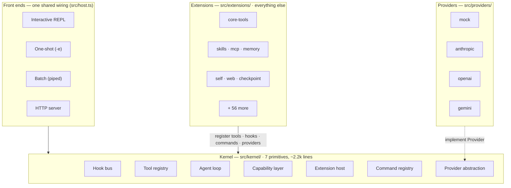
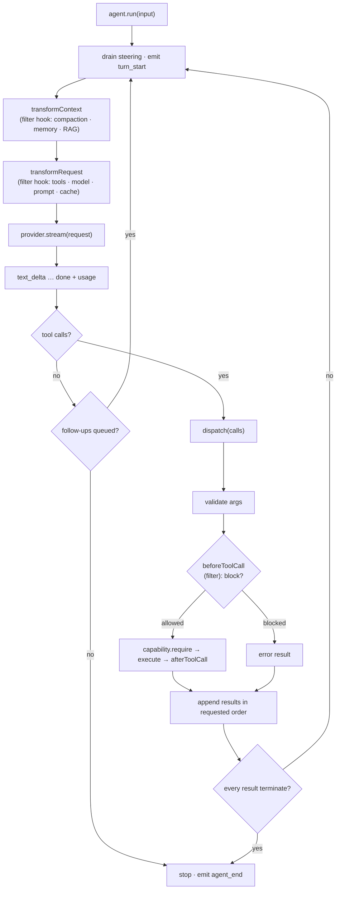
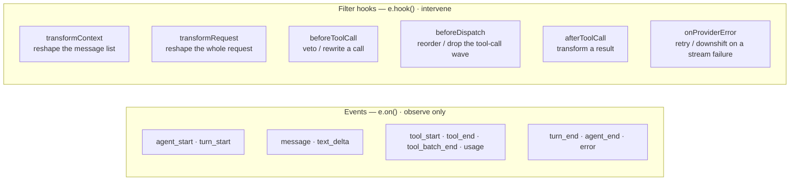
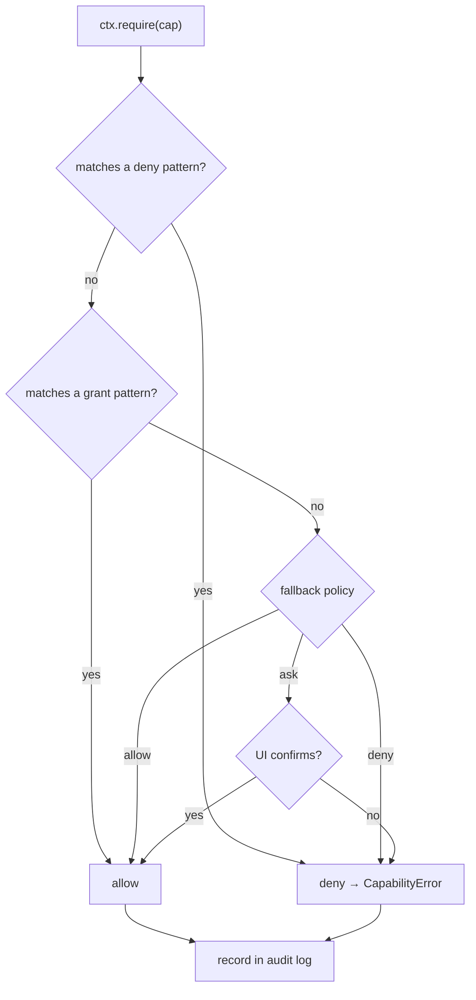

# EAgent

**A minimalist AI agent with a tiny stable core and Emacs-grade extensibility.**

Emacs has survived forty years because of one decision: a small C core hosting a
language in which *almost everything is redefinable at runtime*. Primitives live
in the core; policy lives in the extension language. EAgent applies that decision
to AI agents.

The kernel is **seven primitives and nothing more** (~2,248 lines, held just
under a hard 2,250-line ceiling by a test). There are no built-in tools, no hard-coded prompt
strategy, no memory policy, no sub-agents baked in. The four "built-in" tools
(`read`, `write`, `edit`, `bash`) are themselves an extension. Everything you'd
want to change is a hot-reloadable extension you can edit while the agent runs.



## Why another agent

Most agents are a feature pile with an opaque, shifting core. EAgent inverts that:
a core small enough to read in one sitting, and a single extension surface
powerful enough that new behavior never requires forking. The bet — the same one
pi and Emacs make — is that a minimal, observable, malleable core beats a big one.

## Quickstart

```bash
npm install
npm run build
npm test          # the full offline suite — no network or API key required

# Talk to it offline — a deterministic mock LLM drives everything:
node dist/cli.js -e "hello"

# Load an example extension and poke around:
printf '/tools\n/uptime\n/quit\n' | node dist/cli.js --ext examples/extensions/clock.ts
```

For a live model, set an API key and the CLI selects that provider automatically
(override with `--provider`):

```bash
ANTHROPIC_API_KEY=sk-... node dist/cli.js -m claude-fable-5
OPENAI_API_KEY=sk-...    node dist/cli.js -p openai -m gpt-4o
GEMINI_API_KEY=...       node dist/cli.js -p gemini -m gemini-2.0-flash
```

Or drop the keys in a `.env` file (copy `.env.example`): the CLI and server load
it automatically at startup — real environment variables always win. `.env` also
sets the model per provider via `ANTHROPIC_MODEL` / `OPENAI_MODEL` / `GEMINI_MODEL`,
so you don't need `-m` on every call, and `ANTHROPIC_AUTH_TOKEN` is accepted as an
alias for `ANTHROPIC_API_KEY` (the gateway convention).

Any OpenAI-compatible endpoint works through the OpenAI provider — e.g. a local
Ollama: `OPENAI_BASE_URL=http://localhost:11434/v1 OPENAI_API_KEY=ollama node dist/cli.js -p openai -m llama3`.
For newer official OpenAI models that require `max_completion_tokens`, set
`OPENAI_MAX_TOKENS_PARAM=max_completion_tokens`. The output-length cap defaults to
4096 tokens; raise it per provider with `ANTHROPIC_MAX_TOKENS` / `OPENAI_MAX_TOKENS`
/ `GEMINI_MAX_TOKENS` for long generations or high thinking budgets.

## How a turn works

The agent loop is the one piece that must be small, correct, and observable,
because everything else hangs off it. A turn:



Two injection points make a running agent controllable from outside: **steering**
adds a message before the next model call (interruptions, corrections), and
**follow-up** queues work for when the loop would otherwise idle (automation).

## The seven primitives

All seven live in `src/kernel/` and form the entire public surface of the kernel.

| Primitive            | File                         | Responsibility |
| -------------------- | ---------------------------- | -------------- |
| **Hook bus**         | `src/kernel/hooks.ts`        | Lifecycle events (observe) + filter hooks (intervene) — Emacs *hooks* & *advice*. |
| **Tool registry**    | `src/kernel/registry.ts`     | Register/shadow/dispose tools; a later definition wins, disposing restores the prior one. (Providers, in the same file, register by overwrite — no restore. Commands follow the same shadow/dispose model but live in `commands.ts`.) |
| **Provider**         | `src/kernel/types.ts`        | The one thing the kernel knows about an LLM: a request → a stream of events. |
| **Agent loop**       | `src/kernel/agent.ts`        | Turns, streaming, guarded & ordered tool dispatch, steering, follow-up, stop conditions; first-class state — `snapshot()`/`restore()` + a monotonic step. |
| **Capability layer** | `src/kernel/capabilities.ts` | Per-capability allow / deny / ask, wildcards, an audit log. |
| **Extension host**   | `src/kernel/extension.ts`    | Discovery, activation, the `ExtensionAPI`, hot reload via `jiti`. |
| **Command registry** | `src/kernel/commands.ts`     | User-facing slash commands — `M-x` for agents. |

Everything else — tools, memory, prompts, compaction, UI, sub-agents, MCP — is an
extension. The kernel ships with zero opinions about them.

## Hooks: observe and intervene

The hook bus maps onto Emacs's two extension idioms. **Events** are notifications
you observe; **filter hooks** are advice that can transform or veto a value.



```ts
// Observe:
e.on("tool_end", ({ call, result }) => log(call.name, result.isError));

// Intervene — block a destructive command:
e.hook("beforeToolCall", (decision, { call }) => {
  if (call.name === "bash" && /rm -rf \//.test(String(call.arguments.command)))
    return { ...decision, block: true, reason: "destructive command" };
  return decision;
});
```

These six seams are where memory strategies, model routing, plan-mode approvals,
safety gates, context engineering, wave shaping, and reliability policy plug in — without touching the loop.
(`beforeDispatch` reshapes the tool-call wave; `onProviderError` is an error-path seam that fires only
when a provider stream throws.)

## Built-in extensions

Everything below is an extension — none is in the kernel, and any can be replaced
or removed. Each is a single file under `src/extensions/`, ships with offline
tests, and gates privileged work behind a capability.

They are grouped by theme below; see `BUILTIN_EXTENSIONS` in `src/host.ts` for the
authoritative load order (which is load-bearing — a later extension can shadow an earlier one).

| Extension     | What it adds | Commands | Capability |
| ------------- | ------------ | -------- | ---------- |
| `core-tools`  | `read`, `write`, `edit`, `bash` (workspace-confined) | `/tools` | `fs:read`, `fs:write`, `shell:exec` |
| `search`      | `glob` / `grep` — find files by pattern and search contents in pure Node, workspace-confined | — | `fs:read` |
| `skills`      | LLM-authored skills via `SKILL.md` with progressive disclosure | `/skills` | `skill:read`, `skill:write` |
| `mcp`         | Model Context Protocol client (stdio **and** Streamable HTTP); registers `mcp__<server>__<tool>` (calling tools) and a `mcp__<server>__read_resource` tool (reading resource bodies) | `/mcp` | `mcp:call`, `mcp:read` |
| `codeact`     | code-as-action: `run_code` runs JS/Python in a subprocess boundary, with an optional off-by-default **OS-sandbox isolation tier** (`workspace-write`/`no-network` recommended; `readonly` is degraded on the `bwrap` backend — RW6c-4) via the shared `lib/sandbox` launchers; **fails closed** once a tier is selected if no backend | `/code`, `/codeact` | `code:exec` |
| `subagents`   | `spawn_agent` runs isolated child agents (single / parallel / chain) | `/agents` | `agent:spawn` |
| `subagent-jobs` | async background job lifecycle over the child machinery — `launch_job` fires a child without blocking and returns a jobId; `job_status` inspects, `collect_job` awaits/merges the answer, `cancel_job` stops one; concurrency- and retention-capped, recursion-guarded, dispose cancels running jobs. Jobs are **in-process, not persisted** (they end with the process). `EAGENT_SUBAGENT_JOBS=off` kill switch | `/jobs` | `agent:spawn` |
| `reasoning-search` | **search over forked agents** — `best_of_n` snapshots the current state, forks N **governed** children (`childScope` gate filters + a pruned registry that removes every spawn-class tool — any declaring `agent:spawn`/`workflow:run` — so a fork can't re-fork), runs each on the sub-task, scores (`judge`/`shortest`/`longest`) and returns the argmax. **`tree_search`** generalizes it to multi-step **Tree-of-Thought beam search**: at each depth it expands the frontier (`branch` children per node), scores, keeps the top `beam`, and repeats to `depth`, returning the global best-scoring thought — bounded by a hard `maxNodes` cap, cancellable, losing branches never touch the parent transcript. **`graph_search`** adds **Graph-of-Thought** operations a tree can't: it **generates** `branch` thoughts, **aggregates** them into one combined answer (a multi-parent merge), optionally **refines** the best in place, and returns the global best across all three — so the three tools span the canonical reasoning-search family (best-of-N · ToT · GoT). All off by default (`/reasoning-search on`, `EAGENT_REASONING_SEARCH=off`) | `/reasoning-search` | `agent:spawn` |
| `dynamic-workflow` | the `workflow` tool executes a model-emitted dependency DAG of `tool`/`agent` steps with `${id}` substitution; independent steps run in parallel | `/workflow` | `workflow:run` |
| `templates`   | named, file-based, inheritable **agent templates** (`<name>.md` frontmatter + body = system prompt; single-parent `extends`); `spawn_template` delegates to a scoped isolated child, `/template use` reconfigures the live session (become) with a tool allow-list veto; opt-in name+description catalog (`/template catalog on`), `EAGENT_TEMPLATES=off` kill switch | `/template` | `agent:spawn` |
| `teams`       | **team orchestration**: `run_team` runs a template-backed lead agent supervising template-backed member agents (file `<name>.md` roster **or** an inline roster) over a shared run-scoped board, selecting a coordination pattern (orchestrator, parallel, sequential, generator-verifier, consensus, blackboard) from a documented playbook (optionally pinned); members are leaf agents barred from any spawn/workflow tool; bounded (lead/member turns, delegate cap, roster cap, board caps), `EAGENT_TEAMS=off` kill switch | `/team` | `agent:spawn` |
| `memory`      | store-backed `remember`/`recall` working-memory scratchpad with white-box per-entry provenance; **two tiers** (core `note:` + archival `archive:`) with auto-eviction oldest→archive at a cap, and **`recall(query)`** ranking across both tiers — dependency-free **lexical** token-overlap (`lib/relevance`) by default, with **optional semantic (embedding)** ranking when `EAGENT_MEMORY_EMBED_ENDPOINT` is set (a zero-dep `fetch` embedder; cosine over the query + candidates, **fail-soft** to lexical; `EAGENT_MEMORY_EMBED=off` kill switch) (`/memory recall|archive|promote|forget-archive`); `EAGENT_MEMORY_ENTRIES=off` to disable — registers no `transformContext` hook | `/memory` | — |
| `prune`       | token-budget tool-output pruning via `transformContext` — truncates old, oversized tool results beyond a protected recent window (`EAGENT_PRUNE=off` to disable) | — | — |
| `compact`     | token-gated structured conversation compaction via `transformContext` — folds the older prefix at a user-turn boundary into `## Decisions`/`## Files`/`## Open threads`, keeps the last K user turns, re-injects a byte-capped pinned block; off by default (`/compact on`, `EAGENT_COMPACT=off` to kill) | `/compact` | — |
| `recovery`    | turns a *failed* tool result into a corrective nudge via `afterToolCall`, keyed to EAgent's own error strings, so the model self-corrects (`EAGENT_RECOVERY=off` to disable) | — | — |
| `output-contract`| schema-validated final output — set `Agent.outputSchema` and the model's answer is validated/coerced (reusing the kernel input-validator) via a per-run `respond` tool, surfaced typed on `Agent.output`; invalid answers drive a bounded validate-and-reask with the exact per-field errors, and on the corrective turn the provider is made to force `respond` at decode time (`toolChoice`, graceful degrade) so output becomes near-guaranteed (inert with no schema; `EAGENT_OUTPUT_CONTRACT=off`) | `/respond` | — |
| `content-guard`| ingress trust labeling on `afterToolCall` — strips invisible injection-vector Unicode and wraps *successful* foreign-tool output (default `net:fetch`/`mcp:call`/`mcp:read`) in a non-forgeable (per-activation nonce'd) `<untrusted-content-…>` provenance fence — the body's own fence sentinels are escaped, so foreign content can neither spoof nor break out of the envelope; also fences local `shell:exec`/`fs:read` output when `contentGuard.fenceLocal` is set (the hardened preset sets it; else `/config set contentGuard.fenceLocal true`) (on by default; `EAGENT_CONTENT_GUARD=off`) | `/content-guard` | — |
| `circuit-breaker` | tool-call repetition / consecutive-failure fail-fast — buckets calls by signature (`name + canonical(args)`); the 2nd identical call earns a non-blocking steer, the N-th (default 3) or N consecutive failures ask/block (on by default, mode `ask`; `EAGENT_CIRCUIT_BREAKER=off`) | `/circuit-breaker` | — |
| `planmode`    | human-in-the-loop approval gate before mutating tools run | `/plan` | — |
| `session`     | save / load / handoff for transcripts | `/save`, `/load`, `/sessions`, `/handoff` | `fs:read`, `fs:write` |
| `packages`    | install extensions from `path:` / `git:` / `npm:` (Emacs `package.el` analog) | `/pkg-add`, `/pkg-list`, `/pkg-remove` | `pkg:install` |
| `trace`       | observability: per-run span tree, metrics, token usage — from the event bus | `/trace`, `/usage`, `/trace-save` | — |
| `otel-exporter` | **OpenTelemetry (OTLP/HTTP-JSON) exporter — all three signals** — **traces** (agent/turn/tool lifecycle spans with GenAI attrs), **metrics** (cumulative Sum counters `eagent.gen_ai.token.usage` by token type + `eagent.tool.calls` by error, and the OTel GenAI **Histogram** `eagent.gen_ai.client.operation.duration` — per-call inference latency in seconds, advisory buckets), and **logs** (metadata-only operational records — `error`/`agent_end` with `traceId`/`spanId` correlation, never message content). POSTs each to its own endpoint via `fetch` (best-effort, swallow-all). Hand-rolled, zero-dep; **metadata only — never prompt/result content** (even the error log carries the error *class*, not the message). Each signal independent (`OTEL_EXPORTER_OTLP_ENDPOINT` base or `_TRACES_`/`_METRICS_`/`_LOGS_ENDPOINT`). Optional **W3C `traceparent` propagation**: with traces on, `web`/`mcp` inject the tool-call span onto outbound tool HTTP to hosts in `EAGENT_OTEL_PROPAGATE_HOSTS` (default empty ⇒ nothing injected), linking downstream service traces. Off by default (`EAGENT_OTEL=off`) | `/otel` | — |
| `context-files` | discovers `AGENTS.md` / `CLAUDE.md` up the tree and injects them | `/context`, `/context-reload` | — |
| `microagents` | keyword-triggered knowledge injection via `transformContext` — scans `*.md` files with `triggers:` frontmatter and injects a body when a trigger appears in the latest user message (`EAGENT_MICROAGENTS=off` to disable) | `/microagents` | — |
| `playbook`    | ACE-style durable insight playbook — an ordered list of bullets updated by deterministic delta-merge (`add` a bullet, `merge` an insight into one; segment-exact dedupe, no model call) and auto-injected as one leading ephemeral `system` note each turn via `transformContext`, byte-capped at 8 KB; off by default (`/playbook on`, `EAGENT_PLAYBOOK=off` to disable) | `/playbook` | — |
| `limits`      | guardrails: output truncation, per-run tool-call & token budgets | `/limits` | — |
| `cost`        | token→USD accounting from the event bus — per-model session cost via a date-pinned price card (`/cost pricecard` to retune) and a warn-only rolling-mean run-cost anomaly flag (`EAGENT_COST=off` to disable) | `/cost` | — |
| `budget-cap`   | hard **USD spend ceiling that enforces** — prices the `usage` stream via `cost`'s pricecard and, at a per-run or cumulative-session cap, soft-warns then **blocks** paid tool calls (`mode=block`) or **aborts** the run (`mode=stop`); both caps default `0` = inert (`EAGENT_BUDGET_CAP=off`) | `/budget-cap` | — |
| `self`        | the agent authors and hot-loads its **own** TypeScript extensions | `/self` | `self:read`, `self:extend` |
| `self-improve` | **bounded, human-checkpointed self-improvement harness** (DGM-safety): `propose_improvement` stages a candidate (static-veto + bespoke write, never executed) → `evaluate_candidate` scores it as an **advisory, tamper-detected** signal in a **separate `no-network`-sandboxed subprocess** (the candidate is *never* loaded into the live agent to be judged) → `adopt_improvement` loads it **only after human source-review via `ui.ask`** (not `--yolo`-able), host-tracked + `unloadExtension`-reversible. The isolation boundary is the subprocess+sandbox; the gate is the human. Off by default (`/self-improve on`, `EAGENT_SELF_IMPROVE=off`) | `/self-improve` | `self:extend`, `code:exec` |
| `self-extend-floor` | a **model-capability floor** for self-extension (STOP lesson) — a `beforeToolCall` guard that blocks any `self:extend`-gated call when the acting model (`currentActingAgent() ?? e.agent` — the running sub-agent inside a child run) matches none of the configured allowlist, and passes it otherwise. Inert by default (empty allowlist ⇒ zero gating); configured via `selfExtendFloor.models` (comma-separated, case-insensitive). Matching is **substring** by default (patterns are matched by `contains`, so write the most specific ids that still match, e.g. `opus-4`/`gpt-5`, since a weaker variant whose id contains an allowlisted substring is admitted); set `selfExtendFloor.match=exact` for strict full-id equality (any other value ⇒ substring). No command, no capability; hard kill switch `EAGENT_SELF_EXTEND_FLOOR=off` | — | — |
| `web`         | capability-gated, size-bounded HTTP access (`fetch_url`) | `/fetch` | `net:fetch` |
| `checkpoint`  | git-backed workspace snapshots before mutating tools, with rollback. On by default; `EAGENT_CHECKPOINT=off` kill switch (the auto-snapshot runs async, serialized git on every mutating call) | `/checkpoint`, `/checkpoints`, `/rollback` | — |
| `introspect`  | self-documentation: describe any tool/command, search by keyword | `/describe`, `/apropos` | — |
| `journal`     | durable, append-only run journal; crash-recover with `/resume` (opt-in) | `/journal`, `/resume` | `fs:read`, `fs:write` |
| `time-travel` | agent-state **rewind + fork** — persists `Agent.snapshot()` as a branching checkpoint **tree** (LangGraph-style; rewind and fork are one `restore()` primitive) to `.eagent/timetravel/`; rewinds *conversation* state only (pair with `checkpoint`'s `/rollback` for files). Off by default (`/timetravel on`, `EAGENT_TIME_TRAVEL=off`) | `/timetravel`, `/rewind`, `/fork`, `/tree` | — |
| `todo`        | session-scoped in-memory todo list — `todowrite` replaces and echoes the list | `/todos` | — |
| `goal`         | pins the run's **objective + acceptance criteria** in front of the model every turn (anti-drift `transformContext`) and runs an advisory, offline completion check on `agent_end`; adds a `setgoal` tool + opt-in model-judge; inert until a goal is set (`EAGENT_GOAL=off`) | `/goal` | — |
| `prompts`     | saved prompt templates / macros with `$1 $2 $*` args (Emacs abbrevs) | `/prompt`, `/prompt-save`, `/prompt-remove`, `/prompts` | — |
| `flow-guard`  | compositional egress gate: taints a session on a source capability (default `shell:exec`) or sensitive data, then holds egress (default `net:fetch`/`mcp:call`) — ask or block; also holds a **network-reaching `shell:exec`** command (default `curl`/`wget`/`nc`/`ssh`/…, store-overridable via `networkCommands`) once the session carries *data* taint (a sensitive-path read or a credential-shaped secret), so `read secret → bash curl` is gated while plain `build → curl` is not — residual: a shell-read secret matching none of the four credential shapes sets only capability taint, so it is not caught | `/flow-guard` | — |
| `provenance`  | CaMeL-lite structural injection defense — tags foreign-source results (`net:fetch`/`mcp:call`/`mcp:read`) into a bounded segment store on `afterToolCall`, then on `beforeToolCall` gates a privileged **sink** (`shell:exec`/`net:fetch`/`mcp:call`/`fs:write`) whose string arg verbatim-derives (≥`minLen` segment) from untrusted content — prompts (default) or blocks (strict), redacted; a *different axis* from `flow-guard` (source-taint→any sink vs sensitive-pattern→egress) and `content-guard` (gate vs label). Off by default (`/provenance on`, `EAGENT_PROVENANCE=off`) | `/provenance` | — |
| `risk-guard`  | LLM-based semantic risk analyzer on `beforeToolCall` — classifies sensitive calls (default `shell:exec`) via a tool-less provider sub-call and asks or blocks on a RISKY verdict (off by default; `EAGENT_RISK_GUARD=off`) | `/risk-guard` | — |
| `headless-flags` | CI safety net — when no TTY / a `CI` signal is detected, rewrites shell commands to their non-interactive form (`apt-get install -y`, `npm init -y`) and prepends env guards (`GIT_TERMINAL_PROMPT=0`, `GIT_EDITOR=true`) so a prompt or `$EDITOR` can't hang an unattended run; loads before `bash-policy`, inert in an interactive TTY (`EAGENT_HEADLESS_FLAGS=off`) | `/headless` | — |
| `bash-policy` | command-granular shell policy gate — reduces a command line to a command family and evaluates an allow/deny/ask ruleset (no-op by default; `EAGENT_BASH_POLICY=off`) | `/bash-policy` | — |
| `sandbox-tiers` | **OS-level confinement tiers** for `shell:exec` — rewrites the command (on `beforeToolCall`) to wrap it in the host sandbox (`sandbox-exec` on macOS, `bwrap`/`firejail` on Linux) enforcing `readonly` / `workspace-write` / `no-network`; default tier `off` = no-op, degrades gracefully (pass or block) when no backend exists (`EAGENT_SANDBOX_TIERS=off`) | `/sandbox-tiers` | — |
| `config-hooks` | **declarative external hooks** from `.eagent/hooks.json` — binds matcher→action rules onto the kernel hook bus (`block`/`allow`/`inject`/`append`/`truncate`/`notify`, plus an external `command` action gated on `shell:exec`), so guardrails and formatters need no TypeScript; ships off (`/config-hooks on`, `EAGENT_CONFIG_HOOKS=off`) | `/config-hooks` | — |
| `integrity`   | sweeps every tool description for poisoning / hidden instructions, and flags descriptions that change across sessions (rug-pull guard) | `/integrity` | — |
| `write-guard` | prompts before a *blind overwrite* — a full-content `write` to an existing file the session has not read — via `beforeToolCall` (`EAGENT_WRITE_GUARD=off` to disable) | — | — |
| `secret-guard` | keeps secret *values* out of outgoing tool args — on `beforeToolCall`, scans leak-capable tools' args (default `net:fetch`/`shell:exec`) for credential patterns and asks/blocks without echoing the value (on by default, mode `ask`; `EAGENT_SECRET_GUARD=off`) | `/secret-guard` | — |
| `sweep-edit`   | `sweep_edit` tool — regex-enumerated multi-site refactor: finds match sites via `search` (no shell), fans a scoped sub-agent per file that edits or declines, with a max-sites cap | `/sweeps` | `fs:write`, `agent:spawn` |
| `citations`    | grounding — tags *retrieval* tool output (`net:fetch`/`fs:read`) with a visible `[src:N]` id and, on `agent_end`, warns (never blocks) on a *fabricated* citation in the final answer (off by default; `EAGENT_CITATIONS=off`) | `/citations` | — |
| `env-report`   | classifies *environmental* tool failures (auth/missing-binary/network/permission), surfaces an `environment_issue` and replaces `recovery`'s retry-nudge with a "surface, don't retry" note so the model stops looping on infra faults (on by default; `EAGENT_ENV_REPORT=off`) | — (`env_report` tool) | — |
| `evals`        | offline behavior-eval harness — `/expect` trajectory assertions, an `/eval <dir>` headless runner over `*.eval.json` (also exposed as the `npm run eval` **CI gate** over `evals/`, exit non-zero on failure), and a `judge` tool (recursion-safe sub-call); ships a `test/security/` guard-regression set | `/expect`, `/eval` | — |
| `handoff`      | session resume doc — on `agent_end` (or `/handoff-doc`) summarizes the transcript via a recursion-safe sub-call into a fixed schema + reactivation paragraph, written to `.eagent/handoffs/`; plus an opt-in, relevance- and freshness-gated read side that injects the newest matching handoff once into a fresh session's first turn (off by default; `EAGENT_HANDOFF=off`, resume side `EAGENT_HANDOFF_RESUME=off`) | `/handoff-doc` | — |
| `drift-probe`  | reasoning-quality canary — every N turns probes a pinned question and warns (never blocks) on regression vs the turn-0 baseline, suggesting `/compact` or `/handoff` (off by default; `EAGENT_DRIFT_PROBE=off`) | `/drift-probe` | — |
| `autocontinue` | resumes a **truncated** answer — when a turn ends on `max_tokens` with no tool call, injects a "continue" follow-up so the loop resumes instead of stopping silently; capped at 3 continuations per top-level run, keyed on the acting agent (off by default; `/autocontinue on`, `EAGENT_AUTOCONTINUE=off`) | `/autocontinue` | — |
| `skills-hardening` | guards the skill self-extension surface — `SKILL.md` body/script supply-chain scan + body rug-pull fingerprint (warn-only), frontmatter validation, `allowed-tools` `beforeToolCall` scoping for the active skill, and optional `triggers:`-gated tier-1 disclosure (`EAGENT_SKILL_TRIGGERS=off`) | `/skills` | — |
| `ask`          | agent→host elicitation — an `ask_user_question` tool so the model can pause and ask the human (with options) before guessing, gated by `ui:ask` so batch runs auto-decline; calls an optional `UI.ask` (CLI readline), else falls back to "proceed with a stated assumption"; the HTTP server adds a durable channel (`action_required` stream event + `POST /answer`, timeout/disconnect fallback) | — (`ask_user_question`) | `ui:ask` |
| `routing`      | difficulty-aware per-turn model tiering — a cheap heuristic (or optional sub-call) classifier sets the mutable `Agent.model` to a cheap/flagship tier per turn, restoring it on disable; pairs with `cost` (off by default; `EAGENT_ROUTING=off`) | `/routing` | — |
| `fallback-routing` | **model/provider fallback chains** — registers a composite `fallback` provider that streams an ordered `{provider, model}` chain, failing over to the next entry only *before* the first event is emitted (the no-double-emit invariant), with a per-run circuit breaker; off by default (`/fallback-routing on`, `EAGENT_FALLBACK_ROUTING=off`) | `/fallback-routing` | — |
| `reliability` | **same-provider retry + model downshift** on the `onProviderError` seam — bounded exponential backoff-with-jitter retry of a transient pre-first-event stream failure (conservative allowlist; never re-retries `http.ts`-owned 429/5xx), optionally downshifting the model; a *different axis* from `fallback-routing` (cross-provider) — it never switches provider. Off by default (`/reliability on`, `EAGENT_RELIABILITY=off`) | `/reliability` | — |
| `watchdog`    | **idle deadline on the main provider stream** — wraps the default provider in place and races each `iterator.next()` against an `idleMs` timeout that is *re-armed on every event*, so a stream that goes silent past the deadline is aborted (the turn never hangs) while a long-but-progressing generation is never touched. The `next()`-race, not abort alone, is what unblocks even a signal-ignoring stall; a composed `AbortController` also aborts to free the underlying fetch. A pre-commit idle surfaces to the `onProviderError` retry seam; a mid-stream idle is a fatal turn error (no double-emit). Ships **on** (a safety net), inert unless a stream stalls; wraps the default-provider path only (not arbitrary named/composite providers). `watchdog.idleMs` default 120000; raise it for very large thinking budgets (TTFT can exceed the deadline before the first token). `EAGENT_WATCHDOG=off` | — | — |
| `config`      | **the centralized configuration surface** — inspect and override every knob through the injected `e.config` (value keys resolve override > env > file > default; enablement is env-`off`-veto > override > store > default, the config file excluded). `/config list\|get\|set\|unset\|reload` makes the whole surface discoverable and tunable at runtime, backed by `~/.eagent/config.json`; secrets are never printed (`EAGENT_CONFIG=off`) | `/config` | — |

The MCP client configures servers from `EAGENT_MCP_SERVERS`. Skills live under
`~/.eagent/skills/` (override with `EAGENT_SKILLS_DIR`).

## Capabilities: the one thing pi omits

pi runs extensions in-process with full privileges and tells you to containerize.
That's reasonable for a trusted coding agent — but EAgent makes *LLM-authored
code* a first-class mode, so it carries an explicit capability layer from day one.
A capability is a dotted authority (`fs:read`, `shell:exec`, `net:fetch`,
`self:extend`, …); tools declare what they need and the dispatcher enforces it
before the body runs, recording every decision in an audit log (`/caps`).



**Security stance.** The in-process extension path is for *trusted* code only.
There is no reliable in-process JavaScript sandbox (`node:vm` is explicitly not a
security boundary; `vm2` is abandoned). Untrusted or LLM-generated *code* that
touches the network, the filesystem outside a scratch dir, or credentials belongs
behind a real OS/VM boundary. The capability layer is the seam where that boundary
plugs in; EAgent enforces authority but does not pretend to sandbox in-process
code. See [`SECURITY.md`](SECURITY.md).

## Configuration

Every knob is one layered surface, injected into each extension as `e.config`
(peer to `e.store`). A value resolves **override > env > file > default**; an
extension's enablement resolves **env-`"off"`-veto > override > store > default**
(the config file never affects enablement, so an untrusted repo config cannot
enable or disable an extension).

- **Env** — `EAGENT_<KEY>` where the key upper-cases with camelCase/dots/dashes
  mapped to `_` (`subagents.maxTurns` ⟷ `EAGENT_SUBAGENTS_MAX_TURNS`). Every
  historical `EAGENT_*` name still works.
- **File** — flat JSON at `~/.eagent/config.json` then `./.eagent/config.json`
  (project wins): `{ "subagents.maxTurns": 12, "agent.maxTurns": 30 }`.
- **Runtime** — `/config list | get <k> | set <k> <v> | unset <k> | reload`.

So setting the per-agent turn bound during development is a one-liner —
`EAGENT_SUBAGENTS_MAX_TURNS=12`, `/config set subagents.maxTurns 12`, or a
`config.json` entry — no source edit. See `docs/EXTENSIONS.md` for the `Config`
API. (Secrets like API keys are not config and are never printed by `/config`.)

## Four front ends, one kernel


```bash
npm run serve                 # POST /run streams JSONL; GET /health
curl -s localhost:8787/run -d '{"input":"summarize package.json"}'
# A session id keeps a multi-turn conversation:
curl -s localhost:8787/run -d '{"input":"now in one line","session":"abc"}'
```

`/run` streams line-delimited JSON — the **same** canonical event schema the CLI
`--json` mode emits, documented in [`docs/JSONL.md`](docs/JSONL.md).

The server is open by default (trusted local use); set `EAGENT_TOKEN` to require
`Authorization: Bearer <token>` on `/run`, and request bodies are capped at 1 MiB.
Per-session state is LRU-bounded at `EAGENT_MAX_SESSIONS` (default 1000; `0` disables the cap).
The `session` id multiplexes conversations, not trust: per-session state is isolated (keyed on the
session's root Agent) and sessions run **concurrently** — a same-session second `/run` returns 409 while
different sessions overlap, and `GET /sessions/:id` returns a session's usage + cost. The id is still
authenticated by one shared token, so for per-tenant authorization isolate tenants by running **one
process per tenant** (see `SECURITY.md`).
Set `EAGENT_HARDENED=1` for a one-switch **defense-in-depth** profile: it enables
`risk-guard` (LLM-classifies every `shell:exec` call), `provenance` (injection-defends
tool output), `sandbox.tier=workspace-write` (confines subprocess writes to the
workspace), and `contentGuard.fenceLocal` (content-guard also nonce-fences local
`shell:exec`/`fs:read` output). It is **orthogonal to `yolo:false`** — it does not change the capability
fallback — and is a host-level flag the CLI honors too. Fail-open with no sandbox
backend (warned at startup); the env var is the single override under hardened
(`EAGENT_RISK_GUARD=off` / `EAGENT_PROVENANCE=off` / `EAGENT_SANDBOX_TIER=<tier>`).
See `SECURITY.md`.
To run sandboxed (the posture `SECURITY.md` recommends) there is a `Dockerfile`
(non-root, workspace-confined):

```bash
docker build -t eagent .
# The server binds 127.0.0.1 by default; inside a container it must bind 0.0.0.0
# to be reachable via -p, and a non-loopback bind requires EAGENT_TOKEN
# (fail-closed) — sent as `Authorization: Bearer <token>` on /run.
docker run -p 8787:8787 -e EAGENT_HOST=0.0.0.0 -e EAGENT_TOKEN=<your-token> \
  -v "$PWD:/workspace" eagent
```

## Embedding the kernel

The kernel is usable headless, without the CLI:

```ts
import { Agent } from "eagent";
import { MockProvider } from "eagent/providers/mock";

const agent = new Agent({ capabilities: /* ... */ });
agent.providers.register(new MockProvider([
  { toolCalls: [{ name: "add", arguments: { a: 2, b: 3 } }] },
  { text: "The sum is 5." },
]), { default: true });
const { reason, messages } = await agent.run("add 2 and 3");
```

The `MockProvider` is a scriptable, deterministic LLM — it is why the whole test
suite runs offline. For recording a real model once and replaying it
deterministically in CI, see `RecordingProvider`/`ReplayProvider` in
`eagent/providers/cassette`.

## Layout

```
src/kernel/      the seven primitives + public barrel (index.ts)
src/providers/   mock · anthropic · openai · gemini (fetch + SSE, no SDK;
                 shared retry/SSE in http.ts) · cassette (record/replay)
src/extensions/  64 built-in extensions, all riding the ExtensionAPI
src/host.ts      createAgentHost — shared wiring for every front end
src/cli.ts       terminal host: REPL + one-shot + batch + --json
src/server.ts    HTTP host: /health, /run (streaming), DELETE /sessions/:id
examples/        worked example extensions
test/            the full offline suite — every primitive and extension
```

## Documentation

- [`ARCHITECTURE.md`](ARCHITECTURE.md) — the full design, with diagrams.
- [`docs/EXTENSIONS.md`](docs/EXTENSIONS.md) — the extension author's guide.
- [`docs/JSONL.md`](docs/JSONL.md) — the canonical JSONL event schema shared by
  the CLI `--json` stream and the HTTP `/run` stream.
- [`SECURITY.md`](SECURITY.md) — the threat model and what is / isn't defended.
- [`CONTRIBUTING.md`](CONTRIBUTING.md) — setup and house conventions.
- [`CHANGELOG.md`](CHANGELOG.md) — release notes.

## License

MIT. Heavily inspired by [pi](https://github.com/earendil-works/pi), Emacs, and
the broader lineage of malleable, live-programmable systems.
