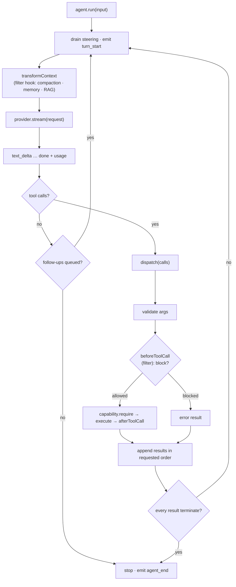
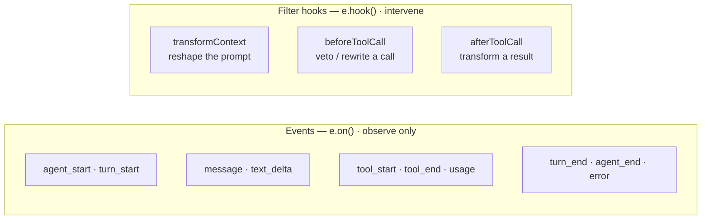
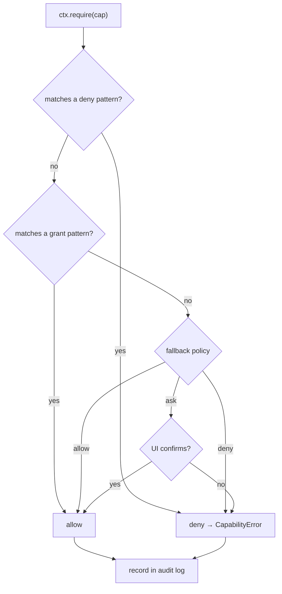
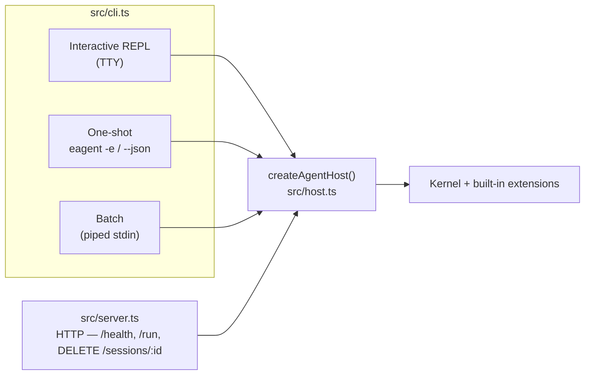

# EAgent

**A minimalist AI agent with a tiny stable core and Emacs-grade extensibility.**

Emacs has survived forty years because of one decision: a small C core hosting a
language in which *almost everything is redefinable at runtime*. Primitives live
in the core; policy lives in the extension language. EAgent applies that decision
to AI agents.

The kernel is **seven primitives and nothing more** (~1,700 lines, held under a
line ceiling by a test). There are no built-in tools, no hard-coded prompt
strategy, no memory policy, no sub-agents baked in. The four "built-in" tools
(`read`, `write`, `edit`, `bash`) are themselves an extension. Everything you'd
want to change is a hot-reloadable extension you can edit while the agent runs.


## Why another agent

Most agents are a feature pile with an opaque, shifting core. EAgent inverts that:
a core small enough to read in one sitting, and a single extension surface
powerful enough that new behavior never requires forking. The bet — the same one
pi and Emacs make — is that a minimal, observable, malleable core beats a big one.

## Quickstart

```bash
npm install
npm run build
npm test          # the full offline suite — no network or API key required

# Talk to it offline — a deterministic mock LLM drives everything:
node dist/cli.js -e "hello"

# Load an example extension and poke around:
printf '/tools\n/uptime\n/quit\n' | node dist/cli.js --ext examples/extensions/clock.ts
```

For a live model, set an API key and the CLI selects that provider automatically
(override with `--provider`):

```bash
ANTHROPIC_API_KEY=sk-... node dist/cli.js -m claude-fable-5
OPENAI_API_KEY=sk-...    node dist/cli.js -p openai -m gpt-4o
GEMINI_API_KEY=...       node dist/cli.js -p gemini -m gemini-2.0-flash
```

Or drop the keys in a `.env` file (copy `.env.example`): the CLI and server load
it automatically at startup — real environment variables always win. `.env` also
sets the model per provider via `ANTHROPIC_MODEL` / `OPENAI_MODEL` / `GEMINI_MODEL`,
so you don't need `-m` on every call, and `ANTHROPIC_AUTH_TOKEN` is accepted as an
alias for `ANTHROPIC_API_KEY` (the gateway convention).

Any OpenAI-compatible endpoint works through the OpenAI provider — e.g. a local
Ollama: `OPENAI_BASE_URL=http://localhost:11434/v1 OPENAI_API_KEY=ollama node dist/cli.js -p openai -m llama3`.
For newer official OpenAI models that require `max_completion_tokens`, set
`OPENAI_MAX_TOKENS_PARAM=max_completion_tokens`.

## How a turn works

The agent loop is the one piece that must be small, correct, and observable,
because everything else hangs off it. A turn:



Two injection points make a running agent controllable from outside: **steering**
adds a message before the next model call (interruptions, corrections), and
**follow-up** queues work for when the loop would otherwise idle (automation).

## The seven primitives

All seven live in `src/kernel/` and form the entire public surface of the kernel.

| Primitive            | File                         | Responsibility |
| -------------------- | ---------------------------- | -------------- |
| **Hook bus**         | `src/kernel/hooks.ts`        | Lifecycle events (observe) + filter hooks (intervene) — Emacs *hooks* & *advice*. |
| **Tool registry**    | `src/kernel/registry.ts`     | Register/shadow/dispose tools (and commands); a later definition wins, disposing restores the prior one. (Providers, in the same file, register by overwrite — no restore.) |
| **Provider**         | `src/kernel/types.ts`        | The one thing the kernel knows about an LLM: a request → a stream of events. |
| **Agent loop**       | `src/kernel/agent.ts`        | Turns, streaming, guarded & ordered tool dispatch, steering, follow-up, stop conditions. |
| **Capability layer** | `src/kernel/capabilities.ts` | Per-capability allow / deny / ask, wildcards, an audit log. |
| **Extension host**   | `src/kernel/extension.ts`    | Discovery, activation, the `ExtensionAPI`, hot reload via `jiti`. |
| **Command registry** | `src/kernel/commands.ts`     | User-facing slash commands — `M-x` for agents. |

Everything else — tools, memory, prompts, compaction, UI, sub-agents, MCP — is an
extension. The kernel ships with zero opinions about them.

## Hooks: observe and intervene

The hook bus maps onto Emacs's two extension idioms. **Events** are notifications
you observe; **filter hooks** are advice that can transform or veto a value.



```ts
// Observe:
e.on("tool_end", ({ call, result }) => log(call.name, result.isError));

// Intervene — block a destructive command:
e.hook("beforeToolCall", (decision, { call }) => {
  if (call.name === "bash" && /rm -rf \//.test(String(call.arguments.command)))
    return { ...decision, block: true, reason: "destructive command" };
  return decision;
});
```

These three seams are where memory strategies, plan-mode approvals, safety gates,
and context engineering plug in — without touching the loop.

## Built-in extensions

Everything below is an extension — none is in the kernel, and any can be replaced
or removed. Each is a single file under `src/extensions/`, ships with offline
tests, and gates privileged work behind a capability.

| Extension     | What it adds | Commands | Capability |
| ------------- | ------------ | -------- | ---------- |
| `core-tools`  | `read`, `write`, `edit`, `bash` (workspace-confined) | `/tools` | `fs:read`, `fs:write`, `shell:exec` |
| `skills`      | LLM-authored skills via `SKILL.md` with progressive disclosure | `/skills` | `skill:read`, `skill:write` |
| `mcp`         | Model Context Protocol client (stdio **and** Streamable HTTP); registers `mcp__<server>__<tool>` | `/mcp` | `mcp:call` |
| `codeact`     | code-as-action: `run_code` runs JS/Python in a subprocess boundary | `/code` | `code:exec` |
| `subagents`   | `spawn_agent` runs isolated child agents (single / parallel / chain) | `/agents` | `agent:spawn` |
| `memory`      | context compaction via `transformContext` + `remember`/`recall` scratchpad | `/compact`, `/memory` | — |
| `planmode`    | human-in-the-loop approval gate before mutating tools run | `/plan` | — |
| `session`     | save / load / handoff for transcripts | `/save`, `/load`, `/sessions`, `/handoff` | `fs:read`, `fs:write` |
| `packages`    | install extensions from `path:` / `git:` / `npm:` (Emacs `package.el` analog) | `/pkg-add`, `/pkg-list`, `/pkg-remove` | `pkg:install` |
| `trace`       | observability: per-run span tree, metrics, token usage — from the event bus | `/trace`, `/usage`, `/trace-save` | — |
| `context-files` | discovers `AGENTS.md` / `CLAUDE.md` up the tree and injects them | `/context`, `/context-reload` | — |
| `limits`      | guardrails: output truncation, per-run tool-call & token budgets | `/limits` | — |
| `self`        | the agent authors and hot-loads its **own** TypeScript extensions | `/self` | `self:read`, `self:extend` |
| `web`         | capability-gated, size-bounded HTTP access (`fetch_url`) | `/fetch` | `net:fetch` |
| `checkpoint`  | git-backed workspace snapshots before mutating tools, with rollback | `/checkpoint`, `/checkpoints`, `/rollback` | — |
| `introspect`  | self-documentation: describe any tool/command, search by keyword | `/describe`, `/apropos` | — |
| `journal`     | durable, append-only run journal; crash-recover with `/resume` (opt-in) | `/journal`, `/resume` | `fs:read`, `fs:write` |
| `prompts`     | saved prompt templates / macros with `$1 $2 $*` args (Emacs abbrevs) | `/prompt`, `/prompt-save`, `/prompts` | — |
| `flow-guard`  | compositional egress gate: taints a session on a source capability (default `shell:exec`) or sensitive data, then holds egress (`net:fetch`) — ask or block | `/flow-guard` | — |
| `integrity`   | sweeps every tool description for poisoning / hidden instructions, and flags descriptions that change across sessions (rug-pull guard) | `/integrity` | — |

The MCP client configures servers from `EAGENT_MCP_SERVERS`. Skills live under
`~/.eagent/skills/` (override with `EAGENT_SKILLS_DIR`).

## Capabilities: the one thing pi omits

pi runs extensions in-process with full privileges and tells you to containerize.
That's reasonable for a trusted coding agent — but EAgent makes *LLM-authored
code* a first-class mode, so it carries an explicit capability layer from day one.
A capability is a dotted authority (`fs:read`, `shell:exec`, `net:fetch`,
`self:extend`, …); tools declare what they need and the dispatcher enforces it
before the body runs, recording every decision in an audit log (`/caps`).



**Security stance.** The in-process extension path is for *trusted* code only.
There is no reliable in-process JavaScript sandbox (`node:vm` is explicitly not a
security boundary; `vm2` is abandoned). Untrusted or LLM-generated *code* that
touches the network, the filesystem outside a scratch dir, or credentials belongs
behind a real OS/VM boundary. The capability layer is the seam where that boundary
plugs in; EAgent enforces authority but does not pretend to sandbox in-process
code. See [`SECURITY.md`](SECURITY.md).

## Four front ends, one kernel



```bash
npm run serve                 # POST /run streams JSONL; GET /health
curl -s localhost:8787/run -d '{"input":"summarize package.json"}'
# A session id keeps a multi-turn conversation:
curl -s localhost:8787/run -d '{"input":"now in one line","session":"abc"}'
```

The server is open by default (trusted local use); set `EAGENT_TOKEN` to require
`Authorization: Bearer <token>` on `/run`, and request bodies are capped at 1 MiB.
To run sandboxed (the posture `SECURITY.md` recommends) there is a `Dockerfile`
(non-root, workspace-confined):

```bash
docker build -t eagent . && docker run -p 8787:8787 -v "$PWD:/workspace" eagent
```

## Embedding the kernel

The kernel is usable headless, without the CLI:

```ts
import { Agent } from "eagent";
import { MockProvider } from "eagent/providers/mock";

const agent = new Agent({ capabilities: /* ... */ });
agent.providers.register(new MockProvider([
  { toolCalls: [{ name: "add", arguments: { a: 2, b: 3 } }] },
  { text: "The sum is 5." },
]), { default: true });
const { reason, messages } = await agent.run("add 2 and 3");
```

The `MockProvider` is a scriptable, deterministic LLM — it is why the whole test
suite runs offline. For recording a real model once and replaying it
deterministically in CI, see `RecordingProvider`/`ReplayProvider` in
`eagent/providers/cassette`.

## Layout

```
src/kernel/      the seven primitives + public barrel (index.ts)
src/providers/   mock · anthropic · openai · gemini (fetch + SSE, no SDK;
                 shared retry/usage in http.ts) · cassette (record/replay)
src/extensions/  20 built-in extensions, all riding the ExtensionAPI
src/host.ts      createAgentHost — shared wiring for every front end
src/cli.ts       terminal host: REPL + one-shot + batch + --json
src/server.ts    HTTP host: /health, /run (streaming), DELETE /sessions/:id
examples/        worked example extensions
test/            the full offline suite — every primitive and extension
```

## Documentation

- [`ARCHITECTURE.md`](ARCHITECTURE.md) — the full design, with diagrams.
- [`docs/EXTENSIONS.md`](docs/EXTENSIONS.md) — the extension author's guide.
- [`SECURITY.md`](SECURITY.md) — the threat model and what is / isn't defended.
- [`CONTRIBUTING.md`](CONTRIBUTING.md) — setup and house conventions.
- [`CHANGELOG.md`](CHANGELOG.md) — release notes.

## License

MIT. Heavily inspired by [pi](https://github.com/earendil-works/pi), Emacs, and
the broader lineage of malleable, live-programmable systems.
