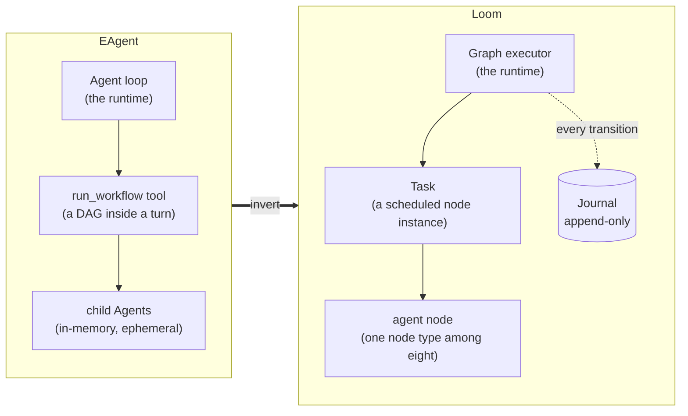
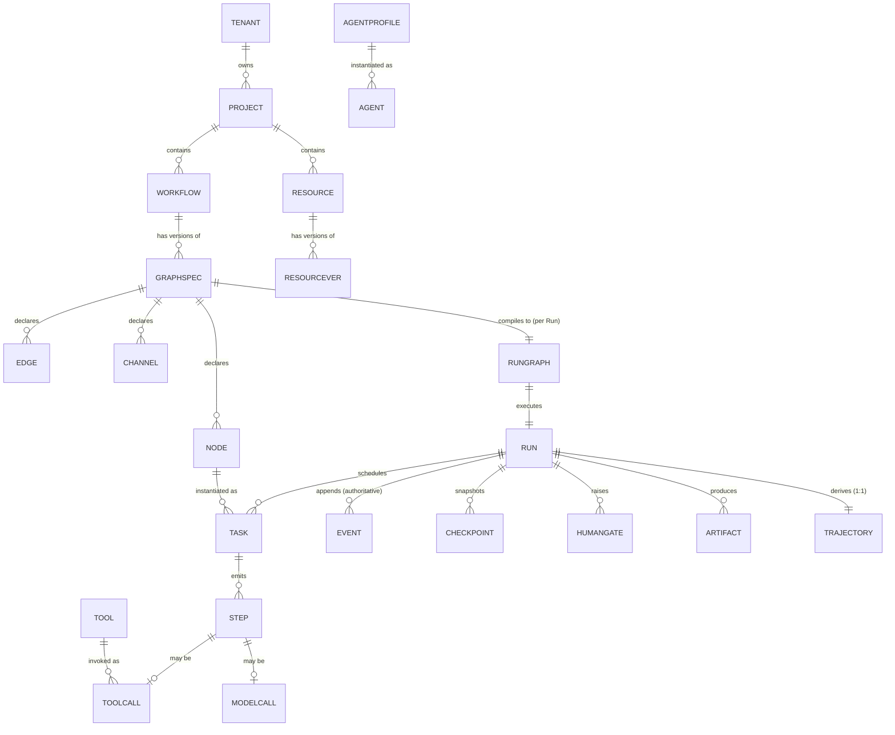
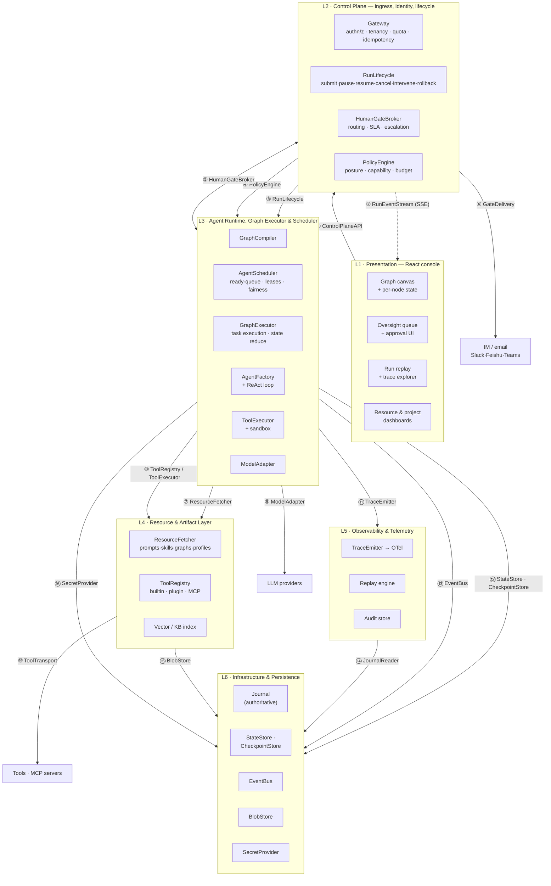

# 00 — Philosophy, Decision Log, D1 Domain Model, D2 Topology

---

## What EAgent taught us

EAgent is a good kernel with a structural limit. The limit is not a missing feature; it
is *where orchestration state lives*. Every row below is evidence from the frozen tree
(`git worktree add ../eagent-ref init`), not opinion.

| # | What EAgent does | Evidence | Consequence in production | What Loom does instead |
|---|---|---|---|---|
| 1 | The dependency DAG is an **argument to one tool call** | `src/extensions/dynamic-workflow.ts:113-151` — `run_workflow` takes `steps[]`; declared `executionMode: "sequential"` at :143 so the whole DAG occupies one blocking turn | Orchestration state is local variables (`outputs`, `status`, `pending` at :331-334) inside one `await`. A parallel run is not addressable, not resumable, not renderable, and not observable except through the parent's transcript | The graph is a **first-class versioned artifact** compiled to a `RunGraph`; the executor, not a tool, owns it (**D5**) |
| 2 | Background work is **process-lifetime only** | `src/extensions/subagent-jobs.ts:14-18`: *"a 'running job' has no meaning across a restart, so the registry is an in-memory `Map` … never `e.store`"* | Restart, deploy, or crash loses every in-flight branch with no record of how far it got | Every state transition is an **append-only journal entry** in SQLite; a run resumes from its last committed `seq` (**D5 §Checkpoints**, **D12**) |
| 3 | The scheduler sits **beside** the agent loop, so policy had to be cloned | `src/extensions/dynamic-workflow.ts:414-468` — `guardedInvoke` is an admitted hand-mirror of `Agent.executeGuarded` (`src/kernel/agent.ts:492-541`), with a comment warning it must be kept in sync | Two enforcement paths for the same security model; drift is a *silent* privilege bug, caught only by a test that asserts one hook is live | The scheduler sits **beneath** the agent loop. There is exactly one dispatch path: `ToolExecutor.invoke`, used identically by an agent node's internal turn and by a standalone tool node (**D3**, **D6**) |
| 4 | Human approval is **synchronous, in-process** | `src/kernel/types.ts:298-315` — `UI.confirm` / `UI.decide` return a `Promise` held by the running turn | An approval cannot survive a restart, cannot be routed to Slack, cannot time out with a default action, and cannot be delegated. In-the-loop is therefore only usable interactively | A `HumanGate` is a **durable record plus a journal event**. The run suspends, releases its worker slot, and resumes when a `GateResolved` event is appended — from any channel, after any restart (**D7**) |
| 5 | One `Agent` = one linear transcript | `src/kernel/agent.ts:115` — `readonly #messages: Message[]`; `run()` throws if already running (:230) | Concurrency has to be modelled as *many agents*, each with its own private history, joined by string splicing (`substitute`, `dynamic-workflow.ts:273`). There is no typed state, no merge semantics, no way to reason about what a join produced | **Typed state channels with declared reducers**; a join is a reducer application, checked at compile time for commutativity (**D5 §State channels**) |
| 6 | Capabilities are **the right idea** | `src/kernel/capabilities.ts`, `src/kernel/agent.ts:526` — the dispatcher enforces `tool.capabilities` before `execute` | Works. This is the single best thing in EAgent and the reason LLM-authored code is safe to run at all | **Inherited and extended.** Capabilities become the base of the `PolicyEngine`, joined by an *irreversibility class* per action, which derives the default oversight posture (**D7 §Irreversibility**) |
| 7 | Hook seams are **the right idea** | `src/kernel/events.ts` — 6 filter hooks + 14 events; `hooks.apply("beforeToolCall", …)` with a `shouldStop` predicate | Works. Extensions intervene without forking the loop | **Inherited and extended.** The hook points move to graph lifecycle stages (`pre-plan`, `pre-node`, `pre-tool`, `post-tool`, `pre-model`, `post-model`, `on-error`, `on-gate`, `on-complete`) (**D6 §Hooks**) |
| 8 | Zero runtime dependencies | `test/zero-dep.test.ts` — runtime deps ⊆ `{jiti}`; UI isolated in a separate package | Works. This is why `build:binary` can produce a single SEA binary at all | **Inherited as a hard constraint** on `@loom/core`. The React console is a separate package that depends on core, never the reverse (**D12**) |
| 9 | The minimalism guard | `test/kernel-surface.test.ts` — pins the public export list and a hard line ceiling | Works, and is the reason 65 extensions exist instead of a 20k-line kernel. But the ceiling was raised four times for things that were genuinely primitive (permission seams, tenancy ALS) | **Inherited with a correction:** guard the *interface surface* (16 named contracts, additively versioned), not the line count. Line ceilings punish correct primitives; surface pins punish incidental ones (**D3 §Versioning**) |

### The three inversions

1. **Control inverts.** The graph schedules the agent, not the reverse. An agent node's
   internal ReAct loop is bounded, private, and replaceable; the graph decides what may
   happen next.
2. **State externalises.** Run state moves out of a message array into typed channels
   backed by an append-only journal, so it survives restarts and can be inspected,
   diffed, checkpointed, and replayed.
3. **Oversight becomes topology.** A human decision is not a blocking `Promise` on a
   `UI` object; it is a durable record the scheduler waits on, indistinguishable in
   mechanism from waiting on a slow tool.

### What Loom deliberately keeps from EAgent

- Capability strings as the security vocabulary (`fs:read`, `shell:exec`, …) with
  wildcard patterns and an audit log.
- A provider abstraction that is *only* "a request becomes a stream of events", with
  the wire format, retries, and auth pushed into implementations.
- Filter hooks that thread a value through handlers and can veto, with a stop predicate
  so a later handler cannot override a decision already made.
- Zero-runtime-dependency core, single-binary deployability, an offline deterministic
  mock provider so the whole suite runs with no API key.
- Registration-returns-a-`Disposable` so a reload is a clean swap.

---

## Foundational decision log

Every non-trivial decision carries: the **choice**, a one-line **rationale**, the
**rejected** alternative, and the **reversal condition** — the observable fact that
would make us change our minds.

### DL-1 · Language and process model

- **Choice:** TypeScript end-to-end on Node ≥ 24 (`engines.node` is `>=24.0.0`), shipped
  as one SEA binary. Core, control plane, executor, and node bodies are all TS in one
  process for v1. The 24 is a **choice, not a forced floor**: native type stripping runs
  unflagged from v22.18.0 and `node:sqlite` from v22.13.0, so the strict floor those imply
  is 22.18. 24 is the LTS line this is developed and tested on. See `08-PLAN.md` A2.
- **Rationale:** the team already ships a zero-dep TS engine and an SEA binary; a
  6–8 week v1 cannot absorb two toolchains, two type systems, and an IPC boundary.
- **Rejected:** Go/Rust orchestration core + Python agent workers over gRPC — the
  reference matrix's default. It buys real CPU parallelism and a stronger scheduler,
  and costs a serialization boundary, duplicated domain types, and two release trains.
- **Reverses when:** measured p99 scheduler tick latency exceeds 50 ms with ≥200
  concurrent in-flight Tasks, *or* CPU-bound function nodes (parsing, embedding,
  diffing) exceed 30 % of event-loop time. **Neither is observable from a span today** —
  `DESIGNED-NOT-BUILT(loom.scheduler.tick)`, and claiming there was one is how this
  condition sat unmeasured. The first half is measurable from the journal without one:
  `task.leased.ts − task.ready.ts` is the queue wait, recorded per Task. The second half
  needs instrumentation that does not exist. The migration is bounded: only
  `GraphExecutor` + `AgentScheduler` move; every other interface is I/O-bound and
  stays.

### DL-2 · The graph executor is the runtime

- **Choice:** the top-level runtime is a graph executor. An agent's ReAct loop is the
  body of one node type.
- **Rationale:** it is the only structure in which parallel branches have identity,
  durability, and independent policy — which is the entire production complaint.
- **Rejected:** keep the agent loop on top and make the DAG a tool (EAgent's shape).
  Simpler to build; structurally cannot give a branch an addressable identity.
- **Reverses when:** never, for multi-task workloads. For a *single* interactive
  coding session the agent-on-top shape is genuinely simpler, so Loom exposes a
  built-in one-node graph (`@loom/graphs/single-agent`) rather than a second runtime.

### DL-3 · Append-only journal as the only durable truth

- **Choice:** one ordered, append-only `Event` log per Run is authoritative. Everything
  else — run status tables, the graph canvas, OTel spans, trajectories, cost ledgers —
  is a **derived read model** rebuildable by folding the journal.
- **Rationale:** durable suspension, deterministic replay, checkpoint/resume, audit
  completeness, and live UI streaming are five requirements with one mechanism. Any
  design that solves them separately will have five inconsistent truths.
- **Rejected:** mutable run/task rows as the source of truth with an events table for
  the UI. Faster to query, but replay and audit become best-effort, and a crash between
  a row update and an event write is a permanent inconsistency.
- **Reverses when:** journal growth makes hot reads unacceptable *and* snapshotting
  cannot fix it. Mitigated up front: a `Checkpoint` is a fold-snapshot, so reads start
  from the last snapshot, not from `seq=0`.

### DL-4 · One artifact: `GraphSpec`

- **Choice:** a single YAML/JSON artifact is authored by a human or agent, versioned in
  the resource layer, rendered by the UI, compiled by the executor, reconstructed by
  observability, and mutated by evolution. No layer keeps a private representation.
- **Rationale:** the brief's hardest consistency requirement. Parallel representations
  are how orchestration frameworks rot — the UI diagram stops matching what ran.
- **Rejected:** an authoring DSL that compiles to an internal IR the UI never sees.
  Nicer authoring ergonomics; guarantees drift.
- **Reverses when:** never. This is enforced mechanically: the compiler emits
  `graph.hash = sha256(canonical(GraphSpec))`, every node span carries it, and a
  reconstruction test asserts the folded journal reproduces the same hash (**D9**).

### DL-5 · Determinism via a recorded effect boundary

- **Choice:** a nondeterministic call is journaled as `effect.started` / `effect.completed`
  under a **derived** key — `effectKey(taskId, kind, ordinal)`, which deliberately excludes
  the attempt number so a retry and a replay resolve to the same record. Replay serves the
  recorded result and never re-executes.
- **The boundary is inside `Engine`, not a method a node body calls.** `#invokeTool`, the
  agent turn, context summarization and a subgraph invocation each open and close their own
  effect. A node body is handed `{taskId, signal, now}` (`FunctionContext`) or
  `{taskId, signal, progress}` (`ToolContext`) and has no way to declare an effect of its
  own — so an author cannot forget to wrap one and cannot invent a key. **Do not write a
  node body that reaches for an effect API; there isn't one.**
- **Rationale:** the only way to get faithful replay without pretending the world is
  pure. Borrowed directly from durable-execution engines (Temporal, DBOS). Putting the
  boundary in the engine rather than in the body is what makes invariant 4 checkable by
  reading one file instead of every resource anyone ever publishes.
- **What is actually recorded:** model calls, tool calls, and the subgraph result. **Not
  the clock, and not randomness** — `effect.started` declares `clock` and `random` kinds
  that nothing appends, `FunctionContext.now` is injected but unjournaled, and `Math`
  reaches a `function` body whole. A body that must replay identically takes its timestamp
  from a channel it reads. See D9 and R4.
- **Rejected:** re-running everything against live systems on replay. Unsafe for any
  irreversible action and non-reproducible for model calls.
- **Reverses when:** never for replay. It is *lossy* in three known cases — secrets,
  redacted fields, and forked runs with modified inputs — stated honestly in **D9 §What
  cannot be replayed**.

### DL-6 · Oversight is a lattice, not a flag

- **Choice:** postures are ordered `out < on < in`. The effective posture of any action
  is `max(system, workflow, node, tool, runtime-escalations)`. Tightening is a `max`;
  loosening is a separate, capability-gated, human-only operation.
- **Rationale:** makes the asymmetry rule a property of the algebra rather than a rule
  people must remember to enforce.
- **Rejected:** a posture enum with last-writer-wins override. One careless node-level
  declaration silently disables a system-level safety control.
- **Reverses when:** never. Enforced at two independent points: the runtime identity of
  the evolution engine is *deny-listed* for `oversight:loosen`, and the compiler rejects
  any candidate graph whose postures are anywhere below its baseline
  (`E_OVERSIGHT_LOOSENED`) (**D7 §Asymmetry**).

### DL-7 · Storage: SQLite (WAL) locally, Postgres distributed — one interface

- **Choice:** `StateStore`/`CheckpointStore`/`Journal` are interfaces; v1 ships a SQLite
  WAL implementation with the journal as one append table plus derived views.
- **Rationale:** satisfies the hard constraint — single binary, empty data directory,
  no external service — while the SQL shape ports to Postgres almost unchanged.
- **Rejected:** an embedded KV (LMDB-style) with hand-rolled indexes. Faster writes; no
  ad-hoc query path for the ops console, and a second query language to port.
- **Reverses when:** single-writer journal append becomes the bottleneck (> ~5k
  events/s sustained). Then partition the journal by run and move to Postgres, which is
  the planned v2 step anyway.

### DL-8 · v1 is a single process; distribution is designed for, not built

- **Choice:** in-process `EventBus`, in-process scheduler with no leader election, tools
  executed as sandboxed subprocesses. Every distributed concern is expressed as an
  interface with a local implementation.
- **Rationale:** the brief's practicality constraint. A distributed v1 by a small team
  in 8 weeks produces a distributed prototype, not a product.
- **Rejected:** Kafka + K8s from day one.
- **Reverses when:** a single tenant needs more than one node's worth of concurrent
  Tasks, or availability requirements exceed what a rolling restart with durable
  suspension can offer.

---

## D1 — Domain model & glossary

Every later section uses only these terms. Where a word has a common loose meaning
(*task*, *step*, *agent*), the definition below is narrow on purpose.

### Cardinality

### Glossary

| Term | Definition | Cardinality | Authoritative store | Mutable |
|---|---|---|---|---|
| **Tenant** | The isolation boundary for identity, quota, resources, telemetry, and secrets. Nothing crosses it. | root | `tenants` | yes |
| **Project** | A namespace inside a Tenant grouping Workflows and Resources; the unit of RBAC assignment. | Tenant 1:N | `projects` | yes |
| **Workflow** | A named, versioned *definition* of a process. A container for GraphSpec versions; it is never itself executed. | Project 1:N | `workflows` | yes |
| **GraphSpec** | The **single source artifact**: an immutable, content-addressed declaration of nodes, edges, channels, policy, and budgets. `sha256(canonical(spec))` is its identity. | Workflow 1:N (versions) | `resources` (kind `graph`) | **no** |
| **RunGraph** | The *compiled, validated* plan for one Run: the GraphSpec plus the resolution manifest (every resource ref pinned to a content hash), the layout hint, and the derived schedule metadata. | Run 1:1 | `run_graphs` | **no** |
| **Node** | A static vertex declared in a GraphSpec. Design-time. Has a type (`agent`,`function`,`router`,`join`,`tool`,`evaluator`,`human_gate`,`subgraph`). | GraphSpec 1:N | inside GraphSpec | **no** |
| **Edge** | A static directed connection declaring a *permitted* transition, with its kind (`seq`,`conditional`,`fanout`,`join`,`error`,`compensation`,`loop` — seven, and D5 is the authoritative list). | GraphSpec 1:N | inside GraphSpec | **no** |
| **Channel** | A named, typed slot of Run state with a declared reducer. The only way data moves between Nodes. | GraphSpec 1:N | inside GraphSpec (schema); values in journal | schema no / value yes |
| **Run** | One execution of one RunGraph. The unit of lifecycle commands, budget, tenancy, and trace root. | Workflow 1:N | `runs` (derived) + journal (authoritative) | status derived |
| **Task** | One *scheduled instance* of a Node in a Run at a specific **branch coordinate** (`nodeId@branchPath#iteration`). The unit the scheduler leases, retries, checkpoints, and cancels. **A Node with a fan-out of 50 produces 50 Tasks.** | Node 1:N | journal | status derived |
| **Step** | One atomic journaled transition inside a Task — a model call, a tool call, an effect, a state write, a gate raise. Carries a monotonic per-Run `seq`. | Task 1:N | journal | **no** |
| **Effect** | One interaction with the world outside the deterministic core, opened and closed by `Engine` under a derived key (`effectKey(taskId, kind, ordinal)`) so its result is recorded and replayable. ModelCall and ToolCall are Effects. A node body does not declare one — see DL-5. | Step 1:0..1 | journal | **no** |
| **Agent** | The *runtime instantiation* of an AgentProfile executing inside an agent-node Task: a bounded ReAct loop with its own private message list. Ephemeral; dies with the Task. | AgentProfile 1:N | journal (its turns) | n/a |
| **AgentProfile** | A versioned Resource declaring persona/prompt ref, model policy and fallback chain, tool allowlist, context budget, and oversight defaults. Design-time. | Project 1:N | `resources` (kind `agent_profile`) | **no** (versions) |
| **Tool** | A capability-declaring, schema-typed callable with an **irreversibility class**. Registered by a built-in, a plugin, or an MCP server. | Registry 1:N | `tool_manifest` | versioned |
| **ToolCall** | One invocation of a Tool from a Task, with validated arguments, a policy decision, an idempotency key, and a result. A kind of Step. | Task 1:N | journal | **no** |
| **Checkpoint** | A restorable snapshot at a Task boundary: `{journalSeq, channelStateHash, resolutionManifestRef, openTasks}`. Named checkpoints are addressable for rollback. | Run 1:N | `checkpoints` + blob | **no** |
| **HumanGate** | A durable request for a human decision, with payload, posture, approvers, SLA, timeout policy, and default action. Raised by a `human_gate` node **or** by a runtime policy escalation. | Run 1:N | `human_gates` + journal | status only |
| **Event** | An immutable, ordered journal entry `{runId, seq, ts, type, actor, payload}`. **The atom of the system.** Everything else is a fold over Events. | Run 1:N | `journal` | **no** |
| **Trajectory** | The normalized projection of a completed Run's journal into ordered `(state, action, observation, outcome)` tuples plus scores. Input to the evolution loop. | Run 1:1 (derived) | `trajectories` | rebuildable |
| **Artifact** | A content-addressed blob produced by a Run (file, image, report, diff). Referenced from channels by digest, never inlined. | Run 1:N | blob store | **no** |
| **Resource** | Any versioned, addressable design-time asset: Prompt, Skill, GraphSpec, Subgraph, AgentProfile, ToolManifest, KnowledgeBase, MCPServer registration. | Project 1:N | `resources` | **no** (versions) |
| **Posture** | One of `in` / `on` / `out`, ordered `out < on < in`. Attached to a system, workflow, node, or tool; resolved by `max`. | attribute | config + journal | resolved per action |
| **BranchCoordinate** | The path identifying a Task instance under fan-out and loops: `root/fanout:docs[7]/loop#2`. Deterministic and stable across replay. | Task 1:1 | journal | **no** |
| **Lease** | A time-bounded claim on a Task by a worker, with a fencing token. Prevents double execution when a worker stalls. | Task 1:0..1 | `leases` | yes |

### Deliberately *not* nouns in this system

- **"Session"** — EAgent's session (a conversational transcript keyed by id) is
  replaced by `Run`. Chat continuity is a Run whose graph is `single-agent` with a
  loop-back edge, not a separate concept.
- **"Job"** — replaced by `Task`. A background job in EAgent was a detached child
  agent; in Loom every unit of work is already a scheduled, durable Task.
- **"Sub-agent"** — replaced by `subgraph` node + `agent` node. There is no privileged
  parent/child agent relationship, only graph nesting.

---

## D2 — System topology

### Edge contract table

Every edge maps to exactly one named interface defined in **D3**. `S` = synchronous
request/response, `A` = asynchronous/streaming.

| # | Edge | Interface (D3) | Protocol (local → distributed) | S/A | Failure mode | Degraded behaviour |
|---|---|---|---|---|---|---|
| ① | UI → Control Plane | `ControlPlaneAPI` | HTTP/JSON → HTTP/JSON behind LB | S | 4xx validation, 429 quota, 503 admission | Client retries with the same `Idempotency-Key`; duplicate submit returns the original `runId` |
| ② | Control Plane → UI | `RunEventStream` | SSE → SSE with sticky session | A | connection drop | Client reconnects with `Last-Event-ID`; server replays journal from `seq+1`, or sends a full snapshot if the gap exceeds the hot window |
| ③ | Control Plane → Executor | `RunLifecycle` | in-process call → gRPC | S | executor busy, run not found, illegal transition | Commands are journaled *before* dispatch, so a lost command is re-driven on restart; illegal transitions are rejected, never queued |
| ④ | Control Plane → Executor | `PolicyEngine` | in-process → gRPC (with local cache + TTL) | S | policy store unreachable | **Fail closed**: unknown → deny, and posture defaults to `in`. Never fail open |
| ⑤ | Control Plane ↔ Executor | `HumanGateBroker` | in-process → gRPC + journal | A | broker down while a gate is open | Gate is already durable in `human_gates`; the run stays suspended, consuming no worker slot. Nothing is lost, only delayed |
| ⑥ | Control Plane → IM/email | `GateDelivery` | HTTPS webhook | A | delivery failure | Channels are tried **once, in parallel**; each failure appends `gate.delivery_failed`, and if *no* channel succeeded the gate falls back to the console queue in the same call. There is no per-channel retry or `maxAttempts` — the retry unit is the SLA escalation tier, whose clock resets. **Delivery failure never auto-approves** |
| ⑦ | Executor → Resources | `ResourceFetcher` | in-process + LRU → HTTP + LRU | S | resource missing / version yanked | Compile-time: run is rejected before it starts. Run-time: impossible — every ref is pinned in the resolution manifest at compile |
| ⑧ | Executor → Tools | `ToolRegistry`, `ToolExecutor` | in-process → in-process (registry) + subprocess/gRPC (exec) | S+A | tool timeout, crash, non-zero exit, schema violation | Typed `ToolError`; retry policy applies only if `idempotent: true`; otherwise surfaces to the node's error edge |
| ⑨ | Executor → LLM | `ModelAdapter` | HTTPS + SSE | A | rate limit, context overflow, content filter, provider down | Normalized error taxonomy drives the declared fallback chain (**D3 §ModelAdapter**) |
| ⑩ | Tool layer → external | `ToolTransport` | subprocess / HTTP / MCP stdio+SSE | S+A | MCP server unhealthy | Circuit breaker per server; tools from an open-circuit server are withheld from the model's tool list and their nodes fail fast |
| ⑪ | Executor → Telemetry | `TraceEmitter` | in-process → OTLP/gRPC | A | collector down | **Telemetry is lossy by design.** Bounded ring buffer, drop-oldest, emit `otel.dropped` counter. Never blocks execution, never blocks a journal append |
| ⑫ | Executor → Persistence | `StateStore`, `CheckpointStore` | SQLite WAL → Postgres | S | write conflict, disk full | Conditional append on `expectedSeq`; conflict → the Task attempt is abandoned and re-leased. Disk full → run suspends, does not corrupt |
| ⑬ | Executor → Bus | `EventBus` | in-process emitter → NATS/Kafka | A | subscriber slow | Per-subscriber bounded queue with drop policy declared at subscribe. A slow UI subscriber can never stall the executor |
| ⑭ | Telemetry → Journal | `JournalReader` | SQL read → SQL read replica | S | none (read-only) | Replay degrades to "as-recorded"; sampled-out spans are reconstructed from the journal, which is never sampled |
| ⑮ | Resources → Blob | `BlobStore` | fs → S3/MinIO | S | blob missing | Content-addressed, so a missing digest is a hard error surfaced at compile, not mid-run |
| ⑯ | Executor → Secrets | `SecretProvider` | env/file → Vault/K8s CSI | S | secret unavailable | Node fails with `E_SECRET_UNAVAILABLE` **before** any effect runs. Resolved values never enter the journal, prompts, or spans |

### The two facts this diagram encodes

1. **Nothing writes durable state except through L6 interfaces**, and within L6 the
   journal is the only authoritative writer. `runs`, `tasks`, `human_gates`, and
   `checkpoints` are read models maintained by a single in-process folder that consumes
   the journal — so a crash between "journal append" and "read model update" is
   self-healing on restart.
2. **Telemetry (⑪) and the bus (⑬) are allowed to lose data; the journal (⑫) is not.**
   This is the line that keeps the system honest under load: back-pressure is applied to
   *admission*, never to durability.
