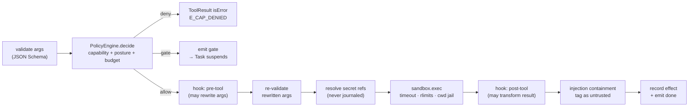

# 01 — D3 · Interface Contracts

All contracts are TypeScript. They are the *only* way layers talk. Swapping local →
distributed swaps implementations behind these signatures and changes no call site
(**D12**).

---

## D3.0 — Shared foundations

### Identity and branded ids

```ts
declare const brand: unique symbol;
type Id<K extends string> = string & { readonly [brand]: K };

export type TenantId   = Id<"tenant">;
export type ProjectId  = Id<"project">;
export type RunId      = Id<"run">;        // ULID — lexicographically time-sortable
export type NodeId     = Id<"node">;       // author-chosen, unique within a GraphSpec
export type TaskId     = Id<"task">;       // `${nodeId}@${branchPath}#${iteration}` — DERIVED, not random
export type GateId     = Id<"gate">;
export type ResourceRef = `${string}/${string}@${string}`;  // kind/name@version|digest
export type GraphHash  = `sha256:${string}`;
export type Seq        = number;           // monotonic per Run, starts at 1, no gaps
```

> **Why `TaskId` is derived, not random.** `nodeId@branchPath#iteration` is a pure
> function of the graph and the branch coordinate. A retry, a resume after restart, and
> a replay all compute the *same* TaskId, which is what makes journal entries
> idempotent and effect keys stable. A random id would break replay silently.

### The error taxonomy — one union, used by every interface

```ts
export type ErrorClass =
  | "validation"   // caller's fault. NEVER retry.
  | "policy"       // denied by PolicyEngine. Retry only after a human changes policy.
  | "not_found"
  | "conflict"     // optimistic-concurrency or idempotency clash. Re-read, then decide.
  | "exhausted"    // budget / quota / rate limit. Retry after `retryAfterMs`.
  | "unavailable"  // transient dependency failure. Retry with backoff.
  | "timeout"
  | "cancelled"
  | "internal";    // a bug in Loom. Never retried automatically; always alerts.

export interface LoomError extends Error {
  readonly class: ErrorClass;
  readonly code: string;               // stable machine code, e.g. "E_GRAPH_INVALID"
  readonly retryable: boolean;         // derived: class ∈ {exhausted, unavailable, timeout}
  readonly retryAfterMs?: number;
  readonly details?: unknown;          // structured, redacted, safe to log
  readonly cause?: unknown;
}
```

**Canonical codes** (the full list lives beside the implementation; these are
load-bearing across layers):

| Code | Class | Raised by | Meaning |
|---|---|---|---|
| `E_GRAPH_INVALID` | validation | `GraphCompiler` | Aggregated compile diagnostics; see `details.diagnostics[]` |
| `E_OVERSIGHT_LOOSENED` | policy | `GraphCompiler` | A candidate graph declares a posture below its baseline (**D7**) |
| `E_CAP_DENIED` | policy | `PolicyEngine` | A required capability is denied for this actor |
| `E_GATE_REQUIRED` | policy | `PolicyEngine` | Not an error — a *signal* the executor converts into a HumanGate |
| `E_BUDGET_EXHAUSTED` | exhausted | `PolicyEngine` | Run/node/tenant budget would be exceeded |
| `E_ADMISSION_REJECTED` | exhausted | `AgentScheduler` | Tenant concurrency or queue depth exceeded; carries `retryAfterMs` |
| `E_SEQ_CONFLICT` | conflict | `StateStore` | `expectedSeq` did not match; another attempt won |
| `E_PAYLOAD_TOO_DEEP` | validation | `StateStore` | A payload or actor nests deeper than `canonicalize` will walk. Refused rather than truncated: a truncating canonicalizer would digest a value that is not the value, and `digest()` is what replay compares |
| `E_IDEMPOTENCY_MISMATCH` | conflict | `ControlPlaneAPI` | Same key, different payload |
| `E_LEASE_LOST` | conflict | `AgentScheduler` | Fencing token stale; this worker must abandon the Task |
| `E_CONTEXT_OVERFLOW` | validation | `ModelAdapter` | Prompt exceeds the model window after compaction |
| `E_CONTENT_FILTERED` | policy | `ModelAdapter` | Provider refused on content grounds |
| `E_PROVIDER_RATE_LIMIT` | exhausted | `ModelAdapter` | Carries `retryAfterMs` from the provider |
| `E_TOOL_TIMEOUT` | timeout | `ToolExecutor` | Wall-clock budget exceeded |
| `E_TOOL_NOT_IDEMPOTENT` | validation | `ToolExecutor` | A retry was requested for a tool that forbids it |
| `E_SECRET_UNAVAILABLE` | unavailable | `SecretProvider` | Resolved *before* any effect runs |
| `E_REPLAY_DIVERGENCE` | internal | `GraphExecutor` | Replay reached an effect key the journal does not contain |
| `E_CANCELLED` | cancelled | any | The `AbortSignal` fired |

> **The "Raised by" column is the design's intent, not an inventory of live throw sites.**
> Five rows above name a raiser that does not raise — `E_GATE_REQUIRED`,
> `E_ADMISSION_REJECTED` (there is no `AgentScheduler` at all; **D6.3**), `E_LEASE_LOST`
> (the executor never arms the fence; `HANDOFF.md` **A2**), `E_TOOL_NOT_IDEMPOTENT`, and
> `E_SECRET_UNAVAILABLE`. Each is declared in `errors.ts` and referenced by nothing else
> in `src/`, so no `retry.onlyIf` list matching one of them will ever fire.
> `test/docs-drift.test.ts` pins the whole never-raised set exactly, which means
> implementing any of them fails the suite and sends its author back to this table.

### Universal method contract

Every asynchronous method on every interface obeys these four rules. They are stated
once here and are not repeated per method.

1. **Cancellation.** Takes `signal?: AbortSignal`. On abort it rejects with
   `LoomError{class:"cancelled", code:"E_CANCELLED"}` and leaves **no partial durable
   state** — durable mutation is always one conditional append, so it either landed
   before the abort or not at all.
2. **Idempotency.** Any method that mutates durable state takes either an
   `idempotencyKey` or an `expectedSeq`. Replaying the same key with the same payload
   returns the original result; with a different payload it rejects
   `E_IDEMPOTENCY_MISMATCH`.
3. **Streaming.** Streams are `AsyncIterable<T>` terminated by exactly one terminal
   event of the union. Consumers **must** drain or call `.return()`; producers must
   release resources on `.return()`. Back-pressure is the consumer's `await` — no
   producer buffers unboundedly.
4. **Errors.** Only `LoomError` crosses an interface boundary. Implementations wrap
   native errors, and never leak provider payloads (which may contain secrets) into
   `message`; those go into redacted `details`.

### Interface versioning and compatibility

```ts
export interface Versioned {
  /** e.g. "loom.dev/v1". Major bump = breaking; minor = additive only. */
  readonly apiVersion: `${string}/v${number}`;
  /** Feature negotiation without a version bump. Consumers MUST tolerate unknown flags. */
  readonly features: ReadonlySet<string>;
}
```

**Rules.** (a) Within a major version, only *additive* changes: new optional fields, new
methods, new union members behind a `features` flag. (b) A consumer that needs a feature
checks `impl.features.has("x")` and degrades explicitly — never by `try/catch`. (c)
Breaking a contract means shipping `V2` alongside `V1` with an adapter, then deleting
`V1` after one release. (d) `GraphSpec.apiVersion` is checked by the compiler: unknown
major → `E_GRAPH_INVALID`; known older minor → migrated in-memory and the migration is
journaled.

> **The minimalism guard, corrected.** EAgent pinned a *line count* on the kernel
> (`test/kernel-surface.test.ts`), which taxed correct primitives as much as incidental
> ones — the ceiling was raised four times. Loom pins **the exported name set instead**:
> `scripts/check-surface.mjs` asks the TypeScript checker for every name reachable from
> `dist/index.d.ts` and compares it to `scripts/surface.json`. **How many names that is,
> is a command and not a number written here** —
> `node -e "console.log(require('./scripts/surface.json').length)"` — because this
> paragraph said 426 while the pin held 452, and the pin moves in every wave that exports
> anything. Adding or removing a public export is a deliberate, reviewed act, and the diff
> shows a reviewer exactly what grew; adding 300 lines inside an existing implementation
> is not policed, because it shouldn't be.
>
> **What that guard does NOT do**, stated because this paragraph claimed both for a while:
> it pins NAMES, not signatures, and it is a script under `npm run check` rather than a
> test under `npm test`. Adding a method to an interface that is already exported changes
> nothing it looks at. The check that compares a method name in a `ts` block here against
> the code of the same name is `test/docs-drift.test.ts`, it reaches the 18 doc interfaces
> that have a counterpart in `src/`, and it compares names and never parameter lists —
> that file's closing section says why.

### Core value types

```ts
/** A read-only projection of Run state visible to a Task. */
export interface StateView {
  get<T = unknown>(channel: string): T | undefined;
  /** Only channels declared as this node's `reads`. Others throw E_CHANNEL_UNDECLARED. */
  require<T = unknown>(channel: string): T;
  readonly hash: string;  // sha256 of the canonicalised visible slice — used for caching + replay
}

/** What a Task proposes to write. Applied through the channel's reducer. */
export type ChannelWrites = Readonly<Record<string, unknown>>;

export interface NodeOutcome {
  readonly status: "ok" | "error" | "gate";
  readonly writes?: ChannelWrites;
  /** Router/conditional nodes only: the subset of declared outgoing edge ids to take. */
  readonly take?: readonly string[];
  /** status:"gate" only — the gate request the executor must raise. */
  readonly gate?: GateRequest;
  readonly error?: LoomError;
  readonly usage?: Usage;
}

export interface Usage {
  inputTokens: number; outputTokens: number;
  cacheReadTokens?: number; cacheWriteTokens?: number; reasoningTokens?: number;
  costUsd: number;          // computed by ModelAdapter from a pinned price table version
  wallMs: number;
}

export type Posture = "out" | "on" | "in";
export type IrreversibilityClass =
  | "read_only"          // no external mutation
  | "reversible_write"   // mutates state Loom can undo via a declared compensation
  | "irreversible"       // cannot be undone (payment, delete, deploy)
  | "externally_visible";// observable by third parties (email, PR comment, tweet)
```

---

## D3.1 — `GraphCompiler`

```ts
export interface GraphCompiler extends Versioned {
  /**
   * Pure. Validates a GraphSpec and pins every resource ref to an immutable digest.
   * No side effects, no durable writes — safe to call from the UI on every keystroke.
   */
  compile(input: {
    spec: GraphSpec;
    tenant: TenantId;
    project: ProjectId;
    /** Baseline for the asymmetry check. Absent for a first compile. */
    baseline?: { graphHash: GraphHash; postures: ReadonlyMap<NodeId, Posture> };
    signal?: AbortSignal;
  }): Promise<CompileResult>;

  // NOT A METHOD OF THIS INTERFACE. Runtime mutation is compiled by the free function
  // `compileMutation(input: MutateInput): MutationResult` in `graph/mutate.ts`, which the
  // executor calls directly; `GraphCompiler` has `compile` and `analyze` and nothing else.
  // Kept here, commented, because the CAPABILITY is real and D5 §Dynamic mutation is
  // written against it — it is the shape that is wrong, not the feature.
  //
  // compileMutation(input: {
  //   base: RunGraph;
  //   mutation: GraphMutation;
  //   budget: ExpansionBudget;
  //   signal?: AbortSignal;
  // }): Promise<CompileResult>;

  /** Static analysis surfaced to the editor without compiling: reachability, unused channels, cost estimate. */
  analyze(spec: GraphSpec): Diagnostics;
}

export type CompileResult =
  | { ok: true;  graph: RunGraph; diagnostics: Diagnostics /* warnings only */ }
  | { ok: false; error: LoomError /* E_GRAPH_INVALID | E_OVERSIGHT_LOOSENED */; diagnostics: Diagnostics };

export interface Diagnostic {
  severity: "error" | "warning" | "info";
  code: string;                       // e.g. "GRAPH006_UNBOUNDED_LOOP"
  message: string;
  at?: { nodeId?: NodeId; edgeId?: string; channel?: string; jsonPath?: string };
  fix?: string;                       // a concrete suggested edit, not "consider reviewing"
}
export type Diagnostics = readonly Diagnostic[];
```

| Property | Contract |
|---|---|
| Errors | `E_GRAPH_INVALID` (aggregates **all** diagnostics — never fails on the first), `E_OVERSIGHT_LOOSENED`, `E_RESOURCE_NOT_FOUND`, `E_CANCELLED` |
| Idempotency | Pure: same `(spec, resource digests)` → identical `RunGraph` including `graphHash`. Memoised by `graphHash` |
| Cancellation | Honoured between validation passes; a cancelled compile writes nothing |
| Streaming | None |

---

## D3.2 — `GraphExecutor`

```ts
export interface GraphExecutor extends Versioned {
  /** Execute exactly one leased Task to a terminal outcome. The ONLY place a node body runs. */
  executeTask(input: {
    lease: Lease;
    graph: RunGraph;
    state: StateView;
    attempt: number;
    mode: "live" | "replay";
    signal: AbortSignal;
  }): Promise<TaskResult>;

  /** Apply a Task's writes through channel reducers and append the transition. Atomic. */
  commit(input: {
    lease: Lease;
    result: TaskResult;
    expectedSeq: Seq;
  }): Promise<{ seq: Seq; unblocked: readonly TaskRef[] }>;

  /** Fold the journal to reconstruct a Run's state at a point in time. */
  project(runId: RunId, atSeq?: Seq): Promise<RunProjection>;
}

export interface TaskResult {
  readonly taskId: TaskId;
  readonly outcome: NodeOutcome;
  readonly steps: readonly StepRecord[];   // every effect, in order, with keys and results
  readonly usage: Usage;
}
```

| Property | Contract |
|---|---|
| Errors | `E_REPLAY_DIVERGENCE`, `E_SEQ_CONFLICT` (from `commit`), `E_LEASE_LOST`, `E_CANCELLED`, plus anything the node body raises, normalised |
| Idempotency | `commit` is conditional on `expectedSeq`. Two workers racing the same Task: exactly one commit lands, the loser gets `E_SEQ_CONFLICT` and discards its work. This is what makes at-least-once *execution* produce exactly-once *state* |
| Cancellation | Aborts the node body, waits `gracePeriodMs` for in-flight effects, then commits a `TaskCancelled` transition. **In-flight irreversible effects are not un-done** — see **D4 deviation 1** |
| Streaming | None on this interface; progress reaches the UI via `EventBus` |

---

## D3.3 — `AgentScheduler`

The component that directly answers *"many tasks in parallel is unmanageable."*

```ts
export interface AgentScheduler extends Versioned {
  /** Admission control. Rejects rather than queueing unboundedly. */
  submit(input: {
    graph: RunGraph;
    trigger: RunTrigger;
    idempotencyKey: string;
    priority?: number;              // 0..9, default 5
    signal?: AbortSignal;
  }): Promise<{ runId: RunId; accepted: true } | never>;

  /** Lease the next runnable Task. Long-polls up to `waitMs`. Returns null on timeout. */
  lease(input: { workerId: string; classes: readonly TaskClass[]; waitMs: number }): Promise<Lease | null>;

  /** Extend a lease held by a long-running Task. Failure means the lease was stolen. */
  heartbeat(lease: Lease): Promise<Lease>;

  /** Return a Task to the queue (worker shutting down, backpressure, retry scheduled). */
  release(lease: Lease, disposition: "retry" | "requeue" | "abandon", afterMs?: number): Promise<void>;

  /** Remove a suspended Run from scheduling entirely — it consumes ZERO worker slots. */
  suspend(runId: RunId, reason: "gate" | "operator" | "budget" | "backoff"): Promise<void>;
  resume(runId: RunId): Promise<void>;

  /** Observability + the ops console's fairness view. */
  stats(scope: { tenant?: TenantId; runId?: RunId }): Promise<SchedulerStats>;
}

export interface Lease {
  readonly taskId: TaskId;
  readonly runId: RunId;
  readonly workerId: string;
  readonly fencingToken: number;   // monotonic; every durable write carries it
  readonly expiresAt: number;
  readonly attempt: number;
}

export type TaskClass = "model" | "tool" | "function" | "gate" | "control";
```

| Property | Contract |
|---|---|
| Errors | `E_ADMISSION_REJECTED` (with `retryAfterMs`), `E_LEASE_LOST` (from `heartbeat`), `E_IDEMPOTENCY_MISMATCH`, `E_CANCELLED` |
| Idempotency | `submit` is keyed; a duplicate key with an identical payload returns the original `runId` with `accepted:true` and creates nothing |
| Cancellation | `lease` returns `null` promptly on abort. A worker dying without `release` is recovered by lease expiry — **the only liveness mechanism that needs no cleanup path** |
| Streaming | `lease` is a long-poll, not a stream, so a worker's crash cannot strand an open stream |
| Fairness | **DESIGNED, NOT BUILT.** The intent is weighted deficit round-robin over Runs, then over Tenants, never FIFO, so a 500-way fan-out cannot starve a single-node run submitted a second later (**D6 §Fairness**). What ships is `Scheduler.select` in `src/run/scheduler.ts`: critical-path order with a branch-coordinate tie-break, **within one run** — `SelectInput` carries a single projection, so cross-run fairness is not merely absent, it is not expressible at this seam. Cross-worker fairness is `DEFERRED-v2` (G3) |

---

## D3.4 — `AgentFactory`

```ts
export interface AgentFactory extends Versioned {
  /** Materialise a bounded ReAct loop from a pinned AgentProfile. Nothing here is durable. */
  create(input: {
    profile: PinnedAgentProfile;      // already resolved to digests by the compiler
    task: TaskRef;
    tools: ReadonlyArray<ToolHandle>; // already filtered by allowlist ∩ policy ∩ circuit state
    context: AssembledContext;        // built by ContextAssembler, deterministic
    effects: EffectRecorder;          // records/serves model + tool calls (replay boundary)
    signal: AbortSignal;
  }): Promise<AgentInstance>;
}

export interface AgentInstance {
  /** Bounded by profile.maxTurns AND the node's token/cost budget, whichever binds first. */
  run(): AsyncIterable<AgentEvent>;
  /** Inject a message before the next model call — the mechanism behind operator "redirect". */
  steer(message: Message): void;
  snapshot(): AgentSnapshot;          // for mid-node checkpointing of long agent loops
}

export type AgentEvent =
  | { type: "text_delta";      text: string }
  | { type: "reasoning_delta"; text: string }
  | { type: "tool_call";       call: ToolCall }
  | { type: "tool_result";     callId: string; result: ToolResult }
  | { type: "turn_end";        turn: number; usage: Usage }
  | { type: "done";            outcome: NodeOutcome };   // exactly one, terminal
```

| Property | Contract |
|---|---|
| Errors | Surfaced as `{type:"done", outcome:{status:"error"}}`, not thrown — a node body never throws past the executor |
| Idempotency | Guaranteed by `EffectRecorder`: in `replay` mode, model and tool calls are served from the journal by effect key and never reach the network |
| Cancellation | `signal` aborts the in-flight model stream; the iterable ends with a terminal `done` carrying `E_CANCELLED` |
| Streaming | Yes — this is the streaming spine that reaches the UI |

> **The correction to EAgent.** In EAgent the agent loop *is* the runtime and owns the
> transcript (`src/kernel/agent.ts:115`). Here an `AgentInstance` is a disposable value
> created per Task, whose durable footprint is only what it writes to channels. Two
> agent nodes running in parallel are two values, not two competing owners of state.

---

## D3.5 — `ToolRegistry`

```ts
export interface ToolRegistry extends Versioned {
  register(tool: ToolDefinition, source: ToolSource): Disposable;   // later-wins shadow stack (from EAgent)
  get(name: string, at?: ResourceRef): ToolHandle | undefined;
  list(filter?: { capabilities?: string[]; source?: ToolSource["kind"]; healthy?: boolean }): readonly ToolHandle[];
  // DESIGNED, NOT BUILT — commented out so it stops reading as a promise.
  // Circuit-breaker state per source; unhealthy sources would be withheld from model
  // tool lists. See the note under the table.
  // health(): ReadonlyMap<string, SourceHealth>;
}

export interface ToolDefinition {
  readonly name: string;
  readonly version: string;
  readonly description: string;
  readonly parameters: JSONSchema;       // validated before AND after policy rewrite
  readonly returns?: JSONSchema;
  readonly capabilities: readonly string[];         // inherited from EAgent
  readonly irreversibility: IrreversibilityClass;   // NEW — drives default posture (D7)
  readonly idempotent: boolean;                     // NEW — gates automatic retry
  readonly compensation?: { tool: string; argsFrom: string };  // NEW — saga rollback
  readonly timeoutMs: number;
  readonly concurrencyKey?: string;                 // serialises calls sharing a key
}
```

| Property | Contract |
|---|---|
| Errors | `E_TOOL_NOT_FOUND`, `E_TOOL_SCHEMA_INVALID` (at registration, never at call) |
| Idempotency | `register` returns a `Disposable`; disposing restores the shadowed definition exactly (EAgent's `registry.ts` semantics, kept) |
| Cancellation | n/a — synchronous |
| Versioning | A `RunGraph`'s resolution manifest pins `name@version`; a mid-run re-registration cannot change what a running Task calls |

**What `run/registry.ts` actually implements.** `register(tool)`, `get(name)` and `list()`
— no `source`, no `at`, no filter — plus two methods this block does not mention:
`require(name)`, the throwing `get` that raises `E_TOOL_NOT_FOUND`, and `manifests()`,
which is what the compiler needs. Shadowing and `dispose` behave exactly as specified.
There is **no circuit breaker**: nothing measures a source, nothing withholds one, and
`SourceHealth` appears nowhere in `src/`, so `healthy` in the `list` filter above is design
too. `test/docs-drift.test.ts` checks the method *names* in this block against the real
class, which is why `health()` is a comment rather than a declaration.

---

## D3.6 — `ToolExecutor`

**The single dispatch path.** EAgent had two (`Agent.executeGuarded` and
`dynamic-workflow.guardedInvoke`); that duplication is the bug this interface exists to
prevent.

```ts
export interface ToolExecutor extends Versioned {
  invoke(input: {
    handle: ToolHandle;
    args: unknown;                  // raw; validated inside
    task: TaskRef;
    actor: Actor;
    /** Deterministic. Same Task + same call ordinal ⇒ same key across retry and replay. */
    idempotencyKey: string;
    budget: BudgetSlice;
    signal: AbortSignal;
  }): AsyncIterable<ToolExecEvent>;
}

export type ToolExecEvent =
  | { type: "policy";   decision: PolicyDecision }        // always first
  | { type: "progress"; chunk: string }                   // streamed to UI, never to the model
  | { type: "gate";     gate: GateRequest }               // policy demanded a human; caller suspends
  | { type: "done";     result: ToolResult; usage: Usage };// exactly one, terminal
```

**The fixed pipeline inside `invoke`** — identical for a tool node and for a tool called
from inside an agent node. There is no second copy of it anywhere:



| Property | Contract |
|---|---|
| Errors | `E_CAP_DENIED`, `E_TOOL_TIMEOUT`, `E_TOOL_NOT_IDEMPOTENT`, `E_BUDGET_EXHAUSTED`, `E_SECRET_UNAVAILABLE`, `E_CANCELLED` |
| Idempotency | The key is passed to the external system when it supports one (HTTP `Idempotency-Key`, MCP request id). If `idempotent:false` **and** an attempt reached the sandbox, a retry is refused with `E_TOOL_NOT_IDEMPOTENT` and the node takes its error edge |
| Cancellation | `SIGTERM` → `gracePeriodMs` → `SIGKILL` for subprocesses; `AbortSignal` for HTTP. An `EffectStarted` entry is journaled *before* the call, so a cancellation during an irreversible effect is **recorded as unknown-outcome**, never as "did not happen" |
| Streaming | Yes. `progress` chunks reach the UI live; they never enter the model's context (EAgent's `tool_progress` semantics, preserved) |

**What `run/engine.ts` actually implements.** There is no `ToolExecutor` in `src/` — the
name appears nowhere in `packages/`. The single dispatch path is the **private**
`Engine.#invokeTool`, and the invariant this section exists to state **is held**:
`grep -ran '\.execute(' packages/core/src/` returns exactly one line, in `run/engine.ts`,
reached only from `#runToolNode` and `#runAgentToolCall`. It is the seam that is missing,
not the guarantee.

Three specifics, because "not built" is not the same as "not true":

- `invoke`'s `AsyncIterable<ToolExecEvent>` is design. The method returns
  `Promise<ToolResult>`; `progress` streams through `ToolContext.progress` into
  `task.progress` instead; `policy` has no event because the decision is a direct
  `ctx.policy.decide` call.
- **`gate` is not "the caller suspends" — it is a REFUSAL.** A `gate` decision inside an
  agent turn cannot suspend the Task: the turn's conversation lives in memory, so a gate
  raised there could not be answered after a restart. `#invokeTool` returns an error
  result naming the tool that needs a human. A `tool` NODE still gates properly, because
  `#executeTask` runs the same chain before dispatch and suspends there; an agent node
  whose reachable tool set contains one of those floors at posture `in` and gates
  **before the model runs**, and `nodeApproved` carries that approval into the turn so
  the one dispatch path does not have to become two.
- Because `#invokeTool` is private and unexported, **D12.2's `ToolExecutor` swap row is
  an intention, not a seam anything can be plugged into today.** Making it true means
  extracting this method when a tool must run out of process — not before.

`test/docs-drift.test.ts` cannot catch any of the above: `ToolExecutor` is one of the
thirty-one doc interfaces with no `src/` counterpart, and its method-name check skips
those by design. This paragraph is the disclosure that stands in for it.

---

## D3.7 — `ResourceFetcher`

```ts
export interface ResourceFetcher extends Versioned {
  /** Resolve a possibly-floating ref to an immutable digest. Called ONLY at compile time. */
  resolve(ref: ResourceRef, at: { tenant: TenantId; project: ProjectId }): Promise<ResolvedRef>;
  /** Fetch pinned content. Called at run time; MUST be given a digest, never a floating ref. */
  fetch<T = unknown>(pinned: ResolvedRef, signal?: AbortSignal): Promise<Resource<T>>;
  list(filter: ResourceFilter): Promise<readonly ResourceSummary[]>;
  publish(draft: ResourceDraft, actor: Actor, idempotencyKey: string): Promise<ResolvedRef>;
  promote(ref: ResolvedRef, to: "canary" | "stable" | "deprecated", actor: Actor): Promise<void>;
}

export interface ResolvedRef {
  readonly ref: ResourceRef;
  readonly digest: `sha256:${string}`;
  readonly channel: "draft" | "canary" | "stable" | "deprecated";
}
```

| Property | Contract |
|---|---|
| Errors | `E_RESOURCE_NOT_FOUND`, `E_RESOURCE_YANKED`, `E_FLOATING_REF_AT_RUNTIME` (an `internal`-class bug guard: `fetch` was handed an unpinned ref) |
| Idempotency | `publish` is keyed and content-addressed — publishing identical content twice returns the same digest and creates no new version |
| Cancellation | Standard |
| **Pinning rule** | `resolve` runs at compile, `fetch` at run. Because the RunGraph carries the resolution manifest, **a resource mutated mid-run cannot affect an in-flight Run** (**D8**) |

---

## D3.8 — `ModelAdapter`

```ts
export interface ModelAdapter extends Versioned {
  readonly provider: string;                 // "anthropic" | "openai" | "vllm" | "mock" | …
  readonly models: ReadonlyMap<string, ModelCapabilities>;

  stream(req: ModelRequest, signal: AbortSignal): AsyncIterable<ModelEvent>;
  priceOf(model: string, usage: Usage): number;      // from a PINNED price-table version
  estimateOf(req: ModelRequest): number;             // WORST-CASE COST, for the D6.5 reservation

  // NOT BUILT, and not the same thing as `estimateOf`. A token count before the call is
  // what a compaction decision wants; `estimateOf` returns a worst-case *cost* for the
  // budget reservation and is the only pre-call estimate any adapter implements. D6.4's
  // compaction ladder is written as if this existed.
  //
  // countTokens(req: ModelRequest): Promise<number>;
}

export interface ModelCapabilities {
  contextWindow: number; maxOutput: number;
  tools: boolean; parallelToolCalls: boolean;
  structuredOutput: "native" | "tool" | "none";
  multimodal: readonly ("image" | "audio" | "pdf")[];
  reasoning: boolean; promptCache: boolean;
}

export type ModelEvent =
  | { type: "text_delta";      text: string }
  | { type: "reasoning_delta"; text: string }
  | { type: "tool_call_delta"; index: number; id?: string; name?: string; argsFragment?: string }
  | { type: "done"; message: Message; finishReason: FinishReason; usage: Usage };

export type FinishReason =
  | "stop" | "tool_use" | "max_tokens" | "content_filter" | "refusal";
```

**Normalized provider-error taxonomy** — every adapter maps its native failures onto
exactly these, which is what makes a fallback chain declarative rather than
provider-specific:

| Normalized | Class | Retry same model? | Fallback chain? | Typical native |
|---|---|---|---|---|
| `E_PROVIDER_RATE_LIMIT` | exhausted | yes, after `retryAfterMs` | yes, if `retryAfterMs` > node budget | HTTP 429 |
| `E_PROVIDER_OVERLOADED` | unavailable | yes, exp. backoff + jitter | yes | 529 / 503 |
| `E_CONTEXT_OVERFLOW` | validation | **no** | only to a larger-window model | 400 context_length |
| `E_CONTENT_FILTERED` | policy | no | **no** — trying another provider to evade a safety filter is forbidden | 400 content_policy |
| `E_PROVIDER_AUTH` | policy | no | yes | 401/403 |
| `E_PROVIDER_BAD_REQUEST` | validation | no | no | 400 schema |
| `E_PROVIDER_TRANSPORT` | unavailable | yes | yes | ECONNRESET, stream truncation |

```yaml
# Declared per agent node; evaluated top-down on a normalized error that permits fallback.
model:
  primary:  { provider: anthropic, model: claude-opus-5, thinking: medium }
  fallback:
    - { provider: anthropic, model: claude-sonnet-5, when: [E_PROVIDER_RATE_LIMIT, E_PROVIDER_OVERLOADED] }
    - { provider: openai,    model: gpt-5,           when: [E_PROVIDER_AUTH, E_PROVIDER_TRANSPORT] }
    - { provider: vllm,      model: qwen3-32b,       when: [E_PROVIDER_OVERLOADED], degrade: true }
  onExhausted: gate      # ask a human rather than silently returning a worse answer
```

| Property | Contract |
|---|---|
| Idempotency | A model call is an Effect keyed by `(taskId, turn, callOrdinal)`. On retry after a *pre-commit* failure the same key is reused, so at most one response is ever journaled for that key |
| Cancellation | Aborts the HTTP stream. **A post-first-token failure is never retried** — retrying a partly-rendered stream double-emits to the UI and double-counts usage. (Inherited verbatim from EAgent's `onProviderError` design, `src/kernel/agent.ts:427-441`) |
| Streaming | Yes; exactly one terminal `done` |

---

## D3.9 — `EventBus`

```ts
export interface EventBus extends Versioned {
  publish(event: JournalEvent): void;               // fire-and-forget; NEVER throws, NEVER blocks
  subscribe(filter: EventFilter, opts: {
    /** Bounded per-subscriber queue. A slow subscriber degrades ITSELF, never the executor. */
    queueSize: number;
    /** `close` cuts the stream and the ITERATOR throws; the two `drop_*` keep delivering. */
    onOverflow: "drop_oldest" | "drop_newest" | "close";
  }): AsyncIterable<JournalEvent> & Disposable;
  /**
   * Catch-up then live tail for a reconnecting UI: journal replay, then the live channel,
   * deduped by seq. GAP-FREE **OR IT THROWS** — see the Errors row; the two are one claim.
   * `opts` defaults to `{queueSize: 1024, onOverflow: "close"}`, and `close` is deliberately
   * NOT `subscribe`'s `drop_oldest`: nothing consumes the live channel while the journal is
   * being read, so its queue is fullest exactly at the seam, and a policy that drops from
   * the OLD end eats the seam — which the `seq <= lastSeq` dedupe cannot see, because it
   * filters duplicates and never gaps. Overriding `onOverflow` gives up the guarantee.
   */
  replayThenTail(runId: RunId, fromSeq: Seq, opts?: Partial<SubscribeOptions>): AsyncIterable<JournalEvent> & Disposable;
}
```

| Property | Contract |
|---|---|
| Errors | `publish` never throws — nor does `subscribe`. That half is unchanged and is what protects the executor. **The subscription's ITERATOR does throw**, on `onOverflow:"close"` and nowhere else: it drains what it still holds and then throws `SubscriberOverflowError`, carrying the seq of the last event it delivered. So "you fell behind and I cut you off" and "the run finished" are two different terminal outcomes of the one delivery path, and a subscriber that reads no counter cannot confuse them. **This row did not previously describe that gap.** In full, it read: "`publish` never throws. `subscribe` may end the iterable with `E_SUBSCRIBER_OVERFLOW` when `onOverflow:"close"`" — a promise of an error code `errors.ts` has never declared, made in the one row also carrying the marker that records its absence. So the change is not a signal replacing a weaker signal; it is a signal replacing a **promise nothing kept**, and the code stays undeclared on purpose: the thrown value is deliberately **not** a `LoomError` with a code, so `NOT-IN-CODE(E_SUBSCRIBER_OVERFLOW)` still holds, and no `retry.onlyIf` list, HTTP status map or boundary taxonomy ever sees it. `drop_oldest` and `drop_newest` still end cleanly — a subscriber that chose to tolerate loss is not interrupted about it, and `Subscription.dropped` remains its counter. Recovery is `replayThenTail(runId, lastSeq + 1)`: the journal kept what the bus dropped |
| Ordering | Per-Run total order by `seq`, guaranteed. **No cross-run ordering guarantee** — and nothing may depend on one |
| Delivery | At-most-once on the bus (it is derived). Exactly-once is available only via `replayThenTail`, which reads the journal — **and only at its defaults**. Its gap-free claim is not a property of merging two sources; it holds *because* the live half is opened `onOverflow: "close"`, so the merged stream is a contiguous prefix and then a throw carrying a resume seq. Pass `opts` that widen the queue and it still holds; pass one that sets `drop_oldest`/`drop_newest` and it does not, silently, because the dedupe filters duplicates and never gaps. A caller that overrides the policy has chosen at-most-once and must track its own watermark |
| Cancellation | `dispose()` or `.return()` unsubscribes synchronously. The merged iterator disposes the live subscription in a `finally`, so a `break` out of the `for await` releases it too |
| Reader count | **One consumer per subscription**, both here and on `subscribe`. Two concurrent `for await` loops over one `Subscription` SPLIT the stream — each event goes to exactly one of them, neither throws, and no `dropped` counter moves — and the first loop to end disposes it for both. A second reader wants a second subscription |

---

## D3.10 — `StateStore` (and the Journal)

```ts
export interface StateStore extends Versioned {
  /** THE durable write. Conditional on expectedSeq — this is the concurrency primitive. */
  append(input: {
    runId: RunId;
    expectedSeq: Seq;                  // 0 for the first event
    events: readonly NewEvent[];       // committed atomically as one transaction
    fencingToken?: number;             // rejected if stale
  }): Promise<{ seq: Seq }>;

  read(runId: RunId, fromSeq: Seq, toSeq?: Seq): AsyncIterable<JournalEvent>;
  head(runId: RunId): Promise<Seq>;

  /** Newest first — `runId` is a ULID, so descending id is descending time. `limit` defaults to 100. */
  listRuns(limit?: number): Promise<readonly RunSummary[]>;
  close(): void;

  // DERIVED READ MODELS ARE NOT A STORE CONCERN, and neither of these exists. A projection
  // is produced by FOLDING (`run/projection.ts`), in the process that wants it — which is
  // what "rebuildable at any time; never written directly" actually implies. There is no
  // `ProjectionName`, no `Page`, and no query surface over derived state; a caller that
  // wants one reads the journal and folds. Left here because D9.4's retention story and
  // D12's console both assume a queryable read model, and that assumption should be
  // visible rather than quietly true.
  //
  // projection<T>(name: ProjectionName, key: string): Promise<T | undefined>;
  // query<T>(name: ProjectionName, filter: unknown, page: Page): Promise<Paged<T>>;
}

export interface JournalEvent {
  readonly runId: RunId;
  readonly seq: Seq;
  readonly ts: number;                 // recorded wall clock — an Effect, not read from Date.now() in node bodies
  readonly type: EventType;
  readonly actor: Actor;               // who/what caused it: system | agent | human | evolution
  readonly taskId?: TaskId;
  readonly payload: unknown;           // redacted at write time per data classification
  readonly classification: "public" | "internal" | "pii" | "secret_ref";
}
```

The closed `EventType` set (v1) — the whole system's vocabulary of durable facts. All 52,
in `EVENT_TYPES` order, and `test/docs-drift.test.ts` now checks this block against that
array in both directions:

```
run.submitted  run.compiled  run.started  run.suspended  run.resumed
run.completed  run.failed    run.cancelled
task.ready     task.leased   task.started  task.progress
task.committed task.failed   task.skipped  task.cancelled  task.retry_scheduled
action.pending fanout.planned
state.reduced  channel.written
effect.started effect.completed effect.failed
model.called   tool.called
gate.raised    gate.delivered gate.delivery_failed gate.callback_rejected
gate.decided   gate.batch_decided  gate.deduped
gate.timeout   gate.escalated gate.reminded  gate.claimed  gate.cancelled
policy.decided policy.escalated policy.deescalated
budget.reserved budget.settled budget.exhausted
graph.mutated  subgraph.started subgraph.completed
checkpoint.created  checkpoint.restored
operator.command  config.reloaded  hook.applied
```

**This list was short by nine for as long as it existed** — `action.pending`,
`fanout.planned`, `gate.delivery_failed`, `gate.callback_rejected`, `gate.cancelled`,
`subgraph.started`, `subgraph.completed`, `config.reloaded` and `hook.applied` were all in
`EVENT_TYPES` and not here, under a heading that calls the list *closed* and *the whole
system's vocabulary*. `gate.cancelled` is the one that stings: its being declared, folded
and never appended was the root cause of a severe authorization defect, and a reader
auditing the vocabulary from this page would not have known it existed. **Eight** of the 52
are still appended by nothing — `test/docs-drift.test.ts` pins which, and why, in
`NEVER_APPENDED`.

`gate.batch_decided` and `gate.deduped` arrived together with D7.9's batching and
deduplication (**04-OVERSIGHT.md** D7.9). Both are RECEIPTS rather than transitions —
neither is folded, because the `gate.decided` rows written in the same append do every state
change — and both exist so that a reader can answer "what did this one decision cover?" and
"where did this decision come from?" from the journal alone.

`gate.claimed` is the newest, and it is D7.3's `Claimed` soft lock
(**04-OVERSIGHT.md** D7.3). `{gateId, until}` with the claiming human as the event's actor —
the subject is not in the payload, for the reason `gate.decided` keeps none either. Unlike
the two receipts above it IS folded, into `GateRecord.claimedBy`/`claimedUntil`, and the fold
is the ARBITER: it keeps the first live claim, drops a second one by another subject, and
lets the holder's own re-claim refresh it, so two people claiming in the same instant get one
answer rather than two locks. It grants nothing — no decision path reads a claim — and there
is deliberately no `gate.claim_expired`: `until` is absolute, so a claim expires by being
ignored and there is no state to reap.

| Property | Contract |
|---|---|
| Errors | `E_SEQ_CONFLICT`, `E_FENCING_STALE`, `E_STORAGE_FULL` |
| Idempotency | `expectedSeq` makes append a compare-and-swap. Two workers for one Task → exactly one append succeeds |
| Consistency | **Authoritative and linearizable per Run.** Projections are read-your-writes within a process and eventually consistent across processes |
| Cancellation | An in-flight append is *not* cancellable — it is a single small transaction. `signal` is deliberately absent from `append` |

---

## D3.11 — `CheckpointStore`

```ts
export interface CheckpointStore extends Versioned {
  create(input: {
    runId: RunId; atSeq: Seq;
    label?: string;                    // named checkpoints survive retention pruning
    kind: "auto" | "manual" | "pre_irreversible";
  }): Promise<CheckpointRef>;

  list(runId: RunId): Promise<readonly CheckpointRef[]>;

  /** Fork or rewind. NEVER mutates the original journal — it appends a restore marker. */
  restore(input: {
    from: CheckpointRef;
    mode: "rewind" | "fork";
    /** fork only: channel overrides for what-if runs. Forces re-execution of downstream effects. */
    overrides?: ChannelWrites;
    actor: Actor;
  }): Promise<{ runId: RunId; seq: Seq }>;
}
```

| Property | Contract |
|---|---|
| Errors | `E_CHECKPOINT_NOT_FOUND`, `E_RESTORE_ILLEGAL` (target precedes a committed irreversible effect and no compensation is declared) |
| Idempotency | `create` at an existing `(runId, atSeq)` returns the existing ref |
| Semantics | `rewind` continues the same `runId` after appending `checkpoint.restored`; `fork` mints a new `runId` with a `forkedFrom` link. **A rewind past an irreversible effect requires either a declared compensation or an explicit human override — the store refuses silently-unsafe rewinds** |

---

## D3.12 — `TraceEmitter`

```ts
export interface TraceEmitter extends Versioned {
  startRun(run: RunProjection): SpanHandle;
  startTask(parent: SpanHandle, task: TaskRef, node: NodeSpec): SpanHandle;
  startEffect(parent: SpanHandle, effect: EffectDescriptor): SpanHandle;
  /** Edges are LINKS, not spans — keeps span count O(nodes), not O(edges). */
  linkEdge(from: SpanHandle, to: SpanHandle, edge: EdgeSpec): void;
  event(span: SpanHandle, name: string, attrs: Attrs): void;
  end(span: SpanHandle, status: "ok" | "error", attrs?: Attrs): void;
}
```

| Property | Contract |
|---|---|
| Errors | **None.** Every method swallows and counts failures (`otel.emit_failed`). Telemetry must never fail a run |
| Sampling | Applied here, at emit. **Sampling never affects the journal**, so a sampled-out run is still fully replayable and auditable |
| Redaction | Attribute values pass a `Redactor` keyed on data classification *before* leaving the process |
| Cancellation | n/a — synchronous and non-blocking (bounded ring buffer, drop-oldest) |

---

## D3.13 — `PolicyEngine`

```ts
export interface PolicyEngine extends Versioned {
  /** The single authorization decision point. Called by ToolExecutor and by the executor per Task. */
  decide(req: PolicyRequest, signal?: AbortSignal): Promise<PolicyDecision>;

  /**
   * Resolve effective posture across all four config levels + runtime escalations.
   * Keyed on the REQUEST rather than on a scope, because the floor depends on the
   * action's irreversibility and data classification as much as on where it runs.
   */
  effectivePosture(req: PolicyRequest): Posture;

  /** Tightening. May be called by the system, by rules, or by a human. */
  escalate(scope: PolicyScope, to: Posture, reason: EscalationReason, actor: Actor): Promise<void>;

  /**
   * Loosening. Separate method on purpose. Requires `oversight:loosen`, which the
   * evolution engine's identity is DENY-LISTED for — not merely un-granted. (D7 §Asymmetry)
   */
  deescalate(scope: PolicyScope, to: Posture, justification: string, actor: HumanActor): Promise<void>;

  /** Budget reservation — prevents the fan-out overshoot bug (D6 §Budgets). */
  reserve(scope: BudgetScope, estimate: number, signal?: AbortSignal): Promise<Reservation>;
  settle(reservation: Reservation, actual: number): Promise<void>;
}

export type PolicyDecision =
  | { effect: "allow"; posture: "out" | "on"; reasons: readonly string[] }
  | { effect: "gate";  posture: "in"; gate: GateRequest; reasons: readonly string[] }
  | { effect: "deny";  error: LoomError; reasons: readonly string[] };
```

| Property | Contract |
|---|---|
| Errors | `E_CAP_DENIED`, `E_BUDGET_EXHAUSTED`, `E_OVERSIGHT_LOOSEN_FORBIDDEN`, `E_POLICY_UNAVAILABLE` |
| **Fail mode** | **Fail closed.** `E_POLICY_UNAVAILABLE` is treated by callers as `deny` for anything above `read_only`, and posture defaults to `in`. Never fail open |
| Idempotency | `decide` is pure w.r.t. durable state (it journals `policy.decided` but that is append-only and keyed by the request digest) |
| Auditability | Every decision journals its `reasons[]` — the exact rules that fired. An audit that cannot say *why* is not an audit |
| Cancellation | Standard |

**`run/policy.ts` is synchronous throughout.** `decide`, `escalate`, `deescalate`,
`reserve` and `settle` all return values rather than promises and take no `signal`,
because nothing in the built engine consults a remote policy service — the four config
levels are resolved in-process. The `Promise` and `signal?` above are the contract for the
day one of them is remote; until then, reading them as descriptions of the class is
wrong. The class also carries `clearCeiling`, `ceilingFor` and `escalationsFor`, which are
the ceiling machinery D7.7's asymmetry rule needs and which this block predates.

---

## D3.14 — `HumanGateBroker`

This block is written against `run/gates.ts` — every method here is on the class. Each one
takes the run's `RunLog` rather than the broker holding a store, which is what makes the
broker stateless enough that a process which never raised a gate can still resolve it.

```ts
export interface HumanGateBroker extends Versioned {
  /** Durable. Returns as soon as the gate is PERSISTED — it does not wait for the human. */
  raise(log: RunLog, req: GateRequest): Promise<GateId>;

  /** Called from any channel: console, webhook, IM callback, CLI. Idempotent per (gate, approver). */
  resolve(log: RunLog, input: {
    gateId: GateId;
    decision: GateDecision;
    /** NOT `HumanActor`: `gate-broker:timeout`, `executor:subgraph` and `replay` answer too. */
    actor: Actor;
    idempotencyKey: string;
  }): Promise<{ resolved: boolean }>;

  /** Open gates for ONE run, joined with the rendered payload where this process has it. */
  list(log: RunLog): Promise<readonly GateSummary[]>;

  /**
   * D7.3's soft lock. A HINT between approvers — it grants nothing and blocks nothing, and
   * `resolve`/`resolveBatch`/`sweepTimeouts` read no claim at all. `claimed: false` is
   * contention, not an error: it NAMES the holder. Refuses (never goes quiet) for a gate
   * that is gone, closed, on a terminal run, or an actor that is not a person.
   */
  claim(log: RunLog, input: { gateId: GateId; actor: Actor }): Promise<{
    claimed: boolean;
    by: string;
    until: number;
  }>;

  /** Re-attach a rendered payload after a restart. Cannot re-declare authorization. */
  rehydrate(gateId: GateId, req: GateRequest): void;

  /** The earliest deadline among a run's open gates, so a sweep can skip it cheaply. */
  nextDeadline(p: RunProjection): number | undefined;

  /** Fire due timeouts for ONE run. Driven by `GateSweeper` — see below. */
  sweepTimeouts(log: RunLog, now?: number): Promise<readonly GateId[]>;
}

export type GateDecision =
  | { kind: "approve" }
  | { kind: "reject";   reason: string }
  | { kind: "edit";     writes: ChannelWrites; reason?: string }   // the highest-value evolution label
  | { kind: "redirect"; take: readonly string[]; reason?: string };
```

| Property | Contract |
|---|---|
| Errors | `E_GATE_NOT_FOUND`, `E_GATE_ALREADY_RESOLVED`, `E_GATE_NOT_AUTHORIZED` (also from `raise`, for a `defaultAction` the gate's own `allowEdit` forbids), `E_HUMAN_APPROVAL_REQUIRED` — **a decision the union does not name, and a rejection with no reason; both from `resolve`, `resolveBatch` and from `raise` for a `defaultAction`**. `E_GATE_EXPIRED` is not thrown — it is the code an expiry writes into `run.failed` |
| Idempotency | Keyed per `(gateId, approverId, idempotencyKey)`. A double-click, a webhook retry, and a Slack retry all collapse to one decision |
| Durability | `raise` persists before returning. **A gate outlives process restart, redeploy, and executor crash by construction** — it is a row plus a journal event, not a `Promise` (EAgent's `UI.confirm`, `src/kernel/types.ts:300`, could not do this) |
| Cancellation | Cancelling the *run* cancels open gates (`gate.cancelled`); cancelling the `raise` call after persistence does not un-raise |
| Streaming | None; gate state changes flow over `EventBus` |

**`claim` and `delegate` were both here, both unbuilt, and both removed. `claim` is back
because it now exists; `delegate` is not.** For a while this block declared
`claim(gateId, actor)` and `delegate(gateId, to, actor)` while `run/gates.ts` had neither
and **D7.3's state table already said so**, so the corpus asserted both — which is what the
drift guard caught. `claim` is now built (D7.3, `gate.claimed`,
`GateRecord.claimedBy`/`claimedUntil`), and the signature above is the one on the class:
`(log, {gateId, actor})`, because every method here takes the run's log. Delegation stays
out, and it is the more pointed of the two: a `human_gate` declaring it is a *compile error*
(`GRAPH014_APPROVAL_UNSUPPORTED`), so the doc would be promising a method for a graph shape
the compiler rejects. Paging (`list(filter, page)`) and `awaiting: ApproverRef[]` went the
same way: `list` returns one run's open gates, and quorum — the only thing that could make
a resolve *partial* — is the same compile error.

**`sweepTimeouts` takes ONE run's log, and a deployment has many.** `GateSweeper`
(`run/gates.ts`) is what walks them: it takes a `StateStore` and **the broker that raised
the gates** — a fresh broker holds none of the ephemeral half, so it would find no
`DeliverySpec`, conclude every escalation chain was exhausted, and expire gates that should
have escalated. `Engine.sweepGates(now?)` is the seam a deployment reaches it through, and
it is a METHOD rather than a timer: core starts no timer and reads no wall clock on its own,
so `now` is a parameter and the interval belongs to whatever owns the process.

For a long stretch of this build **nobody swept at all** — `grep -ran sweepTimeouts
packages/core/src` found only the method's own definition, so in `bin/loom` a gate with
`onTimeout: "fail"` waited forever. That is fixed, and the reason it is recorded here rather
than deleted is the lesson: no document in this corpus should say "the scheduler tick fires
it", because there is no scheduler tick, and saying so is how four documents came to draw a
mechanism that did not exist. What the sweep still cannot see is `HANDOFF.md` **B7**.

---

## D3.15 — `OversightController`

The operator's hands. Separated from `HumanGateBroker` because approving a *pending
request* and interrupting a *running system* are different authorities.

```ts
export interface OversightController extends Versioned {
  command(cmd: InterventionCommand, actor: HumanActor, idempotencyKey: string): Promise<CommandReceipt>;
  /** What can be done right now, and what is already past the point of no return. */
  affordances(runId: RunId): Promise<Affordances>;
  watch(filter: { tenant?: TenantId; runId?: RunId }): AsyncIterable<OversightEvent> & Disposable;
}

export type InterventionCommand =
  | { kind: "pause";     runId: RunId; drain: boolean }   // drain=false stops admitting new Tasks immediately
  | { kind: "resume";    runId: RunId }
  // DESIGN. `Engine.cancel(runId, reason)` takes neither field, and nothing executes a
  // compensation — see 02-EXECUTION-GRAPH.md D5.2. There is no `InterventionCommand` type
  // in `src/` at all; the shipped surface is `Engine`'s own methods plus the HTTP routes.
  | { kind: "cancel";    runId: RunId; gracePeriodMs: number; compensate: boolean }
  | { kind: "steer";     runId: RunId; taskId?: TaskId; message: string }
  | { kind: "redirect";  runId: RunId; taskId: TaskId; take: readonly string[] }
  | { kind: "rollback";  runId: RunId; to: CheckpointRef; mode: "rewind" | "fork" }
  | { kind: "escalate";  runId: RunId; scope: PolicyScope; to: Posture }
  | { kind: "kill";      runId: RunId };                  // no grace, no compensation — audited loudly

export interface Affordances {
  /** Per in-flight Task: how long until its current action becomes irreversible. */
  readonly interventionWindows: readonly { taskId: TaskId; msRemaining: number; class: IrreversibilityClass }[];
  readonly available: readonly InterventionCommand["kind"][];
  readonly blocked: readonly { kind: string; because: string }[];
}
```

| Property | Contract |
|---|---|
| Errors | `E_ILLEGAL_TRANSITION`, `E_NOT_AUTHORIZED`, `E_TOO_LATE` (the intervention window closed — with the `seq` at which it closed) |
| Idempotency | Keyed. `CommandReceipt` carries the `seq` at which the command was journaled |
| **Command durability** | A command is **journaled before it is dispatched**. If the process dies between the two, restart re-drives it. This is why `pause` cannot be lost |
| Cancellation | Commands are short; `cancel` and `kill` are themselves not cancellable |
| Streaming | `watch` is the on-the-loop supervisor's feed |

---

## D3.16 — `EvolutionEngine`

```ts
export interface EvolutionEngine extends Versioned {
  /** Fold a completed Run's journal into a normalized Trajectory. Pure, re-runnable. */
  capture(runId: RunId): Promise<Trajectory>;
  score(t: Trajectory): Promise<TrajectoryScore>;
  /** Propose a candidate. NEVER applies it. Proposal and promotion are different verbs on purpose. */
  propose(cohort: CohortRef, kind: "prompt" | "skill" | "subgraph"): Promise<Candidate | null>;
  /** Replay a frozen regression suite against a candidate with mocked effects. */
  evaluate(c: Candidate, suite: SuiteRef): Promise<EvalReport>;
  /** Requires a passing EvalReport AND, for any non-`stable`→`stable` step, a human actor. */
  promote(c: Candidate, to: "canary" | "stable", actor: Actor, report: EvalReport): Promise<ResolvedRef>;
  rollback(ref: ResolvedRef, reason: string): Promise<ResolvedRef>;
}
```

| Property | Contract |
|---|---|
| Errors | `E_EVAL_REGRESSION`, `E_INSUFFICIENT_COHORT` (n < 30), `E_OVERSIGHT_LOOSEN_FORBIDDEN`, `E_HUMAN_APPROVAL_REQUIRED` |
| **Authority** | The engine's `Actor` identity is deny-listed for `oversight:loosen` and for `resource:promote(stable)`. It can only ever *propose* and *canary* |
| Idempotency | `propose` is deterministic given `(cohort digest, kind, engine version)` — reproducible, reviewable candidates |
| Cancellation | Long jobs; fully cancellable, and partial work is discarded rather than half-promoted |

---

## D3.17–D3.24 — Boundary interfaces

These complete the D2 edge mapping. Each obeys the universal method contract, and each
now ENUMERATES its own error codes and cancellation behaviour rather than inheriting
them silently — closing gap G1.

Why enumerate rather than inherit: a caller writing a `retry.onlyIf` list, or a UI
deciding whether to show "try again", needs to know which codes a method can actually
produce. "Whatever the universal contract allows" is a set of fifty, and a caller who
must handle fifty handles none.

```ts
/** ① Edge L1→L2. The ONLY externally reachable surface. */
export interface ControlPlaneAPI extends Versioned {
  submitRun(req: SubmitRunRequest, auth: AuthContext, idempotencyKey: string): Promise<RunAccepted>;
  getRun(runId: RunId, auth: AuthContext): Promise<RunProjection>;              // auth ADMITS; it does not scope — see below
  listRuns(filter: RunFilter, auth: AuthContext, page: Page): Promise<Paged<RunSummary>>;  // every run, not the caller's
  command(cmd: InterventionCommand, auth: AuthContext, idempotencyKey: string): Promise<CommandReceipt>;
  answerGate(gateId: GateId, decision: GateDecision, auth: AuthContext, idempotencyKey: string): Promise<void>;
  uploadArtifact(stream: ReadableStream, meta: ArtifactMeta, auth: AuthContext): Promise<ArtifactRef>;
}
// Durable at ACK: run.submitted + the compiled RunGraph + the resolution manifest.
// NOT durable at ACK: any execution. A 202 means "this WILL run", never "this HAS run".

/** ② Edge L2→L1. */
export interface RunEventStream extends Versioned {
  open(runId: RunId, lastEventId: Seq | null, auth: AuthContext): AsyncIterable<StreamFrame> & Disposable;
  openTenant(tenant: TenantId, auth: AuthContext): AsyncIterable<StreamFrame> & Disposable;  // tagged by runId
}
// Reconnect, three cases and not two — the third is where this promise was broken twice:
//   a seq this run reached, within the hot window  ⇒ gap-free replay from seq+1, then live tail
//   a seq this run reached, outside it             ⇒ one `snapshot` frame,   then live tail
//   anything else (`1.5`, `0x58`, ahead of head)   ⇒ one `snapshot` frame,   then live tail
// "Anything else" is a BASELINE the client can see it received, never a continuation of
// nothing: an id that is not a seq used to become an OFFSET (`Last-Event-ID: 1.5` on an
// 88-event run replayed 86 frames starting at seq 3, status 200, no marker), and an id ahead
// of head used to take the replay branch and read nothing. Both were fixed by making the
// branch `head`-aware — and the SECOND had a second half forty lines further down, where the
// live tail skipped every event at or under the id the client ASKED with rather than the one
// it was brought up to. That client got its snapshot and then silently received nothing for
// the rest of the run. The live tail is now floored on the resumed seq, which is 0 whenever
// the client was given a snapshot. The client NEVER silently misses events — with ONE window
// where the implementation does not yet keep that promise, reproduced and recorded as
// HANDOFF A20: `#streamEvents` takes its baseline and THEN subscribes, so an event appended
// between the two reaches neither. `EventBus.replayThenTail` exists for exactly that ordering.

/** ③ Edge L2→L3. */
export interface RunLifecycle extends Versioned {
  start(graph: RunGraph, trigger: RunTrigger): Promise<RunId>;
  transition(runId: RunId, to: RunStatus, cause: TransitionCause): Promise<Seq>;  // rejects illegal transitions
}

/**
 * ⑥ Edge L2→IM. Shipped as `DeliveryChannel` in `src/run/delivery.ts`, with
 * `GateDispatcher` (fan-out, redaction, escalation) and `GateCallbackRouter` (the return
 * path) around it — one channel per destination, one of each of the other two over all
 * of them.
 */
export interface GateDelivery extends Versioned {
  readonly name: string;
  /** Outbound. The gate travels INSIDE the target; the receipt is an id you can ask about later. */
  deliver(target: DeliveryTarget, signal: AbortSignal): Promise<string>;

  /**
   * The return path — OPTIONAL, and its absence is the honest answer for most channels.
   * `ConsoleChannel` has no inbound path, so `parseCallback !== undefined` is exactly the
   * test for "can this channel be ANSWERED?". A channel forced to define the method and
   * then throw on every call would answer that question with "maybe".
   *
   * It takes the REQUEST, not a `(raw, target)` pair. Both halves of the older signature
   * were wrong, and building it is what showed why:
   *
   *  - there is no target at callback time. A `DeliveryTarget` carries a `GateSummary`,
   *    and which gate a callback is about is something you learn BY parsing it.
   *  - `raw: unknown` invites `JSON.parse` before verification. `JSON.parse` →
   *    `JSON.stringify` does not round-trip byte-identically — key order, number
   *    formatting and unicode escapes survive the first hop and not the second — so a
   *    signature checked against a re-serialization is checked against a string the
   *    sender never produced. It passes for the payloads a test happens to use and fails
   *    in production, which is the worst available failure mode for an auth check.
   */
  parseCallback?(req: CallbackRequest): Promise<CallbackDecision>;
}

/** The request as BYTES, because the signature is over the bytes as sent. */
export interface CallbackRequest {
  readonly body: Uint8Array;                                        // never re-serialized
  readonly headers: Readonly<Record<string, string | undefined>>;   // lower-cased
  readonly now: number;                                             // injected clock; the replay window
}

export interface CallbackDecision {
  readonly runId: RunId;            // from the SIGNED body; the route checks it against the address posted to
  readonly gateId: GateId;
  readonly decision: GateDecision;
  readonly actor: HumanActor;       // the human the signature vouches for. NEVER {kind: "system"}
  readonly idempotencyKey: string;  // derived from the request, so a channel retry collapses in `resolve`
}
// Delivery failure NEVER auto-approves. It falls back to the console queue and alerts.
// parseCallback VERIFIES; it never authorizes. The approvers list, the gate's state and
// idempotency belong to GateCallbackRouter and HumanGateBroker — a channel that could
// decide those would be the second guard chain invariant 6 exists to forbid.

/** ⑩ Edge L4→external. */
export interface ToolTransport extends Versioned {
  readonly kind: "inproc" | "subprocess" | "http" | "mcp_stdio" | "mcp_sse";
  call(req: TransportRequest, signal: AbortSignal): AsyncIterable<TransportEvent>;
  probe(): Promise<SourceHealth>;     // drives the circuit breaker
}

/** ⑭ Edge L5→L6. */
export interface JournalReader extends Versioned {
  scan(filter: JournalFilter, page: Page): AsyncIterable<JournalEvent>;
  /** Deterministic replay: re-executes the graph with effects served from the journal. */
  replay(runId: RunId, opts: ReplayOptions): AsyncIterable<ReplayFrame>;
}

/** ⑮ Edge L4→L6. */
export interface BlobStore extends Versioned {
  put(stream: ReadableStream, meta: BlobMeta): Promise<{ digest: string; size: number }>;
  get(digest: string, range?: ByteRange): Promise<ReadableStream>;
  head(digest: string): Promise<BlobMeta | undefined>;
}
// Content-addressed ⇒ put is naturally idempotent; identical bytes never stored twice.

/** ⑯ Edge L3→L6. */
export interface SecretProvider extends Versioned {
  resolve(ref: SecretRef, actor: Actor, signal?: AbortSignal): Promise<SecretValue>;
}
// SecretValue is a wrapper whose toString()/toJSON()/util.inspect all return "[secret]".
// Journal, prompts, spans, and tool args record the REF; only the sandbox boundary sees the value.
```

### What `auth` decides — and what, in v1, it does not

Every method above takes an `AuthContext` so that it *can* scope what a caller reaches.
**The shipped control plane uses it for admission and for one authorization decision, and
for nothing else.** Written down here because the signature above implies more than the
code does, and a contract that quietly over-promises is worse than one that admits a gap.

What `auth` decides today:

- **Admission.** No valid credential, no request: 401 before routing, so an
  unauthenticated caller cannot even discover which routes exist.
- **Who a gate decision is recorded as, and whether it is allowed at all.** `auth.subject`
  is matched against a gate's `approvers`, `auth.kind` must be `human`, and a subject
  claimed in the request body is refused rather than ignored. This is the one place a
  principal's identity changes an outcome.
- **Which idempotency slot a write lands in.** Run submission and gate resolution are
  both namespaced by principal, so two callers cannot collide on a key either of them
  chose.

What it does **not** decide: **every valid credential is a full operator credential.** A
run is not scoped to the principal that submitted it, so `getRun`, `listRuns`, the event
stream and `command` (cancel, rewind, advance) reach every run in the journal for every
principal. Gate payloads come with that — they are redacted against the *graph's* declared
classification, never against the viewer — so "everyone sees everything" describes real
data, not a placeholder.

This is a v1 decision for a single-node deployment, taken over the alternative rather than
in ignorance of it. Per-principal access needs a durable owner: the submitting principal
recorded on `run.submitted`, folded into the `runs` read model so a restart does not
forget it, `listRuns` filtered in the store rather than in the server, and a deliberate
escape — an operator role, or an explicit grant — because a deployment whose on-call
engineer cannot cancel someone else's runaway run has traded one outage for another. An
in-process ownership map would be none of that while looking like all of it.

Two things keep the gap from being silent. `ControlPlane` **warns at boot** whenever more
than one principal is configured — because configuring per-subject identities is exactly
what implies isolation to the person doing it — and a test drives one principal reading,
listing and cancelling another's run, so closing the gap means deleting an assertion that
states the limit in full.

### The boundary error taxonomy

Every code below is from the one `LoomError` union (D3.0); the class drives retry and
HTTP status. `cancel` describes what an `AbortSignal` does mid-call.

| Interface | Method | Codes it can raise | On cancel |
|---|---|---|---|
| `ControlPlaneAPI` | `submitRun` | `E_GRAPH_INVALID`, `E_OVERSIGHT_LOOSENED`, `E_CAP_DENIED`, `E_RESOURCE_NOT_FOUND`, `E_RESOURCE_YANKED`, `E_NOT_AUTHORIZED`, `E_IDEMPOTENCY_MISMATCH`, `E_ADMISSION_REJECTED` | nothing is durable; no run exists |
| | `getRun` / `listRuns` | `E_RUN_NOT_FOUND`, `E_NOT_AUTHORIZED` | read is abandoned; no state changes |
| | `command` | `E_RUN_NOT_FOUND`, `E_NOT_AUTHORIZED`, `E_OVERSIGHT_LOOSEN_FORBIDDEN` | the command is either journaled or not; never half-applied |
| | `answerGate` | `E_GATE_NOT_FOUND`, `E_GATE_ALREADY_RESOLVED`, `E_GATE_NOT_AUTHORIZED`, `E_HUMAN_APPROVAL_REQUIRED` | the decision is not recorded; the gate stays open |
| `RunEventStream` | `open` / `openTenant` | `E_RUN_NOT_FOUND`, `E_NOT_AUTHORIZED` | the iterator ends; the run is unaffected |
| `RunLifecycle` | `transition` | `E_RUN_NOT_FOUND`, `E_ILLEGAL_TRANSITION`, `E_SEQ_CONFLICT` | the transition is not journaled |
| `GateDelivery` | `deliver` | `E_GATE_DELIVERY_FAILED` **only** | delivery is abandoned and raises this column's own code, E_CANCELLED — an operator's abort is not a channel that failed, and unlike a delivery failure it must never be retried; **the gate stays open and is never auto-approved** either way |
| | `parseCallback` | `E_GATE_NOT_AUTHORIZED`, `E_PROVIDER_BAD_REQUEST` | no decision is recorded; the gate stays open |
| | the callback route (`GateCallbackRouter`) | those two, plus `E_GATE_NOT_FOUND`, `E_GATE_ALREADY_RESOLVED`, `E_INTERNAL`, and whatever `resolveGate` itself raises | every refusal after admission is journaled as `gate.callback_rejected`; the gate stays open |
| `ToolTransport` | `call` | `E_TOOL_NOT_FOUND`, `E_TOOL_TIMEOUT`, `E_CAP_DENIED`, `E_TOOL_SOURCE_UNAVAILABLE`, `E_TOOL_SCHEMA_INVALID` | `SIGTERM` → grace → `SIGKILL` on the process **group**; an effect whose outcome is unknown is reported as unknown, never as "did not happen" |
| | `probe` | `E_TOOL_SOURCE_UNAVAILABLE` | probe abandoned; the breaker's state is unchanged |
| `JournalReader` | `scan` | `E_RUN_NOT_FOUND` | the iterator ends |
| | `replay` | `E_RUN_NOT_FOUND`, `E_REPLAY_DIVERGENCE`, `E_GRAPH_INVALID` | replay stops; it has no side effects to undo |
| `BlobStore` | `put` | `E_STORAGE_FULL` | a partial blob is never addressable — the digest is computed over the whole stream |
| | `get` / `head` | `E_RESOURCE_NOT_FOUND` | stream closes |
| `SecretProvider` | `resolve` | `E_SECRET_UNAVAILABLE`, `E_NOT_AUTHORIZED` | nothing is cached; a partially-resolved secret never exists |

Four of these rows are load-bearing rather than descriptive:

- **`GateDelivery.deliver` raises exactly one code.** Any other failure would tempt a
  caller into branching, and every branch out of "the notification failed" that is not
  "leave the gate open" is a way to approve something nobody approved.
- **`ToolTransport.call` on cancel reports unknown as unknown.** The alternative — a
  cancelled charge recorded as "did not happen" — is the single most expensive lie this
  system could tell.
- **`BlobStore.put` is content-addressed, so a partial upload is not addressable.** There
  is no cleanup path because there is nothing to clean up.
- **`parseCallback` refuses in two registers, and the split is the whole point.** A bad
  signature and a stale timestamp collapse to the same code deliberately: telling a prober
  which half it got wrong is telling it how to succeed. A request that VERIFIED and is
  then nonsense — not JSON, an unknown decision kind, no approver named — gets
  `E_PROVIDER_BAD_REQUEST` instead, because that is an integration bug in a service that
  holds the signing key, and answering it 403 sends its author hunting for a key problem
  they do not have.

### Codes raised inside the engine, not at a boundary

The table above is per boundary method, so it does not reach every code `errors.ts`
declares. These are the rest. They surface to an operator the same way — in
`run.failed{error.code}`, or in a 4xx/5xx body via `httpStatusFor` — so a code with no
row anywhere is a code somebody has to guess at. `test/docs-drift.test.ts` asserts that
every declared code is named by some design document, which is what keeps this list from
falling behind `errors.ts`.

| Code | Raised by | Means |
|---|---|---|
| `E_RESOURCE_INVALID` | `resources/functions.ts` | a resource's content is not what its kind requires — a `function` resource that will not evaluate, or that evaluates to a non-function |
| `E_CONFIG_INVALID` | `journal/retention.ts`, `run/delivery.ts` | a component was constructed against configuration it cannot honour: an audit store on a non-`audit` tier, a signed channel with an empty callback secret |
| `E_EXPR_INVALID` | `graph/expr.ts` | a `when` / `until` / router-case expression does not parse. Normally a compile-time fault via `checkExpr`; the code exists because `Engine` parses the same source again at runtime |
| `E_AUDIT_IMMUTABLE` | `journal/retention.ts` | a WORM audit record was rewritten with different content. Never a retry; it means two writers disagree about a fact that is supposed to be settled |
| `E_COHORT_INVALIDATED` | `evolution/score.ts` | a cohort was measured under different score weights and is being compared anyway — an improvement measured with a different ruler |
| `E_SUBGRAPH_FAILED` | `run/engine.ts` | a child graph ended in a non-success state. The parent Task fails with the child's status and run id in `details` |
| `E_OUTPUT_MISSING` | `run/engine.ts` | the run finished having written none of its declared outputs. A path was stranded and the run would otherwise report success |
| `E_TASK_TIMEOUT` | **nothing yet** | declared for `NodeSpec.timeoutMs`, which the schema carries and no executor path enforces — a node with a timeout runs as long as it likes. Pinned in the never-raised list of `test/docs-drift.test.ts` |


---

## Interface → layer → deliverable map

| Interface | Layer | D2 edge | Local impl (v1) | Distributed impl (v2) |
|---|---|---|---|---|
| `ControlPlaneAPI` | L2 | ① | `node:http` handler | same behind ingress + LB |
| `RunEventStream` | L2 | ② | SSE from in-proc bus | SSE + sticky routing by `runId` |
| `RunLifecycle` | L2→L3 | ③ | direct call | gRPC |
| `PolicyEngine` | L2 | ④ | in-proc rules + SQLite | same + cached remote store |
| `HumanGateBroker` | L2 | ⑤ | SQLite + in-proc bus | Postgres + delay queue |
| `GateDelivery` | L2 | ⑥ | injected channels: `WebhookChannel` and `SignedWebhookChannel` on global `fetch`, over a `ConsoleChannel` fallback that cannot fail; signed callbacks return through `POST /runs/:id/callbacks/:channel` | vendor payload shapes for Slack/Feishu/Teams/email (the signing scheme is already Slack's) |
| `GraphCompiler` | L3 | — | pure TS | unchanged |
| `AgentScheduler` | L3 | — | `Scheduler` seam: `InProcessScheduler` / `LeasedScheduler`, critical-path order within a run (no DRR yet — see D3.3 Fairness) | leased partitions + leader election |
| `GraphExecutor` | L3 | — | async worker pool | pod replicas |
| `AgentFactory` | L3 | — | in-proc | unchanged |
| `ToolExecutor` | L3 | ⑧ | subprocess sandbox | job pods / Firecracker |
| `ModelAdapter` | L3 | ⑨ | fetch + SSE | unchanged |
| `ResourceFetcher` | L4 | ⑦ | fs + SQLite + LRU | object store + Postgres |
| `ToolRegistry` | L4 | ⑧ | in-proc | unchanged |
| `ToolTransport` | L4 | ⑩ | subprocess / MCP stdio | + MCP SSE, sidecars |
| `TraceEmitter` | L5 | ⑪ | OTLP → local collector | OTLP → Jaeger/Tempo |
| `JournalReader` | L5 | ⑭ | SQLite reader | Postgres read replica |
| `StateStore` | L6 | ⑫ | **SQLite WAL** | Postgres |
| `CheckpointStore` | L6 | ⑫ | SQLite + local blobs | Postgres + S3 |
| `EventBus` | L6 | ⑬ | in-proc emitter | NATS JetStream / Kafka |
| `BlobStore` | L6 | ⑮ | local fs, CAS layout | S3 / MinIO |
| `SecretProvider` | L6 | ⑯ | env + file | Vault / K8s CSI |
| `OversightController` | L2 | ③⑤ | in-proc | gRPC |
| `EvolutionEngine` | L5→L4 | — | offline job | scheduled workers |
