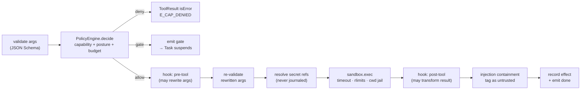

# 01 — D3 · Interface Contracts

All contracts are TypeScript. They are the *only* way layers talk. Swapping local →
distributed swaps implementations behind these signatures and changes no call site
(**D12**).

---

## D3.0 — Shared foundations

### Identity and branded ids

```ts
declare const brand: unique symbol;
type Id<K extends string> = string & { readonly [brand]: K };

export type TenantId   = Id<"tenant">;
export type ProjectId  = Id<"project">;
export type RunId      = Id<"run">;        // ULID — lexicographically time-sortable
export type NodeId     = Id<"node">;       // author-chosen, unique within a GraphSpec
export type TaskId     = Id<"task">;       // `${nodeId}@${branchPath}#${iteration}` — DERIVED, not random
export type GateId     = Id<"gate">;
export type ResourceRef = `${string}/${string}@${string}`;  // kind/name@version|digest
export type GraphHash  = `sha256:${string}`;
export type Seq        = number;           // monotonic per Run, starts at 1, no gaps
```

> **Why `TaskId` is derived, not random.** `nodeId@branchPath#iteration` is a pure
> function of the graph and the branch coordinate. A retry, a resume after restart, and
> a replay all compute the *same* TaskId, which is what makes journal entries
> idempotent and effect keys stable. A random id would break replay silently.

### The error taxonomy — one union, used by every interface

```ts
export type ErrorClass =
  | "validation"   // caller's fault. NEVER retry.
  | "policy"       // denied by PolicyEngine. Retry only after a human changes policy.
  | "not_found"
  | "conflict"     // optimistic-concurrency or idempotency clash. Re-read, then decide.
  | "exhausted"    // budget / quota / rate limit. Retry after `retryAfterMs`.
  | "unavailable"  // transient dependency failure. Retry with backoff.
  | "timeout"
  | "cancelled"
  | "internal";    // a bug in Loom. Never retried automatically; always alerts.

export interface LoomError extends Error {
  readonly class: ErrorClass;
  readonly code: string;               // stable machine code, e.g. "E_GRAPH_INVALID"
  readonly retryable: boolean;         // derived: class ∈ {exhausted, unavailable, timeout}
  readonly retryAfterMs?: number;
  readonly details?: unknown;          // structured, redacted, safe to log
  readonly cause?: unknown;
}
```

**Canonical codes** (the full list lives beside the implementation; these are
load-bearing across layers):

| Code | Class | Raised by | Meaning |
|---|---|---|---|
| `E_GRAPH_INVALID` | validation | `GraphCompiler` | Aggregated compile diagnostics; see `details.diagnostics[]` |
| `E_OVERSIGHT_LOOSENED` | policy | `GraphCompiler` | A candidate graph declares a posture below its baseline (**D7**) |
| `E_CAP_DENIED` | policy | `PolicyEngine` | A required capability is denied for this actor |
| `E_GATE_REQUIRED` | policy | `PolicyEngine` | Not an error — a *signal* the executor converts into a HumanGate |
| `E_BUDGET_EXHAUSTED` | exhausted | `PolicyEngine` | Run/node/tenant budget would be exceeded |
| `E_ADMISSION_REJECTED` | exhausted | `AgentScheduler` | Tenant concurrency or queue depth exceeded; carries `retryAfterMs` |
| `E_SEQ_CONFLICT` | conflict | `StateStore` | `expectedSeq` did not match; another attempt won |
| `E_IDEMPOTENCY_MISMATCH` | conflict | `ControlPlaneAPI` | Same key, different payload |
| `E_LEASE_LOST` | conflict | `AgentScheduler` | Fencing token stale; this worker must abandon the Task |
| `E_CONTEXT_OVERFLOW` | validation | `ModelAdapter` | Prompt exceeds the model window after compaction |
| `E_CONTENT_FILTERED` | policy | `ModelAdapter` | Provider refused on content grounds |
| `E_PROVIDER_RATE_LIMIT` | exhausted | `ModelAdapter` | Carries `retryAfterMs` from the provider |
| `E_TOOL_TIMEOUT` | timeout | `ToolExecutor` | Wall-clock budget exceeded |
| `E_TOOL_NOT_IDEMPOTENT` | validation | `ToolExecutor` | A retry was requested for a tool that forbids it |
| `E_SECRET_UNAVAILABLE` | unavailable | `SecretProvider` | Resolved *before* any effect runs |
| `E_REPLAY_DIVERGENCE` | internal | `GraphExecutor` | Replay reached an effect key the journal does not contain |
| `E_CANCELLED` | cancelled | any | The `AbortSignal` fired |

### Universal method contract

Every asynchronous method on every interface obeys these four rules. They are stated
once here and are not repeated per method.

1. **Cancellation.** Takes `signal?: AbortSignal`. On abort it rejects with
   `LoomError{class:"cancelled", code:"E_CANCELLED"}` and leaves **no partial durable
   state** — durable mutation is always one conditional append, so it either landed
   before the abort or not at all.
2. **Idempotency.** Any method that mutates durable state takes either an
   `idempotencyKey` or an `expectedSeq`. Replaying the same key with the same payload
   returns the original result; with a different payload it rejects
   `E_IDEMPOTENCY_MISMATCH`.
3. **Streaming.** Streams are `AsyncIterable<T>` terminated by exactly one terminal
   event of the union. Consumers **must** drain or call `.return()`; producers must
   release resources on `.return()`. Back-pressure is the consumer's `await` — no
   producer buffers unboundedly.
4. **Errors.** Only `LoomError` crosses an interface boundary. Implementations wrap
   native errors, and never leak provider payloads (which may contain secrets) into
   `message`; those go into redacted `details`.

### Interface versioning and compatibility

```ts
export interface Versioned {
  /** e.g. "loom.dev/v1". Major bump = breaking; minor = additive only. */
  readonly apiVersion: `${string}/v${number}`;
  /** Feature negotiation without a version bump. Consumers MUST tolerate unknown flags. */
  readonly features: ReadonlySet<string>;
}
```

**Rules.** (a) Within a major version, only *additive* changes: new optional fields, new
methods, new union members behind a `features` flag. (b) A consumer that needs a feature
checks `impl.features.has("x")` and degrades explicitly — never by `try/catch`. (c)
Breaking a contract means shipping `V2` alongside `V1` with an adapter, then deleting
`V1` after one release. (d) `GraphSpec.apiVersion` is checked by the compiler: unknown
major → `E_GRAPH_INVALID`; known older minor → migrated in-memory and the migration is
journaled.

> **The minimalism guard, corrected.** EAgent pinned a *line count* on the kernel
> (`test/kernel-surface.test.ts`), which taxed correct primitives as much as incidental
> ones — the ceiling was raised four times. Loom pins **this surface instead**: a test
> snapshots the 24 interface names and every exported method signature. Adding a method
> is a deliberate, reviewed act; adding 300 lines inside an existing implementation is
> not policed, because it shouldn't be.

### Core value types

```ts
/** A read-only projection of Run state visible to a Task. */
export interface StateView {
  get<T = unknown>(channel: string): T | undefined;
  /** Only channels declared as this node's `reads`. Others throw E_CHANNEL_UNDECLARED. */
  require<T = unknown>(channel: string): T;
  readonly hash: string;  // sha256 of the canonicalised visible slice — used for caching + replay
}

/** What a Task proposes to write. Applied through the channel's reducer. */
export type ChannelWrites = Readonly<Record<string, unknown>>;

export interface NodeOutcome {
  readonly status: "ok" | "error" | "gate";
  readonly writes?: ChannelWrites;
  /** Router/conditional nodes only: the subset of declared outgoing edge ids to take. */
  readonly take?: readonly string[];
  /** status:"gate" only — the gate request the executor must raise. */
  readonly gate?: GateRequest;
  readonly error?: LoomError;
  readonly usage?: Usage;
}

export interface Usage {
  inputTokens: number; outputTokens: number;
  cacheReadTokens?: number; cacheWriteTokens?: number; reasoningTokens?: number;
  costUsd: number;          // computed by ModelAdapter from a pinned price table version
  wallMs: number;
}

export type Posture = "out" | "on" | "in";
export type IrreversibilityClass =
  | "read_only"          // no external mutation
  | "reversible_write"   // mutates state Loom can undo via a declared compensation
  | "irreversible"       // cannot be undone (payment, delete, deploy)
  | "externally_visible";// observable by third parties (email, PR comment, tweet)
```

---

## D3.1 — `GraphCompiler`

```ts
export interface GraphCompiler extends Versioned {
  /**
   * Pure. Validates a GraphSpec and pins every resource ref to an immutable digest.
   * No side effects, no durable writes — safe to call from the UI on every keystroke.
   */
  compile(input: {
    spec: GraphSpec;
    tenant: TenantId;
    project: ProjectId;
    /** Baseline for the asymmetry check. Absent for a first compile. */
    baseline?: { graphHash: GraphHash; postures: ReadonlyMap<NodeId, Posture> };
    signal?: AbortSignal;
  }): Promise<CompileResult>;

  /** Validates a proposed runtime mutation against an already-running RunGraph (D5 §Dynamic mutation). */
  compileMutation(input: {
    base: RunGraph;
    mutation: GraphMutation;
    budget: ExpansionBudget;
    signal?: AbortSignal;
  }): Promise<CompileResult>;

  /** Static analysis surfaced to the editor without compiling: reachability, unused channels, cost estimate. */
  analyze(spec: GraphSpec): Diagnostics;
}

export type CompileResult =
  | { ok: true;  graph: RunGraph; diagnostics: Diagnostics /* warnings only */ }
  | { ok: false; error: LoomError /* E_GRAPH_INVALID | E_OVERSIGHT_LOOSENED */; diagnostics: Diagnostics };

export interface Diagnostic {
  severity: "error" | "warning" | "info";
  code: string;                       // e.g. "GRAPH006_UNBOUNDED_LOOP"
  message: string;
  at?: { nodeId?: NodeId; edgeId?: string; channel?: string; jsonPath?: string };
  fix?: string;                       // a concrete suggested edit, not "consider reviewing"
}
export type Diagnostics = readonly Diagnostic[];
```

| Property | Contract |
|---|---|
| Errors | `E_GRAPH_INVALID` (aggregates **all** diagnostics — never fails on the first), `E_OVERSIGHT_LOOSENED`, `E_RESOURCE_NOT_FOUND`, `E_CANCELLED` |
| Idempotency | Pure: same `(spec, resource digests)` → identical `RunGraph` including `graphHash`. Memoised by `graphHash` |
| Cancellation | Honoured between validation passes; a cancelled compile writes nothing |
| Streaming | None |

---

## D3.2 — `GraphExecutor`

```ts
export interface GraphExecutor extends Versioned {
  /** Execute exactly one leased Task to a terminal outcome. The ONLY place a node body runs. */
  executeTask(input: {
    lease: Lease;
    graph: RunGraph;
    state: StateView;
    attempt: number;
    mode: "live" | "replay";
    signal: AbortSignal;
  }): Promise<TaskResult>;

  /** Apply a Task's writes through channel reducers and append the transition. Atomic. */
  commit(input: {
    lease: Lease;
    result: TaskResult;
    expectedSeq: Seq;
  }): Promise<{ seq: Seq; unblocked: readonly TaskRef[] }>;

  /** Fold the journal to reconstruct a Run's state at a point in time. */
  project(runId: RunId, atSeq?: Seq): Promise<RunProjection>;
}

export interface TaskResult {
  readonly taskId: TaskId;
  readonly outcome: NodeOutcome;
  readonly steps: readonly StepRecord[];   // every effect, in order, with keys and results
  readonly usage: Usage;
}
```

| Property | Contract |
|---|---|
| Errors | `E_REPLAY_DIVERGENCE`, `E_SEQ_CONFLICT` (from `commit`), `E_LEASE_LOST`, `E_CANCELLED`, plus anything the node body raises, normalised |
| Idempotency | `commit` is conditional on `expectedSeq`. Two workers racing the same Task: exactly one commit lands, the loser gets `E_SEQ_CONFLICT` and discards its work. This is what makes at-least-once *execution* produce exactly-once *state* |
| Cancellation | Aborts the node body, waits `gracePeriodMs` for in-flight effects, then commits a `TaskCancelled` transition. **In-flight irreversible effects are not un-done** — see **D4 deviation 1** |
| Streaming | None on this interface; progress reaches the UI via `EventBus` |

---

## D3.3 — `AgentScheduler`

The component that directly answers *"many tasks in parallel is unmanageable."*

```ts
export interface AgentScheduler extends Versioned {
  /** Admission control. Rejects rather than queueing unboundedly. */
  submit(input: {
    graph: RunGraph;
    trigger: RunTrigger;
    idempotencyKey: string;
    priority?: number;              // 0..9, default 5
    signal?: AbortSignal;
  }): Promise<{ runId: RunId; accepted: true } | never>;

  /** Lease the next runnable Task. Long-polls up to `waitMs`. Returns null on timeout. */
  lease(input: { workerId: string; classes: readonly TaskClass[]; waitMs: number }): Promise<Lease | null>;

  /** Extend a lease held by a long-running Task. Failure means the lease was stolen. */
  heartbeat(lease: Lease): Promise<Lease>;

  /** Return a Task to the queue (worker shutting down, backpressure, retry scheduled). */
  release(lease: Lease, disposition: "retry" | "requeue" | "abandon", afterMs?: number): Promise<void>;

  /** Remove a suspended Run from scheduling entirely — it consumes ZERO worker slots. */
  suspend(runId: RunId, reason: "gate" | "operator" | "budget" | "backoff"): Promise<void>;
  resume(runId: RunId): Promise<void>;

  /** Observability + the ops console's fairness view. */
  stats(scope: { tenant?: TenantId; runId?: RunId }): Promise<SchedulerStats>;
}

export interface Lease {
  readonly taskId: TaskId;
  readonly runId: RunId;
  readonly workerId: string;
  readonly fencingToken: number;   // monotonic; every durable write carries it
  readonly expiresAt: number;
  readonly attempt: number;
}

export type TaskClass = "model" | "tool" | "function" | "gate" | "control";
```

| Property | Contract |
|---|---|
| Errors | `E_ADMISSION_REJECTED` (with `retryAfterMs`), `E_LEASE_LOST` (from `heartbeat`), `E_IDEMPOTENCY_MISMATCH`, `E_CANCELLED` |
| Idempotency | `submit` is keyed; a duplicate key with an identical payload returns the original `runId` with `accepted:true` and creates nothing |
| Cancellation | `lease` returns `null` promptly on abort. A worker dying without `release` is recovered by lease expiry — **the only liveness mechanism that needs no cleanup path** |
| Streaming | `lease` is a long-poll, not a stream, so a worker's crash cannot strand an open stream |
| Fairness | Ready Tasks are drawn by **weighted deficit round-robin over Runs, then over Tenants**, never FIFO. A 500-way fan-out therefore cannot starve a single-node run submitted a second later (**D6 §Fairness**) |

---

## D3.4 — `AgentFactory`

```ts
export interface AgentFactory extends Versioned {
  /** Materialise a bounded ReAct loop from a pinned AgentProfile. Nothing here is durable. */
  create(input: {
    profile: PinnedAgentProfile;      // already resolved to digests by the compiler
    task: TaskRef;
    tools: ReadonlyArray<ToolHandle>; // already filtered by allowlist ∩ policy ∩ circuit state
    context: AssembledContext;        // built by ContextAssembler, deterministic
    effects: EffectRecorder;          // records/serves model + tool calls (replay boundary)
    signal: AbortSignal;
  }): Promise<AgentInstance>;
}

export interface AgentInstance {
  /** Bounded by profile.maxTurns AND the node's token/cost budget, whichever binds first. */
  run(): AsyncIterable<AgentEvent>;
  /** Inject a message before the next model call — the mechanism behind operator "redirect". */
  steer(message: Message): void;
  snapshot(): AgentSnapshot;          // for mid-node checkpointing of long agent loops
}

export type AgentEvent =
  | { type: "text_delta";      text: string }
  | { type: "reasoning_delta"; text: string }
  | { type: "tool_call";       call: ToolCall }
  | { type: "tool_result";     callId: string; result: ToolResult }
  | { type: "turn_end";        turn: number; usage: Usage }
  | { type: "done";            outcome: NodeOutcome };   // exactly one, terminal
```

| Property | Contract |
|---|---|
| Errors | Surfaced as `{type:"done", outcome:{status:"error"}}`, not thrown — a node body never throws past the executor |
| Idempotency | Guaranteed by `EffectRecorder`: in `replay` mode, model and tool calls are served from the journal by effect key and never reach the network |
| Cancellation | `signal` aborts the in-flight model stream; the iterable ends with a terminal `done` carrying `E_CANCELLED` |
| Streaming | Yes — this is the streaming spine that reaches the UI |

> **The correction to EAgent.** In EAgent the agent loop *is* the runtime and owns the
> transcript (`src/kernel/agent.ts:115`). Here an `AgentInstance` is a disposable value
> created per Task, whose durable footprint is only what it writes to channels. Two
> agent nodes running in parallel are two values, not two competing owners of state.

---

## D3.5 — `ToolRegistry`

```ts
export interface ToolRegistry extends Versioned {
  register(tool: ToolDefinition, source: ToolSource): Disposable;   // later-wins shadow stack (from EAgent)
  get(name: string, at?: ResourceRef): ToolHandle | undefined;
  list(filter?: { capabilities?: string[]; source?: ToolSource["kind"]; healthy?: boolean }): readonly ToolHandle[];
  /** Circuit-breaker state per source; unhealthy sources are withheld from model tool lists. */
  health(): ReadonlyMap<string, SourceHealth>;
}

export interface ToolDefinition {
  readonly name: string;
  readonly version: string;
  readonly description: string;
  readonly parameters: JSONSchema;       // validated before AND after policy rewrite
  readonly returns?: JSONSchema;
  readonly capabilities: readonly string[];         // inherited from EAgent
  readonly irreversibility: IrreversibilityClass;   // NEW — drives default posture (D7)
  readonly idempotent: boolean;                     // NEW — gates automatic retry
  readonly compensation?: { tool: string; argsFrom: string };  // NEW — saga rollback
  readonly timeoutMs: number;
  readonly concurrencyKey?: string;                 // serialises calls sharing a key
}
```

| Property | Contract |
|---|---|
| Errors | `E_TOOL_NOT_FOUND`, `E_TOOL_SCHEMA_INVALID` (at registration, never at call) |
| Idempotency | `register` returns a `Disposable`; disposing restores the shadowed definition exactly (EAgent's `registry.ts` semantics, kept) |
| Cancellation | n/a — synchronous |
| Versioning | A `RunGraph`'s resolution manifest pins `name@version`; a mid-run re-registration cannot change what a running Task calls |

---

## D3.6 — `ToolExecutor`

**The single dispatch path.** EAgent had two (`Agent.executeGuarded` and
`dynamic-workflow.guardedInvoke`); that duplication is the bug this interface exists to
prevent.

```ts
export interface ToolExecutor extends Versioned {
  invoke(input: {
    handle: ToolHandle;
    args: unknown;                  // raw; validated inside
    task: TaskRef;
    actor: Actor;
    /** Deterministic. Same Task + same call ordinal ⇒ same key across retry and replay. */
    idempotencyKey: string;
    budget: BudgetSlice;
    signal: AbortSignal;
  }): AsyncIterable<ToolExecEvent>;
}

export type ToolExecEvent =
  | { type: "policy";   decision: PolicyDecision }        // always first
  | { type: "progress"; chunk: string }                   // streamed to UI, never to the model
  | { type: "gate";     gate: GateRequest }               // policy demanded a human; caller suspends
  | { type: "done";     result: ToolResult; usage: Usage };// exactly one, terminal
```

**The fixed pipeline inside `invoke`** — identical for a tool node and for a tool called
from inside an agent node. There is no second copy of it anywhere:



| Property | Contract |
|---|---|
| Errors | `E_CAP_DENIED`, `E_TOOL_TIMEOUT`, `E_TOOL_NOT_IDEMPOTENT`, `E_BUDGET_EXHAUSTED`, `E_SECRET_UNAVAILABLE`, `E_CANCELLED` |
| Idempotency | The key is passed to the external system when it supports one (HTTP `Idempotency-Key`, MCP request id). If `idempotent:false` **and** an attempt reached the sandbox, a retry is refused with `E_TOOL_NOT_IDEMPOTENT` and the node takes its error edge |
| Cancellation | `SIGTERM` → `gracePeriodMs` → `SIGKILL` for subprocesses; `AbortSignal` for HTTP. An `EffectStarted` entry is journaled *before* the call, so a cancellation during an irreversible effect is **recorded as unknown-outcome**, never as "did not happen" |
| Streaming | Yes. `progress` chunks reach the UI live; they never enter the model's context (EAgent's `tool_progress` semantics, preserved) |

---

## D3.7 — `ResourceFetcher`

```ts
export interface ResourceFetcher extends Versioned {
  /** Resolve a possibly-floating ref to an immutable digest. Called ONLY at compile time. */
  resolve(ref: ResourceRef, at: { tenant: TenantId; project: ProjectId }): Promise<ResolvedRef>;
  /** Fetch pinned content. Called at run time; MUST be given a digest, never a floating ref. */
  fetch<T = unknown>(pinned: ResolvedRef, signal?: AbortSignal): Promise<Resource<T>>;
  list(filter: ResourceFilter): Promise<readonly ResourceSummary[]>;
  publish(draft: ResourceDraft, actor: Actor, idempotencyKey: string): Promise<ResolvedRef>;
  promote(ref: ResolvedRef, to: "canary" | "stable" | "deprecated", actor: Actor): Promise<void>;
}

export interface ResolvedRef {
  readonly ref: ResourceRef;
  readonly digest: `sha256:${string}`;
  readonly channel: "draft" | "canary" | "stable" | "deprecated";
}
```

| Property | Contract |
|---|---|
| Errors | `E_RESOURCE_NOT_FOUND`, `E_RESOURCE_YANKED`, `E_FLOATING_REF_AT_RUNTIME` (an `internal`-class bug guard: `fetch` was handed an unpinned ref) |
| Idempotency | `publish` is keyed and content-addressed — publishing identical content twice returns the same digest and creates no new version |
| Cancellation | Standard |
| **Pinning rule** | `resolve` runs at compile, `fetch` at run. Because the RunGraph carries the resolution manifest, **a resource mutated mid-run cannot affect an in-flight Run** (**D8**) |

---

## D3.8 — `ModelAdapter`

```ts
export interface ModelAdapter extends Versioned {
  readonly provider: string;                 // "anthropic" | "openai" | "vllm" | "mock" | …
  readonly models: ReadonlyMap<string, ModelCapabilities>;

  stream(req: ModelRequest, signal: AbortSignal): AsyncIterable<ModelEvent>;
  countTokens(req: ModelRequest): Promise<number>;   // for compaction decisions, before the call
  priceOf(model: string, usage: Usage): number;      // from a PINNED price-table version
}

export interface ModelCapabilities {
  contextWindow: number; maxOutput: number;
  tools: boolean; parallelToolCalls: boolean;
  structuredOutput: "native" | "tool" | "none";
  multimodal: readonly ("image" | "audio" | "pdf")[];
  reasoning: boolean; promptCache: boolean;
}

export type ModelEvent =
  | { type: "text_delta";      text: string }
  | { type: "reasoning_delta"; text: string }
  | { type: "tool_call_delta"; index: number; id?: string; name?: string; argsFragment?: string }
  | { type: "done"; message: Message; finishReason: FinishReason; usage: Usage };

export type FinishReason =
  | "stop" | "tool_use" | "max_tokens" | "content_filter" | "refusal";
```

**Normalized provider-error taxonomy** — every adapter maps its native failures onto
exactly these, which is what makes a fallback chain declarative rather than
provider-specific:

| Normalized | Class | Retry same model? | Fallback chain? | Typical native |
|---|---|---|---|---|
| `E_PROVIDER_RATE_LIMIT` | exhausted | yes, after `retryAfterMs` | yes, if `retryAfterMs` > node budget | HTTP 429 |
| `E_PROVIDER_OVERLOADED` | unavailable | yes, exp. backoff + jitter | yes | 529 / 503 |
| `E_CONTEXT_OVERFLOW` | validation | **no** | only to a larger-window model | 400 context_length |
| `E_CONTENT_FILTERED` | policy | no | **no** — trying another provider to evade a safety filter is forbidden | 400 content_policy |
| `E_PROVIDER_AUTH` | policy | no | yes | 401/403 |
| `E_PROVIDER_BAD_REQUEST` | validation | no | no | 400 schema |
| `E_PROVIDER_TRANSPORT` | unavailable | yes | yes | ECONNRESET, stream truncation |

```yaml
# Declared per agent node; evaluated top-down on a normalized error that permits fallback.
model:
  primary:  { provider: anthropic, model: claude-opus-5, thinking: medium }
  fallback:
    - { provider: anthropic, model: claude-sonnet-5, when: [E_PROVIDER_RATE_LIMIT, E_PROVIDER_OVERLOADED] }
    - { provider: openai,    model: gpt-5,           when: [E_PROVIDER_AUTH, E_PROVIDER_TRANSPORT] }
    - { provider: vllm,      model: qwen3-32b,       when: [E_PROVIDER_OVERLOADED], degrade: true }
  onExhausted: gate      # ask a human rather than silently returning a worse answer
```

| Property | Contract |
|---|---|
| Idempotency | A model call is an Effect keyed by `(taskId, turn, callOrdinal)`. On retry after a *pre-commit* failure the same key is reused, so at most one response is ever journaled for that key |
| Cancellation | Aborts the HTTP stream. **A post-first-token failure is never retried** — retrying a partly-rendered stream double-emits to the UI and double-counts usage. (Inherited verbatim from EAgent's `onProviderError` design, `src/kernel/agent.ts:427-441`) |
| Streaming | Yes; exactly one terminal `done` |

---

## D3.9 — `EventBus`

```ts
export interface EventBus extends Versioned {
  publish(event: JournalEvent): void;               // fire-and-forget; NEVER throws, NEVER blocks
  subscribe(filter: EventFilter, opts: {
    /** Bounded per-subscriber queue. A slow subscriber degrades ITSELF, never the executor. */
    queueSize: number;
    onOverflow: "drop_oldest" | "drop_newest" | "close";
  }): AsyncIterable<JournalEvent> & Disposable;
  /** Gap-free catch-up for a reconnecting UI: journal replay then live tail, deduped by seq. */
  replayThenTail(runId: RunId, fromSeq: Seq): AsyncIterable<JournalEvent> & Disposable;
}
```

| Property | Contract |
|---|---|
| Errors | `publish` never throws. `subscribe` may end the iterable with `E_SUBSCRIBER_OVERFLOW` when `onOverflow:"close"` |
| Ordering | Per-Run total order by `seq`, guaranteed. **No cross-run ordering guarantee** — and nothing may depend on one |
| Delivery | At-most-once on the bus (it is derived). Exactly-once is available only via `replayThenTail`, which reads the journal |
| Cancellation | `dispose()` or `.return()` unsubscribes synchronously |

---

## D3.10 — `StateStore` (and the Journal)

```ts
export interface StateStore extends Versioned {
  /** THE durable write. Conditional on expectedSeq — this is the concurrency primitive. */
  append(input: {
    runId: RunId;
    expectedSeq: Seq;                  // 0 for the first event
    events: readonly NewEvent[];       // committed atomically as one transaction
    fencingToken?: number;             // rejected if stale
  }): Promise<{ seq: Seq }>;

  read(runId: RunId, fromSeq: Seq, toSeq?: Seq): AsyncIterable<JournalEvent>;
  head(runId: RunId): Promise<Seq>;

  /** Derived read models. Rebuildable from the journal at any time; never written directly. */
  projection<T>(name: ProjectionName, key: string): Promise<T | undefined>;
  query<T>(name: ProjectionName, filter: unknown, page: Page): Promise<Paged<T>>;
}

export interface JournalEvent {
  readonly runId: RunId;
  readonly seq: Seq;
  readonly ts: number;                 // recorded wall clock — an Effect, not read from Date.now() in node bodies
  readonly type: EventType;
  readonly actor: Actor;               // who/what caused it: system | agent | human | evolution
  readonly taskId?: TaskId;
  readonly payload: unknown;           // redacted at write time per data classification
  readonly classification: "public" | "internal" | "pii" | "secret_ref";
}
```

The closed `EventType` set (v1) — the whole system's vocabulary of durable facts:

```
run.submitted  run.compiled  run.started  run.suspended  run.resumed
run.completed  run.failed    run.cancelled
task.ready     task.leased   task.started  task.progress
task.committed task.failed   task.skipped  task.cancelled  task.retry_scheduled
state.reduced  channel.written
effect.started effect.completed effect.failed
model.called   tool.called
gate.raised    gate.delivered gate.decided  gate.timeout  gate.escalated
policy.decided policy.escalated policy.deescalated
budget.reserved budget.settled budget.exhausted
graph.mutated  checkpoint.created  checkpoint.restored
operator.command
```

| Property | Contract |
|---|---|
| Errors | `E_SEQ_CONFLICT`, `E_FENCING_STALE`, `E_STORAGE_FULL` |
| Idempotency | `expectedSeq` makes append a compare-and-swap. Two workers for one Task → exactly one append succeeds |
| Consistency | **Authoritative and linearizable per Run.** Projections are read-your-writes within a process and eventually consistent across processes |
| Cancellation | An in-flight append is *not* cancellable — it is a single small transaction. `signal` is deliberately absent from `append` |

---

## D3.11 — `CheckpointStore`

```ts
export interface CheckpointStore extends Versioned {
  create(input: {
    runId: RunId; atSeq: Seq;
    label?: string;                    // named checkpoints survive retention pruning
    kind: "auto" | "manual" | "pre_irreversible";
  }): Promise<CheckpointRef>;

  list(runId: RunId): Promise<readonly CheckpointRef[]>;

  /** Fork or rewind. NEVER mutates the original journal — it appends a restore marker. */
  restore(input: {
    from: CheckpointRef;
    mode: "rewind" | "fork";
    /** fork only: channel overrides for what-if runs. Forces re-execution of downstream effects. */
    overrides?: ChannelWrites;
    actor: Actor;
  }): Promise<{ runId: RunId; seq: Seq }>;
}
```

| Property | Contract |
|---|---|
| Errors | `E_CHECKPOINT_NOT_FOUND`, `E_RESTORE_ILLEGAL` (target precedes a committed irreversible effect and no compensation is declared) |
| Idempotency | `create` at an existing `(runId, atSeq)` returns the existing ref |
| Semantics | `rewind` continues the same `runId` after appending `checkpoint.restored`; `fork` mints a new `runId` with a `forkedFrom` link. **A rewind past an irreversible effect requires either a declared compensation or an explicit human override — the store refuses silently-unsafe rewinds** |

---

## D3.12 — `TraceEmitter`

```ts
export interface TraceEmitter extends Versioned {
  startRun(run: RunProjection): SpanHandle;
  startTask(parent: SpanHandle, task: TaskRef, node: NodeSpec): SpanHandle;
  startEffect(parent: SpanHandle, effect: EffectDescriptor): SpanHandle;
  /** Edges are LINKS, not spans — keeps span count O(nodes), not O(edges). */
  linkEdge(from: SpanHandle, to: SpanHandle, edge: EdgeSpec): void;
  event(span: SpanHandle, name: string, attrs: Attrs): void;
  end(span: SpanHandle, status: "ok" | "error", attrs?: Attrs): void;
}
```

| Property | Contract |
|---|---|
| Errors | **None.** Every method swallows and counts failures (`otel.emit_failed`). Telemetry must never fail a run |
| Sampling | Applied here, at emit. **Sampling never affects the journal**, so a sampled-out run is still fully replayable and auditable |
| Redaction | Attribute values pass a `Redactor` keyed on data classification *before* leaving the process |
| Cancellation | n/a — synchronous and non-blocking (bounded ring buffer, drop-oldest) |

---

## D3.13 — `PolicyEngine`

```ts
export interface PolicyEngine extends Versioned {
  /** The single authorization decision point. Called by ToolExecutor and by the executor per Task. */
  decide(req: PolicyRequest, signal?: AbortSignal): Promise<PolicyDecision>;

  /** Resolve effective posture across all four config levels + runtime escalations. */
  posture(scope: PolicyScope): Promise<Posture>;

  /** Tightening. May be called by the system, by rules, or by a human. */
  escalate(scope: PolicyScope, to: Posture, reason: EscalationReason, actor: Actor): Promise<void>;

  /**
   * Loosening. Separate method on purpose. Requires `oversight:loosen`, which the
   * evolution engine's identity is DENY-LISTED for — not merely un-granted. (D7 §Asymmetry)
   */
  deescalate(scope: PolicyScope, to: Posture, justification: string, actor: HumanActor): Promise<void>;

  /** Budget reservation — prevents the fan-out overshoot bug (D6 §Budgets). */
  reserve(scope: BudgetScope, estimate: number, signal?: AbortSignal): Promise<Reservation>;
  settle(reservation: Reservation, actual: number): Promise<void>;
}

export type PolicyDecision =
  | { effect: "allow"; posture: "out" | "on"; reasons: readonly string[] }
  | { effect: "gate";  posture: "in"; gate: GateRequest; reasons: readonly string[] }
  | { effect: "deny";  error: LoomError; reasons: readonly string[] };
```

| Property | Contract |
|---|---|
| Errors | `E_CAP_DENIED`, `E_BUDGET_EXHAUSTED`, `E_OVERSIGHT_LOOSEN_FORBIDDEN`, `E_POLICY_UNAVAILABLE` |
| **Fail mode** | **Fail closed.** `E_POLICY_UNAVAILABLE` is treated by callers as `deny` for anything above `read_only`, and posture defaults to `in`. Never fail open |
| Idempotency | `decide` is pure w.r.t. durable state (it journals `policy.decided` but that is append-only and keyed by the request digest) |
| Auditability | Every decision journals its `reasons[]` — the exact rules that fired. An audit that cannot say *why* is not an audit |
| Cancellation | Standard |

---

## D3.14 — `HumanGateBroker`

```ts
export interface HumanGateBroker extends Versioned {
  /** Durable. Returns as soon as the gate is PERSISTED — it does not wait for the human. */
  raise(req: GateRequest, signal?: AbortSignal): Promise<GateId>;

  /** Called from any channel: console, webhook, IM callback, CLI. Idempotent per (gate, approver). */
  resolve(input: {
    gateId: GateId;
    decision: GateDecision;
    actor: HumanActor;
    idempotencyKey: string;
  }): Promise<{ resolved: boolean; awaiting?: readonly ApproverRef[] }>;

  claim(gateId: GateId, actor: HumanActor): Promise<void>;          // soft lock, prevents double work
  delegate(gateId: GateId, to: ApproverRef, actor: HumanActor): Promise<void>;
  list(filter: GateFilter, page: Page): Promise<Paged<GateSummary>>;
  /** Driven by the scheduler tick (local) or a delay queue (distributed). */
  sweepTimeouts(now: number): Promise<readonly GateId[]>;
}

export type GateDecision =
  | { kind: "approve" }
  | { kind: "reject";   reason: string }
  | { kind: "edit";     writes: ChannelWrites; reason?: string }   // the highest-value evolution label
  | { kind: "redirect"; take: readonly string[]; reason?: string };
```

| Property | Contract |
|---|---|
| Errors | `E_GATE_NOT_FOUND`, `E_GATE_ALREADY_RESOLVED`, `E_GATE_NOT_AUTHORIZED`, `E_GATE_EXPIRED` |
| Idempotency | Keyed per `(gateId, approverId)`. A double-click, a webhook retry, and a Slack retry all collapse to one decision |
| Durability | `raise` persists before returning. **A gate outlives process restart, redeploy, and executor crash by construction** — it is a row plus a journal event, not a `Promise` (EAgent's `UI.confirm`, `src/kernel/types.ts:300`, could not do this) |
| Cancellation | Cancelling the *run* cancels open gates (`gate.cancelled`); cancelling the `raise` call after persistence does not un-raise |
| Streaming | None; gate state changes flow over `EventBus` |

---

## D3.15 — `OversightController`

The operator's hands. Separated from `HumanGateBroker` because approving a *pending
request* and interrupting a *running system* are different authorities.

```ts
export interface OversightController extends Versioned {
  command(cmd: InterventionCommand, actor: HumanActor, idempotencyKey: string): Promise<CommandReceipt>;
  /** What can be done right now, and what is already past the point of no return. */
  affordances(runId: RunId): Promise<Affordances>;
  watch(filter: { tenant?: TenantId; runId?: RunId }): AsyncIterable<OversightEvent> & Disposable;
}

export type InterventionCommand =
  | { kind: "pause";     runId: RunId; drain: boolean }   // drain=false stops admitting new Tasks immediately
  | { kind: "resume";    runId: RunId }
  | { kind: "cancel";    runId: RunId; gracePeriodMs: number; compensate: boolean }
  | { kind: "steer";     runId: RunId; taskId?: TaskId; message: string }
  | { kind: "redirect";  runId: RunId; taskId: TaskId; take: readonly string[] }
  | { kind: "rollback";  runId: RunId; to: CheckpointRef; mode: "rewind" | "fork" }
  | { kind: "escalate";  runId: RunId; scope: PolicyScope; to: Posture }
  | { kind: "kill";      runId: RunId };                  // no grace, no compensation — audited loudly

export interface Affordances {
  /** Per in-flight Task: how long until its current action becomes irreversible. */
  readonly interventionWindows: readonly { taskId: TaskId; msRemaining: number; class: IrreversibilityClass }[];
  readonly available: readonly InterventionCommand["kind"][];
  readonly blocked: readonly { kind: string; because: string }[];
}
```

| Property | Contract |
|---|---|
| Errors | `E_ILLEGAL_TRANSITION`, `E_NOT_AUTHORIZED`, `E_TOO_LATE` (the intervention window closed — with the `seq` at which it closed) |
| Idempotency | Keyed. `CommandReceipt` carries the `seq` at which the command was journaled |
| **Command durability** | A command is **journaled before it is dispatched**. If the process dies between the two, restart re-drives it. This is why `pause` cannot be lost |
| Cancellation | Commands are short; `cancel` and `kill` are themselves not cancellable |
| Streaming | `watch` is the on-the-loop supervisor's feed |

---

## D3.16 — `EvolutionEngine`

```ts
export interface EvolutionEngine extends Versioned {
  /** Fold a completed Run's journal into a normalized Trajectory. Pure, re-runnable. */
  capture(runId: RunId): Promise<Trajectory>;
  score(t: Trajectory): Promise<TrajectoryScore>;
  /** Propose a candidate. NEVER applies it. Proposal and promotion are different verbs on purpose. */
  propose(cohort: CohortRef, kind: "prompt" | "skill" | "subgraph"): Promise<Candidate | null>;
  /** Replay a frozen regression suite against a candidate with mocked effects. */
  evaluate(c: Candidate, suite: SuiteRef): Promise<EvalReport>;
  /** Requires a passing EvalReport AND, for any non-`stable`→`stable` step, a human actor. */
  promote(c: Candidate, to: "canary" | "stable", actor: Actor, report: EvalReport): Promise<ResolvedRef>;
  rollback(ref: ResolvedRef, reason: string): Promise<ResolvedRef>;
}
```

| Property | Contract |
|---|---|
| Errors | `E_EVAL_REGRESSION`, `E_INSUFFICIENT_COHORT` (n < 30), `E_OVERSIGHT_LOOSEN_FORBIDDEN`, `E_HUMAN_APPROVAL_REQUIRED` |
| **Authority** | The engine's `Actor` identity is deny-listed for `oversight:loosen` and for `resource:promote(stable)`. It can only ever *propose* and *canary* |
| Idempotency | `propose` is deterministic given `(cohort digest, kind, engine version)` — reproducible, reviewable candidates |
| Cancellation | Long jobs; fully cancellable, and partial work is discarded rather than half-promoted |

---

## D3.17–D3.24 — Boundary interfaces

These complete the D2 edge mapping. Each obeys the universal method contract, and each
now ENUMERATES its own error codes and cancellation behaviour rather than inheriting
them silently — closing gap G1.

Why enumerate rather than inherit: a caller writing a `retry.onlyIf` list, or a UI
deciding whether to show "try again", needs to know which codes a method can actually
produce. "Whatever the universal contract allows" is a set of fifty, and a caller who
must handle fifty handles none.

```ts
/** ① Edge L1→L2. The ONLY externally reachable surface. */
export interface ControlPlaneAPI extends Versioned {
  submitRun(req: SubmitRunRequest, auth: AuthContext, idempotencyKey: string): Promise<RunAccepted>;
  getRun(runId: RunId, auth: AuthContext): Promise<RunProjection>;
  listRuns(filter: RunFilter, auth: AuthContext, page: Page): Promise<Paged<RunSummary>>;
  command(cmd: InterventionCommand, auth: AuthContext, idempotencyKey: string): Promise<CommandReceipt>;
  answerGate(gateId: GateId, decision: GateDecision, auth: AuthContext, idempotencyKey: string): Promise<void>;
  uploadArtifact(stream: ReadableStream, meta: ArtifactMeta, auth: AuthContext): Promise<ArtifactRef>;
}
// Durable at ACK: run.submitted + the compiled RunGraph + the resolution manifest.
// NOT durable at ACK: any execution. A 202 means "this WILL run", never "this HAS run".

/** ② Edge L2→L1. */
export interface RunEventStream extends Versioned {
  open(runId: RunId, lastEventId: Seq | null, auth: AuthContext): AsyncIterable<StreamFrame> & Disposable;
  openTenant(tenant: TenantId, auth: AuthContext): AsyncIterable<StreamFrame> & Disposable;  // tagged by runId
}
// Reconnect: lastEventId within the hot window ⇒ gap-free replay from seq+1.
// Outside it ⇒ one `snapshot` frame then live tail. The client NEVER silently misses events.

/** ③ Edge L2→L3. */
export interface RunLifecycle extends Versioned {
  start(graph: RunGraph, trigger: RunTrigger): Promise<RunId>;
  transition(runId: RunId, to: RunStatus, cause: TransitionCause): Promise<Seq>;  // rejects illegal transitions
}

/** ⑥ Edge L2→IM. */
export interface GateDelivery extends Versioned {
  deliver(gate: GateSummary, target: DeliveryTarget): Promise<DeliveryReceipt>;
  /** Verifies signature + replay window, then maps a channel callback to a GateDecision. */
  parseCallback(raw: unknown, target: DeliveryTarget): Promise<{ gateId: GateId; decision: GateDecision; actor: HumanActor }>;
}
// Delivery failure NEVER auto-approves. It falls back to the console queue and alerts.

/** ⑩ Edge L4→external. */
export interface ToolTransport extends Versioned {
  readonly kind: "inproc" | "subprocess" | "http" | "mcp_stdio" | "mcp_sse";
  call(req: TransportRequest, signal: AbortSignal): AsyncIterable<TransportEvent>;
  probe(): Promise<SourceHealth>;     // drives the circuit breaker
}

/** ⑭ Edge L5→L6. */
export interface JournalReader extends Versioned {
  scan(filter: JournalFilter, page: Page): AsyncIterable<JournalEvent>;
  /** Deterministic replay: re-executes the graph with effects served from the journal. */
  replay(runId: RunId, opts: ReplayOptions): AsyncIterable<ReplayFrame>;
}

/** ⑮ Edge L4→L6. */
export interface BlobStore extends Versioned {
  put(stream: ReadableStream, meta: BlobMeta): Promise<{ digest: string; size: number }>;
  get(digest: string, range?: ByteRange): Promise<ReadableStream>;
  head(digest: string): Promise<BlobMeta | undefined>;
}
// Content-addressed ⇒ put is naturally idempotent; identical bytes never stored twice.

/** ⑯ Edge L3→L6. */
export interface SecretProvider extends Versioned {
  resolve(ref: SecretRef, actor: Actor, signal?: AbortSignal): Promise<SecretValue>;
}
// SecretValue is a wrapper whose toString()/toJSON()/util.inspect all return "[secret]".
// Journal, prompts, spans, and tool args record the REF; only the sandbox boundary sees the value.
```

### The boundary error taxonomy

Every code below is from the one `LoomError` union (D3.0); the class drives retry and
HTTP status. `cancel` describes what an `AbortSignal` does mid-call.

| Interface | Method | Codes it can raise | On cancel |
|---|---|---|---|
| `ControlPlaneAPI` | `submitRun` | `E_GRAPH_INVALID`, `E_OVERSIGHT_LOOSENED`, `E_CAP_DENIED`, `E_RESOURCE_NOT_FOUND`, `E_RESOURCE_YANKED`, `E_NOT_AUTHORIZED`, `E_IDEMPOTENCY_MISMATCH`, `E_ADMISSION_REJECTED` | nothing is durable; no run exists |
| | `getRun` / `listRuns` | `E_RUN_NOT_FOUND`, `E_NOT_AUTHORIZED` | read is abandoned; no state changes |
| | `command` | `E_RUN_NOT_FOUND`, `E_NOT_AUTHORIZED`, `E_OVERSIGHT_LOOSEN_FORBIDDEN` | the command is either journaled or not; never half-applied |
| | `answerGate` | `E_GATE_NOT_FOUND`, `E_GATE_ALREADY_RESOLVED`, `E_GATE_NOT_AUTHORIZED`, `E_HUMAN_APPROVAL_REQUIRED` | the decision is not recorded; the gate stays open |
| `RunEventStream` | `open` / `openTenant` | `E_RUN_NOT_FOUND`, `E_NOT_AUTHORIZED` | the iterator ends; the run is unaffected |
| `RunLifecycle` | `transition` | `E_RUN_NOT_FOUND`, `E_ILLEGAL_TRANSITION`, `E_SEQ_CONFLICT` | the transition is not journaled |
| `GateDelivery` | `deliver` | `E_GATE_DELIVERY_FAILED` **only** | delivery is abandoned; **the gate stays open and is never auto-approved** |
| | `parseCallback` | `E_GATE_NOT_AUTHORIZED`, `E_GATE_NOT_FOUND`, `E_GATE_ALREADY_RESOLVED` | no decision is recorded |
| `ToolTransport` | `call` | `E_TOOL_NOT_FOUND`, `E_TOOL_TIMEOUT`, `E_CAP_DENIED`, `E_TOOL_SOURCE_UNAVAILABLE`, `E_TOOL_SCHEMA_INVALID` | `SIGTERM` → grace → `SIGKILL` on the process **group**; an effect whose outcome is unknown is reported as unknown, never as "did not happen" |
| | `probe` | `E_TOOL_SOURCE_UNAVAILABLE` | probe abandoned; the breaker's state is unchanged |
| `JournalReader` | `scan` | `E_RUN_NOT_FOUND` | the iterator ends |
| | `replay` | `E_RUN_NOT_FOUND`, `E_REPLAY_DIVERGENCE`, `E_GRAPH_INVALID` | replay stops; it has no side effects to undo |
| `BlobStore` | `put` | `E_STORAGE_FULL` | a partial blob is never addressable — the digest is computed over the whole stream |
| | `get` / `head` | `E_RESOURCE_NOT_FOUND` | stream closes |
| `SecretProvider` | `resolve` | `E_SECRET_UNAVAILABLE`, `E_NOT_AUTHORIZED` | nothing is cached; a partially-resolved secret never exists |

Three of these rows are load-bearing rather than descriptive:

- **`GateDelivery.deliver` raises exactly one code.** Any other failure would tempt a
  caller into branching, and every branch out of "the notification failed" that is not
  "leave the gate open" is a way to approve something nobody approved.
- **`ToolTransport.call` on cancel reports unknown as unknown.** The alternative — a
  cancelled charge recorded as "did not happen" — is the single most expensive lie this
  system could tell.
- **`BlobStore.put` is content-addressed, so a partial upload is not addressable.** There
  is no cleanup path because there is nothing to clean up.


---

## Interface → layer → deliverable map

| Interface | Layer | D2 edge | Local impl (v1) | Distributed impl (v2) |
|---|---|---|---|---|
| `ControlPlaneAPI` | L2 | ① | `node:http` handler | same behind ingress + LB |
| `RunEventStream` | L2 | ② | SSE from in-proc bus | SSE + sticky routing by `runId` |
| `RunLifecycle` | L2→L3 | ③ | direct call | gRPC |
| `PolicyEngine` | L2 | ④ | in-proc rules + SQLite | same + cached remote store |
| `HumanGateBroker` | L2 | ⑤ | SQLite + in-proc bus | Postgres + delay queue |
| `GateDelivery` | L2 | ⑥ | console only (v1) | Slack/Feishu/Teams/email adapters |
| `GraphCompiler` | L3 | — | pure TS | unchanged |
| `AgentScheduler` | L3 | — | in-proc DRR queue | leased partitions + leader election |
| `GraphExecutor` | L3 | — | async worker pool | pod replicas |
| `AgentFactory` | L3 | — | in-proc | unchanged |
| `ToolExecutor` | L3 | ⑧ | subprocess sandbox | job pods / Firecracker |
| `ModelAdapter` | L3 | ⑨ | fetch + SSE | unchanged |
| `ResourceFetcher` | L4 | ⑦ | fs + SQLite + LRU | object store + Postgres |
| `ToolRegistry` | L4 | ⑧ | in-proc | unchanged |
| `ToolTransport` | L4 | ⑩ | subprocess / MCP stdio | + MCP SSE, sidecars |
| `TraceEmitter` | L5 | ⑪ | OTLP → local collector | OTLP → Jaeger/Tempo |
| `JournalReader` | L5 | ⑭ | SQLite reader | Postgres read replica |
| `StateStore` | L6 | ⑫ | **SQLite WAL** | Postgres |
| `CheckpointStore` | L6 | ⑫ | SQLite + local blobs | Postgres + S3 |
| `EventBus` | L6 | ⑬ | in-proc emitter | NATS JetStream / Kafka |
| `BlobStore` | L6 | ⑮ | local fs, CAS layout | S3 / MinIO |
| `SecretProvider` | L6 | ⑯ | env + file | Vault / K8s CSI |
| `OversightController` | L2 | ③⑤ | in-proc | gRPC |
| `EvolutionEngine` | L5→L4 | — | offline job | scheduled workers |
