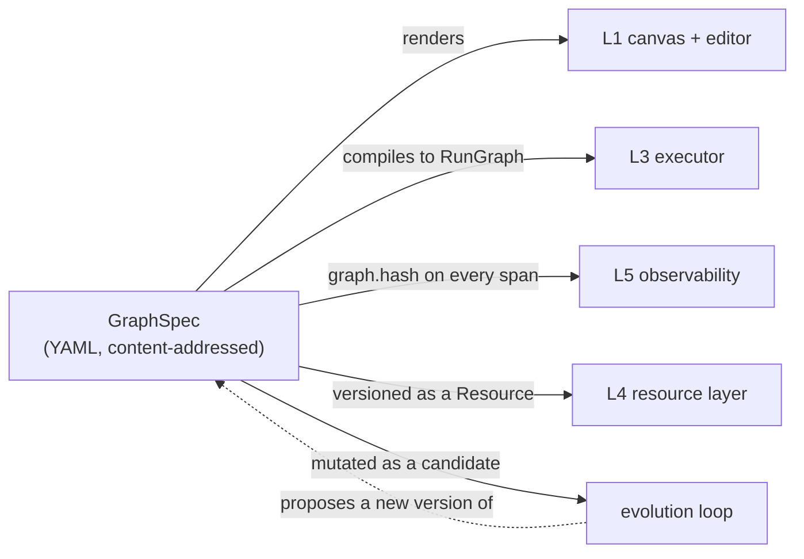
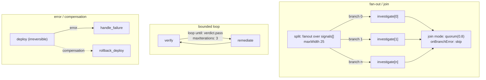
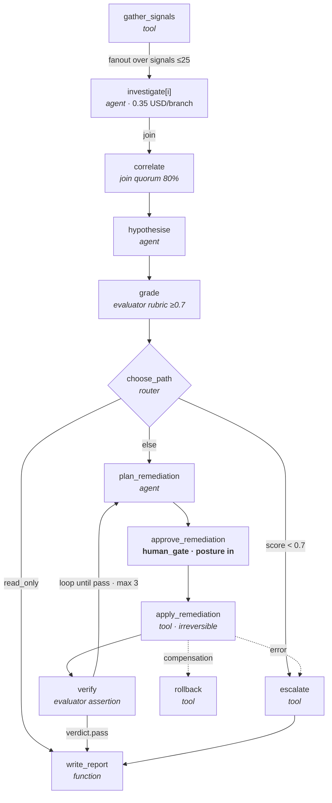
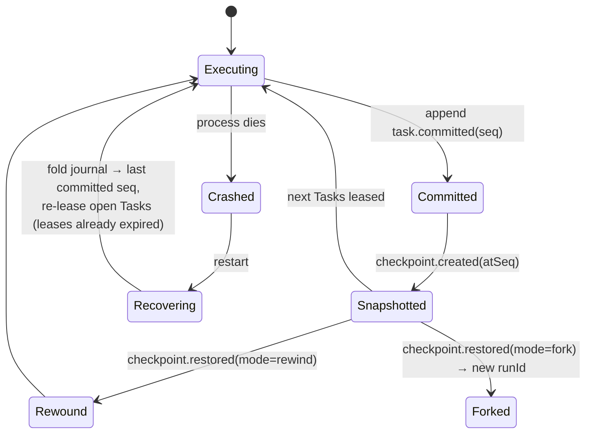
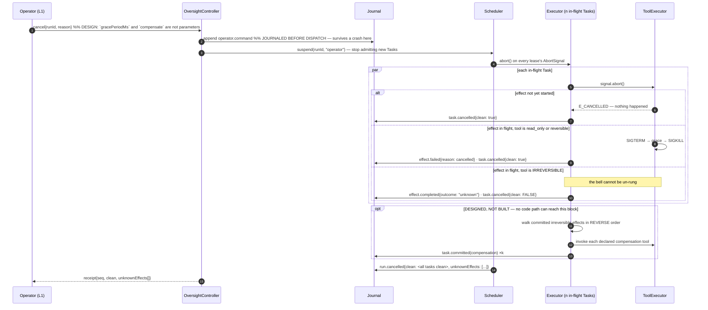
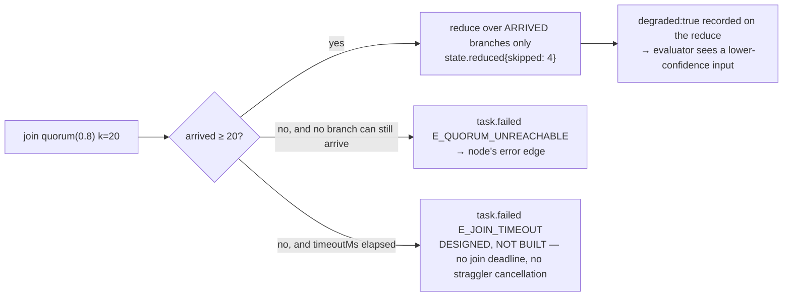
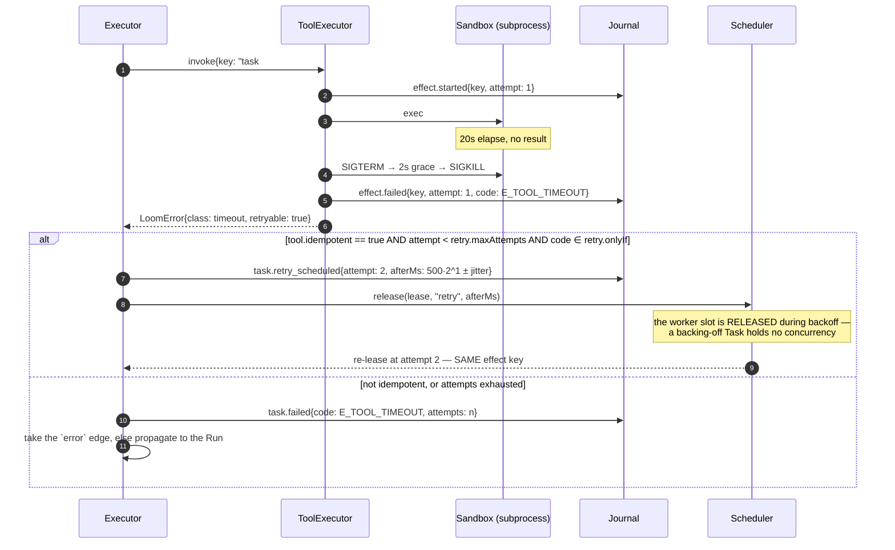
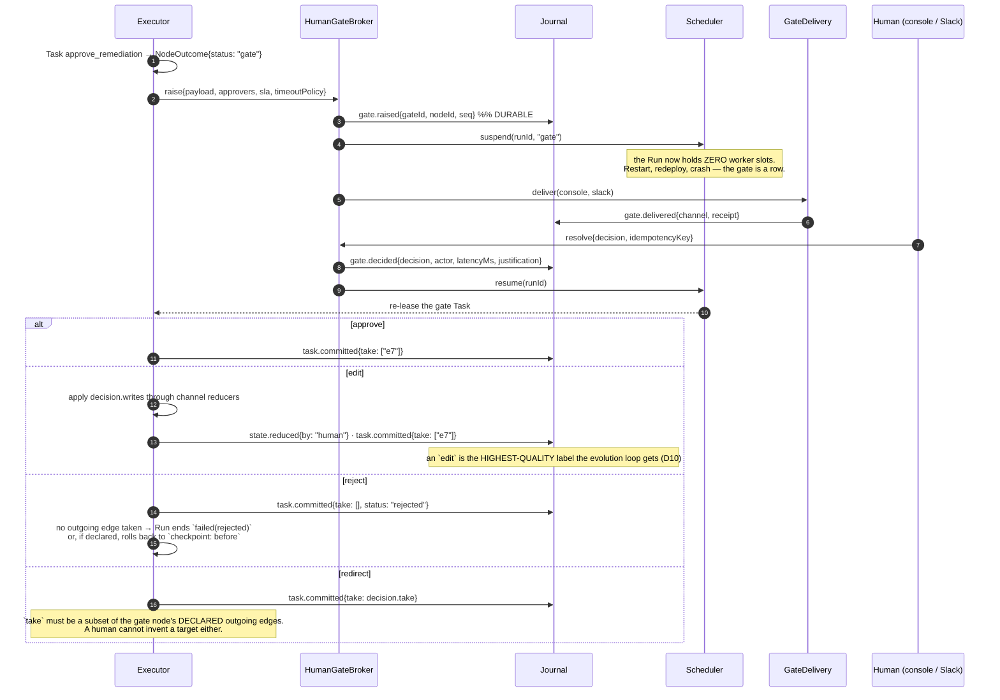

# 02 — D5 · Execution Graph Model, and D4 · Data & Control Flow

---

# D5 — Execution graph model (graph engineering)

The core structural deliverable. One artifact — `GraphSpec` — is authored once and
consumed by all six layers.



---

## D5.1 — Node type taxonomy

| Type | Guarantees | Reads/writes state | Model? | Tools? | Deterministic | Default posture | Can suspend |
|---|---|---|---|---|---|---|---|
| `function` | Pure TS/JS over declared channels. Same input hash ⇒ same output. Runs in a worker thread if `cpuBound: true` | yes / yes | no | no | **yes** | inherits | no |
| `agent` | A bounded ReAct loop from a pinned `AgentProfile`. Bounded by `maxTurns` **and** node budget, whichever binds first. Returns a value matching `outputSchema` or fails | yes / yes | yes | yes | no (recorded) | **`max` over every tool it can REACH** | yes — **before the first turn, never inside one** |
| `tool` | Exactly one `ToolExecutor.invoke`. No model call. The only node type whose irreversibility class is known statically | yes / yes | no | one | no (recorded) | **from tool's irreversibility class** | yes (policy gate) |
| `router` | Selects a subset of its declared outgoing edges. **Cannot write state.** `mode` has two values and only `expression` compiles: `model` is REFUSED (`GRAPH005_ROUTER_MODE_UNSUPPORTED`), see below | yes / **no** | **no** | no | **yes** | inherits | no |
| `join` | A barrier over named incoming branches. Applies channel reducers in branch-coordinate order. Declares `mode` and `onBranchError`; `timeoutMs` is optional and **enforced by nothing — there is no join deadline** | yes / yes | no | no | **yes** | inherits | no |
| `evaluator` | Produces a typed `Verdict {pass, score 0..1, reasons[], evidence[]}`. May be a function (assertions) or an agent (rubric judge). **Its output is the primary non-human signal for the evolution loop** | yes / yes | optional | optional | function: yes | inherits | no |
| `human_gate` | Raises a durable `HumanGate` and suspends the Run. Resumes on `gate.decided`. Its decision may write channels (`edit`) or select edges (`redirect`) | yes / yes | no | no | **no** (human input is an Effect) | **`in` by definition** | **yes, always** |
| `subgraph` | Executes a pinned child `GraphSpec` with an explicit channel mapping in/out. Its own budget slice is carved from the parent's. Depth-limited | mapped | — | — | inherits | inherits (`max` with child's) | yes |

**Reading the last two columns.** "Inherits" is shorthand for the `max` fold in
`graph/compile.ts`: the system floor, the graph's `policy.posture`, a class floor from
every tool the node can REACH, and a data floor from the classification of every channel
it reads or writes. The `agent` row is called out because it used to say "inherits" and
was wrong in a way that mattered: an agent node names no tool — its model picks from
`agent.tools` at run time — so keying the class floor on `node.tool` answered `read_only`
for every agent, and an agent that could reach a destructive tool floored at `out`.
`reachableToolNames` in `graph/spec.ts` is now the one place that answers "which tools",
and oversight, capability accounting and the rewind refusal all read it.

An agent's suspension is likewise narrower than "yes". It suspends at TASK granularity,
**before** the first turn, when that floor makes `PolicyEngine.decide` return `gate`.
Inside a turn there is no suspension available: a `gate` decision reaching
`Engine.#invokeTool` is a **refusal** — the conversation of a turn lives in memory, so a
gate raised there could not be answered after a restart. The approval of the node is
carried into the turn as `nodeApproved`, which is what stops the refusal from turning a
human's "yes" into a run that succeeds having done none of the work. See D3.6.

**Two invariants that make the taxonomy load-bearing rather than decorative:**

1. **A router cannot write state.** If routing could also mutate, "why did it go there?"
   would require replaying arbitrary code. A router's entire output is an edge subset,
   which the journal records verbatim. Enforced: `GRAPH005_ROUTER_WRITES`, "routers cannot
   write state".
2. **Only `human_gate`, `agent`, `tool`, and `subgraph` can suspend** — and all four
   suspend *between* Tasks, never inside a node body. `function`, `router`, and `join`
   are guaranteed to terminate without external input, which is what lets the scheduler
   treat them as cheap and run them inline on the committing worker rather than
   re-queueing.

**Designed, not implemented — `mode: model` is a compile error today.** This used to sit
above as a third invariant, asserting that a model-mode router "returns an index into
declared edge ids", that an invalid selection is `E_ROUTE_INVALID` taking the declared
`fallbackEdge`, and that this is "the concrete mechanism behind *the graph, not the
model's context, decides what may happen next*". None of that runs. `RouterNode.mode` is
`"expression" | "model"` and the field **is declared in order to be refused** — the same
treatment `DelegationSpec` gets, and for the same reason: `Engine.#runRouter` never reads
`mode`. It evaluates `cases[].when` in order whichever mode is declared and, when nothing
matches, takes `router.fallbackEdge` — so accepting `model` would run "a fixed expression
picks the branch" under a graph that reads "a model picks the branch", with a model
`profile` pinned in the resolution manifest and never called. The compiler therefore
pushes `GRAPH005_ROUTER_MODE_UNSUPPORTED`: *router "…" declares mode "model", which no
executor implements — its `when` expressions would decide the branch instead.*

`E_ROUTE_INVALID` is a real code, and it is not the router's. `Engine` raises it in exactly
one place — `#applyGateDecision`, for a **human gate** whose `redirect` decision names an
edge that is not one of the gate node's declared outgoing edges — and it FAILS the Task
rather than falling back:

```ts
const invented = (gate.take ?? []).filter((id) => !outbound.includes(id as EdgeId));
```

**That closed set is enforced for the human gate and for nothing else.** A router's
`cases[].take` and its `fallbackEdge` are checked by no one, at no phase. `validate.ts`
reads `take` in exactly one place — `routerExclusive`, a `GRAPH010` concurrency helper
asking whether two arms can both fire — and never reads `fallbackEdge` at all. At run time
`#runRouter` returns `c.take` and `[router.fallbackEdge]` verbatim, `#edgesToTake` passes an
`outcome.take` through unfiltered, and `#activate` resolves each id against
`ctx.index.edgeById` — **the whole graph's edge table** — with `if (e === undefined)
continue;`. Two consequences, both live:

- a router naming an edge that belongs to **some other node** activates that node's target,
  jumping whatever sat between. Compile the D5.5 example with `choose_path`'s first case
  rewritten to `take: [e8]` (`apply_remediation → verify`) and the compiler returns
  `ok: true` with no diagnostic; the run then skips `approve_remediation` and the
  `k8s.apply` behind it. That is exactly the bug `#applyGateDecision`'s comment records
  having fixed **for gates** — still open one node type over;
- a router naming an edge that exists **nowhere** is a silent no-op that strands the run.

**Designed, not implemented — the router's half of the closed set.** It is a `GRAPH005`
sub-code asserting `take ∪ {fallbackEdge} ⊆ outbound(node)`, and it does not exist. Do not
read the gate check as covering routers; nothing does.

Building `mode: model` therefore costs three things, and `graph/spec.ts`'s `RouterNode`
docstring already names all three: a **recorded model effect** (so replay serves the same
choice), **closed-set validation** of the returned edge id — which the paragraph above says
is owed for `expression` mode too, so it is one check built once for both — and an
`E_ROUTE_INVALID` **fallback** path at the router. Whoever builds it deletes the refusal in
the same change.

---

## D5.2 — Edge semantics

| Kind | Meaning | Required fields | Compile rule |
|---|---|---|---|
| `seq` | Unconditional transition | `from`, `to` | — |
| `conditional` | Taken iff `when` evaluates true, or iff the source router selected this edge id | `when` **xor** source is a `router` | An expression may reference only declared channels; unknown ref ⇒ `GRAPH004` |
| `fanout` | Instantiates `to` once per element of `over`, each in its own branch coordinate | `over` (channel path), `as` (item channel), `maxWidth` | `maxWidth` mandatory and ≤ `policy.expansion.maxFanout`; **both `over` and `as` must be declared channels** — the item channel is branch-scoped and is still a declaration, because the `StateView` has to serve it and the expression type-checker has to know its type (`GRAPH007`) |
| `join` | Barrier. Named branches converge; reducers fold in branch-coordinate order | `branches[]`, `mode`, `onBranchError`; `timeoutMs` optional and unenforced | Every branch id must be reachable from a matching `fanout`/split (`GRAPH008`) |
| `error` | Taken when the source Task terminates with `status:"error"` after retries are exhausted | `from`, `to`, optional `codes[]` | A node whose error is unhandled propagates to the Run — allowed, but warned (`GRAPH011`) |
| `compensation` | **A declaration, not a runtime path — see below.** Says that `to` is what would undo `from`'s committed effects | `compensates` | Only valid from a node whose tool declares a `compensation` naming a REGISTERED tool (`GRAPH012`); a compensation that is itself irreversible or externally visible warns |
| `loop` | Back-edge. Re-instantiates the target with `iteration+1` | `until` (expression), `maxIterations`, optional `budget` | The cycle must contain a node that writes a channel referenced by `until`, and `maxIterations` is mandatory (`GRAPH006`) |



**Join modes**

| `mode` | Fires when | Non-arriving branches |
|---|---|---|
| `all` | every branch reaches it | waits — indefinitely, because `timeoutMs` is enforced by nothing |
| `any` | the first branch arrives | **keep running to completion** |
| `quorum(k)` | `k` branches arrive (`k` integer or fraction of width) | **keep running to completion** |
| `firstSuccess` | first branch with `status:"ok"` | **keep running to completion** |

**A short-circuiting join does not cancel its stragglers, and nothing records that it
didn't.** `#maybeFireJoin` decides on `branches`, `mode` and `k`; the remaining branches
keep their leases and run to the end, and **no `task.cancelled` is appended anywhere** —
that event type is declared, folded in three places, and appended by nothing
(`test/docs-drift.test.ts` pins it in `NEVER_APPENDED`). This column used to read
"cancelled with `task.cancelled(reason: join_short_circuit)`", which is the shape the
guard's own registry names as the false claim.

**There is no `drain` field either**, and its absence is the honest form of the above. It
meant *keep non-arriving branches running after the join fires* — which is what the runtime
does, unconditionally — and its default was `drain: false`. So the DEFAULT was the value
that lied: every graph that never mentioned the field asked for stragglers to be cancelled
and got them kept, and a field whose only honest value is the one nobody writes cannot be
salvaged by refusing the other one. It returns in the change that adds straggler
cancellation, and not before.

`onBranchError`: `fail` (whole join fails), `skip` (branch contributes nothing; recorded).
**`compensate` is REFUSED at compile time.** It is still in the type — `NodeSpec` is pinned
public surface — and it used to be accepted and then treated as an exact synonym for `skip`,
so an author who asked for a failed branch to be rolled back got it silently discarded and
the graph read as though somebody had thought about the failure. A word that means something
weaker than it says is worse than not offering the word, so it is a compile error until
there is a runtime under it, and `#absorbedByJoin` no longer aliases it either.

### Compensation is a compile-time proof and a rewind refusal. Nothing executes one.

This is the single place the corpus says so, and everywhere else that names compensation
points here. **No code path can take a compensation edge.** `#edgesToTake` breaks on
`compensation`, and the only other arm — `#errorEdges`, the failure path, which is the one
path that *could* take one — filters `kind === "error"` alone. `Engine.cancel(runId, reason)`
has no `compensate` and no `gracePeriodMs`. Reproduced on the incident-triage graph with a
throwing `k8s.restart` and a recording `k8s.rollback`: the rollback node never got a Task, and
the run ended **`succeeded`** — an irreversible restart attempted, failed, and not compensated.

What a declared compensation **does** buy, which is real and load-bearing:

- **`Engine.rewind` refuses to cross it.** A committed irreversible effect whose tool declares
  no compensation makes a rewind past it `E_RESTORE_ILLEGAL`. That refusal reads the field's
  PRESENCE, which is why `GRAPH012` now requires the name to resolve to a registered tool: a
  typo, or `compensation: {tool: "noop"}`, bought a legal rewind that undid nothing.
- **A compensation target is not an entry node.** The edge is excluded from the DAG (it is not
  forward flow, and including it makes almost every graph look cyclic) but it still counts as
  an inbound edge, so a rollback node is never scheduled at run start.

Building the executing saga means reverse-commit-order tracking, a `Compensating` run state,
and `cancel{grace, compensate}` — a feature, not a fix. Until then this section is the
contract, and `test/graph/compensation-honesty.test.ts` is what keeps it honest.

---

## D5.3 — Typed state channels and the reducer model

**All inter-node data flows through declared, typed channels.** There is no ambient
context, no implicit "previous output", and no string interpolation between steps.

> EAgent passed data between steps by substituting `${stepId}` tokens into strings
> (`src/extensions/dynamic-workflow.ts:273-290`). It works and it is untyped, unmergeable,
> and unverifiable — a downstream step cannot know whether it received a summary or a
> stack trace. Channels replace it.

```yaml
channels:
  findings:
    type: array
    items: { $ref: "#/defs/Finding" }
    reduce: append_ordered
    classification: internal
    # What a node actually sees in its prompt. A declared projection, not "everything so far".
    contextProjection:
      select: "$[*].{title: title, severity: severity, evidence: evidence[0:2]}"
      maxTokens: 3000
      overflow: summarize      # summarize | truncate_tail | error
  costUsd:      { type: number, reduce: sum, initial: 0 }
  confidence:   { type: number, reduce: min,  initial: 1 }
  incident:     { type: object, reduce: replace, classification: pii }
  touchedHosts: { type: array,  reduce: union_set }
```

### The reducer set (v1)

| Reducer | Fold | Multi-writer safe | Notes |
|---|---|---|---|
| `replace` | `(_, b) => b` | **no** | Compile error if two concurrent branches write it (`GRAPH010`) |
| `append_ordered` | `(a, b) => [...a, ...b]` | **yes** | Deterministic because the join folds in **branch-coordinate order**, not arrival order |
| `merge_object` | shallow merge, later key wins | **yes**, if key sets are disjoint | Overlapping keys across branches ⇒ `GRAPH010` unless `onConflict` declared |
| `sum` / `max` / `min` | arithmetic | **yes** | Commutative and associative |
| `union_set` | set union on a declared identity field | **yes** | |
| `last_write_wins_by_ts` | ordered by recorded effect timestamp | **yes** | Escape hatch; warns (`GRAPH013`) because it makes replay depend on recorded clocks |

### The determinism rule, stated exactly

> A join folds branch contributions **sorted by BranchCoordinate**, which is a total
> order fixed at fan-out time (`over` index, then loop iteration, then nodeId). Therefore
> a reducer must be **associative and total**, but need *not* be commutative. Arrival
> order never affects the result.

This is why `append_ordered` is safe and `replace` is not: `append_ordered` is
associative; `replace` is associative but discards all but one input, so which input
survives depends on the fold order over a set the author didn't intend to be ordered —
the compiler rejects it rather than making it silently arbitrary.

### Reads and writes are declared

Each node declares `reads: []` and `writes: []`. `StateView.require()` throws
`E_CHANNEL_UNDECLARED` for anything else. This buys three things: the compiler can prove
data dependencies without executing anything; the scheduler knows which Tasks conflict;
and the context assembler knows exactly what may enter a prompt.

---

## D5.4 — `GraphSpec` schema

```yaml
apiVersion: loom.dev/v1          # major checked by the compiler; unknown ⇒ E_GRAPH_INVALID
kind: GraphSpec

metadata:
  name: string                   # unique within project
  project: string
  version: integer               # monotonic; identity is the content digest, not this
  description: string
  labels: { [k: string]: string }

policy:                          # graph-level defaults; merged per D11
  posture: out | on | in
  budget:    { costUsd: number, tokens: integer, wallMs: integer }
  expansion: { maxNodes: integer, maxDepth: integer, maxFanout: integer, maxLoopIterations: integer }
  capabilities: [string]         # allowlist; intersected with system + tenant (never widened)
  onBudgetExhausted: degrade | gate | fail

channels:
  <name>:
    type: string|number|boolean|object|array
    schema: { }                  # JSON Schema for object/array
    reduce: replace | append_ordered | merge_object | sum | max | min | union_set | last_write_wins_by_ts
    initial: any
    classification: public | internal | pii | secret_ref
    contextProjection: { select: string, maxTokens: integer, overflow: summarize|truncate_tail|error }

inputs:  [<channel>]             # must be supplied at submit; validated by the control plane
outputs: [<channel>]             # returned to the caller and surfaced in the UI

nodes:
  - id: string
    type: function|agent|tool|router|join|evaluator|human_gate|subgraph
    reads:  [<channel>]
    writes: [<channel>]
    policy: { posture?, capabilities?, budget?, dataClassification? }
    retry:  { maxAttempts: integer, backoff: exponential|fixed, initialMs, maxMs, jitter: bool, onlyIf: [errorCode] }
    timeoutMs: integer
    checkpoint: none | before | after | both     # default: after
    # ── exactly one type block ──
    function: { ref: ResourceRef, cpuBound: bool }
    agent:    { profile: ResourceRef, prompt: ResourceRef, outputSchema: {}, maxTurns: int, tools: [string] }
    tool:     { name: string, version: string, args: {} }        # args templated from `reads`
    router:   { mode: expression|model,                # `model` is in the type and REFUSED (GRAPH005)
                cases: [{when, take}], fallbackEdge: string, profile?: ResourceRef }
    join:     { branches: [string], mode: all|any|quorum|firstSuccess, k?: number,
                onBranchError: fail|skip,          # `compensate` is in the type and REFUSED
                timeoutMs?: integer }              # optional, and there is no join deadline
    evaluator:{ kind: assertion|rubric, ref: ResourceRef, threshold: number }
    humanGate:{ ref: ResourceRef }                                # → the OversightPolicy in D7
    subgraph: { ref: ResourceRef, inputs: {child: parent}, outputs: {parent: child}, budgetShare: number }

edges:
  - id: string
    from: <nodeId>
    to: <nodeId>
    kind: seq|conditional|fanout|join|error|compensation|loop
    when: string                 # conditional only — a restricted expression (see below)
    over: string                 # fanout only — a channel path
    as: string                   # fanout only — the per-branch item channel; MUST be declared under `channels:`
    maxWidth: integer            # fanout only — MANDATORY
    branches: [string]           # join only
    until: string                # loop only
    maxIterations: integer       # loop only — MANDATORY
    codes: [string]              # error only
    compensates: <nodeId>        # compensation only

hooks:                           # extension points; each a pinned ResourceRef (D6 §Hooks)
  prePlan: [] ; preNode: [] ; preTool: [] ; postTool: []
  preModel: [] ; postModel: [] ; onError: [] ; onGate: [] ; onComplete: []
```

### The expression language (`when`, `until`, router `cases`)

`ASSUMPTION: a restricted, side-effect-free expression language — CEL-style — not
JavaScript.` Grammar: channel reads, literals, `&& || !`, comparison, arithmetic,
`len()`, `has()`, `any()/all()` over arrays, and `.` / `[]` access. **No function calls
into user code, no I/O, no loops.** Total, terminating, statically type-checkable against
the channel schemas — which is what makes `GRAPH004` (type compatibility) and `GRAPH006`
(termination) decidable at compile time. Turing-complete predicates would make both
undecidable, which is exactly why they are excluded.

---

## D5.5 — Worked example: incident triage and remediation

Non-trivial by construction: dynamic fan-out, a quorum join, an evaluator, an
expression router, a bounded verify/remediate loop, an irreversible action behind a human
gate, and a compensation path.

**This block is the corpus's one end-to-end artefact, so it is written to be READ BY THE
SHIPPED CODE, not to look like YAML.** It parses under `graph/yaml.ts`'s subset and
compiles with no errors. Two things it once did and no longer does, because the code
refuses both: it spread flow mappings (`{ … }`) across two lines, which the subset does
not join — a flow collection is one line, or it is a block mapping — and it fanned out to
an item channel `signal` that `channels:` never declared, which is
`GRAPH007_UNKNOWN_ITEM`. It also declared `drain: false` on `correlate`, a field
`JoinNode` does not have; see D5.2.

`compile()` still returns two **warnings** against a manifest where `k8s.apply` is
`irreversible` and `chat.post` is `externally_visible`, and they are left in because they
are what an author of this graph should see: `GRAPH009_UNBOUNDED_NODE` for `hypothesise`,
`grade` and `plan_remediation`, which can spend and declare no node budget, and
`GRAPH011_UNHANDLED_IRREVERSIBLE` for `escalate`, which posts to chat with no `error` edge.

```yaml
apiVersion: loom.dev/v1
kind: GraphSpec
metadata:
  name: incident-triage
  project: sre
  version: 7
  description: Triage a paging incident, propose a remediation, execute it under approval.

policy:
  posture: on                              # supervisors watch by default…
  budget: { costUsd: 12.0, tokens: 2000000, wallMs: 900000 }
  expansion: { maxNodes: 64, maxDepth: 3, maxFanout: 25, maxLoopIterations: 3 }
  capabilities: [net:fetch, obs:query, k8s:read, k8s:write, chat:post]
  onBudgetExhausted: gate

channels:
  incident:    { type: object, schema: { $ref: "#/defs/Incident" }, reduce: replace, classification: pii }
  signals:     { type: array,  reduce: replace }
  # The per-branch item channel e1 binds with `as:`. It is branch-scoped and it is still a
  # DECLARATION: `GRAPH007_UNKNOWN_ITEM` refuses a fanout whose `as` names nothing here.
  signal:      { type: object, reduce: replace }
  findings:
    type: array
    reduce: append_ordered
    contextProjection: { select: "$[*].{h: host, s: severity, w: what}", maxTokens: 2500, overflow: summarize }
  hypothesis:  { type: object, reduce: replace }
  verdict:     { type: object, reduce: replace }
  plan:        { type: object, reduce: replace }
  applied:     { type: array,  reduce: append_ordered }
  costUsd:     { type: number, reduce: sum, initial: 0 }
  report:      { type: object, reduce: replace }

inputs:  [incident]
outputs: [report, applied]

nodes:
  - id: gather_signals
    type: tool
    reads: [incident]
    writes: [signals]
    tool: { name: obs.query_window, version: "2.1", args: { service: "${incident.service}", minutes: 30 } }
    retry: { maxAttempts: 3, backoff: exponential, initialMs: 500, maxMs: 8000, jitter: true }
    timeoutMs: 20000

  - id: investigate
    type: agent
    reads: [incident, signal]
    writes: [findings, costUsd]
    agent:
      profile: agent_profile/sre-investigator@stable
      prompt:  prompt/investigate-signal@stable
      outputSchema: { $ref: "#/defs/Finding" }
      maxTurns: 6
      tools: [obs.query_window, k8s.describe, runbook.search]
    policy: { budget: { costUsd: 0.35 } }        # PER BRANCH — 25 × 0.35 ≤ graph budget
    timeoutMs: 120000

  - id: correlate
    type: join
    reads: [findings]
    writes: [findings]
    join: { branches: [investigate], mode: quorum, k: 0.8, onBranchError: skip, timeoutMs: 180000 }

  - id: hypothesise
    type: agent
    reads: [incident, findings]
    writes: [hypothesis, costUsd]
    agent:
      profile: agent_profile/sre-lead@stable
      prompt:  prompt/root-cause@stable
      outputSchema: { $ref: "#/defs/Hypothesis" }
      maxTurns: 4

  - id: grade
    type: evaluator
    reads: [hypothesis, findings]
    writes: [verdict]
    evaluator: { kind: rubric, ref: prompt/grade-hypothesis@stable, threshold: 0.7 }

  - id: choose_path
    type: router
    reads: [verdict, hypothesis]
    router:
      mode: expression
      cases:
        - { when: "verdict.score < 0.7",                          take: [to_escalate] }
        - { when: "hypothesis.remediation.class == 'read_only'",  take: [to_report] }
        - { when: "true",                                         take: [to_plan] }
      fallbackEdge: to_escalate

  - id: plan_remediation
    type: agent
    reads: [hypothesis, findings]
    writes: [plan, costUsd]
    agent:
      profile: agent_profile/sre-lead@stable
      prompt:  prompt/plan-remediation@stable
      outputSchema: { $ref: "#/defs/Plan" }
      maxTurns: 3

  - id: approve_remediation
    type: human_gate
    reads: [plan, hypothesis, verdict, findings]
    writes: [plan]
    humanGate: { ref: oversight/sre-prod-change@stable }
    checkpoint: before                         # rollback target if the human rejects

  - id: apply_remediation
    type: tool
    reads: [plan]
    writes: [applied]
    tool: { name: k8s.apply, version: "3.0", args: { manifest: "${plan.manifest}" } }
    policy: { posture: in }                    # redundant with the tool's class; explicit for readers
    retry: { maxAttempts: 1 }                  # NOT idempotent ⇒ never auto-retried
    checkpoint: both

  - id: verify
    type: evaluator
    reads: [incident, applied]
    writes: [verdict]
    evaluator: { kind: assertion, ref: function/verify-slo-recovered@stable, threshold: 1.0 }

  - id: rollback
    type: tool
    reads: [applied]
    writes: [applied]
    tool: { name: k8s.rollback, version: "3.0", args: { revision: "${applied[-1].revision}" } }

  - id: escalate
    type: tool
    reads: [incident, findings, verdict]
    writes: [report]
    tool: { name: chat.post, version: "1.4", args: { channel: "#sre-oncall", body: "${report.summary}" } }

  - id: write_report
    type: function
    reads: [incident, findings, hypothesis, verdict, applied, costUsd]
    writes: [report]
    function: { ref: function/render-incident-report@stable }

edges:
  - { id: e1,          from: gather_signals,     to: investigate,        kind: fanout, over: signals, as: signal, maxWidth: 25 }
  - { id: e2,          from: investigate,        to: correlate,          kind: join, branches: [investigate] }
  - { id: e3,          from: correlate,          to: hypothesise,        kind: seq }
  - { id: e4,          from: hypothesise,        to: grade,              kind: seq }
  - { id: e5,          from: grade,              to: choose_path,        kind: seq }
  - { id: to_plan,     from: choose_path,        to: plan_remediation,   kind: conditional }
  - { id: to_report,   from: choose_path,        to: write_report,       kind: conditional }
  - { id: to_escalate, from: choose_path,        to: escalate,           kind: conditional }
  - { id: e6,          from: plan_remediation,   to: approve_remediation,kind: seq }
  - { id: e7,          from: approve_remediation,to: apply_remediation,  kind: seq }
  - { id: e8,          from: apply_remediation,  to: verify,             kind: seq }
  - { id: e9,          from: verify,             to: plan_remediation,   kind: loop, until: "verdict.pass || len(applied) >= 3", maxIterations: 3 }
  - { id: e10,         from: verify,             to: write_report,       kind: conditional, when: "verdict.pass" }
  - { id: e11,         from: apply_remediation,  to: escalate,           kind: error }
  - { id: e12,         from: apply_remediation,  to: rollback,           kind: compensation, compensates: apply_remediation }
  - { id: e13,         from: escalate,           to: write_report,       kind: seq }
```



---

## D5.6 — Compile-time validation rules

The compiler runs every rule and returns **all** diagnostics, never just the first.

| Code | Rule | Severity | Why it is decidable |
|---|---|---|---|
| `GRAPH000` | `apiVersion` is one this compiler understands | error | a spec written against a different version may mean something else entirely, and guessing is worse than refusing |
| `GRAPH001` | Every node is reachable from an input node | error | graph traversal |
| `GRAPH002` | Every terminal path reaches an output node or a declared terminal | error | traversal |
| `GRAPH003` | No duplicate node/edge/channel ids | error | set check |
| `GRAPH004` | Every expression type-checks against channel schemas; every referenced channel is declared and *read-declared* by that node | error | the expression language is total and typed |
| `GRAPH005` | Every node's `writes` are declared channels; every `reads` is written by some upstream node or is an input | error | dataflow over the DAG |
| `GRAPH006` | Every cycle has a mandatory `maxIterations` **and** contains a node writing a channel referenced by its `until` | error | a cycle whose condition no node can change is a guaranteed infinite loop |
| `GRAPH007` | Every `fanout` declares `maxWidth ≤ policy.expansion.maxFanout`, **and both the channel it fans `over` and the per-branch `as` item channel are declared under `channels:`** (`GRAPH007_UNKNOWN_OVER` / `GRAPH007_UNKNOWN_ITEM`) | error | static |
| `GRAPH008` | Every `join.branches[]` id matches a reachable fan-out/split; no join waits on a branch that cannot occur | error | traversal |
| `GRAPH009` | Node budgets are consistent: `Σ(perBranchBudget × maxWidth) + Σ(sequential budgets) ≤ graph budget` | **error** | arithmetic over the static bound. *This is the rule that catches "50 parallel agents each within budget, blowing the run budget collectively"* |
| `GRAPH010` | No channel with a non-multi-writer-safe reducer is written by two concurrent branches | error | concurrency is static: two nodes are concurrent iff neither is an ancestor of the other |
| `GRAPH011` | Every node with irreversibility ≥ `irreversible` has an `error` edge or an explicit `unhandled: true` | warning | static |
| `GRAPH012` | `compensation` edges only originate from nodes whose tool declares a compensation | error | tool manifest lookup |
| `GRAPH013` | `last_write_wins_by_ts` used | warning | makes replay clock-dependent |
| `GRAPH014` | **Oversight conformance**: no node declares a posture below the effective system/tenant floor for its irreversibility class, and no `human_gate` declares an approval rule the runtime does not enforce | **error** (`E_OVERSIGHT_LOOSENED` for the posture case; `E_GRAPH_INVALID` for the rest) | posture lattice comparison, plus a structural check on `humanGate.approval` |
| `GRAPH015` | Every resource ref resolves and is not `deprecated`/yanked | error | resource layer lookup |
| `GRAPH016` | `subgraph` nesting depth ≤ `maxDepth`; no cyclic subgraph reference | error | traversal over pinned digests |
| `GRAPH017` | Declared capabilities ⊆ tenant-granted capabilities | error | set containment |
| `GRAPH018` | Estimated worst-case node count ≤ `expansion.maxNodes` | warning | `Σ maxWidth × maxIterations` |
| `GRAPH019` | A posture declaration that a higher floor overrides | warning | posture lattice comparison |
| `GRAPH020` | Exactly one type block per node, and it matches `type` | error | structural; gates the semantic rules |
| `GRAPH021` | Every `fanout` converges on a `join` | error | **added during M2**: without a join, branch writes have no defined fold point and would apply in arrival order — the nondeterminism the branch-coordinate fold exists to remove |

> **Implementation note (M1e/M2).** Two rules were added while building: `GRAPH020`
> (structural, and it *gates* the semantic rules — one accurate error beats twelve
> derived ones) and `GRAPH021`. Two definitions were also sharpened: entry nodes have
> no inbound edge **except a loop back-edge**, so a compensation target is not treated
> as a start node; and an edge condition may reference its source node's
> `reads ∪ writes`, because edge conditions evaluate on post-commit state.

> **A code in this table is a *family*; the diagnostic carries the sub-code.** Every
> `Diagnostic.code` is `GRAPHnnn_REASON`, and `test/docs-drift.test.ts` checks that each
> `GRAPHnnn` family the compiler can emit appears here — the reason, not the family, is
> what an author reads. `GRAPH014` currently emits **eight** distinct sub-codes from **ten**
> call sites — count them with
> `grep -aoE 'GRAPH014_[A-Z_]+' packages/core/src/graph/validate.ts | sort -u | wc -l`
> rather than trusting this sentence, which has now been wrong three times. (`grep -c`
> counts LINES and answers 10, which happens to be the call-site count and is not the same
> question: two sub-codes are pushed from two places each — `GRAPH014_APPROVER_INVALID`
> once for a non-subject and once for a synthetic marker like `(unidentified)`, and
> `GRAPH014_DELIVERY_INVALID` once as an error and once as a warning. A count is only as
> good as the command under it, and 8 + 2 = 10 is the check that this paragraph is
> internally consistent.) The eight:
> `GRAPH014_OVERSIGHT_LOOSENED` (error, and the only one that surfaces as
> `E_OVERSIGHT_LOOSENED` rather than `E_GRAPH_INVALID`), `GRAPH014_GATE_GATES_NOTHING`
> (**warning** — a `human_gate` with no non-error outbound edge, so approving it does
> nothing), `GRAPH014_APPROVAL_UNSUPPORTED` (error — `mode` other than `single`, a `k`,
> `separationOfDuties`, or `delegation`; see the deviation note in **D7.2**),
> `GRAPH014_APPROVER_INVALID` (error — an approver that is not a subject string, or one
> that is a marker the perimeter mints rather than a name: `(unidentified)` and
> `(shared-token)` read as restricted and are satisfied by exactly the callers nobody
> vouched for), `GRAPH014_SLA_INVALID` (error — a `humanGate.sla` the runtime would not run: a
> `respondWithinMs` that is not a positive whole number of ms, an `onTimeout` a graph
> cannot ask for, or `onTimeout: escalate` with no `delivery.escalation` chain behind it,
> which expires at the first deadline and therefore reads as *escalate* and behaves as
> *fail*), `GRAPH014_DELIVERY_INVALID` (error, plus one warning — a `humanGate.delivery`
> block naming no channels, a malformed `{kind, id}` recipient, a blank `redact` field, an
> unknown `redactAs`, a non-positive tier `afterMs`, or a terminal `action: fail` tier
> sitting anywhere but last, where every tier after it is unreachable), and the two
> saturation controls of **D7.9**, whose failure mode is quieter than doing nothing — a
> misdeclared block merges or collapses nothing at all while the graph reads as though it
> did: `GRAPH014_BATCHING_INVALID` (error — a `humanGate.batching` that is not a plain
> object, a non-boolean `enabled`, or, with `enabled: true`, a blank `key`, a `windowMs`
> that is not a positive whole number of ms, or a `maxBatch` that is not a whole number of
> at least 2, since a cap of 1 declares a mechanism and gets none — and `NaN` is not a small
> cap, it is no cap) and `GRAPH014_DEDUPE_INVALID` (error — a
> `humanGate.dedupe` that is not a plain object, a non-boolean `enabled`, or `enabled: true`
> with a `windowMs` that is not a positive whole number of ms, which would inherit a
> decision of any age).
>
> The unsupported-approval errors are deliberate: an oversight rule accepted and not
> enforced looks supervised and is not. Two things `GRAPH014` deliberately does **not**
> check, for the same reason inverted — a compiler asserting something the runtime does not
> mean is its own kind of lie. **Channel NAMES** are not checked, because a `GateDispatcher`
> is built by the deployment and there is no list to check against; an unknown name is
> already `gate.delivery_failed` plus the console fallback at run time, and delivery failure
> never auto-approves. **Escalation `afterMs` monotonicity** is not checked, because
> `afterMs` is each tier's OWN window measured from the previous tier's breach, so a chain
> that tightens as it climbs is a legitimate escalation.

**Termination is bounded, not proved.** Loom does not attempt to prove a graph
terminates; it makes non-termination *impossible by construction* via mandatory
`maxIterations`, `maxWidth`, `maxTurns`, `maxNodes`, and wall-clock/cost budgets. Stating
this plainly matters: a design claiming to "verify termination" of model-driven loops
would be lying.

---

## D5.7 — Dynamic graph mutation

Statically-authored graphs cover most work. Some work genuinely cannot be planned ahead —
so an agent node may **propose** new nodes. Proposal and execution are separated by the
same compiler that validates authored graphs.

```mermaid
sequenceDiagram
  autonumber
  participant AG as agent node (planner)
  participant EX as GraphExecutor
  participant GC as GraphCompiler
  participant PE as PolicyEngine
  participant J as Journal

  AG->>EX: NodeOutcome{ status:"ok", mutation: GraphMutation }
  EX->>PE: check capability `graph:mutate` + expansion budget remaining
  alt budget exhausted or capability denied
    PE-->>EX: deny
    EX->>J: task.failed(E_EXPANSION_EXHAUSTED)
  else permitted
    EX->>GC: compileMutation(base: RunGraph, mutation, budget)
    GC->>GC: re-run GRAPH001..018 on base ⊕ mutation
    alt invalid
      GC-->>EX: E_GRAPH_INVALID + diagnostics
      EX->>AG: diagnostics returned as a tool result (the planner may retry once)
    else valid
      GC-->>EX: RunGraph'
      EX->>J: graph.mutated{ parentHash, newHash, added, budgetConsumed, proposedBy }
      Note over EX: the UI canvas animates the new nodes in;<br/>the same artifact, a new digest
    end
  end
```

**The rules that keep this from becoming unbounded self-modification:**

| Constraint | Value | Enforcement |
|---|---|---|
| Who may mutate | only a node whose profile holds `graph:mutate` | `PolicyEngine` |
| What may be added | nodes and edges **only within the proposing node's declared subgraph region** | compiler: added nodes must be dominated by the proposer |
| What may **never** be changed | existing nodes, existing edges, channel schemas, **any policy or posture field**, budgets | compiler: mutation is additive-only over a frozen base |
| Expansion budget | `maxNodes`, `maxDepth`, `maxFanout` decremented per mutation, per Run | executor, journaled |
| Validation | the identical `GRAPH001..018` pass | `compileMutation` |
| Oversight | a mutation that introduces a node with irreversibility ≥ `irreversible` **raises a gate before executing it**, regardless of the run's posture | `GRAPH014` + policy |
| Durability | the `graph.mutated` event carries the **full added specs**, so a restarting process rebuilds the successor graph from the journal rather than scheduling from the authored one | `Engine#rehydrateGraph` |
| Authority | `canMutate` is declared on the NODE, and `graph:mutate` is checked at dispatch | a model cannot grant itself the power by emitting the right shape |
| Auditability | `graph.mutated` records the full diff and the proposing Task | journal |

`DEFERRED-v2: mutation that *removes* or *rewires* existing nodes.` Additive-only keeps
the executed graph a superset of the compiled one, which keeps replay and the UI's
incremental rendering simple; removal introduces "what happened to the branch that was
already running through the deleted edge?" with no cheap answer.

---

## D5.8 — Checkpointing and resume

**Every Task boundary is a potential checkpoint; `checkpoint:` declares which are
materialized.** A checkpoint is not a copy of the world — it is `{journalSeq,
channelStateHash, resolutionManifestRef, openTasks[]}`, so creating one is O(open tasks),
not O(state).



**Resume semantics after a crash — the exact algorithm:**

1. Read `head(runId)`. Fold the journal (from the newest snapshot, not from 0) to
   rebuild channel state and the Task table.
2. Any Task with `task.leased` but no terminal event is **incomplete**. Its lease has
   expired, so it is re-leased with `attempt+1`.
3. For each incomplete Task, scan its `effect.started` entries without a matching
   `effect.completed`. Each is an **unknown-outcome effect**:
   - `read_only` → simply re-executed.
   - `reversible_write` / `irreversible` with `idempotent: true` → re-executed with the
     same idempotency key; the external system dedupes.
   - `irreversible` with `idempotent: false` → **the Task is not auto-retried.** It takes
     its `error` edge, or — if `policy.onUnknownOutcome: gate` — raises a gate that shows
     the human exactly what may or may not have happened.
4. Suspended runs (open gates) are *not* re-leased. They stay suspended and reappear in
   the approval queue automatically, because the gate is a row, not a promise.

That step-3 branch is the honest core of durable execution: **a crash mid-`POST /charge`
is not recoverable by machinery alone**, and the design says so rather than pretending
retry is always safe.

---

## D5.9 — Execution graph vs. knowledge graph

| | Execution graph (`GraphSpec` → `RunGraph`) | Knowledge graph |
|---|---|---|
| Contains | nodes, edges, channels, policy | entities, relations, provenance |
| Authoritative for | **control flow — what may happen next** | nothing in v1 |
| Written by | authors, and additively by permitted agent nodes | ingestion jobs folding completed Runs |
| Read by | compiler, scheduler, executor, UI, tracer, evolution | agent nodes, **via a retrieval tool only** |
| Consistency | strongly consistent, content-addressed | eventually consistent, derived |
| Failure mode if wrong | the run does the wrong thing → caught by evaluator/gate | retrieval returns worse context → degraded answer, never a control-flow change |

**Rule: no control-flow decision may depend on the knowledge graph.** A router's `when`
may read only channels. If a KG lookup should influence routing, it must first pass
through a `tool` node that writes its result into a channel — so the value is journaled,
typed, replayable, and visible on the canvas.

`DEFERRED-v2: a first-class knowledge graph.` v1 ships a vector index plus a
`kb.search` tool. Justification: without a corpus of completed Runs there is nothing to
build a KG *from*, and a KG whose only client is a retrieval tool is
indistinguishable — from the executor's point of view — from any other tool.

---

## D5.10 — What deliberately stays outside the graph

| Outside the graph | Why | What bounds it instead |
|---|---|---|
| **An agent node's internal ReAct turns** | Modelling every model turn as a node multiplies node count by ~5–20×, makes the canvas unreadable, and inflates the journal. The graph's job is coordination between units of work, not the inside of one | `maxTurns`, node token/cost budget, node `timeoutMs`; each turn still emits a `loom.model` span and a journal `model.called` |
| **Retries, backoff, circuit breaking** | Reliability policy, not workflow semantics. Putting it in the graph doubles every node | `retry:` block, journaled `task.retry_scheduled` |
| **Resource resolution and caching** | Infrastructure. Its result — the resolution manifest — *is* in the RunGraph | pinning rule (**D8**) |
| **Capability prompts and policy evaluation** | A cross-cutting concern that would otherwise appear as a gate node before every single node | `PolicyEngine`, journaled `policy.decided` |
| **Context assembly and compaction** | A deterministic function of declared `contextProjection`s; making it a node would let it be reordered, which would break determinism | `ContextAssembler` (**D6**); the `loom.context.assemble` span is designed, not emitted — see the walkthrough note below |
| **Telemetry, audit, cost accounting** | Observers. A graph that contains its own observers cannot be reasoned about | derived read models |
| **Human *conversation*** (chat back-and-forth) | A gate is a *decision*, not a dialogue. Threading free-form chat through a graph makes termination unprovable | `human_gate` with `edit`/`redirect` decisions; free-form chat is a separate `single-agent` Run |

---

# D4 — Data flow & control flow

## The happy path, end to end

```mermaid
sequenceDiagram
  autonumber
  participant U as L1 WebUI
  participant CP as L2 ControlPlaneAPI
  participant PE as PolicyEngine
  participant GC as GraphCompiler
  participant SC as AgentScheduler
  participant EX as GraphExecutor
  participant AF as AgentFactory
  participant MA as ModelAdapter
  participant TE as ToolExecutor
  participant J as Journal (L6)
  participant OT as TraceEmitter (L5)

  U->>CP: POST /runs {workflow, inputs, Idempotency-Key}
  CP->>CP: authn/z · resolve tenant · quota · validate inputs vs GraphSpec.inputs
  CP->>OT: span loom.request
  CP->>GC: compile(spec, tenant, project)
  GC->>GC: GRAPH001..018 · pin every ResourceRef → digest
  GC-->>CP: RunGraph{graphHash, resolutionManifest}
  CP->>J: append run.submitted + run.compiled   %% ← DURABLE HERE
  CP-->>U: 202 {runId, graphHash}                %% ← ACK means "will run", not "has run"
  CP->>SC: submit(graph, trigger, idempotencyKey)
  SC->>PE: reserve(tenant budget, estimate)
  SC->>J: append run.started + task.ready(entry nodes)
  OT->>OT: start span loom.run (root)

  loop until no ready Tasks
    SC->>SC: Scheduler.select — critical path, ONE run, slice to maxParallelism<br/>(the dwrr design is D6.2; this is what runs)
    SC-->>EX: Lease{taskId, fencingToken, attempt}
    EX->>OT: start span loom.task
    EX->>PE: decide(node, actor, irreversibility, budget)
    PE-->>EX: allow | gate | deny

    alt node.type == agent
      EX->>EX: ContextAssembler → AssembledContext (span loom.context.assemble)
      EX->>AF: create(profile, tools, context, effects)
      loop bounded by maxTurns / budget
        AF->>MA: stream(request)            %% span loom.model (gen_ai.*)
        MA-->>AF: deltas … done{usage}
        opt tool calls
          AF->>TE: invoke(handle, args, idempotencyKey)   %% span loom.tool
          TE->>PE: decide(tool, args)
          TE-->>AF: progress … done{result}
        end
      end
      AF-->>EX: done{NodeOutcome}
    else node.type == tool
      EX->>TE: invoke(...)                  %% span loom.tool
      TE-->>EX: done{result}
    else node.type == function | router | join | evaluator
      EX->>EX: run inline on this worker (no re-queue)
    end

    EX->>J: append effect.* · state.reduced · task.committed(expectedSeq)
    EX->>SC: unblocked Tasks → task.ready
    EX->>OT: end span loom.task
  end

  SC->>J: append run.completed
  OT->>OT: end span loom.run
  J-->>CP: EventBus tail
  CP-->>U: SSE frames (live, resumable by Last-Event-ID)
```

## Numbered walkthrough with telemetry emission points

| # | Step | Span | Key attributes | Journal event |
|---|---|---|---|---|
| 1 | Ingress, authn/z, tenancy resolution | `loom.request` | `http.route`, `tenant.id`, `project.id`, `idempotency.key`, `auth.subject` | — |
| 2 | Input validation against `GraphSpec.inputs` | `loom.request` event `inputs.validated` | `inputs.channels[]`, `inputs.bytes` | — |
| 3 | Compile + pin resources | `loom.compile` | `graph.hash`, `graph.nodes`, `graph.max_width`, `resources.pinned`, `diagnostics.warnings` | — |
| 4 | **Durable acknowledgement** | `loom.request` event `run.durable` | `run.id`, `seq` | `run.submitted`, `run.compiled` |
| 5 | 202 returned to client | — | `http.status_code=202` | — |
| 6 | Admission + tenant budget reservation | `loom.schedule.admit` | `tenant.id`, `queue.depth`, `concurrency.used/limit`, `admit.decision` | `budget.reserved` |
| 7 | Run root span opened | `loom.run` | `run.id`, `workflow.name`, `graph.hash`, `idempotency.key`, `config.digest`, `graph.nodes`, `graph.edges`, `resources.pinned`, `oversight.posture` | `run.started` |
| 8 | Task selection | `loom.schedule.pick` | `sched.policy=dwrr`, `sched.deficit`, `task.class`, `wait_ms` | `task.leased` |
| 9 | Policy decision for the node | `loom.policy` | `policy.effect`, `policy.posture`, `policy.reasons[]`, `irreversibility.class` | `policy.decided` |
| 10 | Context assembly (agent nodes) | `loom.context.assemble` | `ctx.sections[]`, `ctx.tokens.before/after`, `ctx.compaction.applied`, `ctx.projection.channels[]` | — |
| 11 | Model call | `loom.model` | `gen_ai.system`, `gen_ai.request.model`, `gen_ai.usage.input_tokens`, `gen_ai.usage.output_tokens`, `gen_ai.response.finish_reason`, `loom.cost_usd`, `loom.effect.key`, `effect.kind`, `effect.outcome`, `loom.replayed` | `effect.started`, `model.called`, `effect.completed` |
| 12 | Tool call | `loom.tool` | `tool.name`, `tool.version`, `tool.irreversibility`, `tool.idempotent`, `loom.effect.key`, `effect.kind`, `effect.outcome` | `effect.started`, `tool.called`, `effect.completed` |
| 13 | State reduction | `loom.state.reduce` | `channels[]`, `branch.count`, `skipped`, `degraded`, `state.hash.before/after` | `state.reduced` |
| 14 | Task commit | `loom.task` (end) | `task.id`, `node.id`, `task.attempt`, `worker.id`, `task.status`, `branch.path`, `branch.item_channel` (fan-out branches only), `edges.in[]`, `edges.taken[]` | `task.committed` |
| 15 | Checkpoint (if declared) | `loom.checkpoint` | `checkpoint.seq`, `checkpoint.kind`, `open_tasks` | `checkpoint.created` |
| 16 | Run completion | `loom.run` (end) | `run.status`, `usage.input_tokens`, `usage.output_tokens`, `cost.total_usd` | `run.completed` |

> **Edges are span *links*, not spans.** Each `loom.task` span carries `edges.in[]` and a
> link to each producer Task's span. This keeps span count `O(nodes)` while still letting
> **D9** reconstruct the executed graph exactly.

**The Span column of steps 1, 2, 3, 6, 8 and 10 is design, not inventory.** Spans are
derived from journal events by `telemetry/spans.ts`, and `EVENT_TYPES` has no event for
ingress, input validation, compilation, admission, task selection, or context assembly —
so `DESIGNED-NOT-BUILT(loom.request)`, `DESIGNED-NOT-BUILT(loom.compile)`,
`DESIGNED-NOT-BUILT(loom.schedule.admit)`, `DESIGNED-NOT-BUILT(loom.schedule.pick)`,
`DESIGNED-NOT-BUILT(loom.context.assemble)`, and the step-11 attribute
`DESIGNED-NOT-BUILT(loom.replayed)`, which `spans.ts` never sets.

**The Journal event column names one event that nothing appends: step 6's
`budget.reserved`.** `PolicyEngine.reserve` holds the reservation in memory and journals
nothing, so a crashed worker's reservation cannot be recovered by folding — which is what
**D6.5**'s three-level budget design assumes. Every other event this column names is real
and is appended, and `test/docs-drift.test.ts` now checks that claim mechanically for the
whole `EVENT_TYPES` vocabulary rather than leaving it as an assurance in this paragraph.

**The Key attributes column of the built rows is inventory, and was not.** Rows 7, 9 and
11–16 list what `telemetry/spans.ts` really sets on the step's success path, one name per
attribute. Two things it deliberately does not list: attributes set only on a FAILURE —
`error.code` on rows 11, 12, 14 **and 16**, `cancel.clean` on 14 and 16, and
`cancel.unknown_effects` on 16 alone — and `loom.replayed` on row 11, which is marked above
and is design rather than inventory. **D9.1**'s delta table is where the full accounting
lives, and this sentence is now the same list it holds: the closing `loom.run` sets
`error.code` from `run.failed` and both `cancel.*` from `run.cancelled`, while a cancelled
Task gets `cancel.clean` and no unknown-effect count.

The column used to credit `loom.task` with `node.type`, `loom.tool` with `tool.capability`
and `tool.attempt`, `loom.state.reduce` with `reducer[]`, and the closing `loom.run` with
`gates.count` and `tasks.total/failed/skipped` — six attributes an investigator would have
gone looking for and not found, while D9.1's delta table documented that they were missing;
row 11 then kept `effect.kind`/`effect.outcome` off a span that is opened and closed by the
same two events as row 12, which lists them. A corpus that states both is worse than one
that states neither, because the reader has no way to know which page is the stale one.
**D9.1's taxonomy table remains the design and its delta table remains the accounting**;
this one is the inventory, and no attribute check is mechanical yet —
`test/docs-drift.test.ts` says at the bottom exactly why not and what would make it so.

Step 8 is the one that misleads, so it is worth stating flatly. What runs is
`Scheduler.select` in `run/scheduler.ts`:
`orderByCriticalPath(eligible(input), graph).slice(0, maxParallelism)`, over **one run's**
projection. There is no deficit counter, no task class, and no tenant at that seam, so
`sched.policy=dwrr` names a policy that does not exist rather than one that is merely
uninstrumented. **D6.2** carries the guarantee table and its implementation note, and
`99-DOD.md` G3 carries the debt.

---

## Deviation 1 — Mid-run cancellation



**Three things in that diagram do not exist.** Two are marked in it rather than left for a
reader to discover: `Engine.cancel` takes `(runId, reason)` — no grace period, no compensate
flag — and nothing executes a compensation. See "Compensation is a compile-time proof and a
rewind refusal" under D5.2. The grace/`SIGKILL` ladder *does* exist, at the sandbox boundary,
which is why the `par` block above is description rather than design.

The third is **`task.cancelled` itself**, in all three `alt` arms. What `Engine.#cancelTree`
appends is `operator.command`, then `gate.cancelled` for every open gate, then
`run.cancelled` — nothing per Task, so an in-flight Task keeps whatever state it last had.
The event type is declared and folded in `projection.ts`, `spans.ts` and `trajectory.ts`,
and appended by nobody, which is why `test/docs-drift.test.ts` pins it in `NEVER_APPENDED`
and names this diagram and D5.2's join-mode table as the places asserting otherwise. D5.2 is
corrected above; Deviation 5's operator-interrupt diagram is a third occurrence and carries
the same caveat under it.

**The honest part:** `run.cancelled` carries `clean: false` and an explicit
`unknownEffects[]` list when cancellation raced an irreversible effect. The UI shows this
as "cancelled — 1 action may have completed", never as a clean stop. A framework that
reports every cancel as clean is lying to its operator.

---

## Deviation 2 — Partial fan-out failure

Scenario: `investigate` fans out to 25 branches; 3 fail after retries, 1 exceeds its
branch budget, 21 succeed. The join is `quorum(0.8)` = 20, `onBranchError: skip`.

| Branch outcome | Journal | Contribution to `findings` | Notes |
|---|---|---|---|
| 21 × ok | `task.committed` | appended in branch-coordinate order | |
| 3 × error (retries exhausted) | `task.failed{code}` | none | `onBranchError: skip` ⇒ recorded, not fatal |
| 1 × `E_BUDGET_EXHAUSTED` | `budget.exhausted`, `task.failed` | none | branch budget, not run budget — isolation held |
| Join fires at 20 | `state.reduced{branch.count: 21, skipped: 4}` | | quorum satisfied |



Two design points worth naming: (1) the reduce records `degraded: true` and the skipped
count, so a downstream evaluator can *know* it is reasoning over partial evidence rather
than silently over-trusting it; (2) a branch budget breach cannot consume the run budget,
because `GRAPH009` proved `Σ(branch budgets) ≤ run budget` at compile time.

---

## Deviation 3 — Tool timeout with retry



Three specifics: the **effect key is stable across attempts** (`task#3:call:0`), so a
tool that supports server-side idempotency dedupes for free; a **backing-off Task
releases its slot**, so retry storms cost queue depth rather than concurrency; and
`retry.onlyIf` gates on the *normalized* error code, so a schema-validation failure is
never retried as if it were a network blip.

---

## Deviation 4 — Human gate: approve / reject / edit / redirect



**Timeout path.** `sweepTimeouts` fires **when a caller sweeps**, and the caller is
`Engine.sweepGates` — one externally-driven tick over every run in view, which the
deployment calls on whatever interval it owns. `@loom/core` still starts no timer and reads
no wall clock on its own; `now` is a parameter, so a test advances an injected clock and
observes exactly one escalation. Everything below therefore describes what one sweep does,
and a sweep that happens late is still correct: deadlines are absolute timestamps folded out
of the journal, not in-memory timers.

A GRAPH's declared `onTimeout` is one of exactly **two** values: `escalate` (next approver
tier, SLA clock resets, journal `gate.escalated`) or `fail` (the default). There is no
third. `GateSlaSpec.onTimeout` is typed `"escalate" | "fail"` and `defaultAction` is absent
from the type **by construction** — pre-authorizing a decision is only safe once a compiler
has proved the action's irreversibility class permits one, and that proof does not exist —
so `checkSla` refuses any other value with `GRAPH014_SLA_INVALID`: *declares onTimeout "…",
which a graph cannot ask for.* (The refusal is reachable, because the canonical on-disk form
is JSON and nothing type-checks it on the way in.) `escalate` is refused too when no
reachable `delivery.escalation` tier stands behind it, since that reads as *escalate* and
behaves as *fail*.

`TimeoutAction` in `run/gates.ts` does carry a third member, `default_action`, and it is
reachable only for a caller driving `HumanGateBroker.raise` directly with its own
`defaultAction` — never from a `GraphSpec`. If the pre-authorized decision did not survive
the process that raised the gate, `#fireTimeout` degrades it to `fail` rather than leaving a
run suspended with no path out.

**No timeout path a GRAPH can declare can auto-approve anything at all** — not an
irreversible action, and not a reversible one, because `default_action` is unrepresentable
in `GateSlaSpec` and `checkSla` refuses it again for a spec that arrived as JSON. That is
the whole of the guarantee, and it is a guarantee about *representability*, not about
irreversibility: `checkSla` never reads the action's class.

**A broker driven directly can, and nothing there checks the class.** A caller-supplied
`defaultAction` passes `assertDefaultActionIsSatisfiable` at `raise` — the decision is one of
the four kinds, a mirror gate is not carrying an `edit`/`redirect`, an `edit` writes only
`allowEdit` channels — and `#fireTimeout` then applies it. (A `rehydrate`d one skips even
that and is checked only by `#validate` at the deadline, on the same acceptance set.) No arm
of either path reads `IrreversibilityClass`. This paragraph used to end with the unqualified sentence *"No timeout path can
auto-approve an irreversible action"*, justified by a `GRAPH014` rule rejecting
`default_action` on irreversible nodes. That rule has never existed, and the comment in
`run/gates.ts` above the `default_action` arm still asserts it (`HANDOFF.md` **D14**). The
engine's own path is safe for a narrower reason than the sentence claimed: `scheduleOf` in
`run/engine.ts` can only forward `sla.onTimeout`, which is typed `"escalate" | "fail"`.

---

## Deviation 5 — On-the-loop operator interrupt mid-execution

Posture `on`: execution proceeds while a supervisor watches. The supervisor holds
interrupt authority within a **bounded intervention window**.

```mermaid
sequenceDiagram
  autonumber
  participant OP as Supervisor
  participant OC as OversightController
  participant J as Journal
  participant SC as Scheduler
  participant EX as Executor

  Note over EX: apply_remediation is 2s from calling k8s.apply (IRREVERSIBLE)
  EX->>J: policy.decided{irreversibility: irreversible, window_ms: 5000}
  EX->>EX: pre-irreversible hold — wait min(windowMs, remaining) before the effect
  OP->>OC: affordances(runId)
  OC-->>OP: interventionWindows: [{task: apply_remediation, msRemaining: 2100}]

  alt operator acts within the window
    OP->>OC: pause{runId, drain: false}
    OC->>J: operator.command   %% journaled first
    OC->>SC: suspend(runId, "operator")
    SC->>EX: abort before the effect starts
    EX->>J: task.cancelled{clean: true}
    OP->>OC: redirect{taskId, take: ["to_escalate"]} | rollback{to: cp} | steer{message}
    OC->>J: operator.command · policy.escalated{to: "in"}
    Note over OC: an interrupt AUTO-ESCALATES the run to posture `in`.<br/>Tightening is automatic; loosening is not (D7).
  else the window closes first
    EX->>J: effect.started{k8s.apply}
    OC-->>OP: E_TOO_LATE{closedAtSeq}
    Note over OP: the only remaining lever is `compensation`,<br/>not `cancel` — DESIGNED; today the lever is a rewind REFUSAL, not a rollback.
  end
```

**The pre-irreversible hold is the mechanism that makes on-the-loop meaningful.** Before
any effect classified `irreversible` or `externally_visible`, the executor pauses for
`min(policy.interventionWindowMs, budget remaining)` and appends **`action.pending`**
`{nodeId, irreversibility, windowMs, toolName?}` — the frame a supervisor watches for.
Without it, "the supervisor may interrupt" is a promise the system cannot keep — by the
time a human sees the event, the action has happened. The window is configurable per class
and defaults to `0` for `read_only`, `2000 ms` for `reversible_write`, and `5000 ms` for
`irreversible`/`externally_visible`.

Two corrections to that diagram. The frame is `action.pending`, not `irreversible.pending`:
`PolicyEngine.decide` returns `holdMs` and `Engine` appends `action.pending` at two sites,
node-level and tool-level, and it is in D3.10's vocabulary under that name — a reader who
greps for `irreversible.pending` finds nothing, in the one place the design tells them the
mechanism is observable. And `task.cancelled` here is the same absent event as in
Deviation 1: the abort stops the effect, nothing marks the Task.
