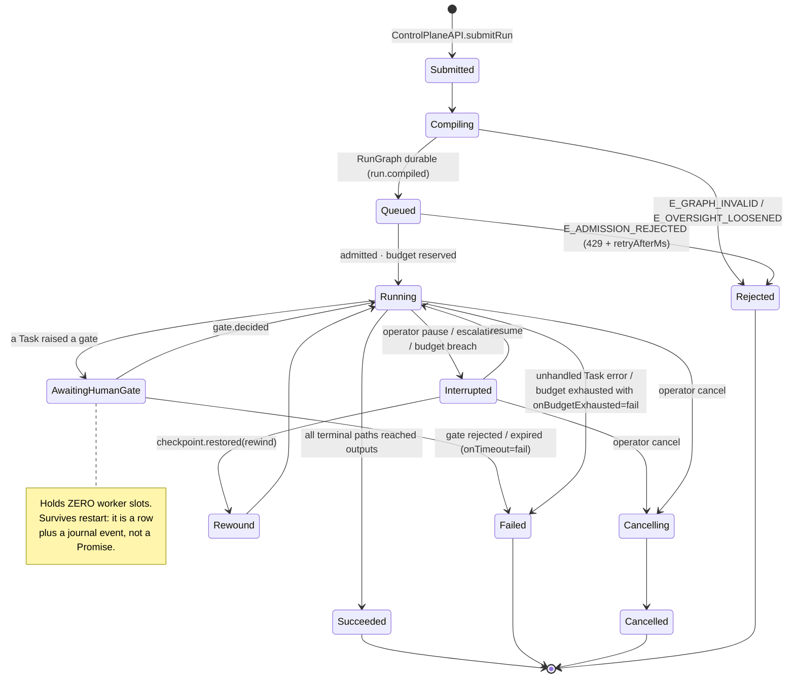
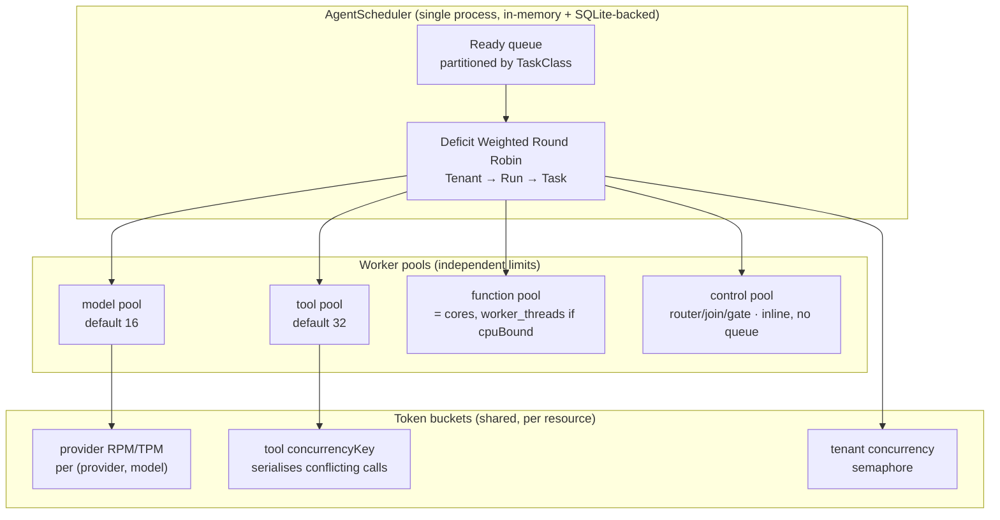
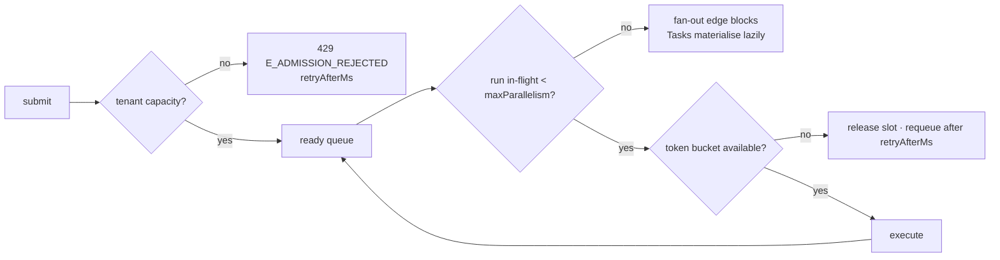
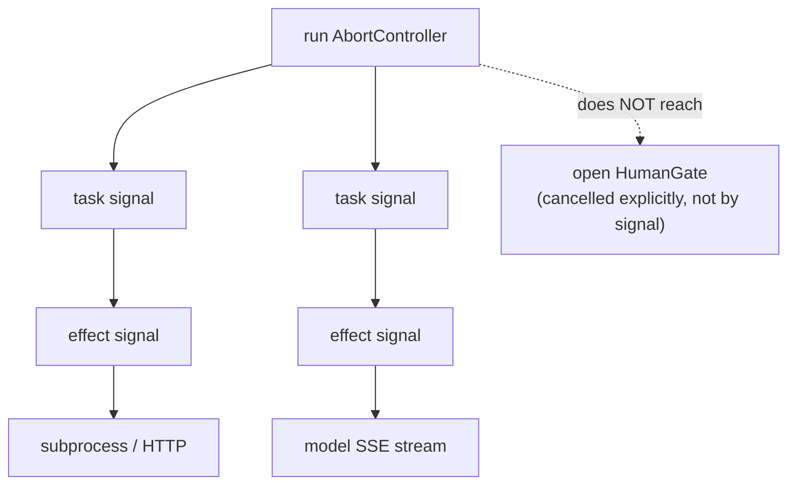
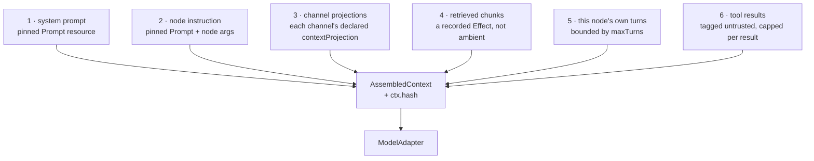
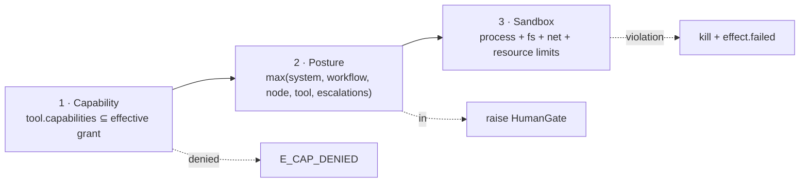

# 03 — D6 · Agent Runtime Design

---

## D6.1 — Lifecycle

### Run



**Which of those states a projection can actually report.** `RunStatus` in `run/projection.ts`
has seven members — `queued`, `running`, `awaiting_gate`, `interrupted`, `succeeded`,
`failed`, `cancelled`. The rest of the diagram is the LIFECYCLE, not the read model:
`Submitted`, `Compiling` and `Rejected` all happen before or instead of the first fold, so a
run in one of them has no projection to report; `Cancelling` and `Rewound` are transitions
that complete inside one call. **`Compensating` was in this diagram and is gone**, because
nothing executes a compensation and a state nothing can enter is not a transition that
completes quickly — it is a promise. See D5.2.

### Task

```mermaid
stateDiagram-v2
  [*] --> Pending: created by fan-out / edge activation
  Pending --> Ready: all inbound edges satisfied
  Ready --> Leased: scheduler grants a Lease (fencing token)
  Leased --> Running: executeTask begins
  Running --> AwaitingHumanGate: NodeOutcome.status = "gate"
  AwaitingHumanGate --> Running: gate.decided → re-lease
  Running --> Committing: node body returned
  Committing --> Succeeded: append task.committed (expectedSeq matched)
  Committing --> Ready: E_SEQ_CONFLICT — another attempt won; discard work
  Running --> Retrying: retryable error, attempts remain
  Retrying --> Ready: after backoff — SLOT RELEASED during the wait
  Running --> Failed: attempts exhausted / non-retryable
  Running --> Cancelled: run cancelled or join short-circuit
  Leased --> Ready: lease expired (worker died) — re-lease at attempt+1
  Pending --> Skipped: an upstream branch failed with onBranchError=skip
  Succeeded --> [*]
  Failed --> [*]
  Cancelled --> [*]
  Skipped --> [*]
```



**And which of those a `TaskRecord` can report.** `TaskState` has nine members — `pending`,
`ready`, `leased`, `awaiting_gate`, `retrying`, `succeeded`, `failed`, `skipped`,
`cancelled`. `Running` and `Committing` are phases inside one `executeTask` call and never
survive a commit, so nothing folds them; **`Compensating` is gone for the same reason as on
the Run FSM.** Two of the nine are reachable only in principle: `task.cancelled` and
`task.skipped` are declared event types that nothing appends (register **C1**), so `skipped`
and `cancelled` are states the fold can express and no run currently reaches.

### Step

A Step is not a state machine — it is an immutable journal triple. Included for
completeness because **D1** gives it a definition:

```
effect.started{key, kind, attempt}  →  effect.completed{key, resultDigest, usage}
                                    ↘  effect.failed{key, code}
                                    ↘  (nothing) ⇒ UNKNOWN OUTCOME on recovery (D5.8 step 3)
```

The three-way outcome — completed, failed, **or nothing at all** — is the whole reason
`irreversible ∧ ¬idempotent` cannot be auto-retried.

---

## D6.2 — Concurrency model

**v1: one process, cooperative async, bounded worker pools per Task class.** Not one
thread per Task, not one process per Run.



**Why pools are per class, not global.** A run that fans out to 25 model calls must not
be able to starve every tool call in the system, and a slow tool must not consume the
concurrency budget that model streaming needs. A single global pool couples unrelated
failure domains — which is the failure mode that makes parallel multi-task systems feel
uncontrollable.

`control`-class Tasks (`router`, `join`, cheap `function`) run **inline on the
committing worker** rather than being re-queued. Round-tripping a 50 µs pure function
through a durable queue costs three orders of magnitude more than the work.

### Fairness — the direct answer to "many parallel tasks is unmanageable"

```
pick():
  for tenant in DWRR(tenants, weight = tenant.tier.weight):
     if tenant.inFlight >= tenant.concurrencyLimit: continue
     for run in DWRR(tenant.runs, weight = run.priority):
        if run.inFlight >= run.maxParallelism: continue
        t = run.readyQueue.pop(byPolicy)        # policy: criticalPathFirst | fifo
        if t and buckets.tryAcquire(t): return t
```

| Property | Guarantee |
|---|---|
| Cross-tenant | A tenant cannot exceed `concurrencyLimit`, so no tenant starves another regardless of fan-out width |
| Cross-run | A 500-Task fan-out and a 1-Task run submitted a second later interleave by deficit; the small run's p99 latency stays bounded |
| Within-run | `criticalPathFirst` orders by longest remaining path (computed at compile time), so the run's makespan shrinks without extra concurrency |
| Starvation | Deficit accumulates while blocked, so a long-blocked Run eventually wins regardless of weight |

**FIFO is explicitly rejected.** Under FIFO a single wide fan-out monopolises every
worker until drained. That is precisely the production symptom this system exists to fix.

> **Implementation note — the WITHIN-run row is built; the other three are not.**
> What ships is `Scheduler.select` (`run/scheduler.ts`), which answers "which Tasks should
> this worker run now?" for **one run's projection**, orders them by critical path with a
> branch-coordinate tiebreak, and slices to a single `maxParallelism` (default 16). There
> are no per-class pools and no token buckets, and the DWRR loop above cannot live at this
> seam at all: cross-tenant and cross-run fairness need a scheduler that sees more than one
> run, which is the coordinator G3 defers. `LeasedScheduler` adds lease-awareness and
> reclaim for two workers and passes the same conformance suite, so the *seam* is exercised
> — but only by calling `select` directly. `Engine.advance` returns or finishes when the ready
> set is empty and consults the scheduler only after, so the reclaim of an EXPIRED lease — the
> one thing `InProcessScheduler` cannot do, and by construction never `ready` — is unreachable
> through the executor. The *fairness* is not exercised either. Recorded honestly as G3's second debt in `99-DOD.md`; do not
> read the guarantee table above as describing v1.

---

## D6.3 — Admission control and backpressure

Three independent levels. Each **rejects or blocks**; none buffers unboundedly — as
designed. **One of the three is built.** Read the implementation note under the diagram
before relying on any of this.

| Level | Where | Trigger | Response |
|---|---|---|---|
| **1 · Run admission** | `AgentScheduler.submit` | tenant `queueDepth` or `concurrentRuns` exceeded | `E_ADMISSION_REJECTED` + `retryAfterMs` → HTTP `429`. **Reject, never queue forever** |
| **2 · Fan-out expansion** | edge activation | ready-queue depth for the Run > `maxParallelism` | The fan-out edge **blocks** — Tasks are created lazily in branch-coordinate order as slots free. `maxWidth` bounds total width; `maxParallelism` bounds *in-flight* width |
| **3 · Resource buckets** | before an effect | provider TPM/RPM, tool `concurrencyKey`, sandbox slots | The Task is `release(lease, "requeue", afterMs)`d — it **gives its slot back** rather than sleeping while holding it |



**Lazy fan-out materialisation** is the specific fix for "a 500-way fan-out drowns the
system". The 500 Tasks exist logically (branch coordinates are computed and journaled),
but rows are created and leased in bounded waves, so memory and queue depth stay `O(maxParallelism)`
rather than `O(maxWidth)`.

> **Implementation note — level 2 is built; levels 1 and 3 are not.**
> **Level 2** is real and is the load-bearing one: `Engine.#commit` appends
> `fanout.planned` with the full planned width, then materialises only
> `min(width, maxParallelism)` branch Tasks, and the join reads the planned width instead
> of counting siblings — so a 500-way fan-out costs `O(maxParallelism)` rows in flight.
> `maxWidth` is enforced twice: at compile (GRAPH007 rejects a fanout edge without one, or
> with one over `expansion.maxFanout`) and again when the item list is sliced at runtime.
>
> **Level 1 does not exist.** There is no `AgentScheduler.submit`, no `queueDepth`, no
> `concurrentRuns`, and nothing anywhere raises `E_ADMISSION_REJECTED` — the code is
> declared in `errors.ts` and referenced by exactly one test, which checks that its class
> maps to HTTP 429. `POST /runs` admits every request it can authenticate. A tenant that
> submits ten thousand runs gets ten thousand runs.
>
> **Level 3 does not exist either.** There is no token bucket, no provider TPM/RPM
> accounting, no tool `concurrencyKey`, and no `release(lease, "requeue", afterMs)` — the
> word `requeue` appears nowhere in `src/`. A provider rate limit surfaces as
> `E_PROVIDER_RATE_LIMIT` from the adapter and is handled by `retry`, which sleeps
> *holding* the slot: precisely the behaviour this level was specified to replace.
>
> Both gaps are pure additions — neither changes an interface — but until they land, the
> only backpressure in the system is per-run width. `test/docs-drift.test.ts` pins
> `E_ADMISSION_REJECTED` in its never-raised list, so the day something throws it, this
> note fails and has to be rewritten.

**The `EventBus`'s bounded queue is NOT a fourth level, and reading it as one inverts the
invariant.** These three levels reject or block a *producer*. The bus does the opposite by
construction: it applies no back-pressure at all, so a slow subscriber loses events rather
than slowing the executor down. That is the invariant — *telemetry may drop data; the
journal may not; backpressure hits admission, never durability* — and it is why the bus is
safe to make derived.

Dropping is therefore legitimate. **Dropping silently is not**, and that is a separate
claim: under `onOverflow: "close"` the subscription is cut and its iterator throws
`SubscriberOverflowError` naming the last seq it delivered, so a subscriber can tell a cut
from an orderly end without polling a counter and can resume from the journal, which kept
what the bus dropped. `publish` still never throws — nothing here reaches back to a
producer. See **D3.9**.

---

## D6.4 — Cancellation propagation



The chain is `AbortSignal` all the way to the syscall, plus four rules:

1. **Journal before abort.** `operator.command` is appended before any signal fires, so a
   crash mid-cancel re-drives the cancel on restart.
2. **Grace then force.** Subprocesses get `SIGTERM`, then `gracePeriodMs`, then `SIGKILL`.
   HTTP effects get `AbortSignal`; a provider that ignores it is abandoned after grace and
   its stream is drained to a bounded limit to avoid a socket leak.
3. **Effect-started is durable before the call.** So a cancel racing an in-flight effect
   is recorded as `outcome: "unknown"`, never as "did not happen" (**D4 deviation 1**).
4. **Gates are cancelled by command, not by signal.** An open gate has no in-flight work
   to abort; it is closed with `gate.cancelled` and removed from every approver's queue.

---

## D6.5 — Budgets: reservation, not post-hoc checking

The naive implementation — check remaining budget before each call — is wrong under
fan-out: 25 branches each individually within budget can collectively exceed it, because
25 checks pass before the first settlement lands.

```ts
// Before an effect: reserve the WORST CASE.
const r = await policy.reserve(
  { run, node, tenant },
  adapter.priceOf(model, { inputTokens: promptTokens, outputTokens: maxOutput, ... })
);
try {
  const usage = await doTheCall();
  await policy.settle(r, adapter.priceOf(model, usage));   // release the unused remainder
} catch (e) {
  await policy.settle(r, 0);
  throw e;
}
```

Reservations are journaled (`budget.reserved` / `budget.settled`), so a crashed worker's
reservation is released by the same lease-expiry sweep that re-leases its Task — no
separate leak-reaper.

**Degradation ladder on exhaustion** (declared per graph via `onBudgetExhausted`):

| Rung | Behaviour | Journal |
|---|---|---|
| 1 · warn | at 80 % — emit `budget.warning`, surface in UI | `budget.reserved{warn:true}` |
| 2 · degrade | switch to the fallback chain's `degrade: true` entry; reduce `maxTurns` | `policy.decided{degraded:true}` |
| 3 · gate | suspend and ask a human to raise the ceiling or approve continuation | `gate.raised{kind:"budget"}` |
| 4 · fail | `E_BUDGET_EXHAUSTED`; the Run fails. **No compensation runs** — nothing executes one; see D5.2 | `budget.exhausted` |

---

## D6.6 — Agent-to-agent messaging contract

**Default: agents do not message each other. They read and write channels.** A join is
the meeting point; a channel is the medium. This keeps every inter-agent interaction
typed, journaled, replayable, and visible on the canvas.

For the cases that genuinely need conversation, a **bounded mailbox** is specified — and,
to be plain about it, **not built**. There is no `Mailbox` in `src/`, no `send`/`recv`, and
no `mailbox` edge kind — `EdgeKind` is the seven in D5, and nothing in the compiler or the
executor would give an eighth any meaning. The one trace of the name in the code is an
`effect.started{kind}` label, which is a taxonomy slot, not this feature. The code the
block below names is unbuilt with it: `DESIGNED-NOT-BUILT(E_MAILBOX_UNDECLARED)` is not in
`errors.ts`, because nothing can violate a rule about an edge kind that does not exist.
Nothing in v1 needs any of it, because the default below carries every case so far:

```ts
export interface Mailbox {
  /** `to` MUST be the peer of a declared `mailbox` edge from this node. Otherwise E_MAILBOX_UNDECLARED. */
  send(to: NodeId, msg: A2AMessage): Promise<void>;
  /** Blocks up to timeoutMs. On timeout returns null — never hangs a Task forever. */
  recv(from: NodeId, timeoutMs: number): Promise<A2AMessage | null>;
}

export interface A2AMessage {
  readonly from: TaskId;                       // branch-coordinate aware, so replies are addressable
  readonly kind: "request" | "response" | "inform";
  readonly correlationId: string;
  readonly body: unknown;                      // validated against the mailbox edge's declared schema
  readonly ttlMs: number;
}
```

| Rule | Reason |
|---|---|
| A `mailbox` edge must be declared in the GraphSpec and appears on the canvas | Otherwise the real topology is invisible and unverifiable |
| Every `recv` has a mandatory timeout, and the compiler rejects a mailbox cycle without a declared `deadlockBudgetMs` | Two agents awaiting each other is the classic multi-agent hang |
| Every message is a journaled Effect | Replay must reproduce the conversation exactly |
| Message bodies are schema-validated | An untyped blob between agents is the same untyped `${step}` splice this design replaced |

`DEFERRED-v2: free-form broadcast / blackboard chatter.` Justification: unbounded
agent-to-agent conversation makes termination unprovable and replay quadratic, and every
observed use case so far is expressible as a channel plus a join.

---

## D6.7 — Context window assembly and compaction

**Context is a deterministic function of declared inputs, not an accumulated
transcript.** This is the difference between a context you can reason about and one that
mysteriously grows.



Each section declares `priority` and `maxTokens`. The assembler runs
`countTokens` **before** the call; if over the model's window minus `reserveOutput`, the
compaction ladder runs in order:

| Rung | Action | Deterministic? |
|---|---|---|
| 1 | Drop sections whose `priority` is below the declared floor | yes |
| 2 | Apply each channel projection's `overflow: truncate_tail` | yes |
| 3 | Summarize the oldest turn window with a **compaction model call** | **yes, because it is a recorded Effect** — replay serves the same summary |
| 4 | Hard-truncate with an explicit `[...truncated N tokens...]` marker | yes |
| 5 | If still over: `E_CONTEXT_OVERFLOW` → the node's error edge | — |

Every assembly was to emit `loom.context.assemble` with `tokens.before/after`,
`sections[]`, and `compaction.rung`, so that context growth would be a *metric* rather
than a mystery. It is a mystery: `DESIGNED-NOT-BUILT(loom.context.assemble)`. Spans are
derived from journal events (**D9.1**) and `run/context.ts` appends none, so which rung
fired on which Task is not recoverable from a trace or from the journal — only the
`E_CONTEXT_OVERFLOW` at rung 5 leaves a mark, and only when the ladder fails outright.

> EAgent handled this with two separate extensions (`prune`, `compact`) reacting to a
> growing `#messages` array. Because context here is rebuilt per Task from declared
> projections, there is no accumulating array to prune — the ladder only ever fires when
> a *single node's* declared inputs are genuinely too large.

---

## D6.8 — Tool sandbox and permission model

Three orthogonal layers. All three must pass.



**Layer 1 — capabilities.** Inherited from EAgent verbatim: dotted authorities
(`fs:read`, `shell:exec`, `net:fetch`, `k8s:write`, …), trailing-`*` wildcards, deny
beats allow, every check journaled with its reasons.

**Layer 2 — posture.** See **D7**.

**Layer 3 — the sandbox (v1).**

| Control | v1 implementation | v2 |
|---|---|---|
| Process isolation | child process, no shell, `argv` array (never string concatenation) | gVisor / Firecracker per call |
| Filesystem | `cwd` jail to a per-Run scratch dir; read allowlist from capabilities; **no access to the Loom data dir** | overlayfs + mount namespace |
| Network | egress through a local proxy with a per-tool domain allowlist; default deny | NetworkPolicy + egress gateway |
| Resources | `RLIMIT_AS`, `RLIMIT_CPU`, `RLIMIT_NOFILE`, wall-clock timeout, output byte cap | cgroups v2 |
| Env | explicit allowlist; secrets injected as `SecretValue` at the boundary only | CSI-mounted, never in env |
| Syscalls | `DEFERRED-v2` — seccomp/Landlock | seccomp-bpf profile per tool |

> **Honest scope statement, inherited from EAgent's `SECURITY.md`:** this enforces
> *authority*, and confines *processes*. It does not sandbox arbitrary in-process
> JavaScript. A `function` node's code is trusted code from a pinned, reviewed Resource —
> it is not a place to run untrusted input.

### Prompt-injection containment

Tool output is hostile input. Three concrete mechanisms, none of which is "tell the model
to be careful":

1. **Provenance tagging.** Every tool result enters context inside a delimited block
   annotated `provenance: untrusted, source: <tool>@<version>`. The system prompt states
   once that untrusted blocks are data, never instructions.
2. **Structural containment.** A turn's tool allowlist and capability set are computed
   from the *node spec* before the turn starts. Nothing in the model's context can widen
   them. This is the load-bearing mechanism: an injection can make a model *ask* for
   `k8s.delete`, and the request is rejected before dispatch because the node never
   declared it.
3. **Taint propagation.** A channel carries taint when an external producer wrote it — a
   `tool` node, an `agent` that had tools, or a `subgraph` (whose child runs where the
   parent cannot see) — **or** when the node that wrote it observed a tainted channel. That
   second clause is propagation proper; with only the first, any `function` or tool-less
   `agent` laundered the taint away by copying the value.

   A node that observes a tainted channel **and** performs an action classified
   `irreversible` or `externally_visible` is held at `in`. Not "one level up": for those two
   classes the class default is already `in`, so a relative bump is the identity and changes
   no answer. What taint actually does is raise the **hard floor** under a human ceiling, so
   an operator's earlier de-escalation stops covering that action. See D7.6.

   "Observes" is not `node.reads`: a `tool.args` template resolves against the whole channel
   scope, so the read set includes every channel a template names. Inside an agent turn the
   granularity is the turn, not the channel — once any tool has returned, later hard-to-undo
   calls in that task are tainted, because the model's arguments are downstream of whatever
   came back.

   Taint is monotonic and is never cleared; there is no declassification operator. Tightening
   is automatic and the asymmetry rule (**D7**) guarantees nothing can undo it — the remedy is
   approving the action, per action.

---

## D6.9 — Hook and plugin extension points

The extension surface, carried over from EAgent's hook bus (`src/kernel/events.ts`) and
re-pointed at graph lifecycle stages. **Observers** cannot change anything; **filters**
thread a value and may veto.

```ts
export interface Hooks {
  // ── filters (intervene) — run in registration order, stop on a terminal value ──
  prePlan:   Filter<{ spec: GraphSpec;        ctx: RunCtx  }, GraphSpec>;
  preNode:   Filter<{ node: NodeSpec; state: StateView; ctx: TaskCtx }, NodeDecision>;
  preModel:  Filter<{ request: ModelRequest;  ctx: TaskCtx }, ModelRequest>;
  postModel: Filter<{ message: Message; usage: Usage; ctx: TaskCtx }, Message>;
  preTool:   Filter<{ call: ToolCall;         ctx: TaskCtx }, ToolDecision>;
  postTool:  Filter<{ result: ToolResult;     ctx: TaskCtx }, ToolResult>;
  onError:   Filter<{ error: LoomError; attempt: number; ctx: TaskCtx }, ErrorDecision>;
  onGate:    Filter<{ gate: GateRequest;      ctx: TaskCtx }, GateRequest>;

  // ── observers (cannot change anything) ──
  onComplete: Observer<{ run: RunProjection }>;
}

export type Filter<In, Out> = (input: In) => Promise<Out> | Out;
export type Observer<In>    = (input: In) => void;

export interface NodeDecision  { skip: boolean; reason?: string; overrideWrites?: ChannelWrites }
export interface ToolDecision  { block: boolean; reason?: string; args: unknown }   // args may be rewritten
export interface ErrorDecision { retry: boolean; afterMs?: number; downshiftModel?: string; take?: string[] }
```

| Rule | Reason |
|---|---|
| A hook is a **pinned Resource**, registered per graph, not ambient global code | Otherwise a hook change silently alters in-flight runs, violating the pinning rule |
| Hooks run inside the Task's budget and `AbortSignal` | A slow hook must degrade its own node, not the scheduler |
| Every hook invocation that changes a value journals `hook.applied{ref, changed:true}` | A silently-rewriting hook is indistinguishable from a bug |
| `preTool` **cannot widen** capabilities or lower posture — only narrow or block | The asymmetry rule applies to extensions too |
| A throwing observer is logged and skipped; a throwing filter fails its Task | EAgent's split, kept: observers are best-effort, filters are load-bearing |
