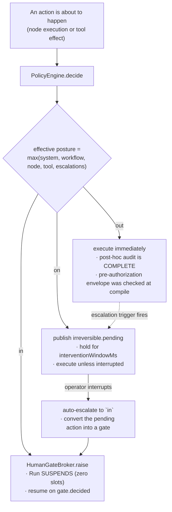
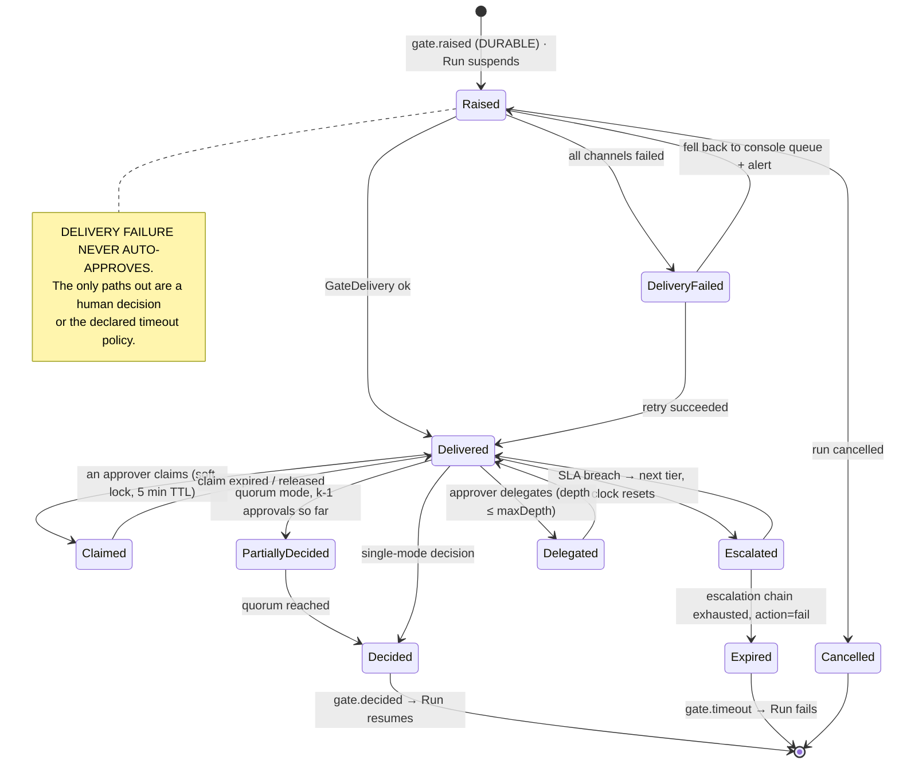
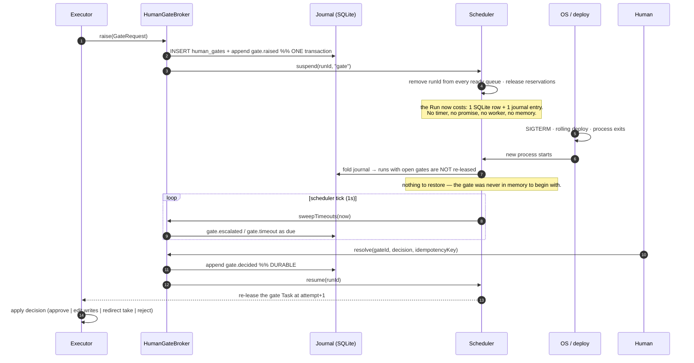
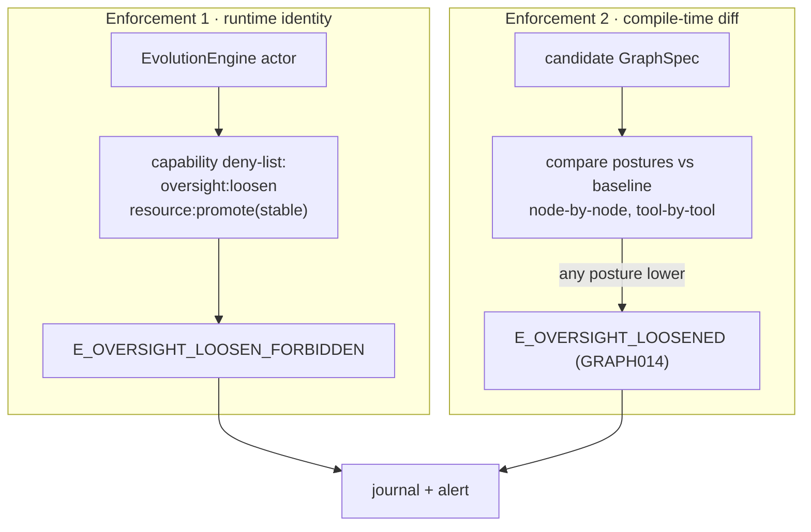

# 04 — D7 · Human Oversight Model

The requirement is not "add an approval feature". It is: **the same workflow must run
under all three oversight postures by configuration alone, with defined runtime movement
between them.** That forces one mechanism, not three features.

---

## D7.1 — One mechanism, three postures



The three postures are **three branches of one decision**, differing only in whether the
executor proceeds, holds briefly, or suspends durably. Every one of them journals the
same `policy.decided` event with a different `effect`. That is why switching posture is a
config change and never a code change.

| Posture | Executor behaviour | Worker slots held | Survives restart | Human required |
|---|---|---|---|---|
| `out` | proceed | 1 (executing) | n/a | no — but audit is complete and demotion triggers are armed |
| `on` | hold `interventionWindowMs`, publish, proceed | 1 (holding) | the hold does not, but the *action record* does | no, unless one intervenes |
| `in` | suspend the Run, release the slot, raise a gate | **0** | **yes — by construction** | yes |

---

## D7.2 — Oversight policy schema

Declared as a Resource (`oversight/<name>@<version>`) and referenced from graphs, nodes,
and tools — so a policy is versioned, pinned, and auditable like anything else.

```yaml
apiVersion: loom.dev/v1
kind: OversightPolicy
metadata: { name: sre-prod-change, project: sre, version: 4 }

posture: in                       # the floor this policy asserts; merged by max (D11)

# ── which actions this policy governs ──
appliesTo:
  irreversibility: [irreversible, externally_visible]
  capabilities: ["k8s:write", "payment:*"]
  dataClassification: [pii]

# ── who decides ──
approval:
  mode: quorum                    # single | quorum | all | tiered
  k: 2                            # quorum only
  approvers:
    - { kind: role,  id: "sre-oncall" }
    - { kind: group, id: "sre-leads" }
  separationOfDuties: true        # an approver may not be the run's initiator
  delegation: { allowed: true, maxDepth: 2, mustStayInGroup: true }

# ── how long, and what happens if nobody answers ──
sla:
  respondWithinMs: 900000         # 15 min — drives the queue's SLA colouring
  onTimeout: escalate             # escalate | default_action | fail   (fail is the default)
  escalation:
    - { afterMs: 900000,  to: { kind: role, id: "sre-manager" } }
    - { afterMs: 2700000, to: { kind: role, id: "director" } }
    - { afterMs: 5400000, action: fail }
  defaultAction: null             # COMPILE ERROR (GRAPH014) if non-null and irreversibility ≥ irreversible

# ── what the human is shown ──
payload:
  summary:  "prompt/gate-summary-k8s@stable"     # rendered server-side, deterministic
  render:   [diff, command, blast_radius, cost_to_date, evidence]
  redact:   [pii]                                # applied BEFORE delivery, not in the UI
  allowEdit: ["plan"]                            # which channels an `edit` decision may write

# ── delivery ──
delivery:
  channels: [console, slack]
  slack: { channel: "#sre-approvals", threadByRunId: true }
  reminders: [{ afterMs: 300000 }, { afterMs: 600000 }]

# ── saturation controls (D7.9) ──
batching:
  enabled: true
  key: "node.id + plan.namespace"
  windowMs: 60000
  maxBatch: 20
trust:
  enabled: false                  # OFF by default — enabling it is a LOOSENING (D7.7)
```

---

## D7.3 — Gate lifecycle



---

## D7.4 — Durable suspension and resume



**The design property that makes this work:** a suspended Run holds *no runtime
resources*, so "how many gates can be open at once" is a database question, not a
concurrency question. Ten thousand open gates cost ten thousand rows.

> This is the single largest departure from EAgent, where an approval was a `Promise`
> held by a running turn (`UI.confirm`, `src/kernel/types.ts:300`). That promise could not
> survive a restart, could not be routed anywhere, and pinned the agent's memory for its
> whole lifetime.

---

## D7.5 — Intervention command set and propagation

| Command | Reaches in-flight work how | Effect on committed work | Journaled | Auto-escalates posture |
|---|---|---|---|---|
| `pause{drain:true}` | stops *admitting*; running Tasks finish | none | `operator.command` | → `on` |
| `pause{drain:false}` | aborts running Tasks at their next effect boundary | none | `operator.command` | → `on` |
| `resume` | re-admits | none | `operator.command` | no change (a resume is not a loosening) |
| `steer{message}` | injected into the target agent's next model call via `AgentInstance.steer` | none | `operator.command` + `state.reduced{by:"human"}` | → `on` |
| `redirect{take}` | forces the edge subset on the named Task; **must be a subset of that node's declared outgoing edges** | none | `operator.command` | → `in` |
| `rollback{to, rewind}` | aborts everything after the checkpoint | **refused** if a committed irreversible effect lies after the target and no compensation is declared (`E_RESTORE_ILLEGAL`) | `checkpoint.restored` | → `in` |
| `rollback{to, fork}` | leaves the original Run untouched | none — the fork re-executes | `checkpoint.restored` | → `in` |
| `cancel{grace, compensate}` | `AbortSignal` chain, then compensation in reverse commit order | compensations run | `run.cancelled{clean, unknownEffects[]}` | n/a |
| `kill` | immediate `SIGKILL`; **no grace, no compensation** | left as-is; recorded as dirty | `run.cancelled{clean:false, forced:true}` + alert | n/a |
| `escalate{scope,to}` | applies to future decisions in scope; already-running effects are unaffected | none | `policy.escalated` | explicit |

**Every intervention tightens.** Note the right-hand column: there is no operator command
that lowers a posture. Loosening exists only as `PolicyEngine.deescalate`, which is a
different verb with a different authority (**D7.7**).

---

## D7.6 — Irreversibility classification → default posture

The classification is declared on the **tool** (its manifest), inherited by any node that
calls it, and combined with the data classification of the channels involved.

| Class | Definition | Examples | Default posture | Auto-retry allowed | Compensation required |
|---|---|---|---|---|---|
| `read_only` | No state outside Loom changes | `obs.query`, `kb.search`, `fs.read`, `k8s.describe` | `out` | yes | no |
| `reversible_write` | Mutates state Loom can undo via a declared compensation | `fs.write` (scratch), `git.commit` (local), `k8s.scale` | `on` | if `idempotent` | **yes** — `GRAPH012` |
| `irreversible` | Cannot be undone by any declared action | `payment.charge`, `db.drop`, `k8s.delete`, `email.send` | **`in`** | **no** | n/a |
| `externally_visible` | Third parties observe it, even if technically revocable | `chat.post`, `pr.comment`, `tweet`, customer email | **`in`** | no | n/a — a retraction is a new visible action |

**Composition rules:**

```
posture_default(action) = max(
    class_default(tool.irreversibility),
    classification_floor(channels read ∪ written),   # pii ⇒ at least `on`; secret_ref ⇒ `in`
    taint_bump(if reads a tainted channel and class ≥ irreversible)   # D6.8 §3
)
effective(action) = max(posture_default, system, tenant, workflow, node, tool, runtime escalations)
```

Because every term enters through `max`, **no single declaration can weaken the result.**
That is the asymmetry rule expressed as arithmetic rather than as a policy people must
remember.

---

## D7.7 — Runtime escalation and de-escalation

### Escalation decision table (automatic — tightening)

| # | Trigger | Detected by | From → To | Scope | Journal | Who may undo |
|---|---|---|---|---|---|---|
| E1 | Evaluator `verdict.score < threshold` | `evaluator` node | `out → on` | run | `policy.escalated{rule:"low_confidence"}` | human with `oversight:loosen` |
| E2 | Budget ≥ 80 % consumed | `PolicyEngine.reserve` | `out → on` | run | `budget.warning` | human |
| E3 | Budget exhausted, `onBudgetExhausted: gate` | `PolicyEngine` | `* → in` | run | `budget.exhausted` | human |
| E4 | ≥ 3 consecutive tool failures on one node | executor counter | `out → on` | node | `policy.escalated{rule:"repeated_failure"}` | human |
| E5 | **Novel tool sequence** — the (node, ordered tool n-gram) was never seen in the last `N` successful runs of this graph version | `PolicyEngine` against the trajectory index | `out → on` | node | `policy.escalated{rule:"novel_sequence", ngram}` | human |
| E6 | Policy violation attempt (capability denied, sandbox kill, egress block) | policy / sandbox | `* → in` | run | `policy.escalated{rule:"violation"}` | human |
| E7 | Anomaly: run cost, token, or wall-clock > p99 of the last 100 runs of this graph version | scheduler metrics | `out → on` | run | `policy.escalated{rule:"anomaly", metric, z}` | human |
| E8 | Tainted channel feeding an `irreversible` action | taint propagation (**D6.8**) | one level up | node | `policy.escalated{rule:"taint"}` | human |
| E9 | Operator interrupt during an `on` hold | `OversightController` | `on → in` | run | `policy.escalated{rule:"operator"}` | the same operator, explicitly |
| E10 | Graph mutation introduces an `irreversible` node | `compileMutation` | `* → in` **for that node** | node | `policy.escalated{rule:"mutation"}` | human |
| E11 | Model returned `refusal` or `content_filter` | `ModelAdapter` | `out → on` | run | `policy.escalated{rule:"model_refusal"}` | human |

### De-escalation table (manual only — loosening)

| # | Path | Required authority | Additional requirement | Journal |
|---|---|---|---|---|
| D1 | Operator lowers posture for one run | `oversight:loosen` **and** run-scoped RBAC | free-text justification, non-empty | `policy.deescalated{scope:"run", justification, actor}` |
| D2 | Operator lowers a workflow's declared floor | `oversight:loosen` + `workflow:admin` | a change to the versioned OversightPolicy Resource → normal promotion pipeline | `resource.promoted` + `policy.deescalated` |
| D3 | Trust tier auto-approves a class | `oversight:loosen`, **enabled once by a human**, bounded scope, revocable | ≥ 50 consecutive approvals, 0 rejects, 0 edits, within one (tenant, tool, node) | `policy.deescalated{scope:"trust_tier"}` + 5 % sampled post-hoc review |
| D4 | Evolution engine lowers anything | **impossible** | — | — |

### The asymmetry rule — two independent enforcement points



Two points, because either alone is bypassable: a deny-list alone fails if a candidate is
promoted by a human who did not read the diff; a compile check alone fails if the engine
edits the policy Resource instead of the graph. Together, a loosening requires a human
who holds `oversight:loosen` **and** a graph whose posture diff is non-negative.

---

## D7.8 — Audit record schema

Human decisions and agent actions land in the same journal, with distinct `actor`
shapes, so a single ordered read reconstructs "who did what, when, and why".

```ts
export interface AuditRecord {
  runId: RunId; seq: Seq; ts: number;
  kind: "gate_decision" | "operator_command" | "policy_change" | "resource_promotion" | "agent_action";

  actor:
    | { kind: "human"; subject: string; displayName: string; via: "console"|"slack"|"api"|"cli";
        onBehalfOf?: string;               // delegation chain head
        mfa: boolean; ip?: string; sessionId: string }
    | { kind: "agent"; profile: ResourceRef; taskId: TaskId; model: string }
    | { kind: "system"; component: string; rule: string }
    | { kind: "evolution"; engineVersion: string; candidate: ResourceRef };

  subject: { gateId?: GateId; taskId?: TaskId; nodeId?: NodeId; resource?: ResourceRef; scope?: PolicyScope };

  decision?: GateDecision;                 // approve | reject | edit{writes} | redirect{take}
  justification?: string;                  // MANDATORY for reject, edit, redirect, and every de-escalation
  priorState: { posture: Posture; stateHash: string };
  newState:   { posture: Posture; stateHash: string };

  // Why this was even asked — the exact rules that fired.
  policyReasons: readonly string[];
  latencyMs?: number;                      // raised → decided; feeds SLA dashboards and D10 scoring
  delegationChain?: readonly string[];
  quorum?: { required: number; received: number; approvers: readonly string[] };
  classification: "internal" | "pii";
  contentDigest: string;                   // sha256 of the payload SHOWN to the human
}
```

`contentDigest` is the non-obvious field: it pins **what the approver actually saw**. A
later "the approver was shown the wrong diff" dispute is otherwise unanswerable, and gate
payloads are rendered server-side precisely so this digest is meaningful.

---

## D7.9 — Approval-queue saturation

In-the-loop is only usable if the queue is survivable. Five mechanisms, applied in this
order:

| # | Mechanism | Concretely | Reduces load by | Risk it introduces |
|---|---|---|---|---|
| 1 | **Class-based auto-approve** | `read_only` actions never gate. This is not a loosening — it is the default posture from **D7.6** | ~70 % of raw candidates | none; read-only cannot harm |
| 2 | **Batching** | Gates matching `batching.key` within `windowMs` merge into one gate showing a manifest of N items; one decision applies to all. `maxBatch` caps the blast radius of a single click | 5–20× on wide fan-outs | a careless bulk approve — mitigated by rendering per-item diffs and requiring scroll-to-end for `maxBatch > 5` |
| 3 | **Deduplication** | Identical `contentDigest` within the window collapses; the second occurrence inherits the first decision and journals `gate.deduped` | high on retry storms | none — identical payload, identical decision |
| 4 | **Trust tiers** | Per `(tenant, tool, node)`: ≥ 50 consecutive approvals with 0 rejects and 0 edits ⇒ auto-approve within that exact scope, with **5 % random sampling still gated** and any single reject resetting the counter to 0 | the steady-state tail | drift — mitigated by sampling, by scope narrowness, and by the fact that enabling tiers at all is a human act (D3 in **D7.7**) |
| 5 | **Priority + SLA ordering** | The queue sorts by `(sla_remaining, blast_radius, cost_at_risk)`, not arrival. A run burning \$40/min while suspended outranks a cosmetic change | perceived load | starvation of low-priority gates — bounded by an ageing term |

**Explicitly not used as a mitigation:** raising `onTimeout` to `default_action: approve`.
`GRAPH014` rejects it for any action classified `irreversible` or `externally_visible`.
Timeout-approval converts an overloaded queue into an *invisible* out-of-the-loop system,
which is the worst possible failure mode — it looks supervised and is not.

---

## D7.10 — The same workflow under all three postures

Identical `GraphSpec`. The only difference is `policy.posture` and the oversight policy
resolved for `apply_remediation`. No node is added or removed; no code changes.

```mermaid
graph TB
  subgraph OUT["posture: out — fully autonomous"]
    A1["plan_remediation"] --> A2["apply_remediation<br/><i>executes immediately</i>"] --> A3["verify"] --> A4["write_report"]
    A2 -.->|"pre-authorization envelope checked at COMPILE:<br/>cost ≤ 12 USD · blast ≤ 1 ns · tools ⊆ allowlist<br/>+ demotion triggers E1–E11 armed"| A2
  end

  subgraph ON["posture: on — supervised"]
    B1["plan_remediation"] --> B2["apply_remediation<br/><b>hold 5 s · irreversible.pending</b>"] --> B3["verify"] --> B4["write_report"]
    B2 -.->|"supervisor may pause / redirect / rollback<br/>within the window; doing so escalates to in"| BX["Interrupted"]
  end

  subgraph IN["posture: in — blocking gate"]
    C1["plan_remediation"] --> C2["approve_remediation<br/><b>Run SUSPENDS · 0 slots</b>"] --> C3["apply_remediation"] --> C4["verify"] --> C5["write_report"]
    C2 -.->|"approve · edit · reject · redirect<br/>quorum 2 · SLA 15 min · escalate ×2"| C2
  end
```



Note what stays constant across all three: the journal shape, the span taxonomy, the
audit record, the checkpoint before `apply_remediation`, and the compensation edge. Only
the `PolicyDecision.effect` differs — `allow`, `allow`-after-hold, or `gate`.

### Pre-authorization envelope (required for `out`)

A node may run out-of-the-loop only if **all** of these are declared and checked at
compile time. A missing field is `GRAPH014`, not a default.

```yaml
preAuthorization:
  costCeilingUsd: 12.0
  blastRadius: { namespaces: ["ns-staging"], maxResources: 5, maxRecords: 0 }
  toolScope: ["k8s.scale", "k8s.describe", "obs.query_window"]   # closed set
  dataClassification: [internal]                                  # no pii, no secrets
  allowedSideEffects: [reversible_write]                          # NOT irreversible
  auditCompleteness: full                                         # journal sampling forbidden for this run
  demotionTriggers: [E1, E2, E4, E5, E6, E7, E8, E11]             # which of D7.7 are armed
```

`auditCompleteness: full` is the one that makes out-of-the-loop defensible: telemetry may
be sampled, but the **journal never is**, so a fully autonomous run is always
reconstructable after the fact.
