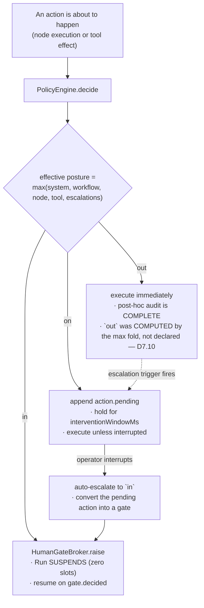
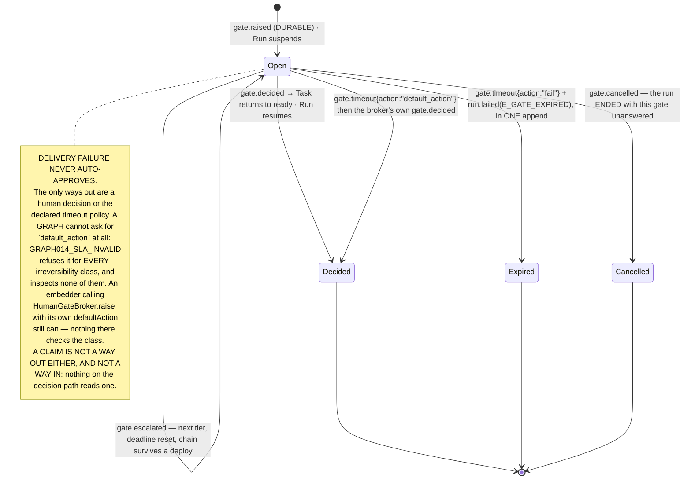
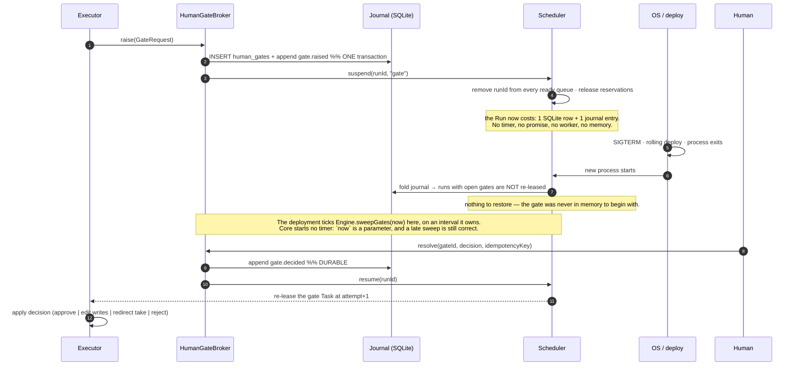
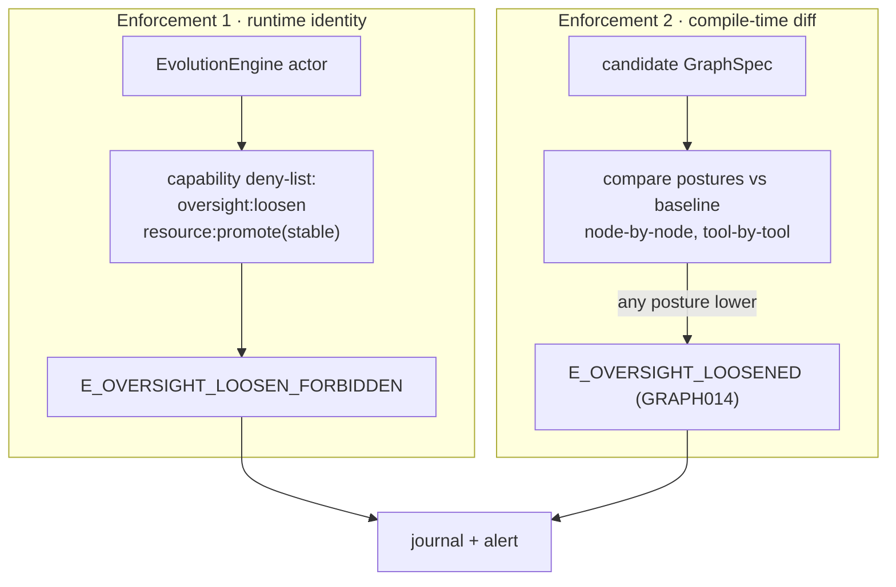

# 04 — D7 · Human Oversight Model

The requirement is not "add an approval feature". It is: **the same workflow must run
under all three oversight postures by configuration alone, with defined runtime movement
between them.** That forces one mechanism, not three features.

---

## D7.1 — One mechanism, three postures



The three postures are **three branches of one decision**, differing only in whether the
executor proceeds, holds briefly, or suspends durably. Every one of them journals the
same `policy.decided` event with a different `effect`. That is why switching posture is a
config change and never a code change.

| Posture | Executor behaviour | Worker slots held | Survives restart | Human required |
|---|---|---|---|---|
| `out` | proceed | 1 (executing) | n/a | no — but audit is complete and the E1–E10 escalation triggers are armed |
| `on` | hold `interventionWindowMs`, publish, proceed | 1 (holding) | the hold does not, but the *action record* does | no, unless one intervenes |
| `in` | suspend the Run, release the slot, raise a gate | **0** | **yes — by construction** | yes |

---

## D7.2 — Oversight policy schema

Declared as a Resource (`oversight/<name>@<version>`) and referenced from graphs, nodes,
and tools — so a policy is versioned, pinned, and auditable like anything else.

```yaml
apiVersion: loom.dev/v1
kind: OversightPolicy
metadata: { name: sre-prod-change, project: sre, version: 4 }

posture: in                       # the floor this policy asserts; merged by max (D11)

# ── which actions this policy governs ──
appliesTo:
  irreversibility: [irreversible, externally_visible]
  capabilities: ["k8s:write", "payment:*"]
  dataClassification: [pii]

# ── who decides ──
approval:
  mode: quorum                    # single | quorum | all | tiered
  k: 2                            # quorum only
  approvers:
    - { kind: role,  id: "sre-oncall" }
    - { kind: group, id: "sre-leads" }
  separationOfDuties: true        # an approver may not be the run's initiator — BUILT
  delegation: { allowed: true, maxDepth: 2, mustStayInGroup: true }

# ── how long, and what happens if nobody answers ──
sla:
  respondWithinMs: 900000         # 15 min — drives the queue's SLA colouring
  onTimeout: escalate             # escalate | default_action | fail   (fail is the default)
  escalation:
    - { afterMs: 900000,  to: { kind: role, id: "sre-manager" } }
    - { afterMs: 2700000, to: { kind: role, id: "director" } }
    - { afterMs: 5400000, action: fail }
  defaultAction: null             # NOT A FIELD of the shipped GateSlaSpec, and onTimeout:
                                  # default_action is a GRAPH014_SLA_INVALID error for EVERY
                                  # class — checkSla inspects none of them. See the deviation

# ── what the human is shown ──
payload:
  summary:  "prompt/gate-summary-k8s@stable"     # rendered server-side, deterministic
  render:   [diff, command, blast_radius, cost_to_date, evidence]
  redact:   [pii]                                # applied BEFORE delivery, not in the UI
  allowEdit: ["plan"]                            # which channels an `edit` decision may write

# ── delivery ──
delivery:
  channels: [console, slack]
  slack: { channel: "#sre-approvals", threadByRunId: true }
  reminders: [{ afterMs: 300000 }, { afterMs: 600000 }]

# ── saturation controls (D7.9) ──
batching:
  enabled: true
  key: "node.id + plan.namespace"
  windowMs: 60000
  maxBatch: 20
trust:
  enabled: false                  # OFF by default — enabling it is a LOOSENING (D7.7)
```

> **Implementation deviation — `approval`, `sla` and `delivery` ship INLINE on the node,
> and most of `approval` is a compile error.** What is built is `HumanGateNode.approval`,
> `HumanGateNode.sla` and `HumanGateNode.delivery` in `graph/spec.ts`, read by the executor
> when it raises the gate and carried straight into `GateRequest`. None of them is resolved
> from the `oversight` Resource this section declares, and they are smaller than this block
> in the ways listed below.
>
> **It is on the node because nothing in `src/` can read a Resource's *content*.**
> `ResourceResolver.resolve` returns `{ref, digest, channel}` — a pin, not a document — so
> `humanGate.ref` proves a policy exists and pins its bytes without ever opening them. (The
> one content hook is `subgraph(ref)`, which returns a nested `GraphSpec`; there is no
> equivalent for `oversight`.) The field names here are used verbatim, so moving the block
> onto the Resource later is a relocation rather than a redesign.
>
> **`approvers` is `readonly string[]`, not `{kind, id}`.** They are opaque subjects
> compared exactly against a human `Actor.subject`. Roles and groups need an identity
> resolver Loom does not have, and a role that expands to nobody is an approvers list that
> authorizes *everybody* — "named nobody" is the permissive case. `GRAPH014_APPROVER_INVALID`
> refuses an entry that is not a subject string. Widening to a union when the resolver
> exists is additive.
>
> **`separationOfDuties` IS BUILT, and it arrived exactly the way this paragraph said support
> would: by deleting a check.** The rule is resolved when the gate is RAISED — from
> `run.submitted.submittedBy`, the principal A4 journals — and written to
> `gate.raised.excludedApprovers`, so `HumanGateBroker.#authorize` keeps reading the fold of
> one event and nothing else. That is what makes it survive a restart, replay unchanged, and
> stay unavailable to a process that did not raise the gate.
>
> It NARROWS `approvers` and does not stand in for one: declared with no approvers it would
> read as "everybody except one person", so that combination is `GRAPH014_APPROVAL_INCOMPLETE`
> — a check *added* in the same change that deleted one. And a run that cannot satisfy the
> rule FAILS at the gate rather than raising one that bars nobody: no principal recorded, a
> principal that is a service or a perimeter marker rather than a person, or a gate whose only
> named approver is the initiator. The refusal is decided where the node OUTCOME is
> constructed rather than thrown from `raise`, because `#commit` runs outside the wave's catch
> and a throw there leaves the task leased forever — a hang wearing a policy's clothes.
>
> **The rest of the block is still refused at compile time, not silently ignored.** `mode`
> other than `single`, any `k`, and `delegation.allowed: true` are
> `GRAPH014_APPROVAL_UNSUPPORTED` errors (`graph/validate.ts`). Accepting the block and
> enforcing only the implemented part would produce a graph that reads as "two of the SRE
> leads must agree" and behaves as "any one of them", with nothing anywhere saying so —
> D7.9's closing paragraph names that the worst available failure mode, because it *looks*
> supervised and is not, so nobody goes looking.
>
> **`sla` ships without `escalation` and without `defaultAction`, and both absences are
> decisions.** `escalation` lives on `delivery`, because escalating means choosing new
> recipients and new channels — `DeliverySpec.escalation` is where the runtime reads it and
> a second home here would be a second thing to keep in step. `defaultAction` has no field
> at all, and `HumanGateNode.sla.onTimeout` is therefore `escalate | fail` rather than
> `GateRequest`'s three: a default action is a decision the author pre-authorizes, safe only
> once a compiler has proved the action's irreversibility class permits one, and that proof
> does not exist for a graph-declared gate. An embedder driving `HumanGateBroker.raise`
> still supplies one; a graph cannot. `GRAPH014_SLA_INVALID` refuses the field for a graph
> that arrived as JSON.
>
> **`delivery` is `run/delivery.ts`'s own `DeliverySpec`, verbatim** — `{channels,
> recipients, redact, redactAs, escalation}` — rather than a restatement, so what the
> compiler checks and what `GateDispatcher` reads are one type. `graph/spec.ts` imports it
> `import type`, which `verbatimModuleSyntax` erases, so `graph/` still depends on nothing
> under `run/` at run time. What `GRAPH014_DELIVERY_INVALID` checks and what it deliberately
> does not — channel names, `afterMs` monotonicity — is in **02-EXECUTION-GRAPH.md** beside
> the rule.
>
> **`reminders` SHIPS, AND IT SHIPS ON `sla` RATHER THAN ON `delivery` — the same rule that
> moved `escalation` the other way, applied in the other direction.** The rule is *what does
> this field decide?* Escalation decides new recipients and new channels, so it lives beside
> them on `delivery` even though this schema draws it under `sla`; a reminder decides
> neither — same tier, same recipients, same channels — so all it carries is an INSTANT, and
> instants are what the `sla` block is. The two blocks are therefore each drawn here holding
> the other's field, which is worth saying out loud rather than leaving as a discrepancy a
> reader has to resolve twice.
>
> Putting it there buys a bound for free: `GateSlaSpec.reminders` cannot exist without
> `respondWithinMs`, so a gate with no clock gets no nudges, and `checkSla` requires every
> instant to fall strictly inside that SLA. **What a reminder is, stated as what it must not
> do:** it does not reset the SLA, it does not burn or reset a tier, it decides nothing, and
> it is not reported as a deadline firing (`SweepReport.fired` counts timeouts, not nudges).
> It is journaled as `gate.reminded{gateId, tier, nth}` — an un-journaled nudge cannot be
> audited, and *why did nobody answer?* is the question the delivery journal exists for —
> and the fold counts those ROWS into `GateRecord.remindersSent`. That counter is the whole
> mechanism: it is what makes the write change the condition that triggered it, so a nudge
> is one event with no companion in its append, where a marker that folded to nothing would
> fire on every tick forever. **Three bounds stop a storm** and all three are needed: the
> schedule is a finite list consumed in order (at most `reminders.length` nudges per gate,
> ever), each firing advances the journaled counter, and every instant must be inside the
> SLA. **For a BATCH it is ONE nudge, not N** — the same answer D7.9 row 2 gives at tier 0
> and at every escalation tier, keyed on "has a sibling already sent this one?" and sound
> only because the schedule is part of the batch's journaled `deliveryDigest`, so a
> suppressed nudge is one that would have said the same thing to the same people at the same
> instant. The schedule itself stays in `EphemeralGate`, like the route: a process that did
> not raise the gate sends no nudges until `rehydrate`, and it can never re-send one the log
> says went out.
>
> **A `recipients` entry may carry more than `{kind, id}`, and the dispatcher passes it on.**
> `checkRecipient` validates those two fields and accepts the rest, which makes vendor
> routing metadata — a Slack channel id, a locale — a legal declaration; a `Recipient` is
> *resolved by the channel*, so the channel is the one party that could use it.
> `GateDispatcher.deliver` rebuilt each entry as `{kind, id}` and silently deleted the rest,
> which is the compiler and the runtime disagreeing about what a graph may say. Resolved
> toward the compiler: closing the shape instead would refuse a portable graph in the
> deployment whose channel needs the field, which is the argument `checkDelivery` already
> makes for not checking channel names.
>
> **Reverses when:** a resolver seam exists that hands a validated `OversightPolicy`
> document to the compiler and the broker. Then these blocks move onto the Resource, the
> unsupported-mode checks are deleted as each mode lands, and `approvers` widens to
> `subject | role | group` — in that order, never the last one first.

---

## D7.3 — Gate lifecycle

`GateRecord.state` in `run/projection.ts` has **four** values, and this is the machine
they make. Delivery is *not* a state: `gate.delivered` and `gate.delivery_failed` are
journaled beside an open gate and change nothing about it, which is the mechanical form of
"delivery failure never auto-approves". **`Claimed` is not a state either, and that is the
whole of how it was finally built** — see below the diagram.



### `Claimed` — built, and built as a FIELD rather than as a state

`HumanGateBroker.claim(log, {gateId, actor})` → `gate.claimed{gateId, until}` with the
claiming human as the event's actor → `GateRecord.claimedBy` / `claimedUntil`. Five minutes
(`CLAIM_TTL_MS`), as this section always specified. It is `run/gates.ts`'s `claim`,
`claimHolder`, `liveClaim`; `test/run/gate-claim.test.ts` is the whole of what it promises.

**It is a self-transition and not a fifth state, because a claim GRANTS NOTHING AND BLOCKS
NOTHING.** A gate somebody is looking at is exactly as open, as answerable and as due as one
nobody has touched, so a state that said otherwise would be a state no reader should branch
on. Every rule follows from that one sentence:

- **it is not authorization.** `resolve`, `resolveBatch` and `#fireTimeout` read no claim at
  all. A legitimate approver decides a claimed gate as fast as an unclaimed one; the SLA
  fires on the same instant; and one credential claiming every gate in a queue stalls
  nothing, because there is no reader to stall. A soft lock that hardens is a way for one
  person to hold up an urgent approval, and the way to keep it soft is for the decision path
  to have no branch on it;
- **the claim door is deliberately NARROWER than the decision door.** Only a *person* may
  claim, whatever `GATE_SYSTEM_ACTORS` would admit to `resolve` — "the clock is reading this
  gate" is not a fact, and it would silence the humans who are — and, when a gate names
  approvers, only one of them. Every divergence between the two chains may only make
  claiming harder, never deciding easier;
- **a batch is one question, so it is claimed once** (`claimHolder`), the same rule that
  pages it once, escalates it once per tier and nudges it once per reminder;
- **contention is not an error.** `{claimed: false}` NAMES the holder, because a hint that
  cannot say who coordinates nobody. Everything else — a gate that is gone, closed, on a
  terminal run, or an actor who may not claim — throws, because a caller reads silence as
  "I hold it".

**The FOLD is the arbiter.** `claim` checks the holder, appends, and then reads its answer
back out of `foldRun`, because two people claiming in the same instant is the case this
exists for and a check taken before an append cannot see a row that has not landed. The
`gate.claimed` arm in `run/projection.ts` keeps the first live claim, drops a second one by
another subject, and lets the holder's own re-claim refresh it. It arbitrates at the
ARRIVING EVENT'S OWN `ts` — the fold has no clock and must not acquire one, or the same
journal folds two ways at two instants — so a holder whose claim had already run out when
the second one was made loses it, and the answer is stable on every later re-fold.

**There is no `gate.claim_expired` and no sweeper.** `until` is absolute, so a claim expires
by being *ignored*: every reader compares its own clock against a number in the journal.
There is no state to reap, and a row whose only content is that time passed would be a
durable fact nobody could observe the absence of. The TTL is short because the two failures
are not symmetrical — a claim that outlives its claimant is a queue that looks attended and
is not, while one that expires early costs a second person opening the same gate and nothing
else — so a client that wants to keep it re-claims, which is evidence the claimant is still
there.

An exhausted escalation chain expires the gate rather than returning it to waiting, and a
`default_action` that did not survive the process that raised it degrades to `fail` — both
because a gate parked open forever is a hang wearing a policy's clothes.

**`Cancelled` is reached from every terminal transition, not only from `cancel`.** Every
exit in `Engine.#finish` closes the run's still-open gates in the same append as the
terminal event — the failure paths, and `run.completed` too, because the budget and fatal
floors reach `#finish` without passing the check that re-suspends a run with an open gate.
A succeeded run must not leave a live question in an approver's queue either. The reason
string differs per path (`cancelOpenGates` in `run/engine.ts` is the single appender), so
the journal distinguishes "an operator cancelled this" from "the run finished without
you". One case still produces a terminal run with an `open` gate: a gate EXPIRY fails the
run and deliberately leaves its siblings open, because the SLA sweep must stay total over
that run's due gates. `HumanGateBroker.resolve` refuses on a terminal run whatever the gate
row says, which is what covers that case and every journal an older build wrote.

**Designed, not implemented — do not merge these states back into the diagram above.**
`Claimed` was the third row here; it is built now, and it is above rather than in the
diagram, because what it turned out to be is a field on an `Open` gate and not a state.

| State | What it was for | Status |
|---|---|---|
| `PartiallyDecided` | quorum mode: `k-1` approvals recorded, waiting for the `k`th | **not built, and now contradicted** — a `human_gate` declaring quorum is a **compile error** (`GRAPH014_APPROVAL_UNSUPPORTED`), so the graph never reaches a runtime that could hold this state |
| `Delegated` | an approver hands the decision on, bounded by `maxDepth` | **not built, and now contradicted** — same compile error. `DelegationSpec` exists in `graph/spec.ts` *only* so that a graph asking for delegation is rejected instead of silently run as if it had asked for nothing |

The quorum row is the one worth pausing on: for a while the diagram modelled quorum as a
live state while the compiler *rejected* graphs that asked for it. A design document that
disagrees with the compiler about whether a feature exists is worse than one that omits
the feature, because a reader trusts the document and the compiler only argues back after
they have written the graph. D7.2's decision block explains why `approvers` is a subject
list and nothing more, and names the resolver seam whose arrival reverses it.

---

## D7.4 — Durable suspension and resume



**The design property that makes this work:** a suspended Run holds *no runtime
resources*, so "how many gates can be open at once" is a database question, not a
concurrency question. Ten thousand open gates cost ten thousand rows.

**And the consequence of that, stated plainly.** A suspended run holding no runtime
resources is exactly what makes it possible for one to hold *nothing at all*, including a
clock — so the clock has to come from outside, and for the length of this build it came
from nowhere. `grep -ran sweepTimeouts packages/core/src` used to find only the method's
own definition; SLA deadlines never expired, tiers never fired, and `onTimeout: "fail"`
waited forever.

**`Engine.sweepGates(now?)` is that outside.** One tick, over every run the store's
`listRuns` window returns, driven by whatever owns the process — `cli.ts`'s `serve`, a
control plane, a cron. It is a METHOD and not a timer on purpose: a library that schedules
work on import keeps its embedder's process alive and puts a wall clock inside the
determinism boundary. Because deadlines are absolute timestamps folded out of the journal,
a sweep that happens late is still correct, which is what makes an externally-driven tick
sound rather than a concession — and it is why a test can advance an injected clock and
observe exactly one escalation with no timer and no sleep.

**What one tick costs, and the one thing it cannot see.** `GateSweeper` keeps a `RunFolder`
per live run between ticks, so a tick is one `listRuns`, a read of the events since the last
tick for each run whose head moved, and a full fold only for a run whose gate is actually
due. A run nobody wrote to costs a number comparison. What it cannot see is a run outside the
`limit` most recently created: `listRuns` orders by run id and there is no read model of open
gates, so after a process restart a gate raised more than `limit` runs ago is invisible to the
sweep. Closing that needs a store query the `StateStore` interface does not have.

> This is the single largest departure from EAgent, where an approval was a `Promise`
> held by a running turn (`UI.confirm`, `src/kernel/types.ts:300`). That promise could not
> survive a restart, could not be routed anywhere, and pinned the agent's memory for its
> whole lifetime.

---

## D7.5 — Intervention command set and propagation

| Command | Reaches in-flight work how | Effect on committed work | Journaled | Auto-escalates posture |
|---|---|---|---|---|
| `pause{drain:true}` | stops *admitting*; running Tasks finish | none | `operator.command` | → `on` |
| `pause{drain:false}` | aborts running Tasks at their next effect boundary | none | `operator.command` | → `on` |
| `resume` | re-admits | none | `operator.command` | no change (a resume is not a loosening) |
| `steer{message}` | injected into the target agent's next model call via `AgentInstance.steer` | none | `operator.command` + `state.reduced{by:"human"}` | → `on` |
| `redirect{take}` | forces the edge subset on the named Task; **must be a subset of that node's declared outgoing edges** | none | `operator.command` | → `in` |
| `rollback{to, rewind}` | aborts everything after the checkpoint | **refused** (`E_RESTORE_ILLEGAL`) on any of **four**, counted in `Engine.rewind`: a **cancelled** run; a **rejected** gate at or after the target seq; a target seq that IS a `gate.decided` of any sign; a committed irreversible effect after the target with no declared compensation. See the note below | `checkpoint.restored` | → `in` |
| `rollback{to, fork}` | leaves the original Run untouched | none — the fork re-executes | `checkpoint.restored` | → `in` |
| `cancel{grace, compensate}` | **DESIGN.** `Engine.cancel(runId, reason)` takes neither parameter, and no code path executes a compensation — see D5.2. What is real: the `AbortSignal` chain, and the `SIGTERM`→grace→`SIGKILL` ladder at the sandbox boundary | **no compensation runs** | `run.cancelled{clean, unknownEffects[]}` | n/a |
| `kill` | immediate `SIGKILL`; **no grace, no compensation** | left as-is; recorded as dirty | `run.cancelled{clean:false, forced:true}` + alert | n/a |
| `escalate{scope,to}` | applies to future decisions in scope; already-running effects are unaffected | none | `policy.escalated` | explicit |

**Every intervention tightens.** Note the right-hand column: there is no operator command
that lowers a posture. Loosening exists only as `PolicyEngine.deescalate`, which is a
different verb with a different authority (**D7.7**).

> **Designed, not implemented — most of this table, and one row asserts an enforcement that
> therefore cannot exist.** `Engine`'s public surface is `sweepGates`, `replaying`,
> `submit`, `advance`, `deescalate`, `openGates`, `resolveGate`, `openGateBatches`,
> `resolveGateBatch`, `projection`, `attach`, `cancel`, `rewind` — and nothing else. There
> is **no** `pause`, `resume`, `steer`, `redirect` or `kill`
> method, and `operator.command` is appended from exactly one place — `cancel` — so the
> Journaled column describes an event only `cancel` and `rewind` actually write.
>
> The row to read carefully is **`redirect{take}`**, whose middle cell says the subset
> "**must be a subset of that node's declared outgoing edges**". That closed-set check is
> real, but it belongs to the **gate decision** `redirect`, not to an operator command:
> `Engine.#applyGateDecision` filters `gate.take` against the gate node's `outbound` and
> raises `E_ROUTE_INVALID`. Every `kind: "redirect"` in `src/` is that gate decision
> (`vocab.ts`, `run/gates.ts`, `run/delivery.ts`, `run/replay.ts`). Read the cell as
> describing the rule an operator `redirect` **would** have to satisfy — and note that the
> equivalent rule for a **router**'s `take` does not exist at all (`02-EXECUTION-GRAPH.md`
> D5.1, `HANDOFF.md` **D13**), so "an edge subset is always checked" is not a property of
> this system.

**A rewind may not undo a refusal, and the asymmetry is the point.** `Engine.rewind`
refuses a `cancelled` run and refuses any rewind whose suppressed range contains a
`gate.decided{decision:"reject"}` — undoing a failure is a retry, undoing a refusal
overrules the person who made it, and both arrive at the same `failed` status when a human
rejects a gate. Rewinding **past** an `approve` stays **allowed**, for a checkable reason:
suppressing the decision re-*opens* the gate rather than carrying the approval forward, so
the same person is asked the same question again before anything runs. `edit` and
`redirect` go with `approve` — they modify a request, they do not refuse one. The way back
from a cancel or a rejection is a new run, with a new id and a decision on the record.

**"Past an approve" is not the same as "to an approve", and the fourth refusal is the
difference.** `HumanGateBroker.resolve` writes `gate.decided` and `run.resumed` in ONE
append, which is two seqs, and `suppressedRanges` is exclusive at both ends. A rewind whose
target is *exactly* the decision's seq therefore keeps the decision and drops the resume:
the run folds back to `awaiting_gate` with its only gate already `decided`, so there are zero
open gates, nothing a human can answer, and `advance` returns immediately without looking for
work. That is a wedge, not a rollback, and it applies to an `approve` just as much as to a
`reject` — so `Engine.rewind` refuses the boundary itself for **any** decision, and names the
two coherent readings in the message (`atSeq + 1` keeps the decision, `atSeq − 1` re-asks).
The rule is therefore: rewinding to a seq *before* a decision undoes it and re-asks;
rewinding to the decision's own seq is refused; and a `reject` anywhere at or after the target
is refused outright.

> **The same split exists one door over and is NOT refused.** `HumanGateBroker`'s `#expire`
> writes `gate.timeout` + `run.failed` in one append, the identical two-seq shape, and the
> boundary scan only looks at `gate.decided`. Rewinding to the `gate.timeout` seq produces
> the same wedge — measured: `run=awaiting_gate gate=expired openGates=0`, `advance()` a
> no-op. Recorded as `HANDOFF.md` **A10**; the refusal above is written against an event
> type where it should be written against an append boundary.

---

## D7.6 — Irreversibility classification → default posture

The classification is declared on the **tool** (its manifest), inherited by any node that
calls it, and combined with the data classification of the channels involved.

| Class | Definition | Examples | Default posture | Auto-retry allowed | Compensation required |
|---|---|---|---|---|---|
| `read_only` | No state outside Loom changes | `obs.query`, `kb.search`, `fs.read`, `k8s.describe` | `out` | yes | no |
| `reversible_write` | Mutates state Loom can undo via a declared compensation | `fs.write` (scratch), `git.commit` (local), `k8s.scale` | `on` | if `idempotent` | **yes** — `GRAPH012` |
| `irreversible` | Cannot be undone by any declared action | `payment.charge`, `db.drop`, `k8s.delete`, `email.send` | **`in`** | **no** | n/a |
| `externally_visible` | Third parties observe it, even if technically revocable | `chat.post`, `pr.comment`, `tweet`, customer email | **`in`** | no | n/a — a retraction is a new visible action |

**Composition rules:**

```
posture_default(action) = max(
    class_default(tool.irreversibility),
    classification_floor(channels read ∪ written),   # pii ⇒ at least `on`; secret_ref ⇒ `in`
    taint_bump(if reads a tainted channel and class ≥ irreversible)   # D6.8 §3
)
effective(action) = max(posture_default, system, tenant, workflow, node, tool, runtime escalations)
```

Because every term enters through `max`, **no single declaration can weaken the result.**
That is the asymmetry rule expressed as arithmetic rather than as a policy people must
remember.

---

## D7.7 — Runtime escalation and de-escalation

### Escalation decision table (automatic — tightening)

| # | Trigger | Detected by | From → To | Scope | Journal | Who may undo |
|---|---|---|---|---|---|---|
| E1 | Evaluator `verdict.score < threshold` | `evaluator` node | `out → on` | run | `policy.escalated{rule:"low_confidence"}` | human with `oversight:loosen` |
| E2 | Budget ≥ 80 % consumed | `PolicyEngine.reserve` | `out → on` | run | `budget.warning` | human |
| E3 | Budget exhausted, `onBudgetExhausted: gate` | `PolicyEngine` | `* → in` | run | `budget.exhausted` | human |
| E4 | ≥ 3 consecutive tool failures on one node | executor counter | `out → on` | node | `policy.escalated{rule:"repeated_failure"}` | human |
| E5 | **Novel tool sequence** — the (node, ordered tool n-gram) was never seen in the last `N` successful runs of this graph version | `PolicyEngine` against the trajectory index | `out → on` | node | `policy.escalated{rule:"novel_sequence", ngram}` | human |
| E6 | Policy violation attempt (capability denied, sandbox kill, egress block) | policy / sandbox | `* → in` | run | `policy.escalated{rule:"violation"}` | human |
| E7 | Anomaly: run cost, token, or wall-clock > p99 of the last 100 runs of this graph version | scheduler metrics | `out → on` | run | `policy.escalated{rule:"anomaly", metric, z}` | human |
| E8 | Tainted channel feeding an `irreversible` action | taint propagation (**D6.8**) | one level up | node | `policy.escalated{rule:"taint"}` | human |
| E9 | Operator interrupt during an `on` hold | `OversightController` | `on → in` | run | `policy.escalated{rule:"operator"}` | the same operator, explicitly |
| E10 | Graph mutation introduces an `irreversible` node | `compileMutation` | `* → in` **for that node** | node | `policy.escalated{rule:"mutation"}` | human |

**What approval means.** On a `human_gate` node, approving COMPLETES it — that node's
entire job is to be the decision. On any other node type there is work behind the gate,
so approving means *go ahead*: the executor falls through and runs the node. Treating
approval as completion would report success for an action that never happened, silently,
in the one place a human was explicitly asked to look.

`reject`, `edit`, and `redirect` all resolve the Task WITHOUT executing it — each is the
human substituting their own outcome. `edit` carries channel writes, not tool arguments,
so running the tool as well would both take the action and overwrite the evidence of it.

**Designed, not implemented — do not merge this row back into the table above.**

| # | Trigger | Detected by | From → To | Scope | Journal | Status |
|---|---|---|---|---|---|---|
| E11 | Model returned `refusal` or `content_filter` | `ModelAdapter` | `out → on` | run | `policy.escalated{rule:"model_refusal"}` | **not built** — no such rule in `run/escalation.ts` |

It had drifted into the middle of the prose above, where it read as an eleventh enforced
rule and where `test/docs-drift.test.ts` could not see it: that test pins the decision
table to `ESCALATION_RULES` by slicing the document *up to* "What approval means", so a row
below the line is a row nothing checks. The rule itself is still worth building — a
provider refusal is exactly the evidence a graph author could not have had — but today the
only refusal handling is `providers/fallback.ts` refusing to retry a content-policy refusal
against a second vendor, which is a different mechanism and changes no posture.

### De-escalation table (manual only — loosening)

| # | Path | Required authority | Additional requirement | Journal |
|---|---|---|---|---|
| D1 | Operator lowers posture for one run | `oversight:loosen` **and** run-scoped RBAC | free-text justification, non-empty | `policy.deescalated{scope:"run", justification, actor}` |
| **D1a** | **THE HARD FLOOR (implementation, M8).** A ceiling may lower an `irreversible` or `externally_visible` action to `on` — never to `out` | — | clamped in `PolicyEngine.effectivePosture`, not by review | — |
| D2 | Operator lowers a workflow's declared floor | `oversight:loosen` + `workflow:admin` | a change to the versioned OversightPolicy Resource → normal promotion pipeline | `resource.promoted` + `policy.deescalated` |
| D3 | Trust tier auto-approves a class | `oversight:loosen`, **enabled once by a human**, bounded scope, revocable | ≥ 50 consecutive approvals, 0 rejects, 0 edits, within one (tenant, tool, node) | `policy.deescalated{scope:"trust_tier"}` + 5 % sampled post-hoc review |
| D4 | Evolution engine lowers anything | **impossible** | — | — |

> **Implementation note (M8): de-escalation is a CEILING, not an escalation-remover.**
>
> Tightening composes by `max`, so an `irreversible` action always computes to `in` —
> which means "let this run on-the-loop for the next hour" could not be *expressed*,
> and the intervention window in D4 deviation 5 could never fire. A human ceiling is
> therefore a separate clamp applied after the `max` fold. It is the only thing in the
> system that can lower a posture, it is human-only, it requires a justification, and
> for hard-to-undo actions it is clamped at `on` — someone stays watching.

### The asymmetry rule — two independent enforcement points



Two points, because either alone is bypassable: a deny-list alone fails if a candidate is
promoted by a human who did not read the diff; a compile check alone fails if the engine
edits the policy Resource instead of the graph. Together, a loosening requires a human
who holds `oversight:loosen` **and** a graph whose posture diff is non-negative.

---

## D7.8 — Audit record schema

Human decisions and agent actions land in the same journal, with distinct `actor`
shapes, so a single ordered read reconstructs "who did what, when, and why".

```ts
export interface AuditRecord {
  runId: RunId; seq: Seq; ts: number;
  kind: "gate_decision" | "operator_command" | "policy_change" | "resource_promotion" | "agent_action"
      | "run_submitted";

  actor:
    | { kind: "human"; subject: string; displayName: string; via: "console"|"slack"|"api"|"cli";
        onBehalfOf?: string;               // delegation chain head
        mfa: boolean; ip?: string; sessionId: string }
    | { kind: "agent"; profile: ResourceRef; taskId: TaskId; model: string }
    | { kind: "system"; component: string; rule: string }
    | { kind: "evolution"; engineVersion: string; candidate: ResourceRef };

  subject: { gateId?: GateId; taskId?: TaskId; nodeId?: NodeId; resource?: ResourceRef; scope?: PolicyScope };

  // WHO an act was taken ON BEHALF OF, where that differs from `actor`. `actor` answers "what
  // appended this row", and for `run.submitted` the honest answer is `system:control-plane` —
  // the plane wrote it. Absent on every kind where the two coincide; a gate decision's actor
  // IS its decider.
  principal?: { kind: "human" | "service"; subject: string; method: string };

  decision?: string;                       // a gate decision (approve|reject|edit|redirect), and for the
                                           // other kinds the act itself: an operator command's kind,
                                           // a tool's name@version, the workflow a run started
  justification?: string;                  // MANDATORY for reject, edit, redirect, and every de-escalation
  priorState?: { posture: Posture; stateHash: string };
  newState?:  { posture: Posture; stateHash: string };

  // Why this was even asked — the exact rules that fired.
  policyReasons: readonly string[];
  latencyMs?: number;                      // raised → decided; feeds SLA dashboards and D10 scoring
  delegationChain?: readonly string[];    // DESIGNED-NOT-BUILT(AuditRecord.delegationChain)
  quorum?: { required: number; received: number; approvers: readonly string[] };  // DESIGNED-NOT-BUILT(AuditRecord.quorum) — and see D7.9: a `human_gate` declaring quorum is a compile error
  classification?: "internal" | "pii";     // DESIGNED-NOT-BUILT(AuditRecord.classification)
  contentDigest?: string;                  // sha256 of the payload AS RAISED — see below
}
```

`contentDigest` is the non-obvious field: it pins **what the approver actually saw**. A
later "the approver was shown the wrong diff" dispute is otherwise unanswerable, and gate
payloads are rendered server-side precisely so this digest is meaningful.

**It is TWO digests once a gate declares `delivery.redact`, and the difference is not a
subtlety.** The one journaled on `gate.raised` and `gate.decided` — the one this record
carries — is `digest(req.payload)`: the real payload, unredacted, because the audit trail's
job is to pin the question that was actually asked. The one a delivery channel is handed is
the digest of the payload **as it was shown**, with every redacted position — leaf, object
or whole array — flattened to one constant. They coincide when nothing was hidden and the
payload is data the journal could carry, which is every payload a gate is raised with.
Shipping the journaled digest to a channel that also holds the redacted rendering was an
inversion oracle over every hidden field — splice a candidate into the hole and hash — and a
five-digit id fell to it in 52 ms.

**Three readers want three different things out of the delivered one, and naming them is
what decides its construction.** An **auditor** settling the dispute above is *inside* the
trust boundary and holds the journal, so what they need is a digest they can **re-derive**
months later from the real payload plus the delivery spec. An **operator** correlating a
re-delivery — tier 0 against tier 2, or the same gate after a restart — needs the same
thing: stability across processes. A **channel deduplicating** (D7.9 row 3) wants "same
digest ⇔ same question", and is the reader this deliberately fails.

The first two are what rule out digesting the tokenised tree the channel actually receives:
a `pii` token is keyed by a root the auditor does not hold and may not even be able to
obtain — a deployment secret if one is configured, and otherwise a per-process random one
that is deliberately unexportable — so a digest over tokens is a number *nobody* can be
relied on to check again, the auditor least of all, and a rendering nobody can reproduce
settles no dispute. (**Whichever root exists is the root every caller gets** — `tokenKey`
reads `deploymentKey() ?? PROCESS_KEY`, so with `LOOM_PII_TOKEN_KEY` configured the delivery
path is keyed by the deployment secret too, separated from a trace's tokens by *scope* and
not by root. This clause used to say the delivery path takes the per-process root today,
which stopped being true the moment that variable was read. What is `telemetry/spans.ts`-only
is the REQUIREMENT: it alone refuses to mint a token when the deployment key is unset,
because only a trace promises to be reproducible in another process. See **D9.6**.)
Flattening instead makes the delivered
digest key-independent, and therefore both re-derivable and restart-stable *whatever* the
key is doing.

**What the flattening buys is not that the channel can recompute the digest — it cannot, in
general — but that no hidden value is an INPUT to it.** That is the property "not an oracle"
has to mean; recomputability holds only for a non-null scalar leaf, and a design that rests
on it is resting on the shape of its own example. Three inputs defeat it: a redacted object
or array reaches the channel with its shape intact and this digest as a single constant; a
redacted `null` reaches the channel unchanged, so nothing marks the position at all; and two
*different* redact lists can produce a byte-identical delivered tree with two different
digests, which makes recomputation not hard but undefined.

**State the condition with it, because the unconditional version is the same overreach one
step along.** "No hidden value is an input" was written here as holding *for every payload*,
which is how the recomputability claim it replaced was written too — a property read off the
inputs the pinning sweep used. It holds for a plain JSON value, at a depth the redactor still
walks, that the payload does not also carry at a position the list did not name. Outside
that, the redactor has two arms above the flattening one and each is a named position that
is not the constant: a `SecretValue` renders its `ref`, so *which* secret sits there moves
the delivered digest; and a position deeper than the walk's limit renders a depth marker.
Neither is a new disclosure — the channel is handed the same rendering by the same arm — but
both are inputs, and this is a claim about inputs.

**And the delivered digest describes what was SENT even when nothing was hidden**, which is
not the same as "the journal's digest, unchanged": the delivered payload is a copy, and a
copy is taken with `JSON.stringify` while the journal's digest is taken with the canonical
form, which reads own enumerable keys and ignores a prototype. For everything the journal can
carry the two agree and this is invisible; for a payload whose class defines `toJSON` they do
not, and the field's own definition — *what the approver actually saw* — decides which one
wins.

The cost of the split is stated where it is paid (`GateDispatcher.deliver`): two gates
differing only inside the redact list carry the same **delivered** digest, so dedup (D7.9
row 3) must read the journaled one, which is inside the boundary and tells them apart.

---

## D7.9 — Approval-queue saturation

In-the-loop is only usable if the queue is survivable. Five mechanisms, applied in this
order:

| # | Mechanism | Concretely | Reduces load by | Risk it introduces |
|---|---|---|---|---|
| 1 | **Class-based auto-approve** | `read_only` actions never gate. This is not a loosening — it is the default posture from **D7.6** | ~70 % of raw candidates | none; read-only cannot harm |
| 2 | **Batching** · BUILT | Gates matching `batching.key` within `windowMs`, **and agreeing on every authorization fact and on the batch's own governance**, merge into one *decision*: a manifest of N items, one click, N `gate.decided` rows and one `gate.batch_decided` saying they were one decision. `maxBatch` caps the blast radius of a single click, and is **journaled on the batch** so the cap is the founder's for the batch's whole life | 5–20× on wide fan-outs, at tier 0 **and at every escalation tier** | a careless bulk approve — mitigated in the broker by refusing to merge gates whose authority or governance differs and by requiring the approver to echo back the manifest they read, and in the console by per-item diffs and scroll-to-end for `maxBatch > 5` |
| 3 | **Deduplication** · BUILT | A gate whose journaled `contentDigest`, node, `policyRef`, approvers and `edit` allow-list all equal those of a gate **already decided** inside `windowMs` inherits that decision in the append that raises it, and journals `gate.deduped` naming the source | high on retry storms | none for an identical payload — but "identical" has to include the *authorization*, or inheriting is a bypass |
| 4 | **Trust tiers** | Per `(tenant, tool, node)`: ≥ 50 consecutive approvals with 0 rejects and 0 edits ⇒ auto-approve within that exact scope, with **5 % random sampling still gated** and any single reject resetting the counter to 0 | the steady-state tail | drift — mitigated by sampling, by scope narrowness, and by the fact that enabling tiers at all is a human act (D3 in **D7.7**) |
| 5 | **Priority + SLA ordering** · BUILT | `HumanGateBroker.list` sorts by `(sla_remaining, blast_radius)` with an ageing term, not by arrival. `cost_at_risk` is deliberately absent — see the deviation below | perceived load | starvation of low-priority gates — bounded by the ageing term, and the bound is stated and driven |

**Explicitly not used as a mitigation:** raising `onTimeout` to `default_action: approve`.
Timeout-approval converts an overloaded queue into an *invisible* out-of-the-loop system,
which is the worst possible failure mode — it looks supervised and is not.

A graph cannot ask for it. `GateSlaSpec.onTimeout` is typed `"escalate" | "fail"`, and
`checkSla` pushes `GRAPH014_SLA_INVALID` for any other value **whatever the action's
irreversibility class** — it never reads the class. This paragraph used to say the rule
"rejects it for any action classified `irreversible` or `externally_visible`", which was
wrong twice: the refusal is categorical rather than class-conditional, and stating it as
class-conditional implies a class check that would then be trusted where it does not exist.
The uncovered path is an embedder calling `HumanGateBroker.raise` with its own
`defaultAction`: `assertDefaultActionIsSatisfiable` validates that decision's *shape* — the
kind is one of the four, a mirror gate carries no `edit`/`redirect`, an `edit` writes only
`allowEdit` channels — and nothing about the class. See the timeout paragraph of
**02-EXECUTION-GRAPH.md** Deviation 4, which states the same boundary from the executor's
side.

> **Implementation deviation — rows 2 and 3, as built.** Declared on the node as
> `HumanGateNode.batching` and `HumanGateNode.dedupe` (`graph/spec.ts`), refused by
> `checkSaturation` in `graph/validate.ts` when they are unusable, and applied in
> `HumanGateBroker.raise`. Row 5 is built too and has its own block at the end of this
> section. Rows 1 and 4 are unchanged: row 1 falls out of D7.6's default posture, row 4 is
> not started (see `HANDOFF.md`).
>
> **N gates stay N gates.** Row 2 says they "merge into one gate"; one durable record
> covering N Tasks is the shape this deliberately does not take. Every authorization fact is
> folded per gate out of its own `gate.raised`, so a merged record either loses the
> per-member facts or duplicates them; `gate.decided` returns exactly one Task to `ready`,
> so a merged decision would need a second fold rule for "a Task becomes runnable" — a
> second path to the thing invariant 6 keeps single; and the SLA sweep, replay and the trace
> are all per gate. So the batch is how members are PRESENTED and DECIDED, not what they
> are: `GateBatch` is derived from the fold on demand, and `HumanGateBroker.resolveBatch`
> writes N `gate.decided` plus one `gate.batch_decided` plus one `run.resumed` in one
> append. From the approver's side that is the merged gate row 2 asks for; from the
> journal's side nothing was merged, which is the half that has to stay reconstructable.
>
> **"One decision applies to all" is exactly where the oversight semantics could change, so
> the merge predicate is part of the mechanism.** Two gates may share a batch only if they
> agree on `policyRef`, on `approvers`, and on the `edit` allow-list — with absent and `[]`
> kept apart there, because absent means unconstrained — and neither may be a subgraph
> mirror. A newcomer that disagrees does not throw and does not silently merge: it starts
> its own batch, which is the "split" reading, visible as two manifests. That is a runtime
> disagreement between two gates of one node, so a compiler could not have seen it.
> Independently, `resolveBatch` runs **every** member through the same `#validate` chain a
> single `resolve` uses, and all of them before anything is written — so a batch that
> somehow holds a member this actor may not decide closes none of them rather than the ones
> it reached first.
>
> **THE FOUNDING SPEC GOVERNS THE BATCH FOR ITS WHOLE LIFE, and that required journaling it.**
> The predicate above is about authority; a batch also has a *policy* — its `key`, its
> `maxBatch`, its `windowMs`, and the route it is announced on — and those four were
> evaluated against the `BatchingSpec` of whichever gate happened to be joining. Three of
> them therefore widened on contact with a newcomer: a batch founded under `maxBatch: 2` and
> joined by nine gates declaring `maxBatch: 20` came back as **one batch of ten**, one click
> at five times the authorised blast radius, with nothing recording that the cap had moved
> because nothing carried it; a batch founded under a 1 s window admitted a gate that arrived
> 100 s later because that gate declared an hour. `gate.raised.batch` now carries
> `{windowMs, maxBatch, deliveryDigest}` beside `{id, key}` on **every** member, and
> `batchGovernance` reads the policy off the batch's own rows, requires every member to agree
> with it, and re-validates the numbers — a journal is authoritative, not well-formed, and
> `members.length >= NaN` is `false`, which is a cap that silently is not one. A batch whose
> governance the journal does not carry — one an older build founded — accepts nobody: the
> newcomer starts its own batch rather than supplying the missing cap itself, which is the
> reading that put the applicant in charge to begin with.
>
> **THE DELIVERY ROUTE IS PART OF THE MERGE PREDICATE, because suppressing a page is the
> mechanism.** A gate that joins a batch is not delivered — that is where the load reduction
> lands, and it is correct. But `sameAuthority` did not compare `delivery`, so two gates
> whose channels, recipients and redact list differed entirely merged and exactly one
> notification went out, on the founder's route: a silent substitution of one gate's delivery
> policy for another's. The route cannot be compared out of process memory — `EphemeralGate`
> is empty in any process that did not raise the gate, and a check whose input can be
> silently empty is a check that passes by default — so what is journaled is a **digest** of
> the spec. Equality is the only thing a merge needs and equality is all a digest discloses;
> the recipients and the redact list stay out of the log, as they always have.
>
> **ONE PAGE PER BATCH PER TIER.** Batching cut the tier-0 page from N to 1 and the escalation
> path had no notion of a batch at all, so one merged question paged the escalation tier **N
> times** — the load reduction inverting exactly when the queue is worst, which is when an SLA
> is breaching. Measured on a five-member batch: one page at tier 0 and five at tier 1, all to
> the same escalation recipient about one manifest. The `gate.escalated` **rows** stay per
> member and must — each burns that member's own tier and resets that member's own clock,
> which is the state the next sweep folds — but the page is sent only by the first member to
> reach a tier, decided from the journal (`siblingReachedTier`) rather than from anything a
> process remembers, so it holds across a deploy mid-chain. It is keyed on "has a sibling
> already reached this tier?" and **not** on the founder's id: a founder-keyed rule goes silent
> the moment the founder is answered singly, and the remaining members would escalate and page
> nobody.
>
> **AND THAT QUESTION IS ASKED AT THE SEQ THE WRITE SWAPS ON, WHICH IS THE HALF THAT WAS
> WRONG.** It was read back from a fresh projection AFTER this member's own `gate.escalated`
> had landed, so a sibling's row arriving in that window made this member believe the page
> had gone out — and both members of a batch can reach that conclusion. Reproduced with two
> brokers over one store, interleaved at exactly that read: both escalated to tier 1 and
> **nobody was paged at all**, which is strictly worse than the N-times paging the rule
> replaced, because a silent non-page is the failure the whole delivery subsystem is arranged
> to prevent. A READ IS NOT A LOCK — the compare-and-swap is; deciding the page from the
> projection at `atSeq` makes the sender exactly the writer that won the swap, so the first
> member to reach a tier pages and no other does.
>
> **THE TIER-0 RULE NEEDS A THIRD CONJUNCT FOR THE SAME REASON, AND IT IS NOT THE SAME
> ANSWER.** A joiner is silent because the manifest it was added to has already been sent to
> exactly these people — an argument that holds only while somebody is still holding an
> unanswered copy of it. Membership is decided over `"any"`, deliberately (a decided member
> still counts against `maxBatch`, so a batch cannot be refilled), so a gate could join a
> batch every member of which had already been ANSWERED and be suppressed against a message
> that had been read, clicked and closed — a run suspended on a question nobody was ever told
> about. `raise` now requires a still-open member. The two sites read a decided sibling in
> OPPOSITE directions and that is correct: at tier 0 the question is *is an equivalent
> question still outstanding?*, and at tier N it is *has this tier already been told?*, to
> which a member that was paged and then answered is still a yes.
>
> **`contentDigest` asked of a batch is a digest of the MANIFEST**, which is the thing shown:
> the batch id, the key, and the ordered `{gateId, nodeId, contentDigest}` of its open
> members. Journaled fields only, so an auditor re-derives it from the log alone; each
> member's own digest rather than any payload, so it discloses nothing a gate digest does
> not; and it moves when membership moves but **not** when a member escalates — a tier
> change resets a deadline, it does not change what is being asked. `resolveBatch` requires
> the approver to echo it back as `expectManifest`, so a decision taken against a list that
> has since gained or lost a member is refused rather than applied to a list nobody read.
>
> **`edit` and `redirect` are refused on a batch** for the reason a mirror refuses them:
> their meaning is not the same for every member. Both remain available per gate.
>
> **The SLA: the EARLIEST member deadline governs the batch, and only its presentation.**
> Each member keeps its own journaled clock and `GateSweeper` sweeps them one at a time,
> exactly as before — batching changed nothing about *which* gates the sweep fires or what it
> writes for them; the one thing it bounds is the escalation **page**, above. The earliest is what
> `GateBatch.deadline` shows because it is the instant the batch stops being answerable as a
> whole: the first member to breach leaves the batch, and every later reading of the
> manifest differs from the one the approver was shown. Showing the latest would be showing
> a deadline no member has.
>
> **Dedup reads the JOURNALED digest, never the delivered one** — D7.8 splits the two and
> says why: two gates differing only inside their redact list carry the same *delivered*
> digest and are not the same question. And it inherits **only from a `decided` gate**: row
> 3 says the second occurrence inherits the first decision, which presumes one exists.
> When the first is still open there is nothing to inherit, and making the second wait on it
> would be a second suspension mechanism with no deadline of its own — two identical open
> questions are what row 2 is for.
>
> **The inherited decision is not a second path to a decision.** `#inheritable` builds the
> `ResolveInput` a caller would have built and runs it through the same `#validate`, then
> the same `decidedEvent` builder `resolve` and the timeout's default action use. It is
> journaled with the system actor `gate-broker:dedupe` rather than with the human who
> decided the source — they never saw this gate — and `gate.deduped.ofGateId` is the one hop
> to the row that does carry them. That component's entitlement is argued in
> `GATE_SYSTEM_ACTORS`, on the same evidence `executor:subgraph` offers: the source gate's
> approvers list is equal to this gate's by the predicate above, so the human who decided
> was checked against this very list. When `#validate` refuses, there is no dedup and a
> human is asked — silence that removes a shortcut rather than asserting an approval.
>
> **AND THE SOURCE MUST BE A GATE A HUMAN DECIDED, which that entitlement asserted and
> nothing enforced.** `GateRecord.decision` cannot say who decided: `approve` reads
> identically whether a person clicked it, the clock applied a pre-authorized default action,
> or another duplicate inherited it — so the fold now carries `decidedBy`, the KIND of the
> deciding actor (not the subject: a subject is a person's identifier and this record reaches
> a browser), and `#inheritable` requires `"human"`. Both other sources were reachable and
> both were measured. A gate that expired into an `approve` by `gate-broker:timeout` was
> inherited by an identical gate declaring `onTimeout: fail` and no default action of its
> own — the pre-authorization belonged to the source, and `sameQuestion` compares neither
> field. **And nothing had proved that pre-authorization safe.** This sentence used to read
> "the pre-authorization `GRAPH014` had proved safe", naming a rule that does not exist:
> `checkSla` refuses `onTimeout: default_action` for every class without inspecting any, and
> the only door a `defaultAction` actually passes through is
> `assertDefaultActionIsSatisfiable` in `run/gates.ts`, which checks that the decision is one
> of the four kinds, that a mirror gate is not carrying an `edit`/`redirect`, and that an
> `edit` writes only `allowEdit` channels. Irreversibility is not consulted anywhere on that
> path. So the inherited decision was not a *vetted* approval being copied — it was an
> unvetted one, which is the stronger reason to require `decidedBy: "human"`.
>
> **And a CHAIN:** each duplicate is itself a `decided`
> gate with a fresh `raisedAtTs`, so 20 duplicates 50 s apart carried one human click
> **1000 s** past a declared 60 s window — a window measured from a source that can be
> replaced is not a window, and "one hop to the human" was twenty. Requiring a human closes
> both by construction rather than by two more comparisons.
>
> **And when the source's decision is in no vocabulary, there is nothing to inherit.**
> `GateRecord.decision` is typed as the four-member union and a journal is not obliged to
> honour that; a `decided` gate carrying `"APPROVE"` passes the state test and only
> `decisionOf`'s `default:` arm refuses it. That arm is register entry **A19** one layer in:
> A19 is an unreadable decision taking the permissive branch at the point of use, and here
> the same value would be copied onto a *second* gate by a system actor in the append that
> raises it — an approval nobody gave, on a question nobody was asked. `undefined` there
> means "no decision to inherit", so a human is asked.
>
> **`dedupe` is a NEW declaration.** D7.2's block has `batching` and no `dedupe`: row 3 was
> specified with a window and nowhere to declare it. Its window is its own, because
> batching's governs how long a queue may accumulate and this one governs how long an answer
> stays current.
>
> **`batching.key` is a literal, not an expression.** D7.2 writes `key: "node.id +
> plan.namespace"`; nothing in `src/` evaluates an expression over a gate payload, and the
> literal plus the `policyRef` equality above already groups the case row 2 names — a wide
> fan-out over one node.
>
> **Reverses when:** a merged durable record becomes worth its cost — which needs a
> per-member decision shape on `GateRecord` first, i.e. the same shape quorum's
> `PartiallyDecided` needs, so do that one first and reconsider this on top of it.

> **Implementation deviation — row 5, as built.** `HumanGateBroker.list` returns one run's
> open gates most urgent first, through `gateQueueOrder` in `run/gates.ts`. It is
> PRESENTATION AND NOTHING ELSE: the same set of gates, the same approvers, the same
> deadlines, the same behaviour when nobody answers. `openGates`, `nextDeadline` and
> `sweepTimeouts` all read the projection directly and none of them consults it. It is also
> not `Scheduler.select` — that orders TASKS a worker will run, on the critical path; this
> orders QUESTIONS a person will read.
>
> **The rank is a deadline pulled earlier by a bounded credit**, rather than the tuple row 5
> writes:
>
> ```
>   rank(g) = min(deadline(g), raisedAtTs(g) + AGEING_MS) − radiusCredit(g)
> ```
>
> sorted ascending, ties broken by `raisedAtSeq`. A strict lexicographic `(sla_remaining,
> …)` would make every later key DEAD — two gates never share a remaining time to the
> millisecond — so row 5's own example could never once fire. A credit in milliseconds is
> the same intent with a working spelling, and it is bounded so that a wide question outranks
> a somewhat more urgent one and never a much more urgent one.
>
> **IT READS NO CLOCK, which is a deviation from the wording and a strengthening of the
> property.** `remaining = deadline − now` is strictly increasing in `deadline`, so ordering
> by the absolute deadline is the same order at every instant — and a queue that cannot
> reshuffle between rendering a manifest and clicking it is worth more than one that tracks a
> clock. `AGEING_MS` (one hour) is likewise an absolute instant derived from the journaled
> raise.
>
> **`blast_radius` is the DECISION's, not the action's**, and the difference is what the
> projection can answer: how many OPEN gates one click would close, which is row 2's own use
> of the phrase and is per gate. The action's irreversibility class reads better and is not
> available — `GateRecord` does not carry one and `policy.decided`'s `irreversibility` is
> folded nowhere — and inventing a field to sort by would be worse than using a fact the
> journal already holds. When the class does reach the gate record it belongs in the rank
> ahead of the batch count.
>
> **`cost_at_risk` IS DELIBERATELY NOT IN THE RANK.** The projection carries it
> (`usage.costUsd + reservedUsd` — both halves, since reserve-worst-case means the exposure
> peaks at the reservation), but it is a RUN-level fact and this is a run-level queue:
> `list` takes one `RunLog`, so the term would shift every rank equally and order nothing.
> Shipping a term that reads as working and does nothing is the "declared and not enforced"
> failure `checkApproval` refuses one field over. It needs a queue that spans runs first;
> nothing in `src/` merges two today, and `server/http.ts` would be where that reaches an
> operator.
>
> **Starvation is bounded, and the bound is stated rather than asserted.** Writing
> `maxCredit` for `(RADIUS_CAP − 1)·PER_MEMBER_MS` — 19 minutes — every gate's rank is at
> most `raisedAtTs + AGEING_MS`, and a gate whose own deadline is no earlier than its ageing
> instant ranks at least `raisedAtTs + AGEING_MS − maxCredit`. So **nothing raised more than
> `maxCredit` after a gate can ever displace it**: the set that can outrank it is closed at a
> fixed instant and only shrinks. The one thing that jumps the queue is a real, soon
> deadline, which is self-limiting — it arrives, and the gate escalates onto a later deadline
> or expires. `maxCredit` is kept below `AGEING_MS` for exactly that reason; above it, a wide
> batch with a distant deadline would outrank a singleton due in a minute and the queue would
> stop being an SLA queue. *A QUEUE NOBODY CAN PUSH TO THE BACK FOREVER* in
> `test/run/gate-saturation.test.ts` drives the whole argument against waves of
> maximum-credit arrivals.

---

## D7.10 — The same workflow under all three postures

Identical `GraphSpec`. The only difference is `policy.posture` and the oversight policy
resolved for `apply_remediation`. No node is added or removed; no code changes.

```mermaid
graph TB
  subgraph OUT["posture: out — fully autonomous"]
    A1["plan_remediation"] --> A2["apply_remediation<br/><i>executes immediately</i>"] --> A3["verify"] --> A4["write_report"]
    A2 -.->|"posture out was COMPUTED, not declared:<br/>max(system, graph, tool class, data class, node)<br/>+ escalation triggers E1–E10 armed"| A2
  end

  subgraph ON["posture: on — supervised"]
    B1["plan_remediation"] --> B2["apply_remediation<br/><b>hold 5 s · action.pending</b>"] --> B3["verify"] --> B4["write_report"]
    B2 -.->|"supervisor may pause / redirect / rollback<br/>within the window; doing so escalates to in"| BX["Interrupted"]
  end

  subgraph IN["posture: in — blocking gate"]
    C1["plan_remediation"] --> C2["approve_remediation<br/><b>Run SUSPENDS · 0 slots</b>"] --> C3["apply_remediation"] --> C4["verify"] --> C5["write_report"]
    C2 -.->|"approve · edit · reject · redirect<br/>quorum 2 · SLA 15 min · escalate ×2"| C2
  end
```



Note what stays constant across all three: the journal shape, the span taxonomy, the
audit record, the checkpoint before `apply_remediation`, and the compensation edge. Only
the `PolicyDecision.effect` differs — `allow`, `allow`-after-hold, or `gate`.

### What actually gates `out`

**A node does not declare its way to `out`; it computes there.** There is no
`preAuthorization` block anywhere in `GraphSpec`, no such check in `graph/validate.ts`, and
no `GRAPH014` sub-code for one — see the designed-not-implemented block below, which used
to stand here as a compile-time requirement.

What `compile()` really does is one `max` fold per node, in `graph/compile.ts`:

```
posture = max( systemPostureFloor,          // the deployment's floor
               spec.policy.posture,          // the graph's declared default
               classFloor,                   // "in" outright for a human_gate; otherwise max
                                             //   over CLASS_DEFAULT_POSTURE of every tool
                                             //   reachableToolNames(node) can reach
               dataFloor,                    // max over CLASSIFICATION_POSTURE_FLOOR of every
                                             //   channel in reads ∪ writes
               node.policy.posture )         // the node's own declaration — an input to the
                                             //   max, never an override
```

So a node reaches `out` only when it is not a `human_gate`, **no tool it can reach is
classified above `read_only`**, and **no channel it touches is classified `pii` or
`secret_ref`** (`CLASS_DEFAULT_POSTURE`: `read_only → out`, `reversible_write → on`,
`irreversible`/`externally_visible → in`; `CLASSIFICATION_POSTURE_FLOOR`:
`public`/`internal → out`, `pii → on`, `secret_ref → in`), and neither the system nor the
graph floors it higher.

**State both conditions as absences, because that is how the code computes them, and the
positive form overstates them.** `dataFloor` reads
`spec.channels[c]?.classification === undefined ? "out" : CLASSIFICATION_POSTURE_FLOOR[cls]`,
so a channel that declares no `classification` — the default, and the case for nine of the
ten channels in D5.5 — contributes `out`, not `internal`-by-assumption. `classFloor` skips a
tool name the `tools` map does not carry (`entry === undefined ? [] : […]`), so an unknown
tool contributes nothing rather than flooring the node. Neither is a bug — flooring on what
the compiler cannot see would gate every graph compiled against a partial manifest — but it
means these floors are a `max` over *what was declared*, not a proof about what the node can
do. Saying "every channel it touches is `public` or `internal`" invites a reader to conclude
a classification was checked when none was declared.

What the fold does guarantee is that nothing an author writes can weaken it, which the
envelope never did — a node declaring `posture: out` under a higher floor gets
`GRAPH019_POSTURE_NO_EFFECT`, a **warning**, and runs at the floor anyway.

The three things a compiler genuinely refuses around this: `GRAPH014_OVERSIGHT_LOOSENED`
(an evolution candidate whose computed posture sits below its baseline — the asymmetry rule
of D7.7, and it needs a `baselinePostures` map to compare against, so an ordinary compile
never raises it), `GRAPH017_CAPABILITY_NOT_GRANTED` (declared capabilities ⊄
tenant-granted), and `GRAPH009_BUDGET_OVERCOMMIT` (`Σ(per-branch budget × maxWidth) +
Σ(sequential) ≤ graph budget`). Two nearby rules only **warn** and must not be read as
gates: `GRAPH009_UNBOUNDED_NODE`, when a node that can spend declares no budget, and
`GRAPH011_UNHANDLED_IRREVERSIBLE`, when a node with irreversibility ≥ `irreversible` has no
`error` edge.

**Audit completeness is not a per-run switch; it is invariant 8.** Telemetry may be
sampled and dropped, the journal may not. That is what makes a fully autonomous run
reconstructable after the fact, and it holds for every run without anything being declared.

### Designed, not implemented — do not merge this block back into the section above

This is what the section above claimed, in full: *"A node may run out-of-the-loop only if
**all** of these are declared and checked at compile time. A missing field is `GRAPH014`,
not a default."* A graph declaring the block gets silence, and a graph omitting it runs at
`out` regardless of it.

```yaml
preAuthorization:                                                 # NOT A FIELD OF GraphSpec
  costCeilingUsd: 12.0
  blastRadius: { namespaces: ["ns-staging"], maxResources: 5, maxRecords: 0 }
  toolScope: ["k8s.scale", "k8s.describe", "obs.query_window"]   # closed set
  dataClassification: [internal]                                  # no pii, no secrets
  allowedSideEffects: [reversible_write]                          # NOT irreversible
  auditCompleteness: full                                         # journal sampling forbidden for this run
  demotionTriggers: [E1, E2, E4, E5, E6, E7, E8]                  # which of D7.7 are armed
```

`grep -ranE 'preAuthorization|blastRadius|toolScope|auditCompleteness|demotionTriggers'
packages/core/src/` returns nothing (exit 1). **The `-E` is load-bearing**: plain `grep` is
BRE, where `|` is a literal, so the command without it returns nothing no matter what is in
the tree and proves the claim for any string whatsoever. It was published here without the
flag, which is the failure D5.6's count note warns about one file over — *a count is only as
good as the command under it*. Building it is a `GraphSpec` field plus a `GRAPH014`
sub-code per clause, and `blastRadius` needs a tool manifest that describes reach — which no
`ToolManifest` does today, so it is the expensive clause and not the cheap one. Two of these
clauses are already enforced by other means and would be redundant: `dataClassification` is
the `dataFloor` fold above, and `allowedSideEffects` is the `classFloor` fold.

`demotionTriggers` listed **E11** until this edit. E11 is D7.7's own designed-not-built row
— `run/escalation.ts` declares `ESCALATION_RULES` with codes E1…E10 and stops — so the
envelope was arming a rule that does not exist, four hundred lines below the note saying so.
