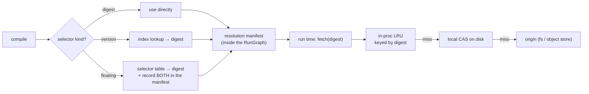
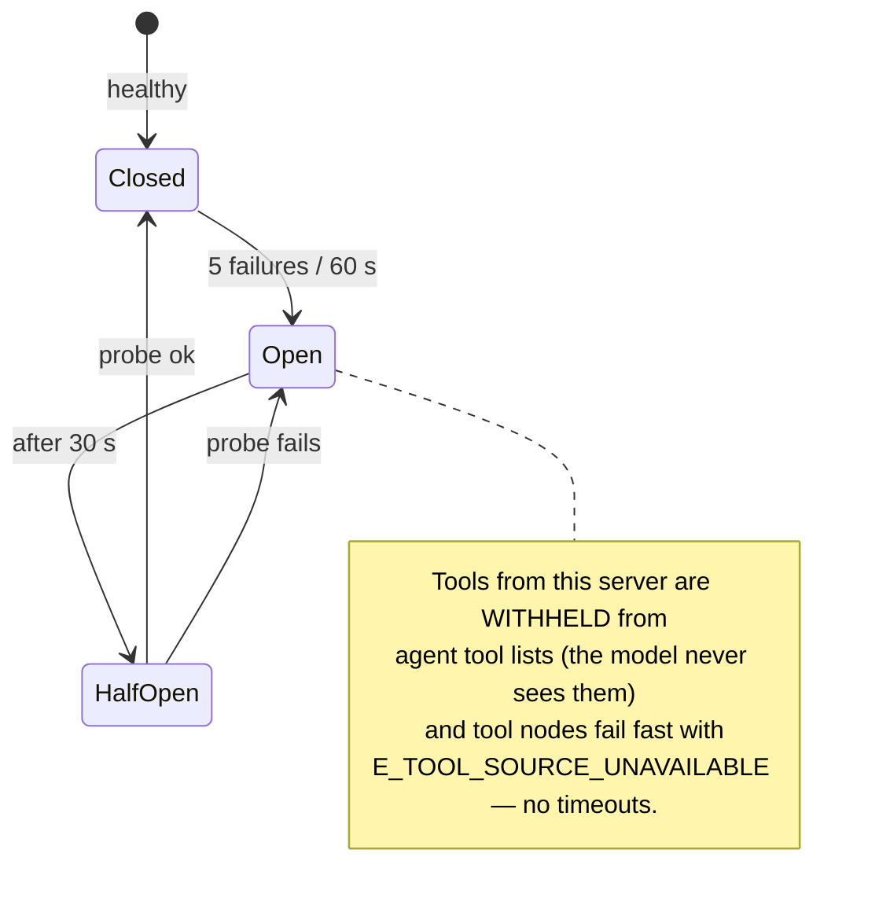
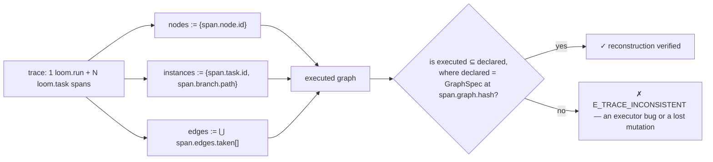
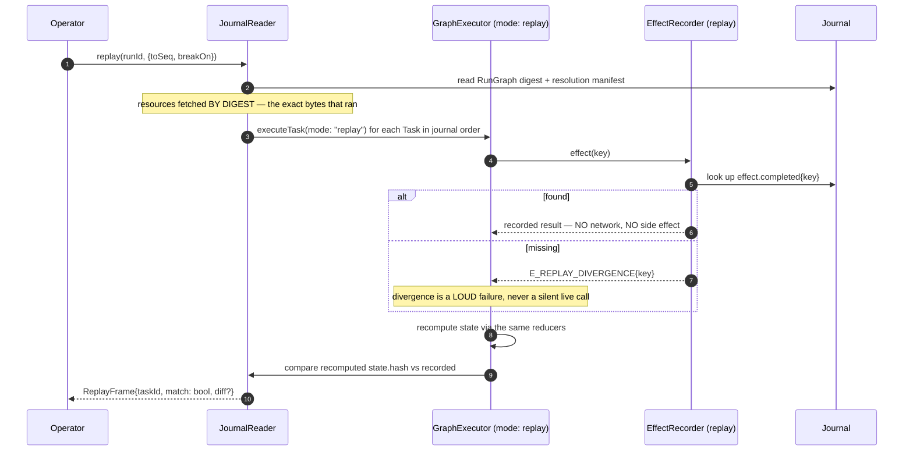
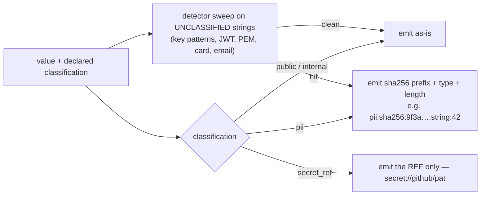
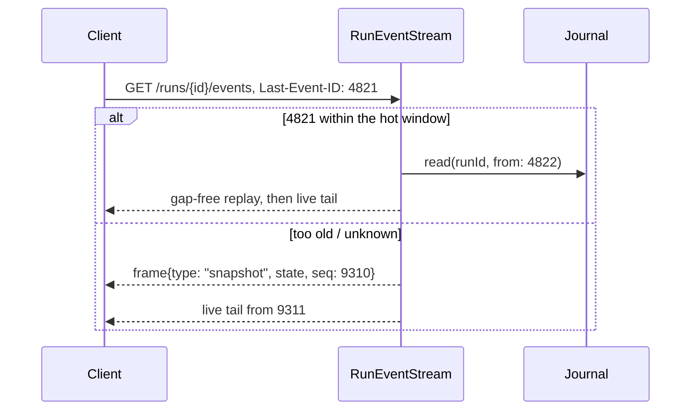

# 05 — D8 · Resource & Artifact Layer, D9 · Observability

---

# D8 — Resource layer design

## D8.1 — Resource kinds and content model

| Kind | Content | Schema-validated at publish | Immutable | Consumed by |
|---|---|---|---|---|
| `prompt` | Templated text + declared variables + a rendering contract | yes | yes | agent, evaluator, router(model), gate payload |
| `agent_profile` | Persona ref, model policy + fallback chain, tool allowlist, context budget, `maxTurns`, oversight defaults | yes | yes | `AgentFactory` |
| `graph` | A `GraphSpec` | yes (`GRAPH001..018`) | yes | `GraphCompiler` |
| `subgraph` | A `GraphSpec` with declared `inputs`/`outputs` mappings | yes | yes | `subgraph` nodes |
| `function` | A pure TS module with a typed signature, published as source + digest | typecheck + signature check | yes | `function` nodes, `evaluator(assertion)` |
| `skill` | A named, parameterised **tool-call sequence** distilled from trajectories: an ordered plan with argument templates and preconditions | yes | yes | agent nodes (offered as one tool), promoted by **D10** |
| `tool_manifest` | Name, version, JSON Schema, capabilities, **irreversibility**, **idempotent**, compensation, timeout, `concurrencyKey` | yes | yes | `ToolRegistry`, `PolicyEngine` |
| `oversight` | An `OversightPolicy` (**D7.2**) | yes | yes | `PolicyEngine`, `HumanGateBroker` |
| `mcp_server` | Transport, endpoint, auth ref, tool-name prefix, trust level | yes | yes | `ToolRegistry` |
| `knowledge_base` | Index config, embedding model ref, chunking policy, source manifest | yes | index is mutable, **config is not** | `kb.search` tool |
| `eval_suite` | A frozen set of recorded trajectories + expected outcomes + must-pass flags | yes | **yes — frozen by definition** | **D10** offline gate |
| `hook` | A filter/observer module implementing **D6.9** signatures | typecheck | yes | executor lifecycle |

**Artifacts** are not Resources. A Resource is a *design-time input*, versioned and
promoted; an Artifact is a *run-time output*, content-addressed in the blob store and
referenced from channels by digest. Confusing the two is how systems end up with
"version 47 of a run output".

## D8.2 — Addressing

```
<kind>/<name>@<selector>

selector := <integer version>          # exact:      prompt/investigate-signal@12
          | sha256:<hex>               # digest:     prompt/investigate-signal@sha256:9f3a…
          | stable | canary | draft    # floating:   prompt/investigate-signal@stable
```

Namespacing is `tenant → project → kind → name`. Cross-project references require an
explicit grant; cross-tenant references are impossible by construction.

**The floating/pinned split is the whole design.** Floating selectors exist so authors
can write `@stable` and mean it. `ResourceFetcher.resolve` converts a floating selector
to a digest **at compile time only**; `ResourceFetcher.fetch` refuses anything but a
digest at run time (`E_FLOATING_REF_AT_RUNTIME`, class `internal` — it can only be a bug).

## D8.3 — Promotion pipeline

```mermaid
stateDiagram-v2
  [*] --> Draft: publish (content-addressed; identical bytes ⇒ same digest, no new version)
  Draft --> Draft: iterate
  Draft --> Canary: promote(canary) — requires a passing EvalReport
  Canary --> Stable: promote(stable) — requires EvalReport + canary metrics + HUMAN actor
  Canary --> Draft: rollback (auto on canary SLO breach)
  Stable --> Deprecated: promote(deprecated) — existing pins keep working
  Deprecated --> Yanked: yank (security only) — compile FAILS for new runs
  Stable --> Stable: a new version takes the `stable` selector; the old digest is untouched
  Yanked --> [*]
  Deprecated --> [*]

  note right of Stable
    Promotion moves a SELECTOR.
    It never mutates content.
    In-flight runs hold digests,
    so they are unaffected.
  end note
```



| Transition | Authority | Gate |
|---|---|---|
| → `draft` | `resource:write` | schema validation |
| → `canary` | `resource:promote` (agent or human) | `EvalReport.pass === true` |
| → `stable` | `resource:promote(stable)` — **human only**; the evolution engine's identity is deny-listed | eval report **and** canary metrics **and** a non-negative posture diff |
| → `deprecated` | `resource:promote` | none; a warning appears at compile |
| → `yanked` | `resource:admin` | incident reference required; **breaks new compiles on purpose** |

## D8.4 — Resolution, caching, and invalidation



**Cache invalidation is not a problem here, by construction.** Every cache is keyed by
content digest, and digests are immutable, so entries are never stale — only evictable.
The *only* mutable mapping is `selector → digest`, which is read exclusively at compile
time and recorded verbatim in the manifest:

```json
{
  "resolvedAt": 1770000000,
  "entries": [
    { "ref": "prompt/investigate-signal@stable", "digest": "sha256:9f3a…", "channel": "stable" },
    { "ref": "agent_profile/sre-investigator@stable", "digest": "sha256:1c07…", "channel": "stable" },
    { "ref": "tool_manifest/k8s.apply@3.0", "digest": "sha256:be51…", "channel": "stable" }
  ]
}
```

## D8.5 — The pinning rule

> **A Run reads only what its resolution manifest names. A Resource published, promoted,
> deprecated, or yanked mid-run cannot affect that Run.**

Consequences, stated so nobody has to infer them:

| Event during a run | Effect on the in-flight Run | Effect on the next Run |
|---|---|---|
| New `prompt@13` published and promoted to `stable` | none — the manifest holds `@sha256:9f3a…` | compiles against `13` |
| `agent_profile` deprecated | none | compile warning |
| `tool_manifest` **yanked** (security) | none for already-pinned calls; a **`policy.escalated{rule:"yanked_tool"}` is raised and the run is escalated to `in`** | compile **fails** |
| A `subgraph` changes | none — subgraph refs are pinned recursively | new digest |
| Config hot-reload of a *non-resource* field (timeouts, concurrency) | applies immediately (**D11**) | applies |

The yank row is the deliberate exception: a *security* yank is the one case where "the
in-flight run is unaffected" is the wrong answer, so instead of breaking it mid-flight
(which could strand irreversible work) the run is escalated to human oversight and the
operator decides.

## D8.6 — Graph templates and subgraph reuse

```yaml
apiVersion: loom.dev/v1
kind: GraphSpec                       # a subgraph is a GraphSpec with an explicit contract
metadata: { name: investigate-signal-pack, project: sre, version: 3 }
contract:
  inputs:  { signal: { $ref: "#/defs/Signal" }, incident: { $ref: "#/defs/Incident" } }
  outputs: { findings: { type: array, items: { $ref: "#/defs/Finding" } } }
  budget:  { costUsdMax: 0.35 }       # the parent carves this from its own via budgetShare
  posture: on                         # a FLOOR; the parent may only raise it
```

Used from a parent with an explicit mapping, so a subgraph never reads the parent's
channels by accident:

```yaml
- id: investigate
  type: subgraph
  subgraph:
    ref: subgraph/investigate-signal-pack@stable
    inputs:  { signal: signal, incident: incident }     # child ← parent
    outputs: { findings: findings }                     # parent ← child
    budgetShare: 0.6
```

**Templates** are GraphSpecs with declared `parameters` substituted at compile time. They
produce a *new digest* per parameter set, so two instantiations of the same template are
two distinct, independently traceable graphs — not one graph behaving differently.

## D8.7 — MCP server registration and health

```yaml
apiVersion: loom.dev/v1
kind: McpServer
metadata: { name: github, project: sre, version: 2 }
transport: { kind: stdio, command: "mcp-github", args: ["--readonly"] }   # or { kind: sse, url: … }
auth: { tokenRef: "secret://github/pat" }                                 # a REF; never a value
trust: untrusted            # untrusted | verified   — see below
toolPrefix: "github."       # every tool is namespaced; collisions are impossible
declared:
  # Loom does NOT trust the server's self-reported metadata for security fields.
  # These are asserted locally by the registrar and are what PolicyEngine reads.
  - { name: "github.search_issues", capabilities: ["net:fetch"], irreversibility: read_only,  idempotent: true }
  - { name: "github.create_issue",  capabilities: ["net:fetch"], irreversibility: externally_visible, idempotent: false }
health:
  probeIntervalMs: 30000
  breaker: { failureThreshold: 5, windowMs: 60000, halfOpenAfterMs: 30000 }
```

**The security rule that matters:** an MCP server's own tool descriptions are *untrusted
input*. Capabilities, irreversibility, and idempotency come from the **local** `declared`
block, authored by whoever registered the server. A server that advertises a new tool not
in `declared` is registered as `capabilities: []`, `irreversibility: irreversible`,
`idempotent: false` — i.e. maximally restricted — and surfaces as a review item.



---

# D9 — Observability design

## D9.1 — Span taxonomy

OpenTelemetry, with `gen_ai.*` semantic conventions for model calls and a `loom.*`
namespace for everything else.

| Span | Parent | Kind | Key attributes |
|---|---|---|---|
| `loom.request` | (root, control plane) | SERVER | `http.route`, `tenant.id`, `project.id`, `idempotency.key`, `auth.subject`, `run.id` |
| `loom.compile` | `loom.request` | INTERNAL | `graph.hash`, `graph.nodes`, `graph.edges`, `graph.max_width`, `resources.pinned`, `diagnostics.errors/warnings` |
| `loom.run` | link → `loom.request` | INTERNAL | `run.id`, `workflow.name`, `graph.hash`, `oversight.posture`, `budget.cost_usd`, `trigger.kind` |
| `loom.schedule.admit` | `loom.run` | INTERNAL | `queue.depth`, `concurrency.used/limit`, `admit.decision`, `wait_ms` |
| `loom.task` | `loom.run` | INTERNAL | `task.id`, `node.id`, `node.type`, `branch.path`, `task.attempt`, `task.status`, **`edges.in[]`**, **`edges.taken[]`**, `state.hash.before/after` |
| `loom.policy` | `loom.task` | INTERNAL | `policy.effect`, `policy.posture`, `policy.reasons[]`, `irreversibility.class`, `capability` |
| `loom.context.assemble` | `loom.task` | INTERNAL | `ctx.sections[]`, `ctx.tokens.before/after`, `ctx.compaction.rung`, `ctx.hash` |
| `loom.model` | `loom.task` | CLIENT | `gen_ai.system`, `gen_ai.request.model`, `gen_ai.request.max_tokens`, `gen_ai.response.finish_reason`, `gen_ai.usage.input_tokens`, `gen_ai.usage.output_tokens`, `loom.cost_usd`, `loom.effect.key`, `loom.replayed` |
| `loom.tool` | `loom.task` | CLIENT | `tool.name`, `tool.version`, `tool.irreversibility`, `tool.idempotent`, `tool.attempt`, `tool.source`, `loom.effect.key`, `loom.replayed` |
| `loom.effect` | `loom.task` | INTERNAL | `effect.key`, `effect.kind`, `effect.outcome` (`completed`\|`failed`\|**`unknown`**) |
| `loom.state.reduce` | `loom.task` | INTERNAL | `channels[]`, `reducers[]`, `branch.count`, `skipped`, `degraded` |
| `loom.gate` | `loom.run` | INTERNAL | `gate.id`, `gate.posture`, `gate.decision`, `gate.latency_ms`, `gate.approvers` (hashed), `gate.escalations`, `gate.batched` |
| `loom.checkpoint` | `loom.run` | INTERNAL | `checkpoint.seq`, `checkpoint.kind`, `open_tasks` |
| `loom.scheduler.tick` | (independent) | INTERNAL | `ready`, `leased`, `suspended`, `tick_ms` — the DL-1 reversal metric |

**Edges are links, not spans.** Each `loom.task` span carries `edges.in[]` plus an OTel
link to each producer Task's span. Span count stays `O(nodes)`; a 500-node run with 2,000
edges produces ~500 task spans, not 2,500.

## D9.2 — Reconstructing the executed graph from a trace



Every span carries `graph.hash`, so the declared graph is fetchable by digest. A run with
mutations carries the *final* hash plus `graph.mutated` journal entries recording each
diff, so the chain `baseHash → …mutations… → finalHash` is verifiable. A CI test asserts
`reconstruct(trace) ⊆ declared(graph.hash)` for every fixture — this is the mechanical
enforcement of DL-4 ("one artifact, no parallel representations").

## D9.3 — Sampling

**Sampling applies to OTel export only. The journal is never sampled.** Everything below
therefore affects trace richness and cost, never durability, auditability, or replay.

| Tier | Head sampling | Tail sampling (always keep) |
|---|---|---|
| Run with posture `in` or any gate | 100 % | — |
| Run with an `irreversible` action | 100 % | — |
| Run flagged for evolution capture | 100 % | — |
| Production, posture `on` | 20 % | error, `policy.escalated`, cost > p95, latency > p95, any `effect.outcome = unknown` |
| Production, posture `out`, `read_only` only | 5 % | same tail rules |
| Replay runs | 0 % head | recorded separately under `loom.replay` |

Head decisions are made at `loom.run` creation and propagated via trace flags, so a
sampled-out run never pays per-span cost. Tail rules are applied by the collector; a run
kept by a tail rule has its complete span set retained because the collector buffers by
trace id for `tailWindowMs` (default 60 s) — spans that outlive the window are
reconstructed from the journal on demand.

## D9.4 — Retention tiering

| Tier | Contents | Store (local → distributed) | Retention | Query latency |
|---|---|---|---|---|
| **Hot** | last 7 d of spans, metrics, run/task read models | SQLite + DuckDB → ClickHouse | 7 d | < 100 ms |
| **Warm** | 30 d of spans as Parquet, aggregated metrics | local fs → S3 + Athena/ClickHouse | 30 d | seconds |
| **Cold** | **the full journal**, compressed, per run | local fs → S3 Glacier IR | 1 y (configurable) | minutes |
| **Audit** | `AuditRecord`s only | separate append-only store, WORM where available | **7 y**, independent lifecycle | seconds |
| **Artifacts** | blobs by digest | local CAS → S3 | referenced-count GC, min 30 d | ms |

The journal sits in **cold** rather than hot because it is large and rarely read — but it
is never *pruned*, only tiered. Audit records are duplicated into their own store because
regulatory retention must not depend on the same lifecycle as debugging telemetry.

## D9.5 — Deterministic replay



Three uses, one mechanism: **debugging** (step through with breakpoints), **regression
evaluation** (**D10** replays a frozen suite against a candidate), and **verification** (a
CI job replays fixtures and asserts every `state.hash` matches — this is how a reducer
regression is caught).

### What cannot be replayed faithfully

Stated plainly, because a design that claims perfect replay is wrong.

| # | Case | Why | What replay does instead |
|---|---|---|---|
| 1 | **Secrets** | Values are never journaled — only `secret://` refs | Re-resolves from `SecretProvider`. Replay in a different environment yields different values, and the frame is marked `hermetic: false` |
| 2 | **Redacted fields** | PII is redacted at write time per classification | Serves the redaction token. Any node whose logic depends on the redacted value diverges; the frame is marked `lossy: true` |
| 3 | **Forked runs with modified inputs** | A fork *re-executes* rather than replaying | Live effects run. `CheckpointStore.restore(fork)` therefore refuses to auto-run past a committed `irreversible ∧ ¬idempotent` effect without an explicit human override |
| 4 | **Effects with `outcome: unknown`** | The crash happened between `effect.started` and any terminal record | Surfaces the gap explicitly and stops, rather than guessing |
| 5 | **Wall-clock-dependent *logic*** | `Date.now()` inside a node body is not an effect unless it goes through `ctx.now()` | The compiler bans direct `Date.now()`/`Math.random()` in `function` resources (lint rule at publish); `ctx.now()`/`ctx.random()` are recorded effects |
| 6 | **External system drift on fork** | The world moved on | Only affects `fork`, never `replay` — replay makes no external calls at all |

## D9.6 — Redaction

Redaction happens **at emit time, in-process, before any bytes leave** — never in the UI
and never in the collector.



Classification is declared on channels and on tool-manifest schema fields, so most
redaction is *declared*, not detected. The detector sweep is a backstop for free-text
model output — it will have false negatives, which is why the primary mechanism is
declaration and why secrets are `SecretValue` wrappers whose `toString`/`toJSON`/
`util.inspect` all return `[secret]` (so an accidental interpolation is inert rather than
catastrophic).

---

## L1 — Presentation-layer answers

The three questions Section 2 requires the presentation layer to answer.

### 1 · Streaming state reconciliation after reconnect



The client keeps `lastSeq` and applies frames idempotently keyed on `seq`, so a duplicate
frame is a no-op. Because the journal is the truth and `seq` is gap-free per Run, "did I
miss anything?" is always answerable — the client never has to guess.

### 2 · Rendering a 500-node graph without stalling

| Technique | Effect |
|---|---|
| **Layout computed at compile time**, shipped in the `RunGraph` as rank/order hints | The browser never runs an O(V·E) layout; it positions from precomputed coordinates |
| **Structure sent once** (immutable, keyed by `graph.hash`, cached in IndexedDB); only *state deltas* stream | A 500-node graph is ~1 payload of ~200 KB then ~40 bytes per state change |
| **Deltas coalesced at 60 ms** into one frame keyed by node id | 25 parallel branches emitting rapidly produce ≤ 16 repaints/s |
| **Subgraphs collapsed by default**; fan-out branches rendered as one **stacked node with a count badge**, expandable | A 25-way fan-out is 1 visual element until you ask for 25 |
| **Canvas/WebGL renderer** above ~150 visible elements, virtualised to the viewport | Constant-time repaint regardless of graph size |
| **Detail on demand** — logs, tool output, and prompts fetched per node on click | The stream carries state, never payloads |

### 3 · Surfacing, routing, and escalating a pending gate

| Surface | Behaviour |
|---|---|
| **Canvas** | The gate node pulses; the run banner shows `AwaitingHumanGate` with an SLA countdown |
| **Global queue** | A per-user queue sorted by `(sla_remaining, blast_radius, cost_at_risk)`; batched gates appear as one row with a count |
| **Push** | Delivered through `GateDelivery` to the declared channels; reminders at declared offsets |
| **Escalation** | On SLA breach the gate re-routes to the next tier, the row re-colours, and `gate.escalated` streams to every watcher |
| **Claim** | Claiming takes a 5-minute soft lock, so two approvers do not both work the same gate |
| **Evidence** | The payload rendered is exactly what `contentDigest` covers — diff, command, blast radius, cost so far, and the evidence the agent cited |
