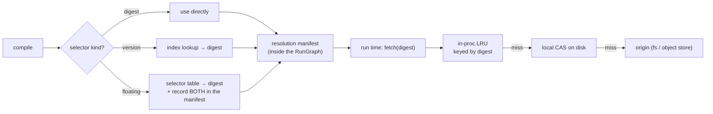
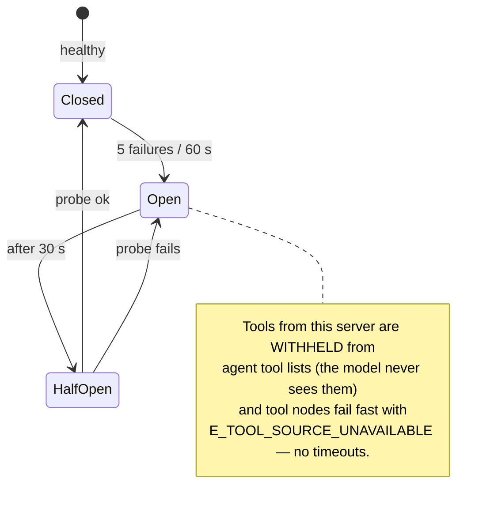
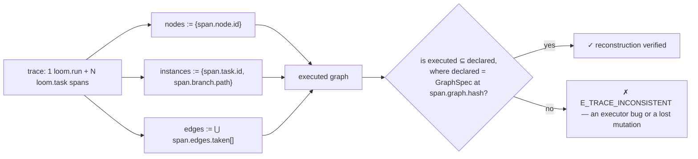
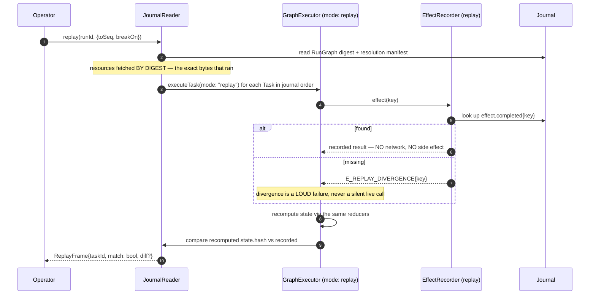
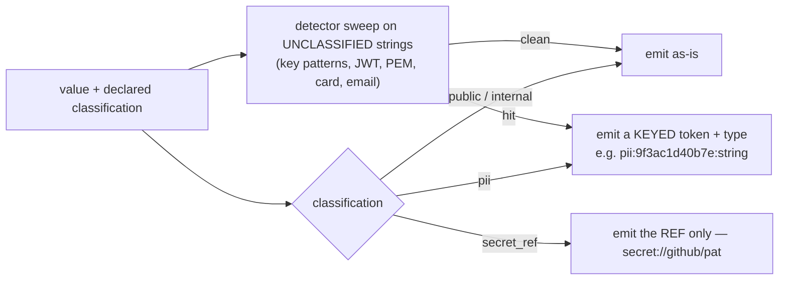
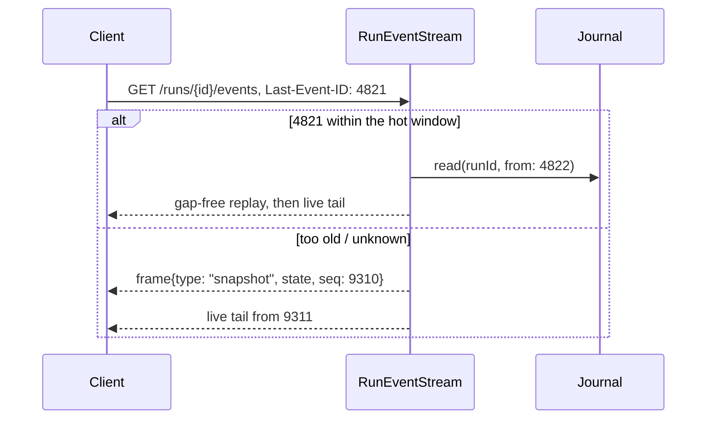

# 05 — D8 · Resource & Artifact Layer, D9 · Observability

---

# D8 — Resource layer design

## D8.1 — Resource kinds and content model

| Kind | Content | Schema-validated at publish | Immutable | Consumed by |
|---|---|---|---|---|
| `prompt` | Templated text + declared variables + a rendering contract | yes | yes | agent, evaluator, router(model), gate payload |
| `agent_profile` | Persona ref, model policy + fallback chain, tool allowlist, context budget, `maxTurns`, oversight defaults | yes | yes | `AgentFactory` |
| `graph` | A `GraphSpec` | yes (every rule in **D5.6** — `GRAPH000`–`GRAPH021` today, and the table there is the list) | yes | `GraphCompiler` |
| `subgraph` | A `GraphSpec` with declared `inputs`/`outputs` mappings | yes | yes | `subgraph` nodes |
| `function` | A pure TS module with a typed signature, published as source + digest | typecheck + signature check | yes | `function` nodes, `evaluator(assertion)` |
| `skill` | A named, parameterised **tool-call sequence** distilled from trajectories: an ordered plan with argument templates and preconditions | yes | yes | agent nodes (offered as one tool), promoted by **D10** |
| `tool_manifest` | Name, version, JSON Schema, capabilities, **irreversibility**, **idempotent**, compensation, timeout, `concurrencyKey` | yes | yes | `ToolRegistry`, `PolicyEngine` |
| `oversight` | An `OversightPolicy` (**D7.2**) | yes | yes | `PolicyEngine`, `HumanGateBroker` |
| `mcp_server` | Transport, endpoint, auth ref, tool-name prefix, trust level | yes | yes | `ToolRegistry` |
| `knowledge_base` | Index config, embedding model ref, chunking policy, source manifest | yes | index is mutable, **config is not** | `kb.search` tool |
| `eval_suite` | A frozen set of recorded trajectories + expected outcomes + must-pass flags | yes | **yes — frozen by definition** | **D10** offline gate |
| `hook` | A filter/observer module implementing **D6.9** signatures | typecheck | yes | executor lifecycle |

**Artifacts** are not Resources. A Resource is a *design-time input*, versioned and
promoted; an Artifact is a *run-time output*, content-addressed in the blob store and
referenced from channels by digest. Confusing the two is how systems end up with
"version 47 of a run output".

## D8.2 — Addressing

```
<kind>/<name>@<selector>

selector := <integer version>          # exact:      prompt/investigate-signal@12
          | sha256:<hex>               # digest:     prompt/investigate-signal@sha256:9f3a…
          | stable | canary | draft    # floating:   prompt/investigate-signal@stable
```

Namespacing is `tenant → project → kind → name`. Cross-project references require an
explicit grant; cross-tenant references are impossible by construction.

**The floating/pinned split is the whole design.** Floating selectors exist so authors
can write `@stable` and mean it. `ResourceFetcher.resolve` converts a floating selector
to a digest **at compile time only**; `ResourceFetcher.fetch` refuses anything but a
digest at run time (`E_FLOATING_REF_AT_RUNTIME`, class `internal` — it can only be a bug).

## D8.3 — Promotion pipeline

```mermaid
stateDiagram-v2
  [*] --> Draft: publish (content-addressed; identical bytes ⇒ same digest, no new version)
  Draft --> Draft: iterate
  Draft --> Canary: promote(canary) — requires a passing EvalReport
  Canary --> Stable: promote(stable) — requires EvalReport + canary metrics + HUMAN actor
  Canary --> Draft: rollback (auto on canary SLO breach)
  Stable --> Deprecated: promote(deprecated) — existing pins keep working
  Deprecated --> Yanked: yank (security only) — compile FAILS for new runs
  Stable --> Stable: a new version takes the `stable` selector; the old digest is untouched
  Yanked --> [*]
  Deprecated --> [*]

  note right of Stable
    Promotion moves a SELECTOR.
    It never mutates content.
    In-flight runs hold digests,
    so they are unaffected.
  end note
```



| Transition | Authority | Gate |
|---|---|---|
| → `draft` | `resource:write` | schema validation |
| → `canary` | `resource:promote` (agent or human) | `EvalReport.pass === true` |
| → `stable` | `resource:promote(stable)` — **human only**; the evolution engine's identity is deny-listed | eval report **and** canary metrics **and** a non-negative posture diff |
| → `deprecated` | `resource:promote` | none; a warning appears at compile |
| → `yanked` | `resource:admin` | incident reference required; **breaks new compiles on purpose** |

## D8.4 — Resolution, caching, and invalidation



**Cache invalidation is not a problem here, by construction.** Every cache is keyed by
content digest, and digests are immutable, so entries are never stale — only evictable.
The *only* mutable mapping is `selector → digest`, which is read exclusively at compile
time and recorded verbatim in the manifest:

```json
{
  "resolvedAt": 1770000000,
  "entries": [
    { "ref": "prompt/investigate-signal@stable", "digest": "sha256:9f3a…", "channel": "stable" },
    { "ref": "agent_profile/sre-investigator@stable", "digest": "sha256:1c07…", "channel": "stable" },
    { "ref": "tool_manifest/k8s.apply@3.0", "digest": "sha256:be51…", "channel": "stable" }
  ]
}
```

## D8.5 — The pinning rule

> **A Run reads only what its resolution manifest names. A Resource published, promoted,
> deprecated, or yanked mid-run cannot affect that Run.**

Consequences, stated so nobody has to infer them:

| Event during a run | Effect on the in-flight Run | Effect on the next Run |
|---|---|---|
| New `prompt@13` published and promoted to `stable` | none — the manifest holds `@sha256:9f3a…` | compiles against `13` |
| `agent_profile` deprecated | none | compile warning |
| `tool_manifest` **yanked** (security) | none for already-pinned calls; a **`policy.escalated{rule:"yanked_tool"}` is raised and the run is escalated to `in`** | compile **fails** |
| A `subgraph` changes | none — subgraph refs are pinned recursively | new digest |
| Config hot-reload of a *non-resource* field (timeouts, concurrency) | applies immediately (**D11**) | applies |

The yank row is the deliberate exception: a *security* yank is the one case where "the
in-flight run is unaffected" is the wrong answer, so instead of breaking it mid-flight
(which could strand irreversible work) the run is escalated to human oversight and the
operator decides.

## D8.6 — Graph templates and subgraph reuse

```yaml
apiVersion: loom.dev/v1
kind: GraphSpec                       # a subgraph is a GraphSpec with an explicit contract
metadata: { name: investigate-signal-pack, project: sre, version: 3 }
contract:
  inputs:  { signal: { $ref: "#/defs/Signal" }, incident: { $ref: "#/defs/Incident" } }
  outputs: { findings: { type: array, items: { $ref: "#/defs/Finding" } } }
  budget:  { costUsdMax: 0.35 }       # the parent carves this from its own via budgetShare
  posture: on                         # a FLOOR; the parent may only raise it
```

Used from a parent with an explicit mapping, so a subgraph never reads the parent's
channels by accident:

```yaml
- id: investigate
  type: subgraph
  subgraph:
    ref: subgraph/investigate-signal-pack@stable
    inputs:  { signal: signal, incident: incident }     # child ← parent
    outputs: { findings: findings }                     # parent ← child
    budgetShare: 0.6
```

**Templates** are GraphSpecs with declared `parameters` substituted at compile time. They
produce a *new digest* per parameter set, so two instantiations of the same template are
two distinct, independently traceable graphs — not one graph behaving differently.

## D8.7 — MCP server registration and health

```yaml
apiVersion: loom.dev/v1
kind: McpServer
metadata: { name: github, project: sre, version: 2 }
transport: { kind: stdio, command: "mcp-github", args: ["--readonly"] }   # or { kind: sse, url: … }
auth: { tokenRef: "secret://github/pat" }                                 # a REF; never a value
trust: untrusted            # untrusted | verified   — see below
toolPrefix: "github."       # every tool is namespaced; collisions are impossible
declared:
  # Loom does NOT trust the server's self-reported metadata for security fields.
  # These are asserted locally by the registrar and are what PolicyEngine reads.
  - { name: "github.search_issues", capabilities: ["net:fetch"], irreversibility: read_only,  idempotent: true }
  - { name: "github.create_issue",  capabilities: ["net:fetch"], irreversibility: externally_visible, idempotent: false }
health:
  probeIntervalMs: 30000
  breaker: { failureThreshold: 5, windowMs: 60000, halfOpenAfterMs: 30000 }
```

**The security rule that matters:** an MCP server's own tool descriptions are *untrusted
input*. Capabilities, irreversibility, and idempotency come from the **local** `declared`
block, authored by whoever registered the server. A server that advertises a new tool not
in `declared` is registered as `capabilities: []`, `irreversibility: irreversible`,
`idempotent: false` — i.e. maximally restricted — and surfaces as a review item.



---

# D9 — Observability design

## D9.1 — Span taxonomy

OpenTelemetry, with `gen_ai.*` semantic conventions for model calls and a `loom.*`
namespace for everything else.

| Span | Parent | Kind | Key attributes |
|---|---|---|---|
| `loom.request` | (root, control plane) | SERVER | `http.route`, `tenant.id`, `project.id`, `idempotency.key`, `auth.subject`, `run.id` |
| `loom.compile` | `loom.request` | INTERNAL | `graph.hash`, `graph.nodes`, `graph.edges`, `graph.max_width`, `resources.pinned`, `diagnostics.errors/warnings` |
| `loom.run` | link → `loom.request` | INTERNAL | `run.id`, `workflow.name`, `graph.hash`, `oversight.posture`, `budget.cost_usd`, `trigger.kind` |
| `loom.schedule.admit` | `loom.run` | INTERNAL | `queue.depth`, `concurrency.used/limit`, `admit.decision`, `wait_ms` |
| `loom.task` | `loom.run` | INTERNAL | `task.id`, `node.id`, `node.type`, `branch.path`, `task.attempt`, `task.status`, **`edges.in[]`**, **`edges.taken[]`**, `state.hash.before/after` |
| `loom.policy` | `loom.task` | INTERNAL | `policy.effect`, `policy.posture`, `policy.reasons[]`, `irreversibility.class`, `capability` |
| `loom.context.assemble` | `loom.task` | INTERNAL | `ctx.sections[]`, `ctx.tokens.before/after`, `ctx.compaction.rung`, `ctx.hash` |
| `loom.model` | `loom.task` | CLIENT | `gen_ai.system`, `gen_ai.request.model`, `gen_ai.request.max_tokens`, `gen_ai.response.finish_reason`, `gen_ai.usage.input_tokens`, `gen_ai.usage.output_tokens`, `loom.cost_usd`, `loom.effect.key`, `loom.replayed` |
| `loom.tool` | `loom.task` | CLIENT | `tool.name`, `tool.version`, `tool.irreversibility`, `tool.idempotent`, `tool.attempt`, `tool.source`, `loom.effect.key`, `loom.replayed` |
| `loom.effect` | `loom.task` | INTERNAL | `effect.key`, `effect.kind`, `effect.outcome` (`completed`\|`failed`\|**`unknown`**) |
| `loom.state.reduce` | `loom.task` | INTERNAL | `channels[]`, `reducers[]`, `branch.count`, `skipped`, `degraded` |
| `loom.gate` | `loom.task`, or `loom.run` when the event carries no `taskId` | INTERNAL | `gate.id`, `gate.posture`, `gate.decision` (`approve`\|`reject`\|`edit`\|`redirect`\|`timeout`\|**`cancelled`**), `gate.latency_ms`, `gate.approver` (**tokenised**) + `gate.approver_kind`, `gate.escalations`, `gate.batched` |
| `loom.checkpoint` | `loom.task` | INTERNAL | `checkpoint.seq`, `checkpoint.kind`, `open_tasks` |
| `loom.scheduler.tick` | (independent) | INTERNAL | `ready`, `leased`, `suspended`, `tick_ms` — the DL-1 reversal metric |

**How a `loom.gate` span ends, and what that tells an operator.** Four terminal shapes,
and the point of the table is that `gate.decision` — not the span status — is the
discriminator. *Answered*, *timed out* and *withdrawn* are three different facts about a
question, and a trace has to distinguish them without anyone opening the journal.

| Ends the span | `gate.decision` | Status | Also set |
|---|---|---|---|
| `gate.decided` | `approve` \| `edit` \| `redirect` | `ok` | `gate.latency_ms`, `gate.approver_kind`, and `gate.approver` (tokenised) when a human decided |
| `gate.decided` | `reject` | `error` | `gate.latency_ms`, `gate.approver_kind`, and `gate.approver` (tokenised) when a human decided |
| `gate.timeout` | `timeout` | `error` | `gate.action` |
| `gate.cancelled` | `cancelled` | `error` | `gate.reason` |
| *nothing does* | *absent* | `unset` | — nothing; the gate never closed, and that is the only thing `unset` means here |

**Both parent columns above said `loom.run` and the code has always parented both on the
Task**, which is the same drift one row over from the one D9.2 records: a document
describing a fold, checked by reading the document. The `loom.gate` row is now the
interesting one, because it has two answers. The gate arms of `spansFrom` used to sit
*below* its task-scope guard, so a gate raised by an event carrying no `taskId` produced
**no `loom.gate` span at all** — not mis-drawn, absent — while `run/projection.ts` and
`GET /runs/:id/gates` showed the same gate perfectly. Whether the engine can append such an
event is unsettled (`engine.ts` branches on `gate.taskId === ""` in two places, so the shape
is contemplated in the tree); the fold no longer has to know. A gate has a `gateId` of its
own, so it is parented on the Task when there is one and on the run when there is not.
Everything still below that guard is genuinely Task-scoped — it either patches the Task's
span or derives a span id from the `taskId` — so a taskless event there has no coordinates
rather than the wrong ones.

A withdrawn gate closes `error`, not `unset`, and the last row is why. Cancel and every
failure or completion path close a run's open gates, so withdrawal is a *common* terminal
shape; sharing `unset` with a gate still waiting for a human made the two
indistinguishable in a trace, and the span's end time was wrong as well — it fell out of
the end-of-journal sweep instead of closing when the question was withdrawn. `error` also
matches what the `run.cancelled` and `task.cancelled` arms of the same fold already do
with a cancellation. Both approver fields are deliberately absent on a withdrawal: the
engine writes the cancel, and naming a system component in either would manufacture the
appearance of someone having decided.

**`gate.approver` and `gate.approver_kind` are two attributes because one attribute may
not mean two things.** `gate.approver` held either a hashed human subject or the bare
word `system`, distinguished by the shape of the value — which is exactly the arrangement
that makes a classification impossible to state: tokenising the slot would have turned the
broker into a pseudonymous person, and not tokenising it left the person in the clear. So
the actor *kind* is its own always-present field, `gate.approver` is a person or nothing,
and "which gates did the clock decide rather than a human?" became a filter instead of a
format-sniff on a value.

**A trace collector is outside the trust boundary, and it is the SECOND egress path.**
The first is `run/delivery.ts`, which hands a gate to a channel; **D9.6** and
`DeliverySpec.redact` are written for it. Everything that argument establishes applies
here at least as strongly, because a collector is very often a third-party SaaS while a
channel is at least chosen per gate. Four attributes were exported in a form the holder
could invert, and all four now go through the same keyed primitive `redact.ts` uses for
a `pii` leaf:

| Attribute | What it was | Why that was a disclosure |
|---|---|---|
| `gate.approver` | `digestOf(subject).slice(7, 19)` — an unkeyed 48-bit prefix | An approver domain is a company directory, and very often it is the graph's own `approvers` list, which `gate.raised` journals in the clear in the same run. Inverted from a four-name candidate list in **0.011 ms** |
| `gate.content_digest` | `digest(gate payload)`, raw | A confirmation oracle for every field in the payload: guess, rebuild, hash, compare. A five-digit `employeeId` that `DeliverySpec.redact` had just hidden from the channel was recovered in **50 ms** — the delivery leak arriving by the other road |
| `state.hash.before` / `state.hash.after` | `digest(whole channel map)`, raw, twice per reduce | The same oracle with all of channel state in scope. The previous wave's class-sweep looked straight at these and filed them as "journal and store, both inside the boundary": true of `state/channels.ts`, which computes them, false of `telemetry/spans.ts`, which ships them. **A digest is not classified by where it is computed** |
| `gate.escalated`'s `to` (a span **event**) | `formatRecipients` output — `user:<address>, role:<name>` | Span *events* were not redacted at all. `close` redacted `attributes` and handed `events` and `links` on raw, which was invisible while every event attribute was a closed enum and became a live leak the moment an escalation put an operator-authored recipient list on one |

**Tokenised rather than dropped, and that is a deliberate line.** A keyed token is a pure
function of its input, so `after(n) == before(n+1)`, "this reduce changed nothing",
"these two gates asked the same question" (which is what **D7.9**'s deduplication needs)
and "the same person answered both" all survive it exactly. Only *guessing the input*
dies. The real values stay legible where they belong — in the journal, inside the
boundary, reachable through the `gate.id` and `task.id` the span still carries in the
clear. A trace whose fields have been redacted into uselessness fails a different
requirement, so what a span may NOT carry is stated as narrowly as it can be: the values
themselves, and nothing that recovers them.

**And the key is the DEPLOYMENT's, not the process's — which is the sentence that keeps
"a trace is a pure function of the journal" true.** This paragraph used to end "the key is
module-private in `security/redact.ts`, per-process, and never journaled", and the middle
third of that was the defect. `security/redact.ts` minted its root with
`randomBytes(32)` at first use, so tokenising four span attributes made the same journal
produce **different span bytes in every process**. Two consequences, neither of which any
test could see:

| Requirement | What a per-process key does to it |
|---|---|
| **Un-inventible** — the holder of a span cannot recover the input | Met. This was never the problem |
| **Deterministic** — same journal ⇒ same trace, in any process, forever | Broken. Two workers tracing one run emit `gate.approver` values nothing can join, which is precisely the *distributed* deployment these interfaces are shaped for; and a re-fold disagrees with the run it describes |

The two are only irreconcilable if the key is per-process. A **deployment-scoped** secret
satisfies both: same journal + same key ⇒ byte-identical trace forever, while a party
without the key still gets nothing. It comes from `LOOM_PII_TOKEN_KEY` (64 hex characters
— environment, not `loom.yaml`, because a config file is content-addressed into
`run.submitted` and rendered by the console, and a MAC key belongs in neither).

**Absent, the attribute is OMITTED, not emitted under a key nobody can reproduce.** This
is a `may` rather than a `must` on purpose — invariant 8 is *telemetry may drop data; the
journal may not*, so making a trace key a precondition of execution would invert it, and
the deployment simply gets a poorer trace. Omitted rather than replaced by a constant,
because a constant would make `state.hash.before == state.hash.after` trivially true —
manufacturing the claim "this reduce changed nothing" out of "we could not tell you". A
malformed key is the other case and gets the other answer: it is refused, warned about
once, and treated as absent. **Rotation** breaks correlation with the deployment's own
history, which is what rotating a MAC key means; nothing records the generation in the
token today, and `piiToken`'s docstring says what it would cost to add.

**Where redaction happens is one line, on purpose.** `close` is the only way a span leaves
`spans.ts`, so the classification map lives beside it as a table keyed by attribute name —
not as an argument each arm passes. An arm that forgets is the failure mode this codebase
has already met twice (see `04-OVERSIGHT.md` on gate authorization), and a table consulted
at the exit covers every attribute however it got onto the span, including the ones a
future arm has not been written yet.

**Edges are links, not spans.** Each `loom.task` span carries `edges.in[]` plus an OTel
link to each producer Task's span. Span count stays `O(nodes)`; a 500-node run with 2,000
edges produces ~500 task spans, not 2,500.

> **Do not read that table as an inventory.** Spans are *derived from the journal* by
> `telemetry/spans.ts`, not emitted inline, so a span exists exactly when some event folds
> into it. Today that is **eight**: `loom.run`, `loom.task`, `loom.policy`, `loom.model`,
> `loom.tool`, `loom.state.reduce`, `loom.gate`, `loom.checkpoint`.

Everything else this document names in the `loom.*` namespace is designed and unbuilt, and
carries the marker `test/docs-drift.test.ts` enforces (see `README.md` → Conventions):

| Marked | Why there is no span today |
|---|---|
| `DESIGNED-NOT-BUILT(loom.request)` | no journal event covers ingress; the control plane's first append is `run.submitted` |
| `DESIGNED-NOT-BUILT(loom.compile)` | compilation finishes *before* the first append, so there is nothing to fold |
| `DESIGNED-NOT-BUILT(loom.schedule.admit)` | admission control is itself unbuilt — see **D6.3** |
| `DESIGNED-NOT-BUILT(loom.context.assemble)` | `run/context.ts` assembles and journals nothing |
| `DESIGNED-NOT-BUILT(loom.effect)` | `effect.started`/`effect.completed` fold into `loom.model` and `loom.tool`; there is no effect span of its own |
| `DESIGNED-NOT-BUILT(loom.scheduler.tick)` | there is no scheduler tick loop to instrument |
| `DESIGNED-NOT-BUILT(loom.replayed)` | an *attribute*, not a span, and `spans.ts` never sets it — so in a trace a replayed effect is indistinguishable from a live one, which is the opposite of what the column promises |
| `DESIGNED-NOT-BUILT(loom.replay)` | D9.3's separate replay bucket below; a replay run journals like any other, under the same names |

`loom.scheduler.tick` is the one that matters: **DL-1**'s reversal condition is written
against it, and DL-1 already says so plainly. Half of that condition is measurable from
the journal without any span (`task.leased.ts − task.ready.ts` is the queue wait); the
CPU half needs instrumentation that does not exist.

**The Key attributes column drifts too, and no test guards it.** `docs-drift.test.ts`
tracks span *names*, because pinning every table cell would amount to pinning prose. So
the eight spans that do exist carry a set close to — not equal to — what is claimed:

| Span | Claimed above, never set | Set by `spans.ts`, missing above |
|---|---|---|
| `loom.run` | `budget.cost_usd`, `trigger.kind` | `idempotency.key`, `config.digest`, `graph.nodes`, `graph.edges`, `resources.pinned`; and at close `run.status`, `usage.input_tokens`, `usage.output_tokens`, `cost.total_usd`, `error.code`, `cancel.clean`, `cancel.unknown_effects` |
| `loom.task` | `node.type`, `state.hash.before/after` | `worker.id`, `branch.item_channel`, `error.code`, `cancel.clean` |
| `loom.policy` | `capability` | — |
| `loom.model` | `gen_ai.request.max_tokens`, and `loom.replayed` (marked above) | `effect.kind`, `effect.outcome`, `error.code` |
| `loom.tool` | `tool.attempt`, `tool.source`, and `loom.replayed` (marked above) | `effect.kind`, `effect.outcome`, `error.code` |
| `loom.state.reduce` | `reducers[]` | `state.hash.before/after` — claimed on `loom.task` above; it is here |
| `loom.gate` | `gate.posture`, `gate.batched` | `node.id`, `gate.policy_ref`, and **`gate.content_digest`** — that the approver saw a particular thing, tokenised. (`gate.action`, `gate.reason`, `gate.approver` and `gate.approver_kind` are not missing: they are in the terminal-shape table under the taxonomy, where the outcome they belong to is) |
| `loom.checkpoint` | — | — |

`gate.approvers` is singular in the code (`gate.approver`) and holds one tokenised
subject, not a list. Two of these were worth acting on rather than documenting, and both
have been: `loom.gate` omitting `gate.content_digest` from the taxonomy hid the one
attribute an audit needs, and `state.hash.before/after` documented on the wrong span sent
an investigator to a span that does not have it. The rows above now name the span that
really carries each.

**Where each of the three tables stands.** The taxonomy above is the *design*; this one is
the *accounting*; and **D8**'s numbered walkthrough in `02-EXECUTION-GRAPH.md` is the
*inventory* — its Key attributes column was corrected to list only what `spans.ts` sets,
because until then the corpus asserted `node.type` as fact on one page and as missing on
this one. All three are maintained by hand. `test/docs-drift.test.ts` guards span *names*
and not attributes, and the note at the bottom of that file sets out the specific reason:
`spans.ts` writes attribute keys both quoted and bare, so a regex can only ever recover
half of them and would report the half as the whole. The complete set is obtainable by
folding a fixture journal through `spansFrom` and reading `Object.keys(span.attributes)` —
at which point this table becomes generated rather than written.

## D9.2 — Reconstructing the executed graph from a trace



Every span carries `graph.hash`, so the declared graph is fetchable by digest. A run with
mutations carries the *final* hash plus `graph.mutated` journal entries recording each
diff, so the chain `baseHash → …mutations… → finalHash` is verifiable. A CI test asserts
`reconstruct(trace) ⊆ declared(graph.hash)` for every fixture — this is the mechanical
enforcement of DL-4 ("one artifact, no parallel representations").

**The assertion has four moving parts and for a long time one of them was tested.** A
mutation sweep over `telemetry/spans.ts` — revert one condition, run the whole suite,
count what turns red — found that deleting the node comparison, deleting the `graph.hash`
comparison, or deleting either from `ok` all left the suite green, because the single test
driving a failure tampers with an **edge**. `at span.graph.hash` is half the sentence: a
trace of run A checked against graph B passed whenever B happened to declare A's nodes.
All three are now pinned, and so is the fourth: a claimed id that is not a string is
reported as **unknown** rather than skipped. Skipping it was fail-open in the one function
whose whole job is to refuse a claim — `"edges.taken": [{}]` reconstructed to no edge at
all and the assertion said `ok`. A non-primitive is named by its shape rather than asked
what it is called, so a hostile `toString` is never invoked.

**A TRACE IS UNTRUSTED INPUT, and that rule left three siblings behind when it was first
applied to those four reads.** All three are the same fail-open in the same loop, and each
is now closed and tested:

| Read | Was | Now |
|---|---|---|
| The claimed graph hash | `String(s.attributes["graph.hash"] ?? "")` — a bare coercion that runs a caller-supplied `toString`, which can throw and take the whole conformance check with it | `idText`, the same total read the other four use. Absent still means absent |
| A claim whose CONTAINER is not a list | `if (Array.isArray(list))` dropped the whole claim — `"edges.taken": {}` reconstructed to no edge and the assertion said `ok`, which is the identical fail-open one level up from the single-id case above | One unknown edge, named by its shape. A scalar is a claim of one |
| A span with no attribute bag | `s.attributes` dereferenced unchecked, on a value this function's own premise says need not have come from `spansFrom` | **One entry in `unreadableSpans`, and `conformsToGraph` refuses the trace.** "A span that claims nothing, not a `TypeError`" was the fix this table used to record, and it was the fail-open again — see below |

**AND THAT LAST ROW'S FIRST FIX WAS ITSELF THE WORST MEMBER OF THE CLASS IT WAS CLOSING.**
`if (attributes === null || typeof attributes !== "object") continue;` was added to make an
untrusted trace safe, and it made a malformed `loom.task` span contribute no claims at all
while the span went on *saying* `loom.task` — so the trace still asserted that a Task ran,
and every claim that Task made was erased. Measured, on a two-span trace whose `loom.run`
span was intact:

```
bag = undefined | null | 7 | "edges.taken:ghost-edge"   ⇒   ok=true, nodes=[] edges=[]
```

Before the guard, the same input threw. **A span that claims nothing and a span whose
claims cannot be read are two different things, and only the first may certify.** Every
other guard in that loop is free to be quiet because a claim it cannot parse is still
*reported* — as an unknown node, an unknown edge, or a hash that matches nothing; the
attribute-bag check had nowhere to report to, so `ReconstructedGraph` grew
`unreadableSpans` (positions, not span ids: reading an id off a span whose shape is already
wrong is one more untrusted read) and `ConformanceResult` gained a fourth conjunct.
`conformsToGraph` is a **verification** function, so a fail-open there does not degrade a
feature — it inverts the check.

**AND THE REFUSAL THAT REPLACED IT WAS THE RIGHT VERDICT REACHED BY THE WRONG TEST — three
times, and the third time is the one that settled the question.**
`attributes === null || typeof attributes !== "object"` admits every exotic object
JavaScript has: `typeof [] === "object"`, and so are `Map`, `Date`, `RegExp` and `Set`.
None of them answers a property read for `node.id` or `edges.taken` — a `Map` keeps its
entries in internal slots — so a `loom.task` span carrying one contributed no claims, joined
no `unreadableSpans`, and was certified. Measured, same two-span trace:

```
bag = [] | new Map([["node.id","ghost-node"]]) | new Date(0) | /ghost/
  ⇒ unreadableSpans=[]  ok=true  nodes=[] edges=[]
```

The second iteration was `isAttributeBag`: not an array, and a prototype of
`Object.prototype` or `null` — prototype identity rather than `Object.prototype.toString`,
because the tag form reads a caller-supplied `Symbol.toStringTag` getter. **Every step of
that reasoning is correct and the result was forged in one line**, because `getPrototypeOf`
is a `Proxy` trap as well:

```
bag = new Proxy(new Map([["edges.taken",["ghost-edge"]]]), {getPrototypeOf: () => Object.prototype})
  ⇒ unreadableSpans=[]  ok=true  edges=[]
```

— and, more plainly, by `{}`, which no iteration ever asked about and which contributes no
claims by the identical route.

**A `Proxy` MUST TELL THE TRUTH ABOUT EXACTLY ONE THING AN INSPECTOR CAN ASK — the
extensibility of its target — so *"is this value a plain bag?"* has no reliable answer in
JavaScript.** That is the argument for abandoning the question rather than sharpening it. The
winnable version is the one `run/delivery.ts` adopted for the same reason: **stop gatekeeping
the container and make the READS total.** `reconstructGraph` now reads every claim through a
private `readProp` and reports a span as unreadable on what came back:

| The read | Unreadable when |
|---|---|
| the `spans` argument itself | it is not an array — reported as `["(unreadable)"]`, since there are no positions to name |
| `s.name` — read ONCE, into a const, having been read twice before | it is not a string (a `null` element, a primitive, a getter that throws) |
| a `loom.run` span's `graph.hash` | absent |
| a `loom.task` span's `node.id`, `task.id`, `edges.in`, `edges.taken` | **all four** absent |

The first row is the one this table was missing, and it is the same omission twice over:
`conformsToGraph` was already spelling `["(unreadable)"]` for its own list-shaped input one
function down, while `reconstructGraph` read `spans.entries()` bare and answered
`TypeError: spans.entries is not a function` — a verification function neither certifying nor
refusing.

**AND A CLAIM'S CONTENTS ARE READ THROUGH `readProp` TOO, WHICH IS WHERE "its only remaining
move is to ANSWER" HAD A THIRD MOVE.** A bag could answer `edges.taken` with a value
`Array.isArray` accepts — it is PROXY-agnostic, and an ordinary array can carry an accessor at
index 0 — and then throw out of `for (const id of list)`:

```
"edges.taken": <array with a getter at [0] that throws>  ⇒ Error: element getter
"edges.taken": new Proxy(["e1"], {get() { throw … }})    ⇒ Error: proxy get
```

The `length` that bounds the loop and each element now go through `readProp`, and the verdicts
are what each list managed to say: a readable `length` with an unreadable element yields the
element as `"undefined"` (reported, refused, never lost); a `length` that will not answer takes
the container verdict — ONE unknown edge named by its shape — because *it would not say how
long it is* is not *it is empty*; and a forged `Symbol.iterator` no longer decides anything,
because indexing reads what the array really holds.

This is strictly stronger where it matters and admits two things the shape test refused. It
now catches `{}`, `Object.create(null)`, a `Proxy` over anything, and a `name` getter that
answers `loom.task` then `loom.run` — the last of which erased a claim of an undeclared node
*and* an undeclared edge and returned `ok: true`. It admits a class instance whose own
properties read fine (its claims are read and tested — a bag that ANSWERS has made a claim,
and a claim is what this function judges) and a span it reads no claims from at all. So
`unreadableSpans` means "nothing I could not read **of what this function reads**", and the
claims come from two span names.

The same reflex was live one file over and there it is a **disclosure**, not a refusal:
`redactAttributes`' classification map took `typeof m === "object"`, so a `Map` answered
`hasOwnProperty` for nothing, every key fell through to the documented default `internal`,
and `internal` is the arm that returns the value —
`redactAttributes({"gate.approver":"u:alice"}, new Map([["gate.approver","pii"]]), "run_a")`
emitted **`u:alice`** in the clear, on a span bound for a third-party collector.

**AND THAT ONE KEEPS ITS PREDICATE, WHICH IS THE SAME RULE AND NOT AN INCONSISTENCY.**
`reconstructGraph` could move its check onto the reads because "this span claims nothing" is
a verdict it is allowed to reach. `attributeClass` cannot: through a property read, *the
caller declared nothing for this key* and *the caller's declarations live in internal slots*
are ONE observation, and the first must answer `internal` or every attribute in every trace
becomes `[secret]`. So `isClassificationMap` stays — a **named-shape refusal**, not a
decision procedure — its docstring says what it cannot decide, the same `Proxy` defeats it,
and `test/security/redact.test.ts`'s *A `Proxy` DEFEATS THE SHAPE TEST AND THE DISCLOSURE IS
REAL* holds that limit executable so it cannot be narrowed silently. What the real caller
relies on is not the predicate: `telemetry/spans.ts` passes `ATTRIBUTE_CLASSES`, a module
constant.

What WAS reachable there is totality, and it was missing on both arguments. `hasOwnProperty`
invokes `[[GetOwnProperty]]` and the index read invokes `get`; on a `Proxy` both are traps
that throw, and `Object.entries(attrs)` invokes `ownKeys`, `getOwnPropertyDescriptor` and
`get`. Each escaped `redactAttributes` and therefore `spansFrom`, costing the caller **every
span for the run** and, for `loom trace`, the process. A classification read that throws now
answers `secret_ref` (a read that threw is not a key that is absent), and an attribute bag that
cannot be enumerated yields `{}` — which is the removing direction the loose guard on that
argument was licensed by in the first place.

**THIS PARAGRAPH ENDED "Both are now total" AND TWO READS BEHIND THAT SENTENCE STILL THREW,
each of them a SIBLING of a read the same wave had just fixed.** The pattern is worth more
than either defect:

| Fixed | Sibling left behind | What it cost |
|---|---|---|
| `hasOwnProperty` and the index read, wrapped in one `try` | `isClassificationMap`'s `Object.getPrototypeOf`, one line ABOVE that `try` — a `Proxy` trap, and named as one in the predicate's own docstring | every span for the run. The test that pinned the two even had to give its proxies a well-behaved `getPrototypeOf` to REACH them: the counterexample was a line of its own setup |
| `Object.entries(attrs)`, wrapped in a `try` | the `redact(v, …)` beneath it — `walk` runs `Object.entries` again on every nested container and `v.map` on every nested array | the same, and reachable at depth 1 with **no `Proxy` at all**: `{payload: {get x() { throw }}}` |

Both are closed, and the claim that replaces "both arguments are total" is a measured one:
**`redactAttributes` does not throw, for any value of any of its three arguments** — 2,576
combinations of hostile `attrs` × `classifications` × `scope`, 0 threw. It is a property of
that function and of nothing else: `redact` and `walk` are unchanged and still throw for these
inputs, which is what `redactPayload` and `redactFields` call, and `test/security/redact.test.ts`
pins that limit so the sentence cannot widen again by being read one word too generously.

The ASYMMETRY is untouched by any of it and is the more useful half: `attrs`' wrong shapes only
ever REMOVE, so its guard stays loose and the new catch drops ONE attribute; `classifications`'
wrong shapes DISCLOSE, so all three of its failure modes — not a map, not readable, not a
classification — answer `secret_ref`. Totality is what neither argument had. It is not the same
statement as the asymmetry and it does not replace it.

## D9.3 — Sampling

**Sampling applies to OTel export only. The journal is never sampled.** Everything below
therefore affects trace richness and cost, never durability, auditability, or replay.

| Tier | Head sampling | Tail sampling (always keep) |
|---|---|---|
| Run with posture `in` or any gate | 100 % | — |
| Run with an `irreversible` action | 100 % | — |
| Run flagged for evolution capture | 100 % | — |
| Production, posture `on` | 20 % | error, `policy.escalated`, cost > p95, latency > p95, any `effect.outcome = unknown` |
| Production, posture `out`, `read_only` only | 5 % | same tail rules |
| Replay runs | 0 % head | recorded separately under `loom.replay` |

Head decisions are made at `loom.run` creation and propagated via trace flags, so a
sampled-out run never pays per-span cost. Tail rules are applied by the collector; a run
kept by a tail rule has its complete span set retained because the collector buffers by
trace id for `tailWindowMs` (default 60 s) — spans that outlive the window are
reconstructed from the journal on demand.

**A `headRatio` THAT IS NOT A RATIO EXPORTS, AND WARNS — it must not read as `headRatio: 0`.**
`shouldExport`'s three tests were `>= 1`, `<= 0` and `bucket < ratio`, and `NaN`, `undefined`
and an object lose all three, so a mistyped sampling policy exported **nothing whatsoever** —
observationally identical to the 0 % head sampling an operator may well have configured on
purpose. `null` and any negative reached the same silence through `null <= 0` and `-1 <= 0`,
both of which are true. The test is now the positive range `typeof r === "number" && r >= 0
&& r <= 1`, which needs no separate `NaN` arm precisely because `NaN` loses every comparison.

The direction is **export**, argued rather than defaulted: sampling is a cost optimisation
over data the journal already holds in full, so when its parameter cannot be read the honest
answer is not to optimise — and it is the visible one, since a collector suddenly holding
every run is noticed in a day while a collector quietly holding none is noticed the day
somebody goes looking for the one trace that mattered. That is the opposite verdict from
`redactAttributes`' unusable scope, which **drops**, and the two agree on the rule rather
than disagreeing: there the alternative is disclosing under a key the caller did not choose,
so quiet is strictly safer; here nothing is disclosed either way and quiet is only quiet.
Neither is a throw — this function has no construction moment at which a refusal could stop
an unstartable process, so a throw would be an exporter dying per run over a telemetry knob,
which invariant 8 has an opinion about. The warning is once per process, like every other
configuration warning in this layer.

## D9.4 — Retention tiering

| Tier | Contents | Store (local → distributed) | Retention | Query latency |
|---|---|---|---|---|
| **Hot** | last 7 d of spans, metrics, run/task read models | SQLite + DuckDB → ClickHouse | 7 d | < 100 ms |
| **Warm** | 30 d of spans as Parquet, aggregated metrics | local fs → S3 + Athena/ClickHouse | 30 d | seconds |
| **Cold** | **the full journal**, compressed, per run | local fs → S3 Glacier IR | 1 y (configurable) | minutes |
| **Audit** | `AuditRecord`s only | separate append-only store, WORM where available | operator's choice; no external mandate applies | seconds |
| **Artifacts** | blobs by digest | local CAS → S3 | referenced-count GC, min 30 d | ms |

The journal sits in **cold** rather than hot because it is large and rarely read — but it
is never *pruned*, only tiered. Audit records are duplicated into their own store so a
retention change made for telemetry cost reasons cannot silently shorten the record of
who approved what.

## D9.5 — Deterministic replay



Three uses, one mechanism: **debugging** (step through with breakpoints), **regression
evaluation** (**D10** replays a frozen suite against a candidate), and **verification** (a
CI job replays fixtures and asserts every `state.hash` matches — this is how a reducer
regression is caught).

### What cannot be replayed faithfully

Stated plainly, because a design that claims perfect replay is wrong.

| # | Case | Why | What replay does instead |
|---|---|---|---|
| 1 | **Secrets** | Values are never journaled — only `secret://` refs | Re-resolves from `SecretProvider`. Replay in a different environment yields different values, and the frame is marked `hermetic: false` |
| 2 | **Redacted fields** | PII is redacted at write time per classification | Serves the redaction token. Any node whose logic depends on the redacted value diverges; the frame is marked `lossy: true` |
| 3 | **Forked runs with modified inputs** | A fork *re-executes* rather than replaying | Live effects run. `CheckpointStore.restore(fork)` therefore refuses to auto-run past a committed `irreversible ∧ ¬idempotent` effect without an explicit human override |
| 4 | **Effects with `outcome: unknown`** | The crash happened between `effect.started` and any terminal record | Surfaces the gap explicitly and stops, rather than guessing |
| 5 | **Wall-clock-dependent *logic*** | `Date.now()` inside a node body is not an effect unless it goes through `ctx.now()` | The compiler bans direct `Date.now()`/`Math.random()` in `function` resources (lint rule at publish); `ctx.now()`/`ctx.random()` are recorded effects |
| 6 | **External system drift on fork** | The world moved on | Only affects `fork`, never `replay` — replay makes no external calls at all |

## D9.6 — Redaction

Redaction happens **at emit time, in-process, before any bytes leave** — never in the UI
and never in the collector.



Classification is declared on channels and on tool-manifest schema fields, so most
redaction is *declared*, not detected. The detector sweep is a backstop for free-text
model output — it will have false negatives, which is why the primary mechanism is
declaration and why secrets are `SecretValue` wrappers whose `toString`/`toJSON`/
`util.inspect` all return `[secret]` (so an accidental interpolation is inert rather than
catastrophic).

**The `pii` arm is a KEYED token, and the box above used to describe an unkeyed one.** It
read "sha256 prefix + type + **length**", which was accurate and was the defect: an
unsalted digest of a leaf whose domain you can enumerate is a lookup key, and the length
was both a direct disclosure and the attacker's first filter. Both are gone — the token is
a MAC under a key that never leaves `security/redact.ts`, and the type stays because a
field name already told you that much. `piiToken`'s own docstring holds the five
requirements this resolves; **read it before changing the format**, and note that the
scope over which the token is stable is a property of that key, stated there and not here.

**The fifth requirement is FOR HOW LONG, and it does not have one answer.** A key's SCOPE
must be no wider than the audience of what it produces (that is what `opts.scope` is for);
its LIFETIME must be no shorter than the correlation window its caller promises, and the
two callers promise different things. Gate delivery correlates within a run in the process
that sent it, so a per-process key costs it nothing it claimed. A trace claims to be a pure
function of the journal — two workers, and a re-fold years later — so a per-process key
does not weaken that claim, it contradicts it. `LOOM_PII_TOKEN_KEY` is what the second
caller needs; see **D9.1**'s boundary table for what happens when it is unset. A
present-but-non-string `scope` used to fall back to the process-wide key, which reached the
shared-key oracle `scope` exists to close through a type hole; it now takes a domain of its
own that no string caller can spell.

**An OMITTED scope reached the same oracle, and configuring the deployment key is what made
that permanent.** `redactAttributes`'s `scope` was optional, so leaving it out minted tokens
under the `process` label — harmless while the root was `randomBytes(32)` per process, and a
cross-run, cross-tenant, *forever-stable* correlation domain once that label is derived from
`LOOM_PII_TOKEN_KEY`. Measured, one key, two processes: `scope omitted` produced the same
token in both. It is now a required parameter on both of the callers whose reader is outside
the boundary — `redactFields` and `redactAttributes` — and a scope either of them cannot use
fails closed: delivery mints under a narrow domain of its own because a gate must still be
delivered, while a span attribute is **omitted**, because a trace losing an attribute is
invariant 8 working as designed and a token whose correlation domain the caller did not
choose is not.

**Emit time means *every* emit.** There are two egress paths, not one: `run/delivery.ts`
to a channel, and `telemetry/spans.ts` to a trace collector. The second was unredacted in
its `pii` sense for the whole of its life — see the boundary table under **D9.1** — and
the lesson generalises past both. When a new way out of the process is built, the question
is not whether it is trusted; it is which of these two it resembles.

---

## L1 — Presentation-layer answers

The three questions Section 2 requires the presentation layer to answer.

### 1 · Streaming state reconciliation after reconnect



The client keeps `lastSeq` and applies frames idempotently keyed on `seq`, so a duplicate
frame is a no-op. Because the journal is the truth and `seq` is gap-free per Run, "did I
miss anything?" is always answerable — the client never has to guess.

### 2 · Rendering a 500-node graph without stalling

| Technique | Effect |
|---|---|
| **Layout computed at compile time**, shipped in the `RunGraph` as rank/order hints | The browser never runs an O(V·E) layout; it positions from precomputed coordinates |
| **Structure sent once** (immutable, keyed by `graph.hash`, cached in IndexedDB); only *state deltas* stream | A 500-node graph is ~1 payload of ~200 KB then ~40 bytes per state change |
| **Deltas coalesced at 60 ms** into one frame keyed by node id | 25 parallel branches emitting rapidly produce ≤ 16 repaints/s |
| **Subgraphs collapsed by default**; fan-out branches rendered as one **stacked node with a count badge**, expandable | A 25-way fan-out is 1 visual element until you ask for 25 |
| **Canvas/WebGL renderer** above ~150 visible elements, virtualised to the viewport | Constant-time repaint regardless of graph size |
| **Detail on demand** — logs, tool output, and prompts fetched per node on click | The stream carries state, never payloads |

### 3 · Surfacing, routing, and escalating a pending gate

| Surface | Behaviour |
|---|---|
| **Canvas** | The gate node pulses; the run banner shows `AwaitingHumanGate` with an SLA countdown |
| **Global queue** | A per-user queue sorted by `(sla_remaining, blast_radius, cost_at_risk)`; batched gates appear as one row with a count |
| **Push** | Delivered through `GateDelivery` to the declared channels; reminders at declared offsets |
| **Escalation** | On SLA breach the gate re-routes to the next tier, the row re-colours, and `gate.escalated` streams to every watcher |
| **Claim** | Claiming takes a 5-minute soft lock, so two approvers do not both work the same gate. **Half-surfaced today, and the halves are named because the difference is visible to a user:** the READ half rides on every `GateSummary`/`GateRecord` — `claimedBy`/`claimedUntil` reach the wire through `GET /runs/:id/gates` and the SSE `snapshot`'s `summarise`, so a queue can already render *held by u:alice until …*. The WRITE half stops at `HumanGateBroker.claim`: there is no `Engine.claimGate` and no route, so nothing outside core can TAKE one. The mechanism, its arbitration and its refusals are built and tested (**04-OVERSIGHT.md** D7.3); one engine method and one `POST` are what remain, and both are the same seam D7.9 row 5's rank needed |
| **Evidence** | The payload rendered is exactly what `contentDigest` covers — diff, command, blast radius, cost so far, and the evidence the agent cited |

> **Implementation note — WHICH SURFACES ACTUALLY CARRY THE ORDER, because a rank that
> reaches one caller is a rank nobody reads.** D7.9 row 5's ranking is one function,
> `gateQueueOrder` in `run/gates.ts` (D7.9's deviation block has the formula), and it is a
> pure function of the run's projection. It reaches a surface only where something calls
> `HumanGateBroker.list`, and for a while that was one place:
>
> | Surface | Order today | Why |
> |---|---|---|
> | `Engine.openGates` | **ranked** | it *is* `HumanGateBroker.list` |
> | `GET /runs/:id/gates` | **ranked** | joins the projection's SET to the queue's ORDER — see the handler in `server/http.ts` |
> | The console's Oversight panel | **ranked** | reads `GET /runs/:id/gates`; see `loadGates` in `server/console.ts` |
> | `loom run`'s awaiting-gate hint | **ranked** | that process submitted the run, so its engine still holds it |
> | `GET /runs/:id`, the SSE `snapshot` frame, every mutation response | journal order | all go through `summarise`, which takes a `RunProjection` and no engine |
> | `loom gates <runId>` | journal order | a fresh CLI process has attached no run, so `Engine.openGates` raises `E_RUN_NOT_FOUND` — measured — and the projection is all it has |
>
> **The dividing line is not the layer, it is whether the caller holds an ATTACHED RUN or only
> a projection** — which is why the two CLI commands that print the same list fall on opposite
> sides of it. The two unranked rows have one cause and one fix: **the rank is reachable only
> through an `Engine` that holds the run, and both of them hold a `RunProjection` instead.**
> Exporting
> `gateQueueOrder` (or a `list`-shaped overload taking a projection) from `run/gates.ts`
> closes both, and is strictly better than the alternative each caller reaches for on its
> own — a second sort, in a second file, agreeing on the day it is written. There is exactly
> one ranking function and it should stay that way.
>
> `GET /runs/:id/gates` has the same residue in miniature, and it is the ORDINARY state after
> a restart rather than an exotic one: `Engine.openGates` raises `E_RUN_NOT_FOUND` for a run
> this process has not attached, the handler degrades that to "no payloads", and an unranked
> gate is then served in journal order after the ranked ones. The set is always complete; the
> ORDER is a claim only about the gates the broker ranked.
