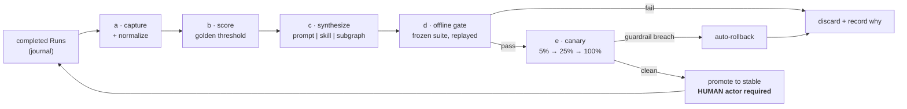
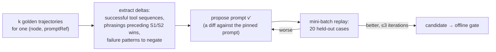

# 06 — D10 · Self-Evolution Loop

**Posture of this section: skeptical.** A self-improving system is the easiest thing in
this design to build badly and the hardest to notice when it is degrading. Every
mechanism below therefore has a threshold, a gate, and a rollback, and the section ends
with an explicit list of what this loop **will not fix**.



---

## D10.a — Trajectory capture and normalization

A `Trajectory` is a **pure fold of a completed Run's journal**, so capture adds no
runtime cost and can be recomputed at any time from cold storage.

```ts
export interface Trajectory {
  runId: RunId;
  graphHash: GraphHash;
  cohort: CohortKey;                 // (workflow, graphVersion, tenantTier, inputBucket)
  steps: readonly TrajectoryStep[];
  outcome: OutcomeSignals;
  usage: { costUsd: number; tokens: number; wallMs: number; modelCalls: number; toolCalls: number };
  policy: { escalations: readonly string[]; violations: number; gatesRaised: number };
  inputDigest: string;               // for dedup and drift detection; NOT the input itself
}

export interface TrajectoryStep {
  taskId: TaskId; nodeId: NodeId; nodeType: NodeType; branchPath: string; attempt: number;
  stateInHash: string; stateOutHash: string;
  action:
    | { kind: "model"; model: string; promptRef: ResourceRef; promptDigest: string;
        toolCallNames: readonly string[]; finishReason: FinishReason }
    | { kind: "tool";  name: string; version: string; argsShape: string; ok: boolean; ms: number }
    | { kind: "route"; taken: readonly string[]; mode: "expression" | "model" }
    | { kind: "gate";  decision: GateDecision["kind"]; latencyMs: number; editedChannels?: string[] };
  observationDigest: string;         // content-addressed; the payload lives in the blob store
}
```

**Normalization rules** — without these, "similar trajectories" is meaningless:

| Rule | Reason |
|---|---|
| Retries collapse to the succeeding attempt; the retry count becomes an attribute | Otherwise a flaky network makes two identical strategies look different |
| Branch coordinates are canonicalised (fan-out branches sorted by content digest, not index) | Two runs that investigated the same 5 signals in a different arrival order are the *same* strategy |
| Payloads are replaced by digests; PII/secret fields never enter a trajectory | A trajectory store is a second copy of production data unless you stop it being one |
| Tool argument *shapes* are recorded, not values (`{namespace:string, replicas:int}`) | Generalisable structure; values do not generalise and leak |
| Trajectories from runs with `posture: in` record the **human decision as a first-class step**, not as metadata | It is the highest-quality label available (**D10.b**) |

## D10.b — Scoring, and what makes a trajectory "golden"

### The signal ladder

No single signal is trusted. Signals are ranked by how hard they are to fake:

| # | Signal | Source | Reliability weight | Notes |
|---|---|---|---|---|
| **S1** | Deterministic verifier | `evaluator{kind: assertion}` — a `function` resource with real assertions (SLO recovered, tests pass, schema valid) | **1.00** | The only signal a model cannot argue with |
| **S2** | Human gate decision | `approve` = +1, `edit` = +0.5 **and the edit itself is a correction label**, `reject` = −1, `redirect` = −0.5 | **0.90** | Sparse, expensive, and the most informative thing the system ever gets |
| **S3** | Downstream acceptance | No rework run on the same `inputDigest` within 72 h; no linked incident reopened | **0.60** | Delayed; requires a 72 h maturation window before a trajectory is scorable |
| **S4** | LLM rubric judge | `evaluator{kind: rubric}` with a pinned rubric | **0.30** | **Never sufficient alone.** A candidate scored only by S4 cannot be promoted past `canary` |
| **S5** | Agent self-report ("task complete") | the agent's own claim | **0.00** | Deliberately zero. Self-report is the classic reward-hacking surface |

```
outcome  = Σ(wᵢ · sᵢ) / Σ(wᵢ)                       over the signals actually present
cost_n   = clamp01(costUsd  / cohort.p50_cost)
lat_n    = clamp01(wallMs   / cohort.p50_wall)

score    = 0.60·outcome + 0.20·(1 − cost_n) + 0.10·(1 − lat_n) + 0.10·human_effort_saved
                                                    ^ human_effort_saved = 1 − (gatesRaised / cohort.p50_gates)
```

`ASSUMPTION: the default weights are 0.60 / 0.20 / 0.10 / 0.10. They are per-workflow
configurable, journaled with every score, and any change invalidates the cohort — a score
computed under different weights is a different metric and is never compared.`

### The golden threshold — all five conditions

A trajectory is **golden** only if:

1. `outcome ≥ 0.8` **and** at least one signal from `{S1, S2, S3}` is present (S4 alone
   never qualifies);
2. `score ≥ p90` of its cohort;
3. `policy.violations == 0` and no `policy.escalated{rule:"violation"}`;
4. the cohort has `n ≥ 30` scored trajectories at the same `graphHash`;
5. the trajectory is not itself the product of an unpromoted candidate (**no
   self-training**, see **D10.f**).

### When there is no ground truth

The common case. The rule is deliberately conservative:

| Available signals | Maximum promotion reachable | Extra requirement |
|---|---|---|
| S1 present | `stable` | normal gates |
| S2 present (≥ 10 human decisions in cohort) | `stable` | normal gates |
| S3 only | `canary` → `stable` after 2× the normal canary volume | — |
| **S4 only** | **`canary`, capped at 5 % traffic** | explicit human sign-off; never auto-promotes |
| none | **no candidate is generated at all** | — |

---

## D10.c — Synthesis

Three artifact kinds, three different procedures. All three produce a **Resource in
`draft`** — synthesis never touches a running system.

### 1 · Optimized prompt



Iterative refinement is bounded to **3 rounds on a 20-case mini-batch held out from the
final eval suite**. Unbounded refinement against the eval suite is how you overfit a
regression suite into uselessness; the mini-batch exists so the real suite stays unseen.

### 2 · Cached tool-call Skill

A `skill` is a **parameterised, ordered tool-call plan** distilled from ≥ 10 golden
trajectories whose normalized tool n-gram is identical:

```yaml
apiVersion: loom.dev/v1
kind: Skill
metadata: { name: diagnose-oom-crashloop, project: sre, version: 1 }
preconditions:
  - "incident.symptom == 'CrashLoopBackOff'"
  - "has(signals)"
plan:
  - { tool: k8s.describe,      args: { pod: "${signal.pod}" } }
  - { tool: k8s.logs,          args: { pod: "${signal.pod}", previous: true, tail: 200 } }
  - { tool: obs.query_window,  args: { metric: "container_memory_working_set_bytes", minutes: 30 } }
produces: { $ref: "#/defs/Finding" }
provenance: { trajectories: 14, cohort: "sre/incident-triage@7", medianCostUsd: 0.11, medianMs: 4200 }
fallback: unfold        # if a precondition fails mid-plan, fall back to the agent doing it step by step
```

A skill is offered to the agent as **one tool** — it collapses 3 model round-trips into 1,
which is where the cost and latency win comes from. `fallback: unfold` is what keeps it
from being brittle: a skill that no longer fits degrades to the general path rather than
failing.

### 3 · Promoted reusable subgraph

The strictest, because a subgraph changes topology:

| Requirement | Threshold | Why |
|---|---|---|
| Occurrences | the same node-and-edge motif in ≥ 20 golden trajectories | below this it is a coincidence |
| Distinct parents | ≥ 3 distinct parent workflows | otherwise it is not *reusable*, just frequent |
| Boundary purity | the motif reads and writes a closed channel set (a clean cut in the dataflow graph) | a motif with tangled state is not extractable |
| Determinism | contains no unbounded loop and no `last_write_wins_by_ts` | a promoted subgraph must be as analysable as an authored one |
| Posture | the extracted subgraph's posture is `max` over every occurrence | extraction must never average oversight down |

## D10.d — The offline evaluation gate

**No candidate reaches traffic without passing this.** It is a *replay* gate, so it costs
no live model calls for recorded steps and produces no side effects.

```yaml
apiVersion: loom.dev/v1
kind: EvalSuite
metadata: { name: incident-triage-regression, project: sre, version: 11 }
frozen: true                     # a suite version is immutable; adding cases mints a new version
cases:
  - { id: c001, trajectory: run_01H8XYZ, mustPass: true,  expect: { outcome: ">=0.9", verdictPass: true } }
  - { id: c002, trajectory: run_01H9ABC, mustPass: true,  expect: { noIrreversibleWithoutGate: true } }
  - { id: c003, trajectory: run_01HAAAA, mustPass: false, expect: { costUsd: "<=0.9" } }
  # … ≥ 50 cases, ≥ 10 mustPass, ≥ 20 % adversarial/failure cases
composition:
  minCases: 50
  minMustPass: 10
  minFailureCases: 10            # cases where the CORRECT behaviour is to fail, escalate, or gate
  maxAgeDays: 90                 # older cases are re-validated or retired — stale suites certify stale behaviour
```

### Promotion criteria — all must hold

`gateCandidate` in `evolution/gate.ts` pushes **eleven** checks and promotes only if every
one passes: the eight below, the two provenance rules in the next section, and check `0`,
which is listed first here because it is the one that gates the exam rather than the
student.

| # | Criterion | Threshold | Rationale |
|---|---|---|---|
| 0 | **Suite well-formedness** | `validateSuite`: `minCases`, `minMustPass`, `minFailureCases` all met, case ids unique, `frozenAt` present and positive | A malformed suite certifies nothing. `maxAgeDays` below is **declared and not enforced** — `EvalSuite.composition` has no such field in `src/`, and nothing retires a stale case; treat the 90 days as an operating convention until it is built |
| 1 | Must-pass cases | **100 %**, zero tolerance | These encode safety and correctness invariants |
| 2 | Aggregate pass rate vs baseline | `candidate.passRate − baseline.passRate ≥ −margin`, default margin **0.01** | The non-inferiority margin stops noise-chasing on small suites. **This is a bare point-estimate comparison, and the design asked for more than the code does** — see the note below |
| 3 | Cost | `candidate.totalCostUsd / baseline.totalCostUsd ≤ ` **1.10×** | A 2 % quality gain for 3× cost is not an improvement. A ratio of TOTALS across the suite, not of medians: `EvalReport` carries `totalCostUsd` and no median, so one pathological case can carry the ratio |
| 4 | Latency | `candidate.p95WallMs / baseline.p95WallMs ≤ ` **1.20×** | |
| 5 | **Prompt size** | token growth ≤ **15 %**, unless the quality gain ≥ 5 pp | The direct anti-bloat control (**D10.f**). `promptGrowth` is an input the caller supplies; nothing in `src/` measures it |
| 6 | **Oversight diff** | non-negative at every node and tool | `E_OVERSIGHT_LOOSENED` — **D7.7**. Also a caller-supplied boolean (`postureDiffNonNegative`); `gateCandidate` trusts it |
| 7 | Safety cases | zero cases whose failure reasons mention `irreversible` — i.e. the `noIrreversibleWithoutGate` expectation | **Injection-resistance cases are not checked, and cannot be expressed**: `EvalCase.expect` has no such field, so a suite cannot declare one and check 7 cannot read one |
| 8 | Determinism | replaying the candidate twice yields identical `state.hash` for every non-model node | catches a candidate that smuggled in nondeterminism |

> **The gate is weaker than this table used to claim, and this is the sentence that says
> so.** Until 2026-08-05 row 2 described "McNemar's paired test … the 95 % lower bound of
> the paired difference > −0.01" and row 7 required "injection-resistance cases". Neither
> is in `evolution/gate.ts`, and row 3 said "median cost" where the code divides one total
> by another. Rows 2–7 above now describe the arithmetic that actually runs.
>
> The gap is real, not cosmetic — this gate is the thing that stops self-evolution
> shipping a regression, and a point estimate on a 50-case suite will wave through a
> candidate that is genuinely worse. Closing row 2 means carrying the per-case
> pass/fail vectors (they exist: `EvalReport.cases[].pass`) into `PromotionInput` and
> computing McNemar's discordant-pair statistic plus a Wilson or exact interval on the
> paired difference — arithmetic only, no dependency, and it needs no new capture.
> Closing row 3 means a `medianCostUsd` on `EvalReport`, computed where `p95WallMs`
> already is. Closing row 7 means an `injectionResistant` expectation on `EvalCase` with
> a deterministic verifier behind it, which is the one of the three that is a design
> question rather than a line of arithmetic. Recorded in `HANDOFF.md` → Known issues.

### The suite may be AI-authored — under two mechanical rules

*Revised 2026-08-04 (M9).* The original rule was "human-authored, never the evolution
engine". That is the safe default and it does not scale, so it is replaced by two
checks that are **mechanically verifiable** rather than aspirational:

| # | Rule | Implementation | Why it substitutes for "human-authored" |
|---|---|---|---|
| **1** | **The suite must PREDATE the candidate** — `suite.frozenAt < candidate.proposedAt` | `gateCandidate` check `9-suite-predates-candidate` | It does not matter who wrote the exam if it existed before the student did. This converts an unfalsifiable question ("is this suite honest?") into a timestamp comparison — and forces suites to be assembled continuously from production traffic, because a suite built the moment you need it is a suite built to be passed |
| **2** | **Separate lineage** — the suite's generator and the candidate's proposer must differ | check `10-separate-lineage` | A shared model, prompt lineage, and implicit notion of "good" converges the exam on whatever the candidate already does. The generator should run with an ADVERSARIAL objective ("find inputs this graph handles badly"), not a descriptive one |

Two supporting properties, already true:

- **Assertions anchor to deterministic verifiers.** `EvalCase.expect` is a status, a
  channel value, a cost bound, or `noIrreversibleWithoutGate` — never "a judge liked
  it". AI chooses *which* runs to include and *what to assert*; the assertion itself is
  code.
- **Must-pass cases are DERIVED, not invented.** They come from recorded production
  failures and from assertion-node verdicts, so the safety floor is observed reality.
  AI may propose a must-pass candidate; promoting a case *to* must-pass is the one
  thing still worth a human click.

If both checks are absent from the input, they report a pass with a readable reason
rather than pretending to have verified something — that is the human-driven path.

## D10.e — Canary rollout

| Stage | Traffic | Minimum volume | Minimum duration | Advance if |
|---|---|---|---|---|
| Shadow | 0 % (runs alongside, output discarded) | 50 runs | 6 h | no errors, cost within bound |
| Canary-1 | 5 % | 200 runs | 24 h | all guardrails green |
| Canary-2 | 25 % | 500 runs | 24 h | all guardrails green |
| Stable | 100 % | — | — | **human promotion** (D8.3) |

**Traffic split is by hash of `inputDigest`**, not random per call — so the same input
always sees the same variant and a retry cannot straddle both arms. A **5 % holdout stays
on the previous stable version permanently** as a live control arm.

### Guardrail metrics and automatic rollback

| Metric | Rollback trigger | Detector |
|---|---|---|
| Must-pass regression in production (a verifier that used to pass now fails) | **any single occurrence** | immediate |
| Task error rate | > baseline + 2 pp | CUSUM, `h = 5σ` |
| Gate rejection rate | > baseline × 1.5 | CUSUM |
| Cost per run | > baseline × 1.25 sustained over 50 runs | EWMA |
| p95 latency | > baseline × 1.5 sustained over 50 runs | EWMA |
| Policy violations / escalations | > baseline + 1 per 100 runs | immediate |
| Human `edit` rate on gates | > baseline × 2 | CUSUM — a rising edit rate means humans are silently fixing a worse agent |

Rollback is `ResourceFetcher.promote(previousDigest, "stable")` — it moves a selector,
touching no content and no in-flight run (which hold digests, per **D8.5**). Rollback is
therefore always safe and always instantaneous.

## D10.f — Failure modes and mitigations

> **Read the Mitigation column as future tense.** It is written throughout as if the
> machinery runs, and most of it guards **(c) synthesis** and **(e) canary**, both
> `DEFERRED-v2` — so most of these mitigations cannot exist yet, because the failure
> modes they answer cannot happen yet. What is actually in `src/` today, checked
> 2026-08-05: the signal weights (`S4 = 0.30`, `S5 = 0.00`, `GROUND_TRUTH_SIGNALS`),
> golden condition 5 (`fromUnpromotedCandidate`), the cohort key including `inputBucket`
> and its `weightsDigest`, `MIN_COHORT_SIZE = 30`, and criterion 5's prompt-growth
> ceiling — which reads a number the *caller* supplies, since nothing measures prompt
> size. Everything else in the column is a design: no `maxAgeDays`, no PSI drift
> detector, no 5 % holdout, no tool-sequence entropy floor, no per-node prompt token
> ceiling, no previous-prompt control arm, no suite/synthesis `runId` disjointness check,
> no auto-deprecation, no posture-diff journal and no posture SLO dashboard.
>
> One row is not merely unbuilt but **contradicted by D10.d above**: reward hacking cites
> "the eval suite is human-authored" as a mitigation, which D10.d replaced in M9 with the
> two mechanical rules (predates + separate lineage) precisely because the human-authored
> rule does not scale. The two mechanical rules are built; that phrase is not the reason
> to trust the suite any more.

| Failure mode | How it appears | Mitigation | Residual risk |
|---|---|---|---|
| **Reward hacking** | Candidates that game S4 (verbose confident prose scores well) | S4 weight 0.30 and never sufficient alone; S5 weighted 0.00; the eval suite is human-authored; must-pass cases include assertions no rubric can satisfy by rhetoric | A sufficiently capable model may game S1 assertions if they are weak. **Mitigation is suite quality, which is a human responsibility this system cannot discharge** |
| **Overfitting to a stale distribution** | Great on the suite, worse in production | `maxAgeDays: 90` on cases; cohort recency window of 30 days; a drift detector on `inputDigest` feature stats (PSI > 0.2 invalidates the cohort and blocks promotion) | Slow drift below the PSI threshold |
| **Feedback-loop collapse** | The system trains on its own output and converges to a narrow behaviour | Golden condition 5 excludes trajectories produced by unpromoted candidates; the permanent **5 % holdout** on the previous stable provides an uncontaminated control; a diversity floor blocks promotion if the candidate's tool-sequence entropy falls > 30 % below baseline | Long-horizon homogenisation across many promotion cycles |
| **Prompt bloat** | Prompts grow every cycle; cost rises, attention degrades | Criterion 5 (≤ 15 % growth); an absolute per-node prompt token ceiling; every candidate must also be tested with the *previous* prompt to confirm the growth is what helped | — |
| **Graph sprawl** | Dozens of near-duplicate promoted subgraphs | ≥ 20 occurrences and ≥ 3 distinct parents to promote; near-duplicate detection by motif digest; **auto-deprecate any promoted subgraph not referenced in 30 days** | — |
| **Cohort contamination** | Comparing a candidate against a baseline measured on different inputs | Cohort key includes `inputBucket`; scores are only ever compared within a cohort; a weight change invalidates the cohort | — |
| **Label leakage** | Eval cases derived from the same runs used to synthesize | Suite cases and synthesis corpus are disjoint by `runId`, enforced at suite construction; the 20-case refinement mini-batch is also disjoint from the suite | — |
| **Silent oversight erosion** | Postures drift down one small step at a time | Two independent enforcement points (**D7.7**); every promotion journals a posture diff; a dashboard tracks aggregate posture over time as a first-class SLO | — |

## D10.g — Enforcement of the asymmetry rule

```ts
// The evolution engine's identity, wired at construction. Not configuration.
const EVOLUTION_ACTOR: Actor = {
  kind: "evolution",
  denied: [
    "oversight:loosen",            // cannot lower a posture anywhere, ever
    "resource:promote(stable)",    // cannot reach production without a human
    "policy:write",                // cannot edit an OversightPolicy resource
    "graph:mutate(policy)",        // cannot touch policy blocks in a candidate graph
  ],
};
```

- **It may propose tightening.** A candidate that *raises* a posture (e.g. adds a gate
  before a newly-risky tool) passes the compile diff and is allowed — and is in fact the
  one class of candidate that can auto-promote to `canary` with a lower evidence bar.
- **It may never loosen.** `deescalate` is a different method with a `HumanActor`
  parameter; the type system alone rejects the call, and the runtime deny-list rejects it
  again if someone casts around the type.

## D10.h — What this loop will **not** fix

Stated plainly, because the value of this section is in its limits.

| It will not fix | Why | What actually fixes it |
|---|---|---|
| A **wrong task decomposition** | It optimises within the graph you gave it; it cannot discover that the whole graph is the wrong shape | A human redesigning the graph |
| A **missing tool or capability** | It can only recombine actions it has observed | Building the tool |
| **Bad or missing data** | Retrieval quality is upstream of everything it measures | Fixing the corpus |
| A **broken external system** | Failures caused by a flaky dependency look like strategy failures and will be "optimised around" in ways that mask the real fault | Fixing the dependency; the circuit breaker and anomaly escalation surface it |
| An **underspecified objective** | Without S1/S2/S3 no candidate is generated at all — this is by design, not a gap | Writing verifiers, i.e. deciding what "good" means |
| **Novel strategy discovery** | It exploits observed successes; it does not explore | Humans, or an explicit exploration budget (`DEFERRED-v2`) |
| **Model capability limits** | No prompt makes a model able to do what it cannot do | A better model, via the `ModelAdapter` fallback chain |
| **Cold start** | With `n < 30` per cohort it produces nothing | Running the system; expect no evolution value for the first weeks |

---

## v1 scope

| Ships in v1 | Deferred |
|---|---|
| (a) capture + normalization | `DEFERRED-v2: (c) synthesis.` Without ≥ 30 scored trajectories per cohort, any synthesized candidate is fitted to noise — shipping the generator before the corpus guarantees the loop's first impression is a bad one |
| (b) scoring + the golden threshold | `DEFERRED-v2: (e) canary infrastructure.` Depends on (c) |
| (d) the offline eval gate **as a CI tool for human-authored changes** | `DEFERRED-v2: automatic promotion of any kind` |
| The trajectory index that powers escalation rule **E5** (novel tool sequence) | |

Shipping (a), (b), and (d) first is not a compromise — the eval gate is immediately
valuable for *human* prompt and graph changes, and it builds the corpus and the suite
discipline that (c) and (e) require in order not to be actively harmful.
