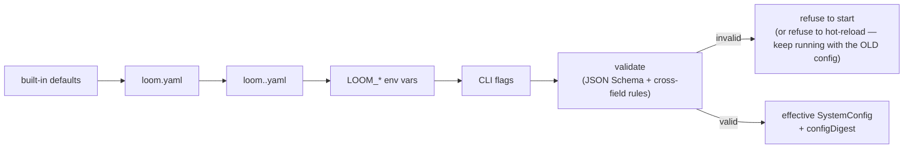
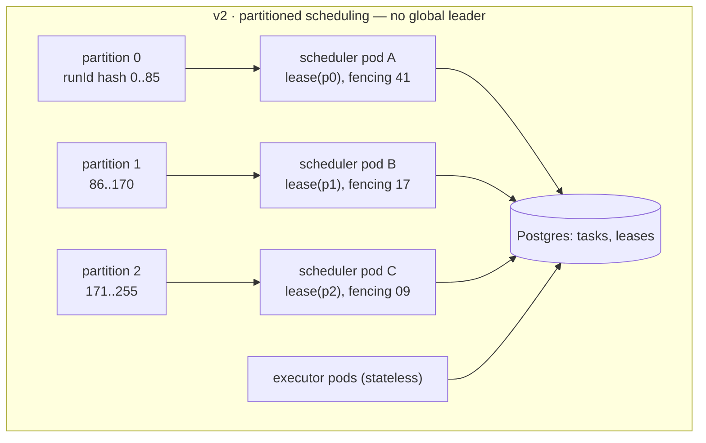
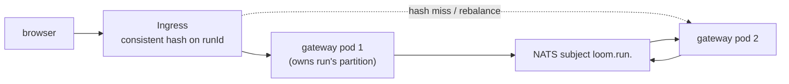

# 07 — D11 · Configuration Hierarchy, D12 · Deployment Strategy

---

# D11 — Configuration hierarchy

Four levels. Every field belongs to exactly one **merge class**, and the class — not the
level — decides how conflicts resolve. This is what makes "a node cannot weaken a system
guarantee" a property of the merge algorithm rather than a rule reviewers must remember.

```
System  ──►  Workflow  ──►  Agent/Node  ──►  Tool
(daemon)     (GraphSpec)    (node block)     (tool manifest + node.tool.policy)
```

## D11.1 — Level 1 · System (`loom.yaml`)

```yaml
apiVersion: loom.dev/v1
kind: SystemConfig

server:
  host: 127.0.0.1                 # RESTART
  port: 8787                      # RESTART
  dataDir: ./.loom                # RESTART — SQLite, CAS blobs, scratch
  publicUrl: http://localhost:8787 # RESTART — used in gate delivery links

runtime:
  pools:                          # HOT — applies to the next lease, not to running Tasks
    model:    { size: 16 }
    tool:     { size: 32 }
    function: { size: 0 }         # 0 ⇒ cpu core count
  scheduler:
    tickMs: 1000                  # HOT
    policy: dwrr                  # HOT — dwrr | fifo (fifo is for debugging only)
    withinRun: criticalPathFirst  # HOT — criticalPathFirst | fifo
    leaseSeconds: 60              # HOT
    heartbeatSeconds: 20          # HOT
  defaults:                       # HOT — floors/ceilings inherited by every workflow
    timeoutMs: 300000
    gracePeriodMs: 15000
    retry: { maxAttempts: 3, backoff: exponential, initialMs: 500, maxMs: 30000, jitter: true }
    circuitBreaker: { failureThreshold: 5, windowMs: 60000, halfOpenAfterMs: 30000 }

tenancy:
  default:
    concurrentRuns: 20            # HOT
    queueDepth: 200               # HOT — beyond this, submit returns 429
    maxParallelismPerRun: 32      # HOT — in-flight Tasks per Run (D6.3 level 2)
    budget: { costUsdPerDay: 250, tokensPerDay: 50000000 }   # HOT

oversight:
  floor: on                       # HOT-TIGHTEN ONLY — the system-wide posture floor.
                                  # This is the DEFAULT (M8): nearly free, since the
                                  # read_only window is 0 ms, and it is the only way to
                                  # have a lever between "automatic" and "blocking gate".
  interventionWindowMs:           # HOT
    read_only: 0
    reversible_write: 0           # a hold on an undoable action is pure latency (M8)
    irreversible: 5000
    externally_visible: 5000
  gateDefaults: { onTimeout: fail, respondWithinMs: 900000 }   # HOT-TIGHTEN ONLY

models:
  providers:
    anthropic: { apiKeyRef: "secret://env/ANTHROPIC_API_KEY", baseUrl: null }   # RESTART
    openai:    { apiKeyRef: "secret://env/OPENAI_API_KEY" }                     # RESTART
    vllm:      { baseUrl: http://localhost:8000/v1, apiKeyRef: null }           # RESTART
  priceTable: price-table@2026-08   # HOT — pinned; changing it invalidates cost cohorts
  rateLimits:                       # HOT
    "anthropic/claude-opus-5": { rpm: 200, tpm: 400000 }

security:
  capabilities:
    granted: ["fs:read", "obs:*", "kb:read"]     # HOT-TIGHTEN ONLY
    denied:  ["shell:exec"]                      # HOT — adding a deny is tightening
  sandbox: { kind: subprocess, egress: proxy, egressAllowlist: ["api.github.com"] }  # RESTART
  secrets: { provider: env }                     # RESTART — env | file | vault

telemetry:
  otlp: { endpoint: http://localhost:4317, protocol: grpc }   # RESTART
  sampling: { defaultHeadRatio: 0.2, tailWindowMs: 60000 }    # HOT
  retention: { hotDays: 7, warmDays: 30, coldDays: 365, auditYears: 7 }  # HOT

storage:
  journal:     { driver: sqlite, dsn: "file:.loom/journal.db?_journal_mode=WAL" }   # RESTART
  readModels:  { driver: sqlite, dsn: "file:.loom/read.db?_journal_mode=WAL" }      # RESTART
  blobs:       { driver: fs, path: ./.loom/cas }                                    # RESTART
  bus:         { driver: inproc }                                                   # RESTART
```

## D11.2 — Level 2 · Workflow, Level 3 · Node, Level 4 · Tool

Levels 2 and 3 live **inside the `GraphSpec`** (`policy:` at graph level, `policy:` on
each node — see **D5.4**), which is deliberate: config that changes execution semantics
must be content-addressed and pinned with the graph, or the pinning rule (**D8.5**) is a
lie. Level 4 is the tool manifest plus a node's `tool.policy` override.

```yaml
# Level 2 — inside GraphSpec
policy:
  posture: on
  budget: { costUsd: 12.0, tokens: 2000000, wallMs: 900000 }
  capabilities: [net:fetch, obs:query, k8s:read, k8s:write]
  expansion: { maxNodes: 64, maxDepth: 3, maxFanout: 25, maxLoopIterations: 3 }
  onBudgetExhausted: gate

# Level 3 — inside a node
- id: apply_remediation
  policy:
    posture: in                       # raises; could never lower
    budget: { costUsd: 0.5 }
    capabilities: [k8s:write]         # intersected with levels 1–2
  retry: { maxAttempts: 1 }
  timeoutMs: 60000

# Level 4 — tool manifest (authoritative for safety fields) + node-local override
tool_manifest/k8s.apply@3.0:
  capabilities: [k8s:write]
  irreversibility: irreversible       # NOT overridable downward at any level
  idempotent: false                   # NOT overridable at any level
  timeoutMs: 30000
```

## D11.3 — Merge precedence

The general rule is **most specific wins**. The exceptions are the point of the table.

| Merge class | Fields | Operator | Direction | Rationale |
|---|---|---|---|---|
| **Posture** | `posture`, gate `onTimeout` strictness | `max` over the lattice `out < on < in` | tighten only | A node cannot disable a system safety floor (**D7.6**) |
| **Capability** | `capabilities.granted` | **intersection** with every ancestor | narrow only | Authority is delegated downward; it cannot be manufactured |
| **Deny** | `capabilities.denied` | **union** | widen only | A deny anywhere is a deny everywhere |
| **Budget** | `costUsd`, `tokens`, `wallMs`, `maxTurns` | `min` | shrink only | A node cannot grant itself more than its run has |
| **Expansion** | `maxNodes`, `maxDepth`, `maxFanout`, `maxIterations` | `min` | shrink only | Blast-radius bounds |
| **Reliability** | `retry.maxAttempts`, `timeoutMs`, `gracePeriodMs` | most specific wins, **clamped** to the system ceiling | either, bounded | Node authors know their node; the system caps pathological values |
| **Irreversibility / idempotency** | tool manifest fields | **not overridable at any level** | fixed | These are facts about the world, not preferences |
| **Ergonomic** | pool sizes, tick, log level, sampling, UI prefs | most specific wins | either | No safety content |
| **Identity** | `dataDir`, ports, DSNs, provider endpoints | system only; lower levels **may not declare** | — | Declaring one is a compile error, not a silent no-op |

### Worked conflict resolution

| Level 1 (system) | Level 2 (workflow) | Level 3 (node) | Level 4 (tool) | **Effective** | Why |
|---|---|---|---|---|---|
| `posture: on` | `posture: out` | — | `read_only` (`out`) | **`on`** | `max` — the workflow's attempt to loosen is ignored, and a warning is emitted |
| `posture: on` | `posture: on` | `posture: in` | — | **`in`** | `max` — tightening at any level always wins |
| `posture: out` | `posture: out` | `posture: out` | `irreversible` (`in`) | **`in`** | The tool's class enters the same `max` |
| `granted: [fs:*, net:fetch]` | `[net:fetch, k8s:write]` | `[k8s:write]` | needs `k8s:write` | **denied** (`E_CAP_DENIED`) | Intersection is `∅` for `k8s:write` — the system never granted it |
| `costUsd/day: 250` | `costUsd: 12` | `costUsd: 0.5` | — | **0.5 per call, 12 per run, 250 per day** | `min` at each scope; enforced by reservation (**D6.5**) |
| `retry.maxAttempts: 3` | — | `5` | — | **3** | Clamped to the system ceiling |

## D11.4 — Validation, defaulting, and precedence of sources



- **Every level is JSON-Schema validated**, plus cross-field rules (`pools.model ≤ rate
  limit headroom`; `gracePeriodMs < timeoutMs`; `hotDays ≤ warmDays ≤ coldDays`).
- **Validation failure never degrades to a default.** At boot it exits non-zero with the
  offending path; on hot-reload it **keeps the previous config** and raises
  `config.reload_rejected`. Silently falling back to a default is how a production system
  ends up running with `posture: out` because someone typo'd a key.
- **`configDigest`** is journaled on every `run.submitted`, so "what config was this run
  executed under" is answerable a year later.
- Env var mapping is mechanical: `LOOM_RUNTIME_POOLS_MODEL_SIZE=24`.

## D11.5 — Hot-reload vs restart

| Class | Fields | Applies to |
|---|---|---|
| **Hot, immediate** | pool sizes, scheduler tick/policy/lease, retry & circuit-breaker defaults, rate limits, sampling, retention, log level, tenancy limits, price table | the next lease / next decision. **Never mutates a running Task** |
| **Hot, tighten-only** | `oversight.floor`, gate defaults, `capabilities.denied`, budget ceilings | in-flight runs immediately (tightening is always safe); loosening requires a restart **and** a human with `oversight:loosen` |
| **Hot, next-run-only** | anything inside a `GraphSpec` or a Resource | in-flight runs are pinned (**D8.5**) and unaffected |
| **Restart required** | `dataDir`, ports, storage DSNs, bus driver, blob driver, secret provider, sandbox kind, OTLP endpoint, provider base URLs | — |

Reload is triggered by `SIGHUP` or `POST /admin/reload`, is journaled as `config.reloaded`
with the before/after digests, and is atomic — a partially-applied config is never
observable.

## D11.6 — Secret references

Secrets appear in configuration **only as references**, never as values:

```
secret://<provider>/<path>[#<field>]
  secret://env/ANTHROPIC_API_KEY
  secret://file/etc/loom/creds.json#github.pat
  secret://vault/kv/data/loom/prod#slack_token        (v2)
```

Resolution happens at the effect boundary and produces a `SecretValue` whose
`toString()`, `toJSON()`, and `util.inspect.custom` all return `[secret]`. Journal
entries, prompts, spans, tool arguments, and UI payloads carry **the ref**. A secret can
therefore only escape by a tool deliberately writing it to its own output — which is why
tool output also passes the redaction detector sweep (**D9.6**).

## D11.7 — Where oversight posture is declared

| Level | Field | Merge | Notes |
|---|---|---|---|
| System | `oversight.floor` | `max` | the floor nothing may go below |
| Tenant | `tenants.<id>.oversight.floor` | `max` | may raise the system floor, never lower it |
| Workflow | `GraphSpec.policy.posture` | `max` | pinned with the graph |
| Node | `node.policy.posture` | `max` | |
| Tool | derived from `irreversibility` (**D7.6**) | `max` | not overridable downward |
| OversightPolicy resource | `posture` + `appliesTo` | `max` | a reusable, versioned bundle |
| Runtime escalations | E1–E11 (**D7.7**) | `max` | journaled, and survive in the projection |

**Conflicts do not exist by construction** — `max` over a total order is total and
associative, so the effective posture is independent of evaluation order. A declaration
that would lower the result is not an error but a **warning** (`GRAPH019: posture
declaration has no effect — a higher floor applies`), because failing the compile would
make it impossible to write a portable graph that runs `out` in dev and `in` in prod.

---

# D12 — Deployment strategy

## D12.1 — The hard constraint, discharged

```bash
./loom serve --data-dir ./.loom
# → creates .loom/{journal.db,read.db,cas/,scratch/}, migrates schema, binds :8787,
#   serves the embedded UI, ready in < 2 s. No Docker, no Postgres, no Kafka, no K8s.
```

One SEA binary with the UI assets embedded. `@loom/core` keeps **zero runtime
dependencies** (EAgent's `test/zero-dep.test.ts` discipline, carried over); React lives
only in `@loom/ui`, which is built to static assets at release time and embedded — so the
dependency arrow points one way and a library consumer never downloads React.

## D12.2 — Implementation swap table

**Only implementations change. No call site changes.** That is the point of **D3**.

| Interface | Single binary (v1) | K8s mesh (v2) | Swap risk |
|---|---|---|---|
| `StateStore` (journal) | SQLite WAL, single writer | Postgres, partitioned by `runId` | **medium** — `expectedSeq` CAS maps to `INSERT … WHERE seq = $expected`; both are transactional |
| `CheckpointStore` | SQLite + local CAS | Postgres + S3 | low |
| `EventBus` | in-process emitter | NATS JetStream | low — publish is already fire-and-forget and lossy-by-contract |
| `BlobStore` | local CAS directory | S3 / MinIO | low — content-addressed |
| `AgentScheduler` | in-process DWRR, no election | partitioned leases; each pod owns a hash range | **high** — see D12.4 |
| `GraphExecutor` | async pool in-process | N executor pods leasing Tasks | medium — already lease-based, so the change is *where* the worker runs |
| `ToolExecutor` | child process | K8s Job / Firecracker per call | medium — latency profile changes; `timeoutMs` defaults must be re-tuned |
| `ModelAdapter` | fetch + SSE | unchanged | none |
| `ResourceFetcher` | fs + SQLite + LRU | object store + Postgres + LRU | low — digests make caching trivial |
| `SecretProvider` | env / file | Vault / K8s CSI | low |
| `TraceEmitter` | OTLP → local collector | OTLP → Jaeger/Tempo + Prometheus | none |
| `HumanGateBroker` | SQLite + tick sweep | Postgres + delay queue | low — gates were always rows |
| `ControlPlaneAPI` | `node:http` | same behind Ingress | low |
| `RunEventStream` | in-proc SSE | SSE + consistent-hash routing (**D12.6**) | medium |

## D12.3 — Where state lives

| Data | v1 | v2 | Authoritative | Consistency |
|---|---|---|---|---|
| Journal (Events) | SQLite `journal.db` | Postgres, partitioned by `runId` | **yes** | linearizable **per Run**; no cross-run ordering |
| Read models (`runs`, `tasks`, `gates`, `leases`) | SQLite `read.db` | Postgres | no — folded | read-your-writes in-process; eventually consistent across pods |
| Checkpoints | SQLite + local CAS | Postgres + S3 | no — a fold snapshot | derived, verifiable against the journal |
| Artifacts / blobs | local CAS | S3 | **yes** (the bytes) | immutable, content-addressed |
| Resources | fs + SQLite index | object store + Postgres | **yes** | immutable content; the `selector → digest` map is strongly consistent |
| Spans / metrics | SQLite + DuckDB | ClickHouse + Prometheus | no — derived, **sampled** | best-effort |
| Audit records | SQLite (separate file) | append-only store, WORM | **yes** | linearizable, independent 7-year lifecycle |
| Secrets | env / file | Vault / CSI | **yes** | never journaled, never cached to disk |

## D12.4 — Scheduler: leader election and work leasing

**v1 has no leader**, because there is one process. The design nonetheless uses leases
from day one, so v2 is a swap and not a rewrite.



- **Partitioned, not singleton.** A global leader would be both a bottleneck and a single
  point of failure. Each scheduler leases a hash range of `runId`s via a `partition_leases`
  row with a fencing token (or a K8s `Lease` object).
- **Task leases are the liveness mechanism.** A worker's death needs no cleanup path: the
  lease expires and the Task is re-leased at `attempt+1`. Every durable write carries the
  fencing token, so a stalled worker that wakes up late is rejected with
  `E_FENCING_STALE`, not allowed to double-commit.
- **Heartbeats extend, they do not renew forever.** A Task exceeding `timeoutMs` is
  reclaimed regardless of heartbeats, so a wedged tool cannot hold a slot indefinitely.

## D12.5 — Exactly-once, honestly

| Layer | Guarantee | Mechanism |
|---|---|---|
| **Task execution** | **at-least-once** | leases expire; a crashed attempt is retried |
| **State commit** | **exactly-once** | conditional append on `expectedSeq` + fencing token; the losing attempt discards its work with `E_SEQ_CONFLICT` |
| **Effects on idempotent tools** | **effectively-once** | stable effect key `(taskId, callOrdinal)` passed as the external idempotency key; the journal dedupes replays |
| **Effects on non-idempotent tools** | **at-least-once, and explicitly surfaced** | `effect.started` without a terminal record ⇒ `outcome: "unknown"`; auto-retry refused; the run takes its error edge or gates |
| **Journal → UI delivery** | at-most-once on the bus, **exactly-once via `replayThenTail`** | `seq`-keyed idempotent client apply |
| **Gate decisions** | exactly-once | `(gateId, approverId)` idempotency key |

The honest headline: **the system provides exactly-once *state*, not exactly-once *side
effects***. Exactly-once side effects are not achievable against systems that do not
offer idempotency; the design's contribution is to make the gap explicit, narrow
(`irreversible ∧ ¬idempotent` only), and visible to a human.

### Idempotent tool calls

```ts
const effectKey = `${taskId}:call:${callOrdinal}`;   // stable across retry, restart, replay
// HTTP tools:  Idempotency-Key: <effectKey>
// MCP tools:   request id derived from <effectKey>
// Custom:      the manifest declares `idempotencyArg`, and the executor injects it
```

Tools that cannot support this declare `idempotent: false` and are governed by the row
above. `GRAPH011` warns at compile when such a tool has no `error` edge.

## D12.6 — Sticky streaming sessions



Stickiness is an **optimisation, not a requirement**. Any pod can serve any run's stream
by subscribing to the bus subject and, for the catch-up portion, reading the journal. A
rebalance therefore causes at most a reconnect, which the `Last-Event-ID` protocol
already handles gap-free (**D9 §L1.1**). Designing stickiness as a *requirement* would
make rolling deploys visibly break every open stream.

## D12.7 — Durable gates across restarts and rolling deploys

```mermaid
sequenceDiagram
  participant K as K8s
  participant P1 as pod v1
  participant DB as Postgres
  participant P2 as pod v2
  K->>P1: SIGTERM (preStop)
  P1->>P1: stop leasing new Tasks
  P1->>P1: control Tasks finish (< 5 s); long Tasks release(lease, "requeue")
  Note over P1,DB: open gates need NOTHING — they are rows, not promises
  P1->>K: exit within terminationGracePeriodSeconds
  K->>P2: start v2
  P2->>DB: lease partitions · fold journals · re-lease requeued Tasks
  Note over P2,DB: DESIGNED, NOT BUILT — sweepTimeouts would resume gate SLAs<br/>from the persisted timestamps here. Nothing calls it.
```

Three properties make this boring, which is the goal:

1. `terminationGracePeriodSeconds` only needs to exceed the *control-task* duration
   (milliseconds), because long Tasks are released rather than waited on.
2. Gate SLA clocks are **absolute timestamps in the database**, not in-memory timers, so a
   deploy neither resets nor skips an SLA. *Nothing sweeps them*, though — see the note in
   the diagram — so today a deploy neither resets nor advances one either.
3. A gate raised by v1 and answered under v2 works because the gate payload is
   self-contained and the decision is applied by whichever executor re-leases the Task.

## D12.8 — Migration path: local → distributed

Migration is **per Run**, which is possible because Runs share nothing except Resources.

```mermaid
graph LR
  A["1 · stand up Postgres + S3 + NATS<br/>point a NEW instance at them"] --> B["2 · dual-read verify:<br/>replay N finished runs from SQLite<br/>against the Postgres impl, compare state hashes"]
  B --> C["3 · migrate Resources first<br/>(immutable, content-addressed ⇒ trivially copyable)"]
  C --> D["4 · stop admitting NEW runs locally<br/>(existing runs continue)"]
  D --> E["5 · drain: finish or SUSPEND every run<br/>suspended runs are just rows"]
  E --> F["6 · export journals per run → import to Postgres<br/>verify head(seq) and state hash per run"]
  F --> G["7 · flip DNS / config; resume suspended runs"]
  G --> H["8 · keep SQLite read-only for 30 d as a fallback"]
```



Step 2 is the one that de-risks the whole thing: **replay is the migration test.** Because
a replayed run recomputes every `state.hash` and compares against the recorded value, a
storage-layer bug shows up as a hash mismatch on historical data *before* any production
traffic moves.

`ASSUMPTION: v1 targets ≤ 200 concurrent in-flight Tasks and ≤ 5k journal events/s on
one node.` Beyond either number, DL-1 and DL-7's reversal conditions fire and the
distributed path is opened.

**Neither number is measured continuously today, and the intended dashboard does not
exist.** `DESIGNED-NOT-BUILT(loom.scheduler.tick)`: spans are derived from journal events
(**D9.1**), no event covers a scheduler tick, and there is no tick loop to attach one to.
Journal append latency is likewise uninstrumented. What is available needs no new span and
should be wired before either reversal condition is trusted:

| Wanted | Available from the journal today |
|---|---|
| scheduler tick p99 | `task.leased.ts − task.ready.ts` per Task — queue wait, journaled for every Task, so a p99 over a real run is a fold |
| events/s | `seq` deltas over `ts` for a run, or `COUNT(*)` over the store's time window |
| event-loop share of CPU-bound function nodes | **nothing.** This half needs instrumentation that does not exist |

Until that is wired, "the decision to distribute is data-driven" describes an intention.
A p99 taken over a span that is never emitted is a p99 over zero samples, and it reads as
a check that passed.
