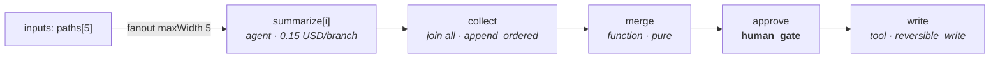

# 08 — D13 · Risk Register & Walking Skeleton, D14 · Assumptions & Open Questions

---

# D13 — Risk register and walking skeleton

## D13.1 — The build-vs-adopt question, answered before the risk table

It would be dishonest to present a durable-execution engine design without addressing why
we are not simply adopting one.

| Option | What it gives | What it does not give | Verdict |
|---|---|---|---|
| **Temporal / Cadence** | Durable execution, replay, retries, timers, leases — battle-tested | Requires a server cluster (violates the single-binary constraint); workflow-as-code, not workflow-as-**data**, so the UI/observability/evolution layers cannot consume one artifact (**DL-4**); no oversight model; no capability/policy layer | **Reject for v1.** Revisit if the single-binary constraint is dropped |
| **LangGraph / similar** | Graph model, state channels, checkpointing — closest conceptual match | Python-first; checkpointing is not an append-only audit log; no capability model; no posture lattice; no policy engine; distributing it is a rewrite | **Reject.** Borrow the *concepts* (typed channels, reducers, compiled graph) — the design does, explicitly |
| **Airflow / Dagster / Prefect** | Mature scheduling and UI | Batch/data-pipeline semantics: no streaming, no mid-run human gates, no per-node model budget, no agent runtime | **Reject** |
| **Build on the interfaces in D3** | Everything above is a swappable implementation; the single-binary constraint holds; the six layers consume one artifact | We own the scheduler, the journal, and the replay engine — roughly 6 of the 8 weeks | **Chosen** |

**Reverses when:** the single-binary constraint is dropped *and* a hosted Temporal is
already operated by the org. In that case `StateStore` + `AgentScheduler` + `GraphExecutor`
become a Temporal-backed implementation and the other 21 interfaces are unchanged — which
is itself an argument that the interface boundary is drawn in the right place.

## D13.2 — Risk register

| # | Risk | Likelihood | Impact | Mitigation | How we detect it early |
|---|---|---|---|---|---|
| **R1** | **Scope explosion** — 14 deliverables, 8 weeks, small team | **high** | **high** | Milestones M0–M6 are ordered so the walking skeleton is green at M2. Everything after M2 is additive. `DEFERRED-v2` is enforced, not aspirational | M2 slips past week 4 |
| **R2** | **Nobody authors GraphSpecs** — users want a chat box, not YAML | **high** | **high** | Ship a built-in `single-agent` graph so the chat experience is a one-node Run from day one; ship a `graph-from-goal` authoring agent that proposes a GraphSpec the human edits; the canvas is an editor, not a viewer | Week 6 dogfooding: count runs on authored graphs vs `single-agent` |
| **R3** | **Gate UX is unusable**, so operators set everything to `out` and the oversight model becomes decorative | medium | **high** | Queue saturation controls (**D7.9**) are v1, not v2; SLA-ordered queue; batching; measure and dashboard `posture` distribution as an SLO | The aggregate-posture dashboard trends toward `out` |
| **R4** | **Determinism leaks** — a `function` resource calls `Date.now()`/`Math.random()`/`fetch` directly and replay diverges | **high** | medium | Publish-time lint bans them; `ctx.now()`/`ctx.random()`/`ctx.effect()` are the only sanctioned paths; a CI job replays every fixture and asserts state-hash equality | Replay CI fails |
| **R5** | **SQLite single-writer contention** under fan-out | medium | medium | WAL mode; batch appends per Task commit (one transaction, N events); measure append p99 from day one; DL-7's reversal condition is pre-agreed | journal append p99 > 20 ms |
| **R6** | **Prompt injection causes real damage** via tool output | medium | **high** | Three-layer containment (**D6.8**): structural allowlist computed before the turn, provenance tagging, taint-triggered posture escalation. Injection-resistance cases are must-pass in every eval suite | Red-team suite in CI from M4 |
| **R7** | **Cost blowout** from fan-out | medium | **high** | `GRAPH009` proves `Σ(branch budgets) ≤ run budget` **at compile time**; reservation-based accounting (**D6.5**) closes the check-then-act race; degradation ladder | Budget dashboards; a compile that would exceed is rejected, not warned |
| **R8** | **Evolution loop silently degrades quality** | medium (once enabled) | **high** | Synthesis is `DEFERRED-v2` precisely to avoid this; when enabled: human-authored suites, permanent 5 % holdout, CUSUM guardrails, human-only `stable` promotion | Holdout arm outperforms the treatment arm |
| **R9** | **Model provider drift** breaks adapters mid-sprint | **high** | low | Adapters are `fetch`+SSE with no SDK (EAgent's proven approach); a cassette suite records real responses and replays them offline; every provider has a normalized error map | Nightly live smoke test against each provider |
| **R10** | **Replay divergence from runtime drift** — Node/library version changes alter serialization | medium | medium | Canonical JSON serialization (sorted keys, explicit number formatting) for every hash; the runtime version is journaled with each run; replay warns on mismatch | Replay CI against fixtures recorded on an older runtime |
| **R11** | **Distributed migration is harder than the interfaces promise** | medium | medium | The `expectedSeq` CAS and lease/fencing model are chosen *because* they port; step 2 of the migration (**D12.8**) replays historical runs against the new store before any traffic moves | Dual-read verification fails |
| **R12** | **Two systems to maintain** — EAgent users exist while Loom is built | **high** | medium | EAgent is frozen at `eagent-v1`, explicitly reference-only, with no feature work. Loom ships `single-agent` early so migration has a target | Any commit landing on `init` |
| **R13** | **The journal conflicts with data-erasure obligations** (GDPR/CCPA right to erasure vs an immutable log) | medium | **high** | **Crypto-shredding**: per-data-subject encryption keys for `pii`-classified payloads; erasure = destroy the key, leaving structure and hashes intact and the audit chain verifiable | Legal review — **this is Open Question Q3 and it can block GA, not just v1** |

## D13.3 — The walking skeleton

The smallest end-to-end slice that exercises every architectural claim. It contains a
parallel fan-out and a human gate, as required.

```yaml
apiVersion: loom.dev/v1
kind: GraphSpec
metadata: { name: skeleton-summarize, project: demo, version: 1 }
policy:
  posture: on
  budget: { costUsd: 1.0, tokens: 200000, wallMs: 120000 }
  expansion: { maxNodes: 12, maxDepth: 1, maxFanout: 5, maxLoopIterations: 1 }
  capabilities: [fs:read, fs:write]
channels:
  paths:    { type: array,  reduce: replace }
  path:     { type: string, reduce: replace }        # per-branch item
  digests:  { type: array,  reduce: append_ordered }
  merged:   { type: object, reduce: replace }
  written:  { type: object, reduce: replace }
  costUsd:  { type: number, reduce: sum, initial: 0 }
inputs:  [paths]
outputs: [written]
nodes:
  - { id: summarize, type: agent, reads: [path], writes: [digests, costUsd],
      agent: { profile: agent_profile/summarizer@stable, prompt: prompt/summarize-file@stable,
               outputSchema: { $ref: "#/defs/Digest" }, maxTurns: 3, tools: [fs.read] },
      policy: { budget: { costUsd: 0.15 } }, timeoutMs: 60000 }
  - { id: collect, type: join, reads: [digests], writes: [digests],
      join: { branches: [summarize], mode: all, onBranchError: skip, timeoutMs: 90000 } }
  - { id: merge, type: function, reads: [digests], writes: [merged],
      function: { ref: function/merge-digests@stable } }
  - { id: approve, type: human_gate, reads: [merged], writes: [merged],
      humanGate: { ref: oversight/demo-write@stable }, checkpoint: before }
  - { id: write, type: tool, reads: [merged], writes: [written],
      tool: { name: fs.write, version: "1.0", args: { path: "out/summary.md", body: "${merged.markdown}" } },
      retry: { maxAttempts: 1 }, checkpoint: both }
edges:
  - { id: e1, from: summarize, to: collect, kind: join, branches: [summarize] }
  - { id: e2, from: collect,   to: merge,   kind: seq }
  - { id: e3, from: merge,     to: approve, kind: seq }
  - { id: e4, from: approve,   to: write,   kind: seq }
entry: { fanout: { from: paths, to: summarize, as: path, maxWidth: 5 } }
```



### What the skeleton proves — the acceptance checklist

| # | Claim | How the skeleton proves it |
|---|---|---|
| 1 | One artifact serves all layers | The same YAML compiles, renders on the canvas, appears in spans via `graph.hash`, and is versioned as a Resource |
| 2 | Compile-time validation is real | Delete `maxWidth` ⇒ `GRAPH007`. Set `summarize` budget to 0.30 ⇒ `GRAPH009` (5 × 0.30 > 1.0) |
| 3 | Parallel fan-out works and is fair | 5 branches execute concurrently; a second Run submitted mid-flight is not starved (`loom.schedule.pick` deficits) |
| 4 | Typed join with a reducer | `digests` arrives in **branch-coordinate order**, not completion order — asserted by a test that delays branch 0 |
| 5 | Partial failure is contained | Make branch 2 fail ⇒ `onBranchError: skip`, `state.reduced{skipped:1, degraded:true}`, run still completes |
| 6 | **Durable human gate** | `kill -9` the process while the gate is open; restart; the gate is in the queue with its SLA clock intact; approving resumes the run |
| 7 | Checkpoints and rollback | Reject the gate ⇒ rewind to `checkpoint: before`; verify no `fs.write` occurred |
| 8 | Deterministic replay | `loom replay <runId>` reproduces every `state.hash` with zero network calls |
| 9 | Trace reconstructs the graph | `reconstruct(trace) ⊆ declared(graph.hash)` asserted in CI |
| 10 | Single binary, empty dir | `rm -rf .loom && ./loom serve` then submit — works with no external service |
| 11 | Posture is config-only | Flip `policy.posture` to `out` and remove the gate node's policy ⇒ the same graph runs autonomously, with no code change |
| 12 | Cost governance | Reservation prevents 5 parallel branches from collectively exceeding the run budget |

## D13.4 — Milestones

Eight weeks. Each milestone has a hard exit criterion; nothing advances on "mostly works".

| M | Weeks | Scope | Exit criterion |
|---|---|---|---|
| **M0** | 0.5 | Repo, workspaces, CI (typecheck, test, lint, zero-dep guard, interface-surface pin). `MockModelAdapter` (deterministic, offline) | `npm test` green offline with no API key |
| **M1** | 1.5 | `StateStore` (SQLite WAL journal + fold), `EventBus`, domain types, `GraphCompiler` with `GRAPH001..010` | Compile the skeleton; a fold of a hand-written journal reproduces expected state; conditional-append CAS test passes under simulated concurrency |
| **M2** | **2** | **The walking skeleton, end to end**: scheduler with leases + DWRR, executor, `AgentFactory`, `ToolExecutor`, `PolicyEngine` (capabilities + posture), `HumanGateBroker`, CLI. No UI | **All 12 acceptance rows above pass**, including the `kill -9` gate-durability test |
| **M3** | 1 | `TraceEmitter` + span taxonomy + graph reconstruction test; `JournalReader.replay`; `CheckpointStore` restore/fork | Replay CI green on ≥ 10 fixtures; reconstruction assertion in CI |
| **M4** | 1 | Real `ModelAdapter`s (Anthropic, OpenAI, OpenAI-compatible) with normalized errors + fallback chains; cassette record/replay; sandbox (subprocess, fs jail, egress proxy); injection red-team suite | Live smoke test per provider; red-team suite must-pass |
| **M5** | 1 | `@loom/ui`: graph canvas with delta streaming and reconnect, oversight queue with batching + SLA ordering, run detail, replay viewer | A 500-node synthetic graph renders and streams at ≥ 30 fps; reconnect after a 60 s disconnect is gap-free |
| **M6** | 1 | Resource layer + promotion pipeline + pinning; MCP registration + circuit breaker; `EvalSuite` + offline gate as a CI tool; config hierarchy + hot reload | Promote a prompt through draft→canary→stable; an in-flight run is provably unaffected; a bad candidate is rejected by the gate |
| **M7** | *buffer* | Hardening, docs, the second real workflow | Two real production workflows running for a week |

`DEFERRED-v2` register — every item, with its one-line justification:

| Item | Justification |
|---|---|
| Distributed deployment (K8s, Postgres, NATS, S3) | A distributed v1 by a small team in 8 weeks yields a distributed prototype, not a product (**DL-8**) |
| Evolution synthesis + canary + auto-promotion | Without ≥ 30 scored trajectories per cohort, candidates are fitted to noise (**D10 §v1 scope**) |
| First-class knowledge graph | Nothing to build it from until runs accumulate; retrieval is a tool node until then (**D5.9**) |
| Slack / Feishu / Teams / email gate delivery | The console queue proves the gate model; channel adapters are additive and each needs its own auth/signature review (**D3.20**) |
| Subtractive graph mutation | Additive-only keeps the executed graph a superset of the compiled one, preserving replay and incremental rendering (**D5.7**) |
| Free-form agent-to-agent chatter / blackboard | Makes termination unprovable and replay quadratic; every observed case is a channel plus a join (**D6.6**) |
| seccomp/Landlock syscall filtering | Subprocess + fs jail + egress proxy covers the realistic threat model for v1; syscall filtering is platform-specific work (**D6.8**) |
| Custom (user-authored) reducers | The built-in set covers every case in the worked examples; a custom reducer is arbitrary code inside the determinism boundary (**D5.3**) |
| Multi-region / DR | No requirement stated; the journal export path makes it tractable later (**D12.8**) |
| Audio/video multimodal input | Image + PDF cover current needs; audio needs a transcription pipeline that is its own project |

---

# D14 — Assumption register and open questions

## D14.1 — Assumption register

Every `ASSUMPTION:` from the document, plus the implicit ones made in writing it.

| # | Assumption | Where | Blast radius if wrong | How to check cheaply |
|---|---|---|---|---|
| A1 | The system is named **Loom** | `README` | cosmetic — a global find-replace | ask |
| A2 | **TypeScript end-to-end on Node 22+**, single SEA binary | DL-1 | large — but bounded: only `GraphExecutor` + `AgentScheduler` would move to Go | measure `loom.scheduler.tick` p99 at M2 |
| A3 | Expressions are a **restricted CEL-style language**, not JavaScript | D5.4 | medium — a Turing-complete predicate makes `GRAPH004`/`GRAPH006` undecidable | try to express 10 real routing conditions in it |
| A4 | Scoring weights **0.60 / 0.20 / 0.10 / 0.10** | D10.b | low — configurable, journaled per score | back-test against 100 historical runs |
| A5 | v1 targets **≤ 200 concurrent Tasks, ≤ 5k journal events/s** on one node | D12.8 | medium — sets when the distributed path opens | load test at M3 |
| A6 | **Multi-tenancy is in the data model from day one**; v1 ships single-tenant defaults | D1, D11 | high if wrong in the other direction — retrofitting tenancy is a rewrite; carrying it is cheap | confirm the deployment model |
| A7 | AuthN is **OIDC bearer + API keys**; AuthZ is RBAC with `viewer / operator / approver / admin` and a separable `oversight:loosen` | D3.17, D7 | medium — the gate model depends on stable approver identity | confirm the identity provider |
| A8 | Gate delivery in v1 is **console-only** | D13 deferred | medium — if approvals must reach Slack on day one, M6 pulls forward | ask which channel is mandatory |
| A9 | `RunId` is a **ULID**; `TaskId` is derived, never random | D3.0 | low, but load-bearing for replay | — |
| A10 | The **model price table is maintained manually** and pinned by version | D11.1 | low — cost figures drift until updated | subscribe to provider pricing changes |
| A11 | The journal retains **full payloads for 365 days**; audit records for 7 years | D9.4 | high on storage cost and on A/Q3 | estimate bytes/run × runs/day |
| A12 | UI stack is **React + Vite + Zustand**, assets embedded in the binary | D12.1 | low | — |
| A13 | `function` node code is **trusted, reviewed, pinned** — not a place for untrusted input | D6.8 | high if violated — it is inside the trust boundary | make it explicit in the authoring guide |
| A14 | An `edit` gate decision is a **high-quality training label**, and humans will use it rather than reject-and-retry | D7, D10.b | medium — if unused, S2 signal density drops and D10 stays cold longer | measure the edit-vs-reject ratio after a month |
| A15 | Evaluator `Verdict` is `{pass: boolean, score: 0..1, reasons: string[], evidence: Ref[]}` | D5.1 | low | — |
| A16 | Interventions windows default to **0 / 2 s / 5 s** by irreversibility class | D4 dev. 5 | medium — too short makes on-the-loop theatre; too long adds latency to every irreversible action | measure real operator reaction times |
| A17 | **Trust-tier thresholds**: 50 consecutive approvals, 0 rejects, 0 edits, 5 % sampled review | D7.9 | medium — too loose is silent autonomy | start with tiers disabled (the default) |

## D14.2 — Open questions a human must answer before implementation

Ordered by how much they change the build.

| # | Question | Why it blocks | Default if unanswered |
|---|---|---|---|
| **Q1** | **What is the production oversight default — `out`, `on`, or `in`?** And who in the org holds `oversight:loosen`? | It sets the system floor, the expected gate volume, and therefore whether **D7.9** saturation controls are M2 or M6 work | `on`, with `oversight:loosen` held only by `admin` |
| **Q2** | **What are the real numbers** — tenants, concurrent runs, runs/day, p95 run duration, fan-out width? | Directly validates or kills A5, and decides whether the distributed path is v1.5 or v3 | A5's numbers |
| **Q3** | **Data-erasure obligations.** Does an immutable journal conflict with GDPR/CCPA right-to-erasure in your jurisdictions? Is crypto-shredding acceptable to your counsel? | **R13.** This can block GA, not just v1, and the mitigation (per-subject keys) must be designed in from M1 — it cannot be retrofitted | Implement crypto-shredding from M1 and get it reviewed |
| **Q4** | **Which approval channel is mandatory at launch?** Slack, Feishu, Teams, email, or console-only? | Each needs signature verification, an interactive-callback contract, and identity mapping — roughly 3–5 days each | Console-only (A8) |
| **Q5** | **Who writes and owns eval suites?** | **D10 is inert without human-authored suites.** If no one owns this, the honest answer is to cut the evolution loop from the roadmap rather than ship a generator with no exam | Cut D10.c/e permanently, keep D10.d as a CI tool |
| **Q6** | **Which model providers must be supported at GA**, and are any self-hosted? | Decides M4 scope and whether `ModelCapabilities` needs an OSS-model shim (no native tool calling, no structured output) | Anthropic + OpenAI + one OpenAI-compatible endpoint |
| **Q7** | **Is the primary authoring interface YAML, the canvas editor, or a chat that proposes graphs?** | **R2** — the biggest adoption risk in the register. It decides whether M5 is a viewer or an editor | Chat-proposes → human edits on the canvas → YAML is the storage format |
| **Q8** | **Existing identity provider and RBAC source of truth?** | Approver identity must be stable and auditable across restarts and channel callbacks | OIDC, roles from claims |
| **Q9** | **What is the first real workflow to port?** | The walking skeleton proves the architecture; a real workflow proves the *product*. Picking it late means M7 discovers a missing node type | An internal one the team owns end to end |
| **Q10** | **Does EAgent need a migration path, or is it simply frozen?** | Decides whether `single-agent` must be behaviourally compatible with EAgent's CLI, or merely similar | Frozen; `single-agent` is a fresh, similar-feeling experience |
