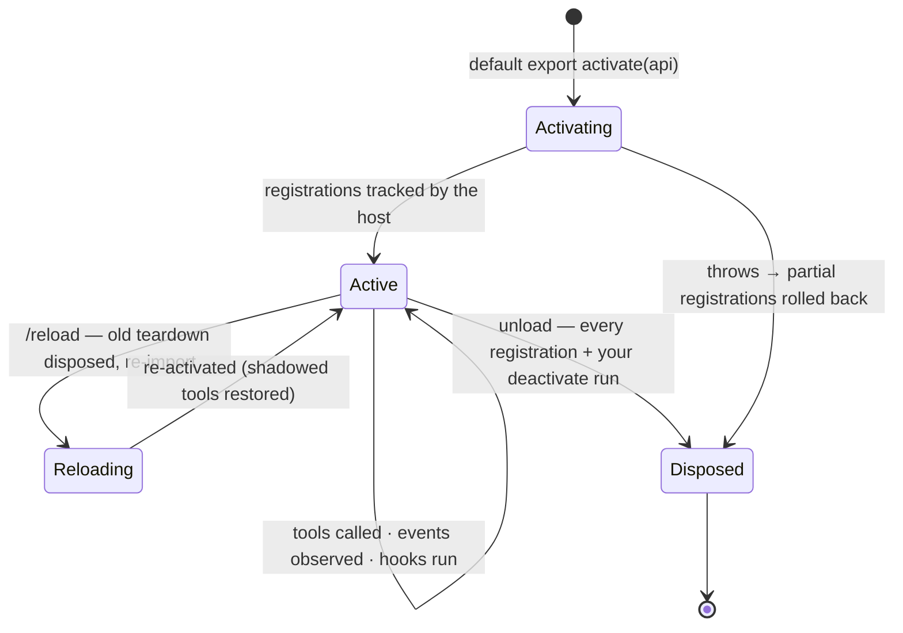
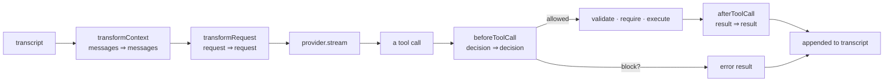

# Writing EAgent extensions

Almost everything in EAgent is an extension. The kernel is seven primitives;
tools, memory, prompts, sub-agents, MCP, and even the four "built-in" tools
(`read`, `write`, `edit`, `bash`) are extensions riding a single stable surface,
the `ExtensionAPI`. This guide is the practical reference for authoring one.

The API is defined in [`src/kernel/extension.ts`](../src/kernel/extension.ts);
the tool helpers in [`src/kernel/define.ts`](../src/kernel/define.ts); the hook
contract in [`src/kernel/events.ts`](../src/kernel/events.ts). When in doubt,
those files are the source of truth.

## The shape of an extension

An extension is a module with a **default-exported activation function**. It
receives the `ExtensionAPI` and registers tools, hooks, commands, or providers
on it.

```ts
import { defineTool } from "@eagent/core";
import type { ExtensionAPI } from "@eagent/core";

export default function activate(e: ExtensionAPI) {
  e.registerTool(
    defineTool({
      name: "ping",
      description: "Reply with pong.",
      execute: () => ({ content: "pong" }),
    }),
  );
}
```

The activation function may be **async**. It may return nothing, a
**deactivate function** (`() => void`), or a **`Disposable`** (`{ dispose() }`);
whatever it returns runs on unload and before every reload, alongside the
automatic teardown of everything it registered.

```ts
export default async function activate(e: ExtensionAPI) {
  const handle = await openSomething();
  return () => handle.close(); // runs on unload/reload
}
```

Every registration call (`registerTool`, `on`, `hook`, `registerCommand`,
`registerProvider`) returns a `Disposable` and is **tracked by the host**, so a
reload tears the old version down precisely and brings the new one up — the
"clean swap" that makes live redefinition safe. You rarely need to dispose those
by hand; return a deactivate only for resources the host can't see (timers,
sockets, file handles).




## The `ExtensionAPI` surface

This is the entire public surface, copied from `src/kernel/extension.ts`:

```ts
interface ExtensionAPI {
  readonly id: string;

  registerTool(tool: Tool): Disposable;
  registerProvider(provider: Provider, opts?: { default?: boolean }): Disposable;
  registerCommand(command: Command): Disposable;

  on<K extends keyof KernelEvents>(event: K, handler: EventHandler<KernelEvents[K]>): Disposable;
  hook<K extends keyof KernelFilters>(
    point: K,
    handler: FilterHandler<KernelFilters[K]["value"], KernelFilters[K]["context"]>,
  ): Disposable;

  /** Declare a capability this extension's tools are allowed to use. */
  grantCapability(pattern: string): void;

  /** Namespaced persistent state for this extension. */
  readonly store: Store;
  readonly log: Logger;
  /** The running agent (registries, hooks, capabilities, transcript). */
  readonly agent: Agent;
  /** The command registry, for introspection. */
  readonly commands: CommandRegistry;

  /** Request a hot reload of this extension. Treat as terminal: code after the
   *  await runs in the old runtime. */
  reload(): Promise<void>;

  /** Load another extension from a file at runtime (via the host's jiti loader)
   *  and return its id — the seam for dynamic, self-authored, and
   *  package-installed extensions, all tracked like built-ins. */
  loadExtension(path: string): Promise<string>;
  /** Tear down a runtime-loaded extension by id. */
  unloadExtension(id: string): Promise<void>;
}
```

| Member | Purpose |
| ------ | ------- |
| `id` | The extension's id (the filename without extension, or the id passed to `host.use`). Used to namespace the `store` and prefix the `log`. |
| `registerTool(tool)` | Register a `Tool` the model can call. A later registration shadows an earlier same-named one; disposing restores the prior. |
| `registerProvider(provider, opts?)` | Register an LLM `Provider`; pass `{ default: true }` to make it the default. |
| `registerCommand(command)` | Register a user-facing slash command. |
| `on(event, handler)` | Subscribe to a lifecycle **event** (observe). |
| `hook(point, handler)` | Install a **filter hook** (intervene): transform or veto a threaded value. |
| `grantCapability(pattern)` | Declare an authority this extension's tools may use without prompting (`"fs:read"`, `"net:*"`). |
| `store` | Per-extension persistent key/value state, namespaced by `id`. |
| `log` | A `Logger` whose output is prefixed with `[id]`. |
| `agent` | The running `Agent` — its registries, hook bus, capability manager, and transcript. |
| `commands` | The `CommandRegistry`, for introspection. |
| `reload()` | Request a hot reload of *this* extension. Terminal: code after the `await` runs in the old runtime. |
| `loadExtension(path)` | Load another extension file at runtime via the host's `jiti` loader; returns its id. The seam for self-authored and package-installed extensions. |
| `unloadExtension(id)` | Tear down a runtime-loaded extension by id. |

## Defining tools

`defineTool` is a thin, typed constructor — no schema inference, because the
JSON Schema is exactly what the model sees, so it stays explicit. An `execute`
just returns a `ToolResult` — `{ content, isError? }` — so you can build one
inline.

```ts
import { defineTool } from "@eagent/core";

e.registerTool(
  defineTool({
    name: "word_count",
    description: "Count words in a piece of text.",
    parameters: {
      type: "object",
      properties: {
        text: { type: "string", description: "The text to count words in." },
      },
      required: ["text"],
    },
    execute: (args) => {
      const text = String(args.text ?? "");
      if (!text.trim()) return { content: "text is empty", isError: true };
      return { content: String(text.trim().split(/\s+/).length) };
    },
  }),
);
```

The full `ToolDefinition` (`src/kernel/define.ts`):

| Field | Meaning |
| ----- | ------- |
| `name` | The tool name the model calls. |
| `description` | What it does — written for the model. |
| `parameters?` | A JSON-Schema object for the arguments (defaults to `{ type: "object", properties: {} }`). |
| `executionMode?` | `"parallel"` (default) or `"sequential"`. One sequential tool forces its whole batch to run in order. |
| `capabilities?` | Capabilities the tool needs, enforced before `execute` runs (see below). |
| `execute(args, ctx)` | The body. May be sync or async; returns a `ToolResult`. |

A `ToolResult` is `{ content, isError?, details?, terminate? }`: `content` is the
model-legible text; `details` is a structured payload for renderers/telemetry and
is never sent to the model. When authoring **inside this repo**, the `ok(content,
details?)` / `fail(content, details?)` helpers in
[`src/kernel/define.ts`](../src/kernel/define.ts) build these for you (imported
relatively, e.g. `import { ok, fail } from "../kernel/define.js"`); they are
in-tree conveniences and are intentionally not part of the package's public
barrel, so from the published package just return the object directly.

The second argument to `execute`, `ctx: ToolContext`, gives you
`ctx.toolCallId`, `ctx.signal` (an `AbortSignal`), `ctx.require(cap)`,
`ctx.progress(chunk)`, `ctx.ui`, `ctx.agent`, and `ctx.log`.

## The capability model

A capability is a dotted authority string. Privileged tools declare what they
need; the dispatcher enforces it **before the tool body runs**.

```ts
e.registerTool(
  defineTool({
    name: "fetch",
    description: "HTTP GET a URL and return the body.",
    capabilities: ["net:fetch"], // enforced automatically before execute()
    parameters: {
      type: "object",
      properties: { url: { type: "string" } },
      required: ["url"],
    },
    execute: async (args) => ({ content: await (await fetch(String(args.url))).text() }),
  }),
);
```

Declaring `capabilities: [...]` on a tool means the kernel calls
`ctx.require(cap)` for each one before invoking `execute`; if any is denied it
throws a `CapabilityError` and the body never runs. You can also call
`await ctx.require("net:fetch")` yourself inside `execute` for a finer-grained
or conditional check.

Decisions come from an ordered policy: an explicit **deny** wins, then an
explicit **grant**, otherwise the fallback (**ask** the human by default, or
`allow`/`deny` for automated/locked-down runs). Patterns support a trailing
wildcard segment: `fs:*`, `*`. Every check is recorded in an audit log you can
inspect with `/caps`.

Use `e.grantCapability("net:fetch")` (or a wildcard like `"fs:*"`) in your
activation function to declare that your extension's tools should be allowed
that authority without prompting. The dotted names in use across the project:

| Capability | Used by |
| ---------- | ------- |
| `fs:read` | `core-tools` (read/edit), `search` (glob/grep), `session`, `journal` |
| `fs:write` | `core-tools` (write/edit), `session`, `journal` |
| `shell:exec` | `core-tools` (bash) |
| `code:exec` | `codeact` (run JS/Python) |
| `net:fetch` | `web` (`fetch_url`) |
| `skill:read` / `skill:write` | `skills` (reading / authoring a `SKILL.md`) |
| `mcp:call` | `mcp` (calling a remote MCP tool) |
| `mcp:read` | `mcp` (reading a remote MCP resource body) |
| `agent:spawn` | `subagents` |
| `workflow:run` | `dynamic-workflow` (`workflow`) |
| `pkg:install` | `packages` |
| `self:read` / `self:extend` | `self` (reading / authoring & loading new TypeScript extensions) |
| `ui:ask` | `ask` (blocking to ask the human a question) |

## Lifecycle events (observe)

Subscribe with `e.on(event, handler)`. These are notifications; handlers cannot
change anything. From `src/kernel/events.ts`:

| Event | Payload | Fires when |
| ----- | ------- | ---------- |
| `session_start` | `{}` | A fresh extension runtime has come up (also after a reload). |
| `session_shutdown` | `{}` | The runtime is tearing down (also before a reload). |
| `reload` | `{ id? }` | A hot reload occurred. |
| `agent_start` | `{ input }` | A run begins. |
| `agent_end` | `{ reason }` | A run ends (with its `StopReason`). |
| `turn_start` | `{ turn }` | A turn begins. |
| `turn_end` | `{ turn, step }` | A turn ends. |
| `message` | `{ message }` | A completed message was appended to the transcript. |
| `text_delta` | `{ text }` | Incremental assistant text during streaming. |
| `reasoning_delta` | `{ text }` | Incremental reasoning ("thinking") text during streaming, for models that expose it. |
| `tool_start` | `{ call }` | A tool call is about to run. |
| `tool_progress` | `{ call, chunk }` | Incremental output from a running tool (`ctx.progress`), for live tool cards. |
| `tool_end` | `{ call, result, step }` | A tool call finished. |
| `tool_batch_end` | `{ batch, step }` | A parallel tool wave settled (the ordered `{call,result}` pairs). |
| `usage` | `{ usage, cumulative }` | Token usage for the just-finished model call, plus the running total. |
| `error` | `{ error, where }` | Something threw. |

```ts
e.on("tool_end", ({ call, result }) => {
  e.log.info(`${call.name} -> ${result.isError ? "error" : "ok"}`);
});
```

## Filter hooks (intervene)

Install with `e.hook(point, handler)`. A filter hook threads a value through
your handler, which returns the (possibly transformed) value. There are six —
five on the request/tool path (incl. `beforeDispatch`, the wave-level seam) plus `onProviderError` (an error-path seam,
covered after them) — the seams where memory, model routing, plan-mode approvals,
safety gates, context engineering, and reliability policy plug in without touching
the loop. Here is where the four **single-call** request/tool ones fire inside a turn (`beforeDispatch`
acts on the whole tool-call wave before per-call dispatch — see its own subsection below):




### `transformContext`

Reshape the message list just before it reaches the model — compaction, memory,
RAG, a system note. **Return a new array; do not mutate the transcript in
place.**

```ts
e.hook("transformContext", (messages /*, { turn, model } */) => [
  {
    role: "system",
    content: [{ type: "text", text: `The current time is ${new Date().toISOString()}.` }],
    meta: { ephemeral: true },
  },
  ...messages,
]);
```

### `transformRequest`

Reshape the whole outbound request — `systemPrompt`, `messages`, `tools`, `model`,
`toolChoice`, `thinking` — just before the provider call. This is the deepest
request seam: withhold tools from the model (least-privilege / progressive
disclosure), route the model, assemble a dynamic system prompt, or set a cache
boundary. `transformContext` runs first, so its output arrives as `value.messages`.
The context carries `{ turn, cumulativeUsage }`. **Return the (possibly mutated)
value.** With no handler registered the request is byte-identical to the default.

```ts
e.hook("transformRequest", (req, { turn, cumulativeUsage }) => {
  // Plan mode: hide mutating tools from the model on the first turn.
  if (turn === 1) req.tools = req.tools.filter((t) => !/^(write|edit|bash)$/.test(t.name));
  return req;
});
```

### `beforeDispatch`

Reshape the **whole tool-call wave** before it is dispatched (the per-call
`beforeToolCall` sees one call; this sees them all). The threaded value is the
`ToolCallBlock[]` to dispatch; the context carries `{ turn }`. Return a reordered
and/or filtered subset — run a cheap validation call first, drop a now-redundant
call. **Pairing is preserved by the kernel:** every *original* call id still gets a
`tool_result` (a real one if dispatched, else a neutral `"(skipped…)"` synthetic),
and ids you return that weren't in the originals are ignored (no injection). Drop a
call as a *security veto* with `beforeToolCall` instead (it pairs via a proper error
result); `beforeDispatch` is for wave shape.

```ts
e.hook("beforeDispatch", (calls /*, { turn } */) =>
  // run any `read` before any `write`, and dedupe identical calls
  dedupe(calls).sort((a, b) => rank(a.name) - rank(b.name)));
```

### `beforeToolCall`

Approve, rewrite, or veto a tool call before it runs. The threaded value is a
`ToolDecision` (`{ block, reason?, arguments }`); the context carries the
`call`. Return a refined decision — block it, or rewrite `arguments`.

```ts
e.hook("beforeToolCall", (decision, { call }) => {
  if (call.name !== "bash") return decision;
  const command = String(call.arguments.command ?? "");
  if (/\brm\s+-rf\s+[~/]/.test(command)) {
    return { ...decision, block: true, reason: "refusing to delete from a root or home path" };
  }
  return decision;
});
```

Multiple extensions register `beforeToolCall`; they run in `BUILTIN_EXTENSIONS`
load order and the **first `block: true` wins** (a non-blocking rewrite chains
onward). See [SECURITY.md → Guard precedence](../SECURITY.md#guard-precedence) for
the full ordered roster and how to change precedence.

### `afterToolCall`

Transform a tool's `ToolResult` before it is appended to the transcript —
redaction, truncation, annotation.

```ts
e.hook("afterToolCall", (result, { call }) => {
  if (result.content.length <= 4000) return result;
  return { ...result, content: result.content.slice(0, 4000) + "\n…(truncated)" };
});
```

### `onProviderError` (error-path)

Unlike the four above, this fires **only when the provider stream throws** — and
only **before** any event has been emitted (a post-first-event failure can't be
retried without double-emitting, so it always propagates). The threaded value is
`{ retry, downshiftModel?, fail }` and the context is `{ error, attempt }`. Return
`{ retry: true, fail: false }` (optionally with `downshiftModel`) to re-stream the
turn; the default (no handler) is `{ retry: false, fail: true }`, so the run ends
with `reason:"error"` exactly as before. The kernel caps re-streams per turn. This
is the seam the `reliability` extension rides for same-provider backoff-retry +
model downshift (cross-provider failover is `fallback-routing`'s job).

```ts
e.hook("onProviderError", (decision, { error, attempt }) => {
  if (attempt < 3 && isTransient(error)) return { retry: true, fail: false };
  return decision; // default: fail
});
```

## Per-extension state, logging, and namespacing

Each extension gets its own namespaced persistent `store` (keyed by the
extension `id`). This is the explicit fix for Emacs's global-mutable-state
mistake: state is scoped, not global. A reload preserves the store; a teardown
does not wipe it.

```ts
const runs = (e.store.get<number>("activations") ?? 0) + 1;
e.store.set("activations", runs);
```

The `store` interface is `get<T>(key, fallback?)`, `set(key, value)`,
`delete(key)`, `keys()`. Backing is in-memory in tests and JSON-file-backed in
the CLI (`~/.eagent/state/<id>.json`).

### Configuration — `e.config`

Alongside `store`, every extension gets `e.config`: the one layered
configuration surface. **Read config through it instead of `process.env`.** Where
`store` is deliberately per-extension isolated, `config` is a *shared* dotted
key space (e.g. `agent.maxTurns`, `subagents.maxTurns`, `workspace`) so knobs are
discoverable in one place and settable via env, a `config.json` file, or
`/config set`.

```ts
const maxTurns = e.config.int("subagents.maxTurns", 8);   // value key
const on = e.config.enabled("compact", { default: false, store: e.store });
```

- **Value keys** (`get`/`int`/`bool`/`string`) resolve **override > env > file >
  default**. The env var name derives from the key: `subagents.maxTurns` ⟷
  `EAGENT_SUBAGENTS_MAX_TURNS` (upper-cased, camelCase/dots/dashes → `_`).
- **`enabled(key, { default, store })`** is the unified kill-switch/opt-in gate:
  it resolves **env-`"off"`-veto > override > `store.get("enabled", default)` >
  default**. The config **file is intentionally excluded** from enablement, so an
  untrusted project `config.json` can never flip an extension on or off. Pass
  `store: e.store` only when the extension also has a store `enabled` flag toggled
  by its own `/x on|off` command.
- **`set`/`unset`** write the persisted runtime override (what `/config set`
  and `/x on|off` use); **`entries()`** powers `/config list` and hides
  secret-substring keys. Never read a secret (API key/token) through config.

Env-name irregularities (legacy names that don't match the derivation) are
handled by the `ENV_ALIASES` map in `src/config.ts`; add a row there when you
introduce a key whose historical env var doesn't follow the convention.

The `log` is a `Logger` (`debug`/`info`/`warn`/`error`) whose every line is
prefixed with `[<id>]`, so output from different extensions stays attributable.

## Discovery and hot reload

The CLI discovers extension files from two directories, **project-local taking
precedence over user-global** on an id collision:

1. `.eagent/extensions/` in the current working directory (project-local) — wins;
2. `~/.eagent/extensions/` (user-global).

They are loaded user-dir first, project-dir last, so the project file wins under
the registry's "later wins" rule. Files are loaded directly via **jiti** with
**no build step** — drop a `.ts` (or `.js`/`.mjs`/`.tsx`) file in one of those
directories and it is picked up on the next start. Files and directories
beginning with `_` or `.` are skipped. You can also load a file explicitly with
`--ext path/to/ext.ts`.

`/reload` re-imports and re-activates extensions. Because every registration is
a tracked `Disposable`, reload tears the old version down cleanly (running any
returned deactivate) before bringing the new one up. The host emits
`session_shutdown`, swaps, then emits `reload` and `session_start`.

**Caveat:** `e.reload()` (and the `reload()` API member) is terminal. The reload
swaps the runtime out from under you, so any code after `await e.reload()` runs
in the *old*, now-disposed runtime. Treat the await as the end of the function.

## A complete worked example

A single file with a tool, a guard hook, and a command — copy-pasteable. (This
file is auto-discovered from `.eagent/extensions/`, so it imports from the
published package `"eagent"`; when authoring in-tree — as `examples/extensions/`
does — import from the relative `src/kernel/*.js` paths instead, which also gives
you the `ok`/`fail` helpers.)

```ts
// .eagent/extensions/notes.ts — auto-discovered, then `/reload`
import { defineTool } from "@eagent/core";
import type { ExtensionAPI } from "@eagent/core";

export default function activate(e: ExtensionAPI) {
  e.log.info("notes extension activated");

  // 1. A small, focused tool that persists to the per-extension store.
  e.registerTool(
    defineTool({
      name: "note",
      description: "Append a short note to a persistent scratchpad.",
      parameters: {
        type: "object",
        properties: { text: { type: "string", description: "The note to save." } },
        required: ["text"],
      },
      execute: (args) => {
        const text = String(args.text ?? "").trim();
        if (!text) return { content: "note text is empty", isError: true };
        const notes = e.store.get<string[]>("notes") ?? [];
        notes.push(text);
        e.store.set("notes", notes);
        return { content: `Saved note #${notes.length}.` };
      },
    }),
  );

  // 2. A guard: block writes to anything that looks like a dotfile.
  e.hook("beforeToolCall", (decision, { call }) => {
    if (call.name !== "write") return decision;
    if (/(^|\/)\.[^/]+$/.test(String(call.arguments.path ?? ""))) {
      return { ...decision, block: true, reason: "writing dotfiles is disabled by the notes extension" };
    }
    return decision;
  });

  // 3. A user-facing command to read the scratchpad back.
  e.registerCommand({
    name: "notes",
    description: "Print saved notes.",
    run: (ctx) => {
      const notes = e.store.get<string[]>("notes") ?? [];
      ctx.print(notes.length ? notes.map((n, i) => `${i + 1}. ${n}`).join("\n") : "(no notes yet)");
    },
  });

  // 4. Optional cleanup, run on unload/reload.
  return () => e.log.info("notes extension deactivated");
}
```

See [`examples/extensions/clock.ts`](../examples/extensions/clock.ts) for the
in-repo worked example, and `src/extensions/` for the real built-ins.

## Best practices

- **Keep tools small and capability-gated.** One tool, one job. Declare every
  privileged authority in `capabilities: [...]` (and `grantCapability` only what
  the host should auto-allow) so the dispatcher — not your code — is the gate.
- **Don't mutate the transcript in `transformContext`.** Return a *new* array.
  The messages you receive are the live transcript; build a derived list instead
  of editing it in place. Mark injected, non-persistent messages with
  `meta: { ephemeral: true }` so other extensions can recognize them.
- **Return a deactivate to clean up.** Anything the host can't see — timers,
  sockets, watchers, child processes — should be torn down in a returned
  deactivate function or `Disposable`, so reloads stay clean.
- **Scope state to the `store`.** Use the namespaced `store` for persistence
  rather than module-level globals; it survives reloads and stays attributable
  to your extension.
- **Treat `reload()` as terminal.** Do no work after `await e.reload()`.
- **Test offline.** The suite runs against `MockProvider` with no network or API
  key; keep new extensions and their tests offline too.
